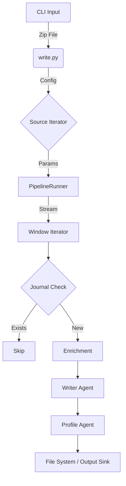

# Architecture: The Batch Era (v0.2 - v0.9)

**Status:** Historical / Active (Deprecating in Sprint 2)
**Era:** The Batch Processing Era
**Primary Artifacts:** `src/egregora/orchestration/pipelines/write.py`, `src/egregora/orchestration/runner.py`

## Overview

The "Batch Era" represents the foundational architecture of the Egregora system, designed primarily as a CLI-driven static site generator. In this model, the system operates as a linear pipeline: it ingests a complete dataset (e.g., a WhatsApp export), processes it in discrete "windows" (time-slices), and outputs static Markdown files.

This architecture was optimized for **simplicity** and **correctness** over latency. It assumes the entire timeline is available at the start of execution.

## Core Components

### 1. The Monolith Orchestrator (`write.py`)

The `run_cli_flow` function in `write.py` acts as the "God Function" for the system.
- **Responsibilities:**
    - CLI Argument Parsing.
    - Configuration Resolution (`load_egregora_config`).
    - Source Iteration (Looping through configured sources).
    - Error Handling and Reporting (Rich console output).
- **Characteristics:**
    - **Procedural:** It flows top-to-bottom.
    - **Blocking:** It halts on errors (unless configured otherwise).
    - **Coupled:** It directly imports and orchestrates unrelated subsystems (Enrichment, Taxonomy, Site Initialization).

### 2. The Heartbeat (`runner.py`)

The `PipelineRunner` class encapsulates the execution logic. Its primary loop, `process_windows`, iterates through time-based windows of messages.

#### Key Mechanisms:

- **Windowing Strategy:**
    - Data is sliced into chunks (e.g., 6 hours) *before* processing begins.
    - **Recursive Splitting:** If a window contains too many tokens for the LLM context, `_process_window_with_auto_split` recursively divides it into smaller sub-windows. This is a defining characteristic of this era—handling scale by dividing time.

- **Journal Deduplication:**
    - Before processing a window, the runner checks the `Journal` repository.
    - If a matching signature (hash of content + config) exists, the window is skipped.
    - This provides "Incremental Builds" within a batch context.

- **The Processing Unit (`_process_single_window`):**
    - **Enrichment:** Calls `EnrichmentWorker` to add metadata to messages.
    - **Writer:** Invokes the LLM to generate a narrative summary (`write_posts_for_window`).
    - **Profile Generator:** Invokes `ProfileWorker` to update author profiles based on the window's content.
    - **Persistence:** Writes artifacts (posts, profiles) to the file system immediately.

## Data Flow

## Legacy Quirks & "Fossils"

- **Sync/Async Hybrid:** While the core loop is synchronous, agents like `EnrichmentWorker` use internal `asyncio` loops, leading to a "Sandwich" concurrency model (Sync -> Async -> Sync).
- **The "Context" Object:** `PipelineContext` passes almost all system state around, acting as a Service Locator anti-pattern common in batch scripts.
- **Direct I/O:** There is no abstraction layer for storage in the early versions; `Path` objects are passed deeply into the logic.

## Transition to "Symbiote" (Sprint 2+)

As of Sprint 2 (2026-01), this architecture is being refactored.
- **Simplifier** is decomposing `write.py` into distinct ETL stages.
- **Artisan** is breaking `PipelineRunner` into composable units.
- **Visionary** is introducing a "Sidecar" model where data lives in a persistent DB (DuckDB) rather than just flowing through a transient pipe.

This document serves as the tombstone for the purely file-based, linear batch processing engine that launched the project.
