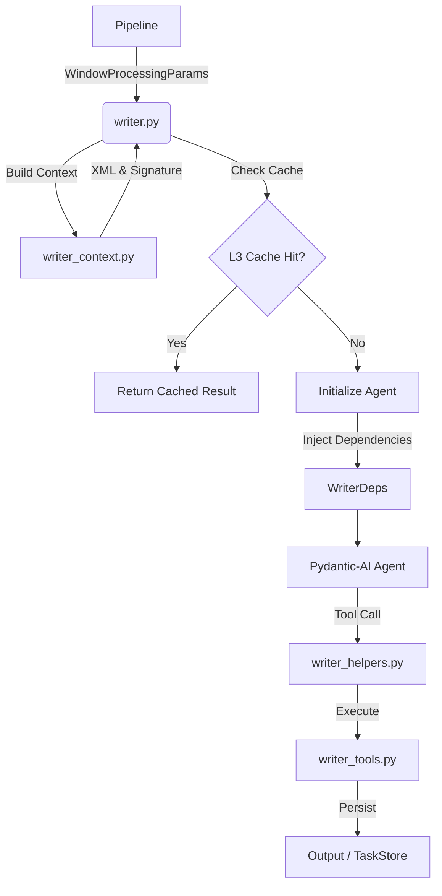

# 🧠 The Writer Agent Architecture

**Status:** Active (Symbiote Era)
**Component:** `src/egregora/agents/writer.py`
**Pattern:** Composition Root + Dependency Injection

---

## 🏗️ Overview

The **Writer Agent** is the primary cognitive engine of Egregora, responsible for synthesizing conversation logs into narrative blog posts. Unlike a simple LLM wrapper, the Writer is a complex distributed system that acts as a **Composition Root**, assembling memory, tools, and error handling strategies before execution.

## 🧩 Component Breakdown

The Writer's architecture enforces a strict separation of concerns:

### 1. The Composition Root (`writer.py`)
This is the entry point. It does not contain business logic but coordinates the assembly of the agent:
- **Orchestration:** Manages the `Retrying` loop and error handling.
- **Assembly:** Calls `writer_context` to prepare data and `writer_setup` to configure the `pydantic_ai.Agent`.
- **Execution:** Runs the agent loop and finalizes results (caching, RAG indexing).

### 2. The Context Builder (`writer_context.py`)
Responsible for **Memory** and **State**. It isolates the complex logic of data preparation from the agent's execution.
- **Lazy Loading:** RAG and Profile contexts are injected dynamically via system prompts to avoid computing them for cache hits.
- **Signature Calculation:** Generates a deterministic hash of the conversation + template + config to enable L3 Caching.
- **Data Primitives:** Defines `WriterDeps` and `WriterContext` dataclasses that serve as the "spine" of the data flow.

### 3. The Skills Module (`writer_helpers.py` & `writer_tools.py`)
Responsible for **Capabilities**.
- **`writer_helpers.py`**: Bridges the Pydantic-AI `RunContext` to the actual tool implementations. It registers the tools with the agent.
- **`writer_tools.py`**: Contains **pure, functional implementations** of the tools. These functions are decoupled from the agent runtime, making them unit-testable.

## 🔄 Data Flow

## 🛠️ TaskStore Integration

The Writer Agent exhibits a hybrid approach to resilience:

- **Critical Path (Post Writing):** The `write_post_tool` operates **synchronously**. It writes directly to the file system (via `OutputSink`) to ensure the agent receives immediate confirmation of success. This is crucial for the agent's "reasoning trace" — it needs to know the file exists to reference it.
- **Background Tasks (Banner Generation):** The `generate_banner` tool operates **asynchronously**. It offloads the expensive image generation process to the `TaskStore` (`tasks` table in DuckDB). The agent receives a "scheduled" status and moves on, trusting the `BannerAgent` to pick up the work later.

## 📜 Lore & Technical Debt

- **"The Taskmaster":** The codebase contains several `[Taskmaster]` tags, indicating known areas for refactoring. The complexity of `write_posts_for_window` is a primary target.
- **Cache Trade-offs:** To optimize performance, the cache signature relies heavily on the conversation XML. Changes to the underlying RAG index do *not* automatically invalidate the cache for identical conversations, a deliberate "Lazy Consistency" choice documented in `writer_context.py`.
