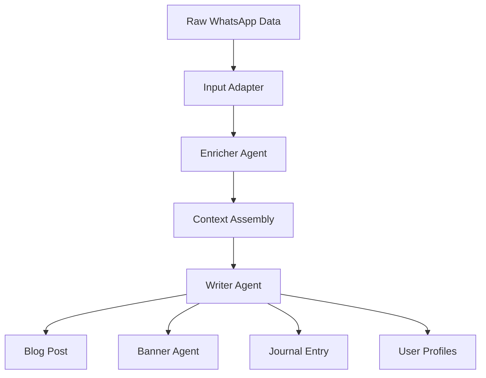

# Egregora Agents

This document serves as the primary onboarding guide for both human developers and AI assistants working with the Egregora agentic system.

## System Overview

Egregora uses a multi-agent architecture to transform raw WhatsApp conversations into polished blog posts. The system is built on **Pydantic-AI** and orchestrates several specialized agents.



---

## The Agents

### 1. Writer Agent ✍️
**Source:** `src/egregora/agents/writer.py`

The conductor of the blog generation process. It analyzes the conversation, decides on a narrative angle, and synthesizes the final post.

- **Role:** Narrative construction, content synthesis, continuity management.
- **Inputs:**
  - Enriched conversation DataFrame.
  - Historical context (previous journal entries).
  - User profiles (personalities, interests).
- **Outputs:**
  - Markdown blog post (`DocumentType.POST`).
  - Continuity journal entry (`DocumentType.JOURNAL`).
  - Updated user profiles (`DocumentType.PROFILE`).
- **Key Tools:**
  - `write_post`: Persists the final blog post.
  - `search_media`: RAG-based search for relevant past content.
  - `generate_banner`: Delegates to the Banner Agent.
  - `read_profile` / `write_profile`: Manages user knowledge graph.

### 2. Enricher Agent 🔍
**Source:** `src/egregora/agents/enricher.py`

Pre-processes raw data to add semantic depth before the Writer sees it.

- **Role:** Data augmentation and content extraction.
- **Capabilities:**
  - **URL Enrichment:** Fetches metadata (title, description) and content summaries for shared links.
  - **Media Enrichment:** Generates descriptions for images and transcriptions for audio/video.
- **Caching:** Uses a robust L1 cache (`.egregora-cache/enrichment`) to prevent redundant API calls.

### 3. Banner Agent 🎨
**Source:** `src/egregora/agents/banner/agent.py`

A specialized visual designer agent.

- **Role:** Creating visual assets for blog posts.
- **Inputs:** Post title, summary, slug.
- **Outputs:** SVG/PNG banner images saved to `docs/assets/banners/`.

---

## Developer Guide (Humans)

### Adding a New Tool
Tools are defined in `src/egregora/agents/writer_tools.py` to keep the agent logic clean.

1. **Define the Implementation:** Create a pure function in `writer_tools.py`.
   ```python
   def my_new_tool_impl(ctx: ToolContext, arg1: str) -> Result:
       # Logic here
       return Result(...)
   ```
2. **Register with Agent:** In `writer.py`, wrap it with `@agent.tool`.
   ```python
   @agent.tool
   def my_new_tool(ctx: RunContext[WriterDeps], arg1: str) -> Result:
       return my_new_tool_impl(ctx.deps.tool_context, arg1)
   ```

### Modifying Prompts
Prompts are Jinja2 templates located in `src/egregora/prompts/`.
- `writer.jinja`: The core instruction set for the Writer.
- `enrichment.jinja`: Instructions for media/URL analysis.

**Tip:** Use `uv run` to execute the pipeline during development:
```bash
uv run egregora write path/to/data.zip
```

---

## AI Assistant Guide (Robots)

If you are an AI (like Antigravity or Codex) working on this repo, follow these rules:

1. **Tool Isolation:** When modifying agent capabilities, look at `src/egregora/agents/writer_tools.py` first. Do not put heavy logic directly into `writer.py`.
2. **Type Safety:** Respect the Pydantic models in `src/egregora/data_primitives/`.
3. **Context Awareness:** The `WriterDeps` and `ToolContext` classes are the primary dependency injection mechanisms. Ensure they are correctly populated in `write_pipeline.py`.
4. **Testing:** Always add a test case in `tests/agents/test_writer_tools.py` when adding new functionality.
5. **Path Handling:** Use `pathlib.Path` everywhere. Avoid string manipulation for paths.

### Common Pitfalls
- **Circular Imports:** `writer.py` imports `writer_tools.py`. Do not import `writer.py` from `writer_tools.py`.
- **API Keys:** Never hardcode keys. Use `os.environ` or the `config` object.
