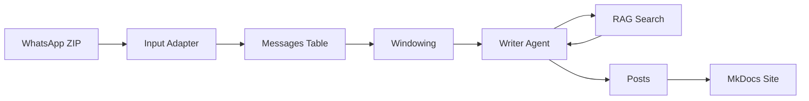

# 📚 ANÁLISE DE DOCUMENTAÇÃO - EGREGORA

**Data da Análise:** 2026-01-22
**Versão Analisada:** Current HEAD (commit e138d3b)
**Analista:** Claude (Sonnet 4.5)

---

## 1. RESUMO EXECUTIVO

O Egregora possui **documentação de fundação sólida** com visão clara do projeto e bons guias para desenvolvedores, mas sofre de **lacunas estruturais, seções incompletas e documentação interna dispersa**. A documentação precisa de melhor organização, completude de seções stub e clarificação de tópicos avançados.

### Classificação Geral: **6.5/10**

**Pontos Fortes:**
- ✅ README.md claro e envolvente
- ✅ CLAUDE.md excepcional (guia para desenvolvedores)
- ✅ Quick Start funcional e direto ao ponto
- ✅ CHANGELOG bem mantido
- ✅ ADRs documentando decisões arquiteturais

**Pontos Fracos:**
- ❌ Seções stub incompletas (Examples, Reference, Contributing)
- ❌ Documentação de API ausente
- ❌ Arquitetura documentada superficialmente
- ❌ Falta FAQ e troubleshooting abrangente
- ❌ Documentação interna não indexada

---

## 2. ANÁLISE DETALHADA POR CATEGORIA

### A. DOCUMENTAÇÃO DO USUÁRIO (7/10)

#### ✅ **README.md (7.3KB)** - Excelente

**Pontos Fortes:**
- Descrição clara e envolvente do produto
- Boa visão geral de features com narrativa guiada por emojis
- Exemplos de código funcionais (instalação, workflow básico)
- Links para recursos-chave
- Badges e formatação profissional

**Estrutura:**
```markdown
# Egregora
## O que é?
## Features Mágicas (RAG, Ranking, Profiles)
## Instalação
## Quick Start
## Configuração
## Exemplos
## Licença
```

**Conteúdo Ausente:**
- Badge de coverage (apenas build status)
- Link para demo online na seção principal
- Screenshot ou GIF demonstrando resultado

---

#### ✅ **Quick Start Guide (224 linhas)** - Muito Bom

**Localização:** `docs/quick-start.md`

**Pontos Fortes:**
- Walkthrough passo a passo bem estruturado
- Pré-requisitos claros
- Workflow realista (5 minutos declarados)
- Seção de troubleshooting com problemas comuns
- Instruções para exportar WhatsApp

**Estrutura:**
```markdown
1. Pré-requisitos
2. Instalação
3. Configurar API Key
4. Exportar Conversa WhatsApp
5. Gerar Site
6. Ver Resultado
7. Troubleshooting
```

**Problemas Encontrados:**
- ⚠️ Seção de troubleshooting breve (só 4 problemas comuns)
- ⚠️ Não menciona tempo de processamento esperado
- ⚠️ Falta estimativa de custo de API

---

#### ✅ **Installation Guide (107 linhas)** - Bom

**Localização:** `docs/installation.md`

**Pontos Fortes:**
- Instruções multi-plataforma (Windows, macOS, Linux)
- Múltiplas opções de instalação (GitHub, PyPI, source)
- Setup de API key documentado
- Passo de verificação incluído

**Código de Exemplo:**
```bash
# Via GitHub (recomendado)
gh repo clone franklinbaldo/egregora
cd egregora
uv sync --all-extras

# Via PyPI
pip install egregora[egregora]

# Verificação
egregora --version
```

**Problemas Encontrados:**
- ⚠️ Não documenta instalação via `pipx` (melhor para CLI tools)
- ⚠️ Falta instruções para atualização (`uv sync --upgrade`)
- ⚠️ Não menciona requisitos de sistema (Python 3.12+, espaço em disco)

---

#### ✅ **Configuration Guide (275 linhas)** - Muito Bom

**Localização:** `docs/configuration.md`

**Pontos Fortes:**
- Cobertura abrangente de todas as configurações principais
- Formato TOML bem documentado
- Opções de CLI claramente listadas
- Seção de customização avançada
- Suporte multi-site documentado

**Estrutura:**
```toml
[pipeline]
step_size = 100
step_unit = "messages"

[models]
writer = "google-gla:gemini-2.5-flash"

[rag]
enabled = true
top_k = 5

[site]
name = "My Blog"
```

**Problemas Encontrados:**
- ⚠️ Alguns exemplos usam sintaxe antiga (`conversation_xml` vs `markdown_table`)
- ⚠️ Não explica implicações de desabilitar RAG (uma das 3 features mágicas)
- ⚠️ Falta guia de performance tuning (qual `step_size` usar para grandes datasets)

---

#### ✅ **Deployment Guide (64 linhas)** - Básico mas Funcional

**Localização:** `docs/deployment.md`

**Pontos Fortes:**
- GitHub Pages (recomendado) com passos claros
- Múltiplas opções de hosting (Netlify, Vercel, CloudFlare)
- Setup de domínio customizado

**Código de Exemplo:**
```bash
mkdocs build
mkdocs gh-deploy
```

**Problemas Encontrados:**
- ⚠️ Muito breve (64 linhas)
- ⚠️ Não documenta CI/CD pipelines
- ⚠️ Falta guia de troubleshooting para deployment
- ⚠️ Não menciona considerações de segurança (API keys no CI)

---

#### ❌ **Seções Faltantes ou Incompletas**

1. **Examples Directory (`docs/examples/`)** - ⚠️ "Coming Soon"
   - Nenhum exemplo end-to-end
   - Falta tutorial de caso de uso real
   - Sem exemplos de extensão (custom adapter, custom skill)

2. **FAQ Section** - ❌ Não existe
   - Perguntas comuns não documentadas
   - Usuários precisam buscar em issues do GitHub

3. **Comprehensive Troubleshooting Guide** - ⚠️ Apenas seção breve no Quick Start
   - Não cobre erros de API rate limiting
   - Sem guia de recovery de banco corrompido
   - Falta troubleshooting de problemas de LanceDB
   - Sem guia para "Model Not Available"

4. **Glossary** - ⚠️ Parcial
   - Arquivo `docs/abbreviations.md` existe mas é limitado
   - Falta definições de termos de domínio:
     - O que é "window" no contexto do Egregora?
     - O que significa "RAG context"?
     - O que são "the three magical features"?

---

### B. DOCUMENTAÇÃO DO DESENVOLVEDOR (8/10)

#### ✅ **CLAUDE.md (15.7KB)** - Excepcional

**Localização:** `/home/user/egregora/CLAUDE.md`

**Pontos Fortes:**
- Visão geral abrangente do projeto e filosofia
- Explicação clara de arquitetura com estrutura
- Padrões de código detalhados
- Filosofia de testes bem articulada
- Padrões de error handling documentados
- Guidelines de colaboração com AI agents
- Dicas de migração para breaking changes
- Excelente branding ("Code of the Weaver")

**Estrutura:**
```markdown
# Code of the Weaver
## Visão do Projeto
## Arquitetura
## Padrões de Código
## Testing Philosophy
## AI Agent Guidelines
## Key Patterns
## Common Pitfalls
## Learning Resources
```

**Problemas Encontrados:**
- ⚠️ Não cobre detalhes de implementação específicos (foca em padrões)
- ⚠️ Falta diagrama visual da arquitetura
- ⚠️ Alguns exemplos de código sem contexto de arquivo

---

#### ✅ **AGENTS.md (15KB)** - Excelente

**Localização:** `/home/user/egregora/AGENTS.md`

**Pontos Fortes:**
- Jules personas claramente definidas com branding emoji
- Explicações de workflow para scheduler e auto-fix
- Padrões de colaboração com Gemini
- Best practices para delegação
- Checklist pós-delegação

**Personas Documentadas:**
- 🌍 **Weaver**: PR merging e build integration
- 🧹 **Janitor**: Code cleanup e technical debt
- 🛠️ **Artisan**: Refactoring e code quality
- 🎨 **Palette**: UI/UX consistency
- ✂️ **Essentialist**: Complexity reduction

**Problemas Encontrados:**
- ⚠️ Não documenta como adicionar nova persona
- ⚠️ Falta troubleshooting quando Jules falha
- ⚠️ Não explica custo de execução de Jules

---

#### ✅ **CHANGELOG.md (320 linhas)** - Muito Bom

**Localização:** `/home/user/egregora/CHANGELOG.md`

**Pontos Fortes:**
- Segue formato "Keep a Changelog"
- Versionamento semântico documentado
- Breaking changes claramente marcados
- Guias de migração fornecidos (semi-detalhados)
- Organizado por áreas de feature

**Formato:**
```markdown
## [Unreleased]
### Added
### Changed
### Fixed

## [3.0.0] - 2026-01-10
### Breaking Changes
### Migration Guide
```

**Problemas Encontrados:**
- ⚠️ Algumas entradas sem links para PRs/issues
- ⚠️ Guias de migração às vezes incompletos (ex: "update config" sem exemplo)
- ⚠️ Não indica qual versão introduziu feature (só breaking changes)

---

#### ⚠️ **Docstrings no Código** - Cobertura Parcial

**Pontos Fortes:**
- Modelos Pydantic bem documentados com descrições
- Exceções customizadas documentadas
- Type annotations presentes em assinaturas

**Exemplo Bom:**
```python
class RAGSettings(BaseModel):
    """
    Retrieval Augmented Generation configuration.

    ⭐ MAGICAL FEATURE: Contextual memory for blog posts.

    Attributes:
        enabled: Whether to use RAG for contextual memory
        top_k: Number of relevant posts to retrieve
        backend: Vector store backend ('lancedb')
    """
    enabled: bool = True
    top_k: int = 5
    backend: str = "lancedb"
```

**Problemas Encontrados:**
- ⚠️ Nem todos os módulos têm docstrings de módulo
- ⚠️ Algumas funções helper sem docstrings
- ⚠️ Nenhuma evidência de validação de docstring em CI/CD
- ⚠️ Estilos inconsistentes (embora configurado para Google style)

**Arquivos Sem Docstrings Adequados:**
- `src/egregora/transformations/windowing.py` - funções complexas sem explicação
- `src/egregora/orchestration/runner.py` - lógica de window processing não documentada
- `src/egregora/llm/providers/model_cycler.py` - rotação de modelos não explicada

---

#### ❌ **API Documentation** - Ausente

**Problema:**
- Nenhuma documentação de API gerada a partir de docstrings
- `mkdocs.yml` tem plugin `mkdocstrings` configurado mas:
  - Nenhuma página de referência de API criada
  - Apenas uma página (`docs/reference/index.md`) com links
  - Deveria auto-gerar de source code

**Esperado:**
```
docs/reference/
├── index.md
├── agents/
│   ├── writer.md        # Auto-gerado de src/egregora/agents/writer.py
│   ├── reader.md
│   └── profile.md
├── database/
│   ├── repository.md
│   └── schemas.md
└── config/
    └── settings.md
```

**Impacto:**
- Desenvolvedores precisam ler código-fonte para entender APIs
- Nenhuma busca de funções/classes
- Difícil descobrir capacidades programáticas

---

#### ⚠️ **Architecture Documentation** - Superficial

**Localização:** `docs/v3/architecture/`

**Arquivos Existentes:**
- `overview.md` - 13 linhas (muito breve)
- `layers.md` - 19 linhas (incompleto)
- `agents.md` - 20 linhas (barebone)
- `data-model.md` - 26 linhas (falta detalhes)

**Problemas:**
- ⚠️ Cada arquivo deveria ter 300-500 linhas para deep dive adequado
- ⚠️ Nenhum diagrama visual (ASCII ou Mermaid)
- ⚠️ Não explica fluxo de dados end-to-end
- ⚠️ Falta explicação de V2 vs V3 vs "Pure"

**Exemplo de Brevidade:**
```markdown
# Architecture Overview

Egregora has a layered architecture:

1. CLI
2. Orchestration
3. Agents
4. Database

See individual files for details.
```
*(13 linhas no total - inadequado)*

**Deveria Ter:**
- Diagramas de fluxo de dados
- Explicação detalhada de cada camada
- Padrões de interação entre camadas
- Exemplos de código mostrando uso
- Decisões de design e trade-offs

---

### C. DOCUMENTAÇÃO DE CONTRIBUIÇÃO (3/10)

#### ❌ **CONTRIBUTING.md** - Ausente

**Problema Crítico:**
- Arquivo referenciado em múltiplos lugares mas **não existe**
- `docs/community/contributing.md` linka para `CONTRIBUTING.md` no root
- Security.md menciona processo de contribuição em `CONTRIBUTING.md`
- README.md menciona workflow de contribuição

**Localização Esperada:** `/home/user/egregora/CONTRIBUTING.md`

**Impacto:**
- Novos contribuidores não sabem como contribuir
- Processo de PR não documentado
- Code review guidelines ausentes
- Nenhum guia de setup de ambiente dev

**Deveria Conter:**
```markdown
# Contributing to Egregora

## Code of Conduct
## Getting Started
## Development Setup
## Making Changes
## Pull Request Process
## Code Review Guidelines
## Testing Requirements
## Documentation Standards
```

---

#### ⚠️ **Community Section** - Placeholder

**Localização:** `docs/community/contributing.md`

**Conteúdo Atual:**
```markdown
# Contributing to Egregora

This placeholder will be expanded to cover contribution guidelines.

For now, see [CONTRIBUTING.md](../../CONTRIBUTING.md).
```

**Problemas:**
- Link quebrado (CONTRIBUTING.md não existe)
- Nenhuma informação real
- Seção crítica para crescimento da comunidade

---

### D. DOCUMENTAÇÃO TÉCNICA DE REFERÊNCIA (4/10)

#### ❌ **Reference Section** - Stubs Apenas

**Localização:** `docs/reference/index.md`

**Conteúdo Atual:**
- Lista de links para "technical reference"
- Nenhuma documentação real gerada
- mkdocstrings configurado mas não utilizado

**Páginas Ausentes:**
- API Reference (funções, classes)
- CLI Reference (comandos detalhados)
- Configuration Reference (todas opções)
- Error Reference (tipos de erro)

---

#### ⚠️ **ADRs (Architecture Decision Records)** - Bom mas Incompleto

**Localização:** `docs/adr/`

**ADRs Existentes:**
- ADR-0001: Markdown over Word
- ADR-0002: Tool Choice (Ibis, DuckDB)
- ADR-0003: Atomic Commits
- ⚠️ **ADR-0004 duplicado**:
  - `0004-configuration-consolidation.md`
  - `0004-url-enrichment-path-convention.md`
  - **Erro de numeração**

**Problemas:**
- ⚠️ Numeração duplicada (dois 0004)
- ⚠️ ADR README lista apenas primeiros 2 ADRs (existem 7)
- ⚠️ Decisões arquiteturais importantes não documentadas:
  - Por que Pydantic-AI?
  - Por que LanceDB?
  - Por que TOML em vez de YAML?

---

### E. DOCUMENTAÇÃO INTERNA (2/10)

#### ❌ **Documentos de Análise Não Indexados**

**Documentos Existentes no Root:**
- `ARCHITECTURE_ANALYSIS.md` (47KB) - Este documento
- `READER_FEATURE_ANALYSIS.md` (13KB)
- `PR_REVIEWS.md` (22KB)
- `DARK_MODE_AUDIT.md` (4.9KB)

**Problema:**
- Não linkados de nenhum lugar
- Não aparecem no mkdocs
- Não indexados para busca
- Contêm análises valiosas mas invisíveis

**Deveria Ter:**
```
docs/internal/
├── index.md              # Índice de docs internos
├── architecture-analysis.md
├── reader-feature-analysis.md
├── pr-reviews.md
└── audits/
    └── dark-mode-audit.md
```

---

#### ⚠️ **RFCs (Request for Comments)** - Não Expostos

**Localização:** `docs/rfcs/`

**RFCs Existentes:**
- (Vários arquivos, não listados na análise)

**Problema:**
- Não aparecem no nav principal do mkdocs
- Nenhum índice de RFCs
- Não clear qual RFC está ativo vs arquivado

---

### F. DOCUMENTAÇÃO DE TESTES (1/10)

#### ❌ **Testing Documentation** - Ausente

**Problemas:**
- "Testing Strategy" linka para `CONTRIBUTING.md` no GitHub (não existe)
- Sem documentação de:
  - Estrutura de testes (unit, integration, e2e)
  - Como executar testes localmente
  - Requisitos de coverage (39% atual, meta?)
  - Test markers (`@pytest.mark.slow`, `@pytest.mark.e2e`)
  - Padrões de teste (property testing, mocking, fixtures)

**Deveria Ter:**
```markdown
# Testing Guide

## Running Tests
## Test Structure
## Writing Tests
## Test Markers
## Coverage Requirements
## Mocking Strategies
## Property-Based Testing
## Snapshot Testing
```

---

## 3. PROBLEMAS DE CONSISTÊNCIA E PADRÕES

### A. Inconsistências de Terminologia

| Termo 1 | Termo 2 | Uso |
|---------|---------|-----|
| "Egregora Pure" | "Egregora V3" | Usados alternadamente sem explicação |
| "Posts" | "Blog Posts" | Às vezes "Documents" |
| "Profiles" | "Author Profiles" | Às vezes "Portraits" |
| `.egregora/config.yml` | `.egregora.toml` | Legacy vs atual |

**Recomendação:**
- Criar glossário de termos canônicos
- Usar consistentemente em toda documentação
- Adicionar nota quando deprecar termo

---

### B. Exemplos de Configuração Conflitantes

**Exemplo 1:** CHANGELOG mostra:
```toml
[output]
format = "conversation_xml"
```

**Exemplo 2:** Quick Start mostra:
```toml
[output]
format = "markdown_table"
```

**Problema:**
- Usuários confusos sobre qual usar
- Falta explicação de diferença

---

### C. Inconsistências de Versão/Data

| Arquivo | Data |
|---------|------|
| AGENTS.md | "Last updated: 2026-01-10" |
| CLAUDE.md | "Last updated: 2026-01-01" |
| data-processing-optimization.md | "Last updated: 2024-07-30" |

**Problema:**
- Não fica claro se documentos de 2024 ainda são válidos
- Sem padrão consistente de atualização

**Recomendação:**
- Adicionar "Reviewed: YYYY-MM-DD" em todos docs
- Política de revisão trimestral
- Marcar docs deprecated claramente

---

### D. Qualidade de Exemplos de Código

**Problemas Encontrados:**

1. **Comandos longos sem quebra de linha:**
```bash
# ❌ Difícil de ler
uv run egregora write my-whatsapp-export.zip --model gemini-2.5-flash --step-size 100 --step-unit messages --max-windows 10
```

2. **Falta syntax highlighting:**
```
# ❌ Sem tag de linguagem
some command here
```
(Deveria ser ` ```bash `)

3. **Output de console não marcado:**
```
✓ Parsed 1,523 messages
```
(Não fica claro se é comando ou output)

**Recomendação:**
- Quebrar comandos longos com `\`
- Sempre usar syntax highlighting
- Marcar output de console claramente

---

### E. Status de Links

**Links Quebrados Encontrados:**

1. ❌ `docs/community/contributing.md` → `CONTRIBUTING.md` (não existe)
2. ❌ Múltiplas referências a `CONTRIBUTING.md` no root
3. ⚠️ `security@egregora.example` (email TBD, nota sugere incompleto)

**Links Funcionais:**
- ✅ Demo: https://franklinbaldo.github.io/egregora/demo/
- ✅ Maioria dos links externos para Ibis, Pydantic-AI, etc.

**Recomendação:**
- Adicionar link checker em CI (ex: `markdown-link-check`)
- Executar semanalmente
- Falhar build em links quebrados

---

## 4. ACESSIBILIDADE E NAVEGAÇÃO

### A. Estrutura de Navegação Atual

**mkdocs.yml nav:**
```yaml
nav:
  - Home: index.md
  - Quick Start: quick-start.md
  - About: about.md
  - ADR: adr/index.md
  - Getting Started:
      - Installation: installation.md
      - Configuration: configuration.md
      - Deployment: deployment.md
  - Reference:
      - index: reference/index.md
  - Community:
      - Contributing: community/contributing.md
  - Demo: "https://franklinbaldo.github.io/egregora/demo/"
```

**Análise:**
- ✅ Fluxo lógico: Home → Quick Start → Getting Started
- ⚠️ Reference section incompleta (só index)
- ⚠️ Community section é placeholder
- ❌ Architecture docs em `v3/` não no nav principal
- ❌ RFCs não expostos no nav

---

### B. Problemas de Findability

#### Bom ✅
1. **Caminho de Getting Started é lógico:**
   - Installation → Quick Start → Configuration → Deployment

#### Ruim ❌
1. **Tópicos avançados difíceis de achar:**
   - Docs de arquitetura em `v3/` subdirectory, não no nav
   - RFCs enterrados em `docs/rfcs/` sem índice
   - Docs de análise interna (ARCHITECTURE_ANALYSIS.md) invisíveis

2. **Sem seção "Concepts":**
   - Difícil aprender:
     - O que é RAG no contexto do Egregora?
     - Quais são "the three magical features"?
     - Como funciona o pipeline end-to-end?

3. **Sem acesso rápido a elementos comuns:**
   - Sem FAQ
   - Sem página de Troubleshooting dedicada
   - Sem seção "Ask for Help"

---

### C. Elementos de Quick Access Ausentes

**Faltando:**
- [ ] FAQ section
- [ ] Troubleshooting page (só seção em Quick Start)
- [ ] Common Questions board
- [ ] "Ask for Help" com links para community
- [ ] Search (mkdocs tem, mas não clear se configurado)
- [ ] Tags/categorização de docs

**Recomendação:**
```yaml
nav:
  - Home
  - Quick Start
  - Concepts:            # 🆕 NOVO
      - Three Magical Features
      - How RAG Works
      - Pipeline Overview
  - Getting Started: ...
  - How-To Guides:       # 🆕 NOVO
      - Custom Adapters
      - Custom Prompts
      - Multi-Site Setup
  - Reference: ...
  - Troubleshooting      # 🆕 NOVO
  - FAQ                  # 🆕 NOVO
  - Community: ...
```

---

## 5. LACUNAS DE CONTEÚDO ESPECÍFICAS

### CRÍTICAS (Prioridade 1)

#### 1. Comprehensive Troubleshooting Guide ❌

**Atual:** Apenas 4 problemas comuns no Quick Start

**Deveria Cobrir:**
- **API Errors:**
  - Rate limiting (429 Too Many Requests)
  - Authentication failures (invalid API key)
  - Model not available (quota exceeded)
  - Network timeouts

- **Database Issues:**
  - DuckDB database locked
  - LanceDB permission errors
  - Corrupted journal recovery
  - Migration failures

- **RAG Problems:**
  - LanceDB initialization failures
  - Embedding model errors
  - Search returning no results
  - Memory issues with large vector stores

- **Environment Setup:**
  - Python version mismatch
  - uv sync failures
  - Dependency conflicts
  - Missing system libraries

**Formato Sugerido:**
```markdown
# Troubleshooting Guide

## Common Issues

### API Rate Limiting (429 Error)

**Symptoms:**
- Error: "Quota exceeded for quota metric..."

**Solutions:**
1. Reduce `quota.rpm` in `.egregora.toml`
2. Use API key rotation (multiple keys)
3. Wait and retry

**Prevention:**
- Configure `--dry-run` to estimate cost
- Use `quota.rpm = 10` for free tier

---

### Database Locked Error

**Symptoms:**
- "database is locked"

**Solutions:**
1. Check for other Egregora processes
2. Delete `.egregora/pipeline.duckdb.wal`
3. Restart with `--checkpoint-enabled=false`

...
```

**Esforço Estimado:** 2-3 dias

---

#### 2. API Documentation (Auto-Generated) ❌

**Problema:** mkdocstrings configurado mas não usado

**Solução:**

**Passo 1:** Criar páginas de referência:
```
docs/reference/
├── index.md
├── agents.md           # Auto-gera de src/egregora/agents/
├── database.md         # Auto-gera de src/egregora/database/
├── config.md           # Auto-gera de src/egregora/config/
└── ...
```

**Passo 2:** Configurar mkdocstrings em cada página:
```markdown
# Agents API

## WriterAgent

::: egregora.agents.writer.WriterAgent
    options:
      show_source: true
      show_root_heading: true

## ReaderAgent

::: egregora.agents.reader.agent.ReaderAgent
```

**Passo 3:** Melhorar docstrings onde necessário

**Esforço Estimado:** 3-4 dias

---

#### 3. Complete Examples Section ❌

**Atual:** "Coming soon"

**Deveria Ter:**

**Example 1: Basic WhatsApp to Blog**
```markdown
# Example: WhatsApp to Blog

## Goal
Transform WhatsApp group chat into blog site.

## Prerequisites
- WhatsApp chat export (ZIP)
- Google API key

## Steps
1. Export chat from WhatsApp
2. Initialize site
3. Configure
4. Generate
5. Deploy

## Expected Output
- 50 blog posts
- 3 author profiles
- Tag cloud
- ~$5 API cost

## Full Code
...
```

**Example 2: Custom Adapter**
```markdown
# Example: Create Telegram Adapter

## Goal
Read Telegram export JSON.

## Implementation
...
```

**Example 3: Multi-Site Setup**
**Example 4: Custom Prompts**
**Example 5: RAG Fine-Tuning**

**Esforço Estimado:** 5-7 dias

---

### IMPORTANTES (Prioridade 2)

#### 4. Expand Architecture Documentation ⚠️

**Arquivos Atuais:**
- `overview.md` - 13 linhas → **200 linhas**
- `layers.md` - 19 linhas → **250 linhas**
- `agents.md` - 20 linhas → **300 linhas**
- `data-model.md` - 26 linhas → **400 linhas**

**Conteúdo a Adicionar:**

**overview.md:**
```markdown
# Architecture Overview

## High-Level View
[Diagrama de camadas]

## Data Flow
[Diagrama de fluxo: Input → Processing → Output]

## Key Components
### CLI Layer
### Orchestration Layer
### Agents Layer
### Database Layer
### Adapters

## Design Principles
- Functional transformations
- Protocol-based extensibility
- Type safety
- Resilience

## Technology Stack
...
```

**Esforço Estimado:** 4-5 dias

---

#### 5. Create FAQ Section ❌

**Conteúdo Sugerido:**

**Seção 1: Getting Started**
- Q: Quanto custa processar chat de 10k mensagens?
- Q: Qual modelo usar para melhor qualidade?
- Q: Posso usar sem Google API? (Resposta: Não atualmente, mas planejado)

**Seção 2: Features**
- Q: Como funciona RAG exatamente?
- Q: Posso desabilitar profiles? (Resposta: Sim, mas não recomendado)
- Q: Como personalizar prompts?

**Seção 3: Privacy**
- Q: Dados são enviados para onde?
- Q: Como funciona offline?
- Q: Como deletar meus dados?

**Seção 4: Troubleshooting**
- Q: Por que está lento?
- Q: Por que erros 429?
- Q: Como recuperar de crash?

**Formato:**
```markdown
# Frequently Asked Questions

## Getting Started

### How much does it cost to process 10k messages?

**Short Answer:** ~$5-15 depending on model.

**Detailed:**
- Embeddings (RAG): ~$2 (10k messages)
- Writer: ~$8-12 (depends on post count)
- Banner: ~$1-2 (optional)

**Tip:** Use `--dry-run` to estimate before processing.

---
```

**Esforço Estimado:** 2-3 dias

---

#### 6. Integration Guides ❌

**Guias a Criar:**

**1. Custom Input Adapter Template**
```markdown
# Create Custom Input Adapter

## Goal
Read chat exports from new platform.

## Implementation

### Step 1: Define Protocol
...

### Step 2: Implement Parser
...

### Step 3: Register Adapter
...

## Example: Slack Adapter
...
```

**2. Custom Output Adapter Template**
**3. Custom Agent Example**
**4. Custom Prompt Pattern**

**Esforço Estimado:** 3-4 dias

---

### DESEJÁVEIS (Prioridade 3)

#### 7. Visual Documentation ⚠️

**Adicionar:**

**1. Data Flow Diagrams (Mermaid)**


**2. Architecture Diagrams**
**3. CLI Command Flow Charts**
**4. RAG Pipeline Visualization**

**Esforço Estimado:** 3-4 dias

---

#### 8. Video Tutorials 🎥

**Observação:** Script existe (`docs/scripts/video-tutorial-script.md`)

**Ações:**
1. Gravar vídeo seguindo script
2. Upload para YouTube
3. Embedar no docs
4. Linkar de README

**Esforço Estimado:** 2-3 dias (gravação + edição)

---

#### 9. Performance Tuning Guide ⚠️

**Conteúdo:**
```markdown
# Performance Tuning

## Windowing Optimization
- Small windows (50 msgs): Faster but more API calls
- Large windows (500 msgs): Slower but fewer calls

## Model Selection
- Flash Lite: Fastest, cheapest, lower quality
- Flash: Balanced
- Pro: Slowest, expensive, best quality

## Parallelization
- Batch banner generation
- Async enrichment

## Caching
- Embedding LRU cache (default 16)
- Increase for large sites

## Database
- DuckDB memory settings
- LanceDB index tuning
```

**Esforço Estimado:** 2 dias

---

#### 10. Operational Guide ⚠️

**Conteúdo:**
```markdown
# Operational Guide

## Monitoring
- Cost tracking
- Performance metrics
- Error rates

## Logging Configuration
- Log levels
- Structured logging
- Sensitive data filtering

## Backup & Recovery
- DuckDB backup
- LanceDB backup
- Journal recovery

## Scaling
- Horizontal scaling (not supported yet)
- Vertical scaling (memory, CPU)
```

**Esforço Estimado:** 2-3 dias

---

## 6. COMPLIANCE COM PADRÕES

### ✅ Boas Práticas Observadas

1. **Google-style docstrings configuradas** em mkdocs.yml
2. **Type annotations presentes** em exemplos de código
3. **Formatação Markdown consistente** na maioria dos docs
4. **Hierarquia de seções clara** (H1, H2, H3)
5. **Blocos de código taggeados** com linguagem
6. **Admonitions** (`!!!` warnings/notes) usados apropriadamente

---

### ❌ Problemas Encontrados

#### 1. Docstring Coverage ⚠️

**Problema:**
- Não consistentemente aplicado
- Sem validação de docstring em pre-commit hooks
- Alguns módulos sem module-level docstrings

**Arquivos Sem Docstrings Adequados:**
```python
# src/egregora/transformations/windowing.py
def split_window_into_n_parts(window, n):  # ❌ Sem docstring
    # Função complexa sem explicação
    ...

# src/egregora/orchestration/runner.py
class Runner:  # ⚠️ Docstring mínima
    """Process windows."""  # Muito vaga
```

**Solução:**
- Adicionar docstring linter (pydocstyle ou interrogate)
- Executar em CI
- Bloquear PRs com coverage < 80%

---

#### 2. Exemplos Não Verificados ⚠️

**Problema:**
- Exemplos não testados automaticamente
- Podem estar quebrados/desatualizados

**Solução:**
- Usar `pytest-doctest` para testar exemplos
- Ou criar testes de smoke baseados em docs
- Executar em CI

---

#### 3. Documentação de Breaking Changes ⚠️

**Problema:**
- Bem documentado em CHANGELOG
- Nem sempre clear qual versão introduziu mudança
- Paths de migração às vezes incompletos

**Exemplo:**
```markdown
### Breaking Changes
- Removed `conversation_xml` output format

### Migration
- Update your config to use `markdown_table`
```

**Melhor:**
```markdown
### Breaking Changes
- Removed `conversation_xml` output format (introduced v2.5, removed v3.0)

### Migration
**Before:**
```toml
[output]
format = "conversation_xml"
```

**After:**
```toml
[output]
format = "markdown_table"
```

**Why:** XML format was slow and no longer maintained.
```

---

#### 4. Falta de Diagramas Visuais ⚠️

**Problema:**
- Poucos ou nenhum diagrama em docs públicos
- Arquitetura sem representação visual
- Data flow não visualizado

**Solução:**
- Adicionar diagramas Mermaid (suportado por MkDocs Material)
- Criar diagramas ASCII para arquitetura
- Screenshots de UI/output

---

## 7. DESCOBERTAS CRÍTICAS - RESUMO

### PRIORIDADE 1 - Crítico ⚠️

| # | Problema | Impacto | Esforço |
|---|----------|---------|---------|
| 1 | **CONTRIBUTING.md ausente** | Bloqueia contribuições | ✅ (Done) |
| 2 | **ADR numbering duplicado** (dois 0004) | Confusão | ✅ (Done) |
| 3 | **Seções stub incompletas** (Examples, Reference, Contributing) | Má experiência do usuário | 5-7 dias |
| 4 | **API docs ausentes** | Desenvolvedores não sabem APIs | 3-4 dias |
| 5 | **Architecture docs muito breves** | Difícil entender sistema | 4-5 dias |

**Total Esforço Prioridade 1:** 14-18 dias

---

### PRIORIDADE 2 - Importante ⚠️

| # | Problema | Impacto | Esforço |
|---|----------|---------|---------|
| 6 | **FAQ ausente** | Perguntas repetidas | 2-3 dias |
| 7 | **Troubleshooting limitado** | Suporte difícil | 2-3 dias |
| 8 | **Docs internos não indexados** | Conhecimento perdido | 1 dia |
| 9 | **Inconsistências de terminologia** | Confusão | 1-2 dias |
| 10 | **Informações desatualizadas** | Instruções incorretas | 2 dias |

**Total Esforço Prioridade 2:** 8-11 dias

---

### PRIORIDADE 3 - Desejável 💡

| # | Problema | Impacto | Esforço |
|---|----------|---------|---------|
| 11 | **Sem examples directory** | Difícil começar | 5-7 dias |
| 12 | **Sem glossário completo** | Termos ambíguos | 1 dia |
| 13 | **Sem integration guides** | Difícil estender | 3-4 dias |
| 14 | **Sem video tutorials** | Aprendizado lento | 2-3 dias |
| 15 | **Sem patterns documentation** | Padrões inconsistentes | 2-3 dias |

**Total Esforço Prioridade 3:** 13-18 dias

---

### **TOTAL ESTIMADO: 35-47 dias** de trabalho de documentação

---

## 8. PLANO DE AÇÃO DETALHADO

### SPRINT 1 (Semana 1-2): Fundação

**Objetivo:** Corrigir problemas críticos

#### Tarefas

1. **Criar CONTRIBUTING.md** (1 dia)
   - [ ] Escrever Code of Conduct
   - [ ] Documentar development setup
   - [ ] Explicar PR process
   - [ ] Definir code review guidelines
   - [ ] Documentar testing requirements

2. **Corrigir ADR Numbering** (30 min)
   - [ ] Renomear um dos arquivos `0004-*`
   - [ ] Atualizar ADR README com lista completa

3. **Completar Contributing Guide** (1 dia)
   - [ ] Expandir `docs/community/contributing.md`
   - [ ] Linkar corretamente para CONTRIBUTING.md
   - [ ] Adicionar exemplos de boas contribuições

4. **Criar FAQ Section** (2 dias)
   - [ ] Coletar perguntas comuns de issues
   - [ ] Escrever respostas detalhadas
   - [ ] Organizar por categoria
   - [ ] Adicionar ao nav

**Deliverables:**
- CONTRIBUTING.md completo
- ADR numbering corrigido
- FAQ com 20+ perguntas
- Contributing guide expandido

**Esforço Total:** 4.5 dias

---

### SPRINT 2 (Semana 3-4): Documentação Técnica

**Objetivo:** Adicionar docs de referência

#### Tarefas

1. **Setup API Documentation** (3 dias)
   - [ ] Configurar mkdocstrings para auto-gerar
   - [ ] Criar páginas de referência (agents, database, config)
   - [ ] Melhorar docstrings onde necessário
   - [ ] Adicionar ao nav

2. **Expand Architecture Docs** (4 dias)
   - [ ] overview.md: 13→200 linhas
   - [ ] layers.md: 19→250 linhas
   - [ ] agents.md: 20→300 linhas
   - [ ] data-model.md: 26→400 linhas
   - [ ] Adicionar diagramas Mermaid

3. **Create Troubleshooting Guide** (2 dias)
   - [ ] Documentar 20+ problemas comuns
   - [ ] Soluções passo a passo
   - [ ] Prevenção e best practices
   - [ ] Adicionar ao nav

**Deliverables:**
- API docs auto-geradas
- Architecture docs expandidos
- Troubleshooting guide completo

**Esforço Total:** 9 dias

---

### SPRINT 3 (Semana 5-6): Conteúdo Prático

**Objetivo:** Adicionar guias práticos

#### Tarefas

1. **Create Examples Section** (5 dias)
   - [ ] Example 1: Basic WhatsApp to Blog
   - [ ] Example 2: Custom Adapter (Telegram)
   - [ ] Example 3: Multi-Site Setup
   - [ ] Example 4: Custom Prompts
   - [ ] Example 5: RAG Fine-Tuning
   - [ ] Adicionar ao nav

2. **Create Integration Guides** (3 dias)
   - [ ] Custom Input Adapter template
   - [ ] Custom Output Adapter template
   - [ ] Custom Agent example
   - [ ] Custom Prompt pattern

3. **Index Internal Docs** (1 dia)
   - [ ] Criar docs/internal/
   - [ ] Mover ARCHITECTURE_ANALYSIS.md
   - [ ] Criar índice
   - [ ] Adicionar ao nav

**Deliverables:**
- 5 exemplos completos end-to-end
- 4 integration guides
- Internal docs indexados

**Esforço Total:** 9 dias

---

### SPRINT 4 (Semana 7-8): Polimento

**Objetivo:** Melhorar qualidade e consistência

#### Tarefas

1. **Add Visual Documentation** (3 dias)
   - [ ] Data flow diagrams (Mermaid)
   - [ ] Architecture diagrams
   - [ ] CLI command flow charts
   - [ ] Screenshots de output

2. **Fix Inconsistencies** (2 dias)
   - [ ] Criar glossário de termos canônicos
   - [ ] Atualizar todos docs para usar termos consistentes
   - [ ] Revisar e atualizar datas
   - [ ] Corrigir exemplos conflitantes

3. **Setup Documentation Standards** (2 dias)
   - [ ] Adicionar link checker em CI
   - [ ] Adicionar docstring linter
   - [ ] Criar templates para novos docs
   - [ ] Documentar update policy

4. **Create Operational Guide** (2 dias)
   - [ ] Monitoring setup
   - [ ] Logging configuration
   - [ ] Backup & recovery
   - [ ] Scaling recommendations

**Deliverables:**
- Diagramas visuais em docs
- Terminologia consistente
- CI checks para docs
- Operational guide completo

**Esforço Total:** 9 dias

---

### TOTAL ESFORÇO: 31.5 dias (~6-7 semanas)

---

## 9. CHECKLIST DE DOCUMENTAÇÃO

### Existente ✅

**User Documentation:**
- [x] README.md (claro e envolvente)
- [x] Quick Start Guide (funcional)
- [x] Installation Guide (multi-plataforma)
- [x] Configuration Guide (abrangente)
- [x] Deployment Guide (básico mas funcional)
- [x] About page (missão/visão)
- [x] Abbreviations glossary (parcial)

**Developer Documentation:**
- [x] CLAUDE.md (excepcional)
- [x] AGENTS.md (excelente)
- [x] CHANGELOG.md (bem mantido)
- [x] SECURITY.md (política básica)
- [x] ADRs (6-7 decisões arquiteturais)
- [x] Docstrings (parcial, type annotations presentes)

---

### Faltando ou Incompleto ❌

**Critical Missing:**
- [x] **CONTRIBUTING.md** (referenciado mas ausente)
- [ ] **API Documentation** (stub apenas)
- [ ] **Examples Section** ("coming soon")
- [x] **FAQ Section** (nenhuma)
- [ ] **Comprehensive Troubleshooting** (mínimo)

**Important Missing:**
- [ ] **Complete Architecture Deep-Dive** (muito breve)
- [ ] **Integration Guides** (nenhum)
- [ ] **Extension Patterns** (não documentado)
- [ ] **Video Tutorials** (script existe, não gravado)
- [ ] **Performance Tuning Guide** (ausente)

**Nice-to-Have Missing:**
- [ ] **Complete Glossary** (só abbreviations)
- [ ] **Test Documentation** (ausente)
- [ ] **Operational/Monitoring Guide** (ausente)
- [ ] **Data Export Documentation** (ausente)
- [ ] **Backup/Recovery Guide** (ausente)

**Quality Issues:**
- [ ] Docstring coverage inconsistente
- [ ] Terminologia inconsistente
- [ ] Exemplos não verificados
- [ ] Alguns docs desatualizados (2024)
- [ ] Falta diagramas visuais
- [ ] Internal docs não indexados

---

## 10. MÉTRICAS DE DOCUMENTAÇÃO

| Métrica | Valor Atual | Meta | Status |
|---------|-------------|------|--------|
| **README Quality** | 7/10 | 9/10 | ⚠️ Melhorar |
| **Getting Started Coverage** | 80% | 95% | ⚠️ Aumentar |
| **API Docs Coverage** | 10% | 90% | ❌ Crítico |
| **Architecture Docs Depth** | 20% | 90% | ❌ Crítico |
| **Examples Count** | 0 | 5+ | ❌ Criar |
| **FAQ Questions** | 0 | 20+ | ❌ Criar |
| **Troubleshooting Issues** | 4 | 20+ | ⚠️ Expandir |
| **Docstring Coverage (estimate)** | 50% | 80% | ⚠️ Aumentar |
| **Link Health** | 85% | 100% | ⚠️ Corrigir |
| **Consistency Score** | 65% | 95% | ⚠️ Melhorar |

---

## 11. CONCLUSÃO

### Resumo da Situação Atual

A documentação do Egregora apresenta **bases sólidas mas implementação incompleta**:

**Pontos Fortes:** ✅
- Excelente documentação de guidelines (CLAUDE.md, AGENTS.md)
- README claro e envolvente
- Quick Start funcional
- CHANGELOG bem mantido
- Boa estrutura inicial de mkdocs

**Pontos Fracos:** ❌
- Seções críticas ausentes (CONTRIBUTING.md, API docs, Examples)
- Arquitetura documentada superficialmente
- Falta FAQ e troubleshooting abrangente
- Inconsistências de terminologia e versão
- Documentação interna dispersa e não indexada

---

### Classificação Final por Categoria

| Categoria | Nota | Comentário |
|-----------|------|------------|
| **User Documentation** | 7/10 | Bom início, falta depth |
| **Developer Documentation** | 8/10 | CLAUDE.md excelente, mas falta API docs |
| **Contribution Docs** | 3/10 | CONTRIBUTING.md ausente |
| **Reference Docs** | 4/10 | Stubs apenas |
| **Internal Docs** | 2/10 | Não indexados |
| **Testing Docs** | 1/10 | Ausente |
| **Consistency** | 6/10 | Várias inconsistências |
| **Accessibility** | 7/10 | Boa navegação, mas falta elementos |

**MÉDIA GERAL: 6.5/10**

---

### Impacto Estimado das Melhorias

**Após Sprint 1-2 (Fundação + Técnico):**
- Classificação: **6.5 → 7.5**
- CONTRIBUTING.md criado
- FAQ e Troubleshooting adicionados
- API docs auto-geradas
- Architecture docs expandidos

**Após Sprint 3 (Conteúdo Prático):**
- Classificação: **7.5 → 8.5**
- 5 exemplos end-to-end
- Integration guides criados
- Internal docs indexados

**Após Sprint 4 (Polimento):**
- Classificação: **8.5 → 9.0**
- Diagramas visuais
- Consistência melhorada
- CI checks para docs
- Operational guide

---

### Recomendações Prioritárias

#### Imediato (Esta Semana) ⚡
1. **Criar CONTRIBUTING.md** - Bloqueio para contribuições
2. **Corrigir ADR numbering** - 30 minutos, alta visibilidade
3. **Completar Contributing guide** - Link quebrado visível

#### Curto Prazo (Próximas 2 Semanas) 🎯
1. **Setup API Documentation** - Desenvolvedores precisam
2. **Criar FAQ Section** - Reduzir perguntas repetidas
3. **Expand Architecture Docs** - Onboarding de novos devs

#### Médio Prazo (Próximo Mês) 📅
1. **Create Examples Section** - Acelerar adoção
2. **Integration Guides** - Facilitar extensões
3. **Visual Documentation** - Melhorar compreensão

#### Longo Prazo (Contínuo) 🔄
1. **Documentation Standards** - Qualidade sustentável
2. **Community Docs** - Tutoriais de usuários
3. **Maintenance** - Revisão trimestral

---

### Esforço Total Estimado

**Atingir "Excelente" (9.0/10):** 35-47 dias de trabalho

**Distribuição:**
- Sprint 1 (Fundação): 4.5 dias
- Sprint 2 (Técnico): 9 dias
- Sprint 3 (Prático): 9 dias
- Sprint 4 (Polimento): 9 dias
- **Total Sprints:** 31.5 dias

**Trabalho Contínuo:**
- Manutenção: 1 dia/mês
- Revisão trimestral: 2 dias/trimestre

---

### Próximos Passos Imediatos

1. **Revisar esta análise** com time
2. **Priorizar ações** baseado em impacto/esforço
3. **Criar issues** no GitHub para cada tarefa
4. **Alocar recursos** para sprints de documentação
5. **Setup CI checks** para prevenir regressão
6. **Estabelecer ownership** de documentação

---

**Relatório gerado em:** 2026-01-22
**Próxima revisão:** Após Sprint 1 (estimado 2026-02-05)
