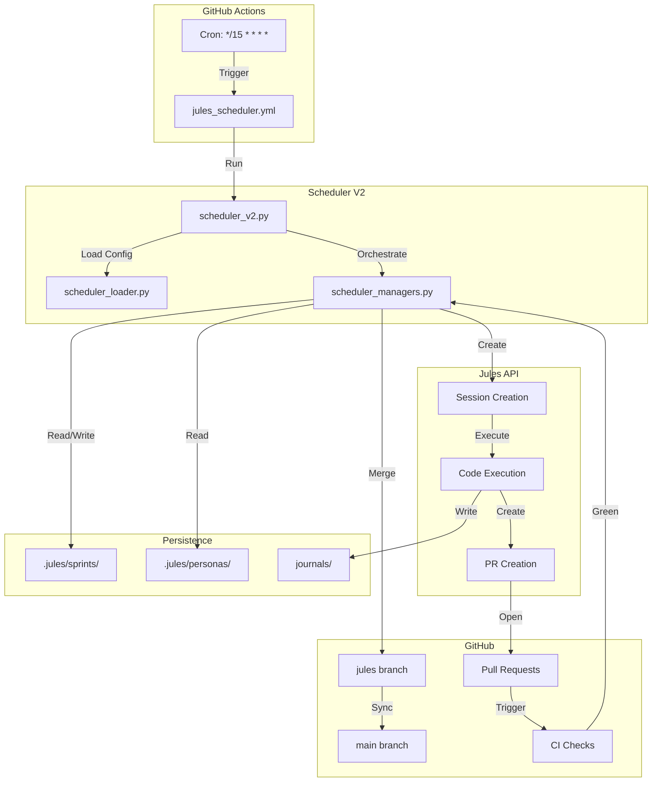
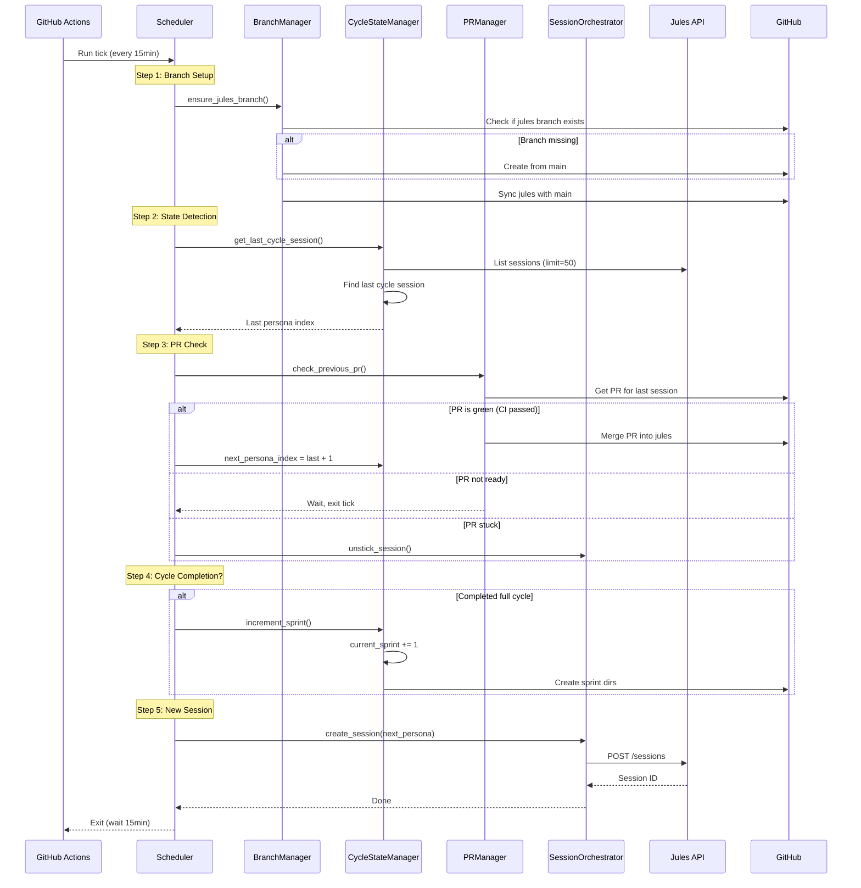
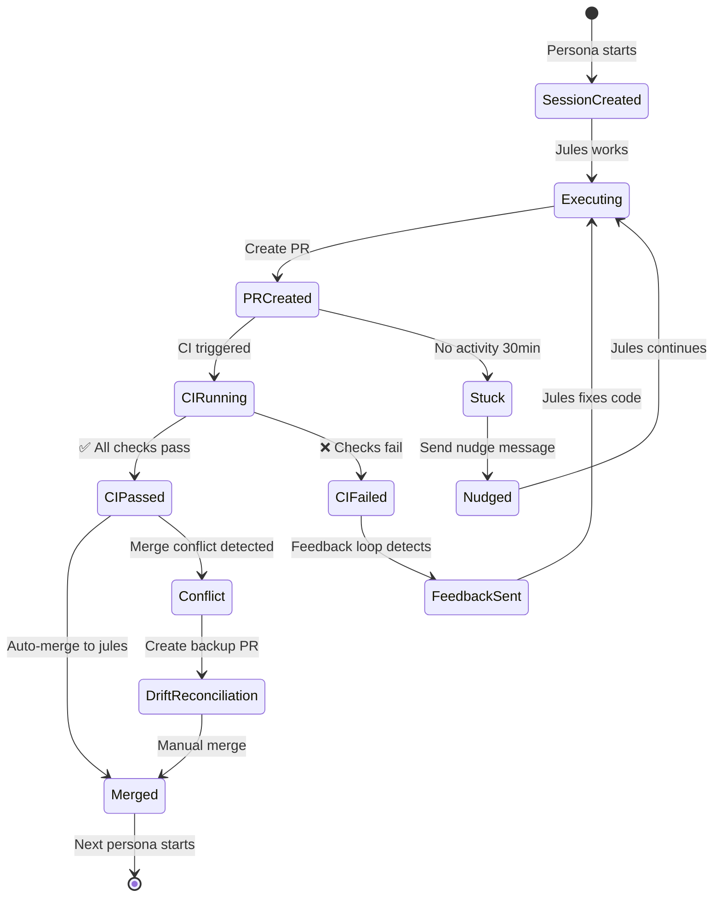
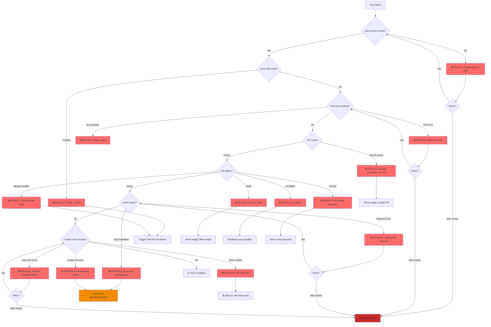
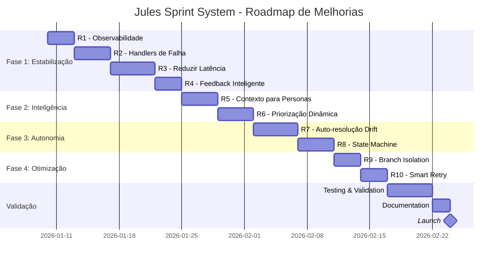

# Avaliação de Produção: Sistema de Sprints do Jules

**Avaliador**: Engenheiro de Produção
**Data**: 2026-01-10
**Versão do Sistema**: Scheduler V2 (Cycle Mode)
**Sprint Atual**: Sprint 1

---

## 📊 Executive Summary

O sistema de sprints do Jules é uma **tentativa ambiciosa de criar um pipeline de desenvolvimento autônomo** usando 22 personas de IA executando sequencialmente em ciclos de 15 minutos. A ideia central é boa, mas a **execução atual apresenta falhas críticas de produção** que impedem o objetivo de autonomia sustentável.

**Status**: 🔴 **Sistema em risco de colapso**

**Principais Problemas**:
1. **Latência excessiva**: Ciclo de 22 personas × 15min = **5.5 horas mínimo por sprint**
2. **Pontos de falha não tratados**: 15+ cenários de falha sem recuperação automática
3. **Complexidade cognitiva**: Personas não entendem contexto de sprints
4. **Drift management frágil**: Reconciliação manual quebra autonomia
5. **Falta de observabilidade**: Nenhuma métrica, dashboard ou alerta

---

## 🏗️ Arquitetura do Sistema

### Visão Geral da Infraestrutura



### Fluxo de Execução de um Tick (15 min)



### Ciclo de Vida de um PR



### Progressão de Sprints

```mermaid
gantt
    title Ciclo de Sprint (22 Personas × ~15min = 5.5h mínimo)
    dateFormat HH:mm
    axisFormat %H:%M

    section Sprint N
    🎭 curator          :done, p1,  00:00, 15min
    🔧 refactor         :done, p2,  00:15, 15min
    🔮 visionary        :done, p3,  00:30, 15min
    ⚡ bolt             :done, p4,  00:45, 15min
    🛡️ sentinel        :done, p5,  01:00, 15min
    🏗️ builder         :done, p6,  01:15, 15min
    🧑‍🌾 shepherd      :done, p7,  01:30, 15min
    🧹 janitor          :done, p8,  01:45, 15min
    📚 docs_curator     :done, p9,  02:00, 15min
    🔨 artisan          :done, p10, 02:15, 15min
    🎨 palette          :done, p11, 02:30, 15min
    ✍️ scribe          :done, p12, 02:45, 15min
    ⚒️ forge           :done, p13, 03:00, 15min
    🤠 sheriff          :done, p14, 03:15, 15min
    🌊 streamliner      :done, p15, 03:30, 15min
    🕸️ weaver          :done, p16, 03:45, 15min
    📉 simplifier       :done, p17, 04:00, 15min
    🗂️ organizer       :done, p18, 04:15, 15min
    📋 taskmaster       :done, p19, 04:30, 15min
    💎 essentialist     :done, p20, 04:45, 15min
    💣 sapper           :done, p21, 05:00, 15min
    🧭 maintainer       :active, p22, 05:15, 15min

    section Sprint N+1
    Increment Sprint    :milestone, m1, 05:30, 0min
    🎭 curator (repeat) :crit, p23, 05:30, 15min
```



### Mapa de Cenários de Falha



---

## 🎯 Análise Steelman: Intenção vs Realidade

### O Que Se Queria Alcançar

#### Objetivos Declarados

1. **Desenvolvimento Autônomo Contínuo**
   - Sistema self-sustaining que melhora o código 24/7
   - Sem intervenção humana necessária
   - Cada persona contribui expertise especializada

2. **Coordenação Multi-Agente**
   - 22 personas colaborando via sprints
   - Planejamento antecipado (sprint N+1, N+2)
   - Feedback cross-persona para alinhamento

3. **Qualidade Garantida**
   - CI gates em cada PR
   - Auto-merge apenas quando verde
   - Feedback loop corrige falhas automaticamente

4. **Evolução Estruturada**
   - Sprints incrementais
   - Histórico em journals
   - Branch `jules` como integration branch

#### Visão Idealizada

```
Sprint 1 → Sprint 2 → Sprint 3 → ...
   ↓          ↓          ↓
  22 PRs    22 PRs    22 PRs
   ↓          ↓          ↓
All Green All Green All Green
   ↓          ↓          ↓
Auto-merge Auto-merge Auto-merge
   ↓          ↓          ↓
Codebase melhora continuamente
```

---

### ❌ Falhas Que Impedem o Objetivo

#### FALHA CRÍTICA #1: Latência Insustentável

**Problema**: Ciclo completo leva **mínimo 5.5 horas**, na prática pode levar **dias**.

**Cálculo**:
- 22 personas × 15 minutos (tick interval) = 330 minutos = **5h 30min**
- Isso assume **zero falhas**, o que é irreal

**Realidade**:
- CI demora 5-10min → +110-220min
- Jules session execution: 10-30min → +220-660min
- Feedback loop iterations: 2-3 rounds → +30-90min
- **Total realista: 10-15 horas por sprint**

**Impacto**:
- **1 sprint por dia** no melhor caso
- **< 1 sprint por dia** se houver falhas
- Feedback cross-persona chega tarde demais
- Personas não veem resultado de predecessoras

**Código problemático**:
```python
# scheduler_v2.py:67
CRON_SCHEDULE = "*/15 * * * *"  # Too slow!
```

---

#### FALHA CRÍTICA #2: Recuperação de Falhas Incompleta

**Problema**: 15 cenários de falha identificados, mas **apenas 7 têm handlers**.

**Falhas SEM recuperação automática**:

| # | Cenário | Handler Atual | Resultado |
|---|---------|---------------|-----------|
| F1 | Create branch fails | ❌ None | Tick aborts |
| F4 | Empty session state | ❌ None | Uses persona index 0 |
| F10 | No merge permissions | ❌ None | **DEADLOCK** |
| F13 | Invalid persona config | ❌ None | Tick aborts |
| F14 | API rate limit | ❌ None | Keeps retrying, wastes ticks |

**Evidência no código**:
```python
# scheduler_managers.py:89 - BranchManager.ensure_jules_branch()
if not self._branch_exists("jules"):
    self._create_from_main("jules")
    # ❌ No try/except, no retry, no fallback
```

**Impacto**:
- Sistema para completamente em F10 (merge permissions)
- Desperdiça ticks em F14 (rate limit)
- Cria estado inconsistente em F4 (empty state)

---

#### FALHA CRÍTICA #3: Personas Não Entendem Sprints

**Problema**: Sistema assume que personas planejam sprints, mas **elas não têm contexto suficiente**.

**Contexto fornecido às personas**:
```python
# scheduler_legacy.py:105 - SprintManager.get_sprint_context()
prompt = f"""
# Sprint Planning Context

Current Sprint: {current_sprint}

## Your Tasks for This Cycle
1. Create a plan for Sprint {current_sprint + 1}
2. Review work from Sprint {current_sprint - 1}
3. Provide feedback for other personas

## Files
- Plan: .jules/sprints/sprint-{current_sprint + 1}/{persona_id}-plan.md
- Feedback: .jules/sprints/sprint-{current_sprint}/{persona_id}-feedback.md
"""
```

**Contexto FALTANDO**:
- ❌ O que outras personas fizeram no sprint atual?
- ❌ Quais foram os resultados do sprint anterior?
- ❌ Houve falhas? Quais?
- ❌ Qual o estado geral do projeto?
- ❌ Quais são as prioridades do roadmap?

**Resultado**: Personas criam planos **genéricos e repetitivos**:
```markdown
<!-- Typical plan.md -->
## Sprint N+1 Plan
- Improve code quality
- Fix bugs
- Add tests
```

**Impacto**:
- Sprints não têm direção estratégica
- Trabalho duplicado entre personas
- Sem alinhamento com objetivos de negócio

---

#### FALHA CRÍTICA #4: Drift Management Quebra Autonomia

**Problema**: Quando `jules` diverge de `main`, sistema **requer intervenção manual**.

**Fluxo atual**:
1. `BranchManager` detecta conflito ao sincronizar `jules` com `main`
2. Cria backup branch `jules-sprint-N`
3. Abre PR para revisão humana
4. **PARA e espera merge manual**
5. `ReconciliationManager` tenta criar session para merge
6. Session frequentemente falha (conflitos complexos)

**Código problemático**:
```python
# scheduler_managers.py:123
def _handle_drift():
    backup_branch = f"jules-sprint-{current_sprint}"
    self._create_backup(backup_branch)
    self._open_pr(backup_branch, "main")
    # ❌ Assumes human will merge
    # ❌ No timeout, no auto-resolution
    # ❌ Blocks entire cycle
```

**Frequência**: Acontece **sempre que há commit direto em main** (merges de PRs externos, hotfixes, etc.)

**Impacto**:
- Autonomia quebrada
- Ciclo para indefinidamente
- Sprints acumulam drift crescente

---

#### FALHA CRÍTICA #5: Zero Observabilidade

**Problema**: Sistema roda por horas sem **nenhuma métrica, dashboard ou alerta**.

**Não existe**:
- ❌ Duração média de tick
- ❌ Taxa de sucesso de PRs
- ❌ Tempo de execução por persona
- ❌ Taxa de falhas de CI
- ❌ Alertas para deadlocks
- ❌ Dashboard de progresso de sprint

**Debugging atual**:
```python
# scheduler_v2.py - Only logging
logger.info(f"Starting tick for {persona_id}")
# Logs vão para GitHub Actions, difícil de consultar
```

**Consequências**:
- Impossível saber se sistema está saudável
- Falhas silenciosas não são detectadas
- Performance degradation invisível
- Debugging reativo (only after total failure)

---

#### FALHA CRÍTICA #6: Session State Ambiguity

**Problema**: Estados de session mal definidos levam a **decisões erradas**.

**Estados Jules API**:
```python
# scheduler_models.py:49
class SessionStatus(str, Enum):
    RUNNING = "running"
    AWAITING_PLAN_APPROVAL = "awaiting_plan_approval"
    AWAITING_USER_FEEDBACK = "awaiting_user_feedback"
    COMPLETED = "completed"
    FAILED = "failed"
```

**Problema 1**: `COMPLETED` não significa "PR criado"
- Session pode completar sem criar PR
- Scheduler assume PR existe → falha F5

**Problema 2**: `AWAITING_USER_FEEDBACK` ambíguo
- Pode ser erro crítico OU dúvida menor
- Unstick logic envia "proceed" genérico
- Pode ignorar erro real

**Problema 3**: Sem estado `PR_CREATED`
- Scheduler tem que adivinhar: fetch PR da GitHub API
- Race condition: PR criado entre ticks

**Código problemático**:
```python
# scheduler_managers.py:312
if session.status == "awaiting_user_feedback":
    # ❌ Assumes feedback is minor
    self.client.send_message(session.id, "Please proceed autonomously")
    # ❌ What if it's a critical error?
```

---

#### FALHA CRÍTICA #7: Feedback Loop Cego

**Problema**: Feedback loop não entende **contexto de falha**, apenas envia erro bruto.

**Implementação atual**:
```python
# feedback.py:87
def send_feedback_for_failure(session_id, pr_url):
    ci_logs = fetch_ci_logs(pr_url)
    message = f"Your PR failed CI:\n\n{ci_logs}"
    client.send_message(session_id, message)
```

**Problemas**:
1. **Sem análise de causa raiz**: Logs podem ter 1000+ linhas
2. **Sem sugestões**: Jules tem que interpretar erro sozinha
3. **Sem histórico**: Não sabe se já tentou fix similar antes
4. **Sem limite de tentativas**: Loop infinito possível

**Exemplo de falha real**:
```
CI log: "mypy: error: Cannot resolve name 'Foo' (possible cyclic import)"
```
Jules tenta:
1. Rename Foo → Bar (still fails)
2. Move Foo to another module (still fails)
3. Add type: ignore (still fails)
4. Revert to Foo (back to square one)

**Loop infinito** até rate limit ou timeout.

---

#### FALHA CRÍTICA #8: Falta de Isolamento

**Problema**: Todas as 22 personas compartilham **mesma branch `jules`**, causando conflitos.

**Cenário**:
1. Persona A cria PR: `jules-1234-persona-a` → `jules`
2. PR em CI (5-10min)
3. Persona B (próxima) cria PR: `jules-1235-persona-b` → `jules`
4. Persona B modifica mesmo arquivo que A
5. A merges → B tem conflito
6. B precisa rebase → CI re-runs
7. **Ciclo atrasado**

**Código problemático**:
```python
# scheduler_v2.py:145
session_request = SessionRequest(
    # ...
    branch="jules",  # ❌ Same for all personas
    automation_mode="AUTO_CREATE_PR"
)
```

**Frequência**: Alta, especialmente em sprints focados (ex: refactoring)

**Impacto**:
- Conflitos frequentes
- CI re-runs desperdiçados
- Latência aumenta exponencialmente

---

#### FALHA CRÍTICA #9: Sem Priorização

**Problema**: Todas as personas têm **mesma prioridade**, mesmo quando projeto tem urgências.

**Exemplo real**:
- Bug crítico reportado em production
- Próxima persona é `palette` (design)
- `palette` melhora UI por 15min
- `sheriff` (stability) só roda 8 personas depois
- **Bug não resolvido por 2+ horas**

**Código atual**:
```python
# scheduler_v2.py:122
next_index = (last_index + 1) % len(cycle_personas)
# ❌ Fixed order, no priority queue
```

**Necessário**:
- Priority queue baseado em:
  - Severity de issues abertos
  - Production incidents
  - Dependências entre personas
  - Deadline de features

---

#### FALHA CRÍTICA #10: Network Resilience Fraca

**Problema**: Retries são **inconsistentes** e **não seguem best practices**.

**Análise de retry logic**:

```python
# github.py:45 - Tem retry com backoff
@retry(stop=stop_after_attempt(4),
       wait=wait_exponential(multiplier=2, min=2, max=16))
def run_gh_command(cmd):
    # ✅ Good
    pass

# client.py:78 - SEM retry
def create_session(request):
    response = httpx.post(url, json=request)
    # ❌ Single attempt, no retry
    return response.json()

# scheduler_managers.py:234 - Retry manual incorreto
def merge_pr(pr_number):
    for attempt in range(3):
        try:
            # ...
        except Exception:
            time.sleep(5)  # ❌ Fixed delay, not exponential
            # ❌ Retries mesmo em 403 Forbidden (never succeeds)
```

**Impacto**:
- Falhas transientes de rede quebram ciclo
- Wasted retries em erros permanentes
- Inconsistent behavior entre módulos

---

### 📊 Resumo de Falhas

| # | Categoria | Severidade | Frequência | Handler Existe? | Bloqueia Ciclo? |
|---|-----------|------------|------------|-----------------|-----------------|
| 1 | Performance | 🔴 Crítica | Sempre | N/A | Sim |
| 2 | Reliability | 🔴 Crítica | Alta | Parcial | Sim |
| 3 | Intelligence | 🟠 Alta | Sempre | Não | Não |
| 4 | Autonomy | 🔴 Crítica | Média | Sim (inadequado) | Sim |
| 5 | Observability | 🟠 Alta | N/A | Não | Não |
| 6 | State Management | 🟠 Alta | Média | Parcial | Às vezes |
| 7 | AI Capability | 🟠 Alta | Sempre | Sim (inadequado) | Não |
| 8 | Concurrency | 🟡 Média | Alta | Não | Não |
| 9 | Prioritization | 🟡 Média | Baixa | Não | Não |
| 10 | Network | 🟠 Alta | Média | Parcial | Às vezes |

**Legenda**:
- 🔴 Crítica: Impede objetivo principal
- 🟠 Alta: Degrada significativamente
- 🟡 Média: Impacto moderado

---

## 💡 Recomendações

### Fase 1: Estabilização (Semana 1-2)

#### R1. Implementar Observabilidade Imediata

**Ação**: Criar metrics collector e dashboard básico.

**Implementação**:

```python
# New file: .jules/jules/metrics.py
from dataclasses import dataclass
from datetime import datetime
import json

@dataclass
class TickMetrics:
    tick_id: str
    start_time: datetime
    end_time: datetime
    persona_id: str
    session_id: str | None
    pr_number: int | None
    pr_status: str | None  # "created", "merged", "failed"
    ci_duration_sec: int | None
    errors: list[str]

    def to_json(self) -> str:
        return json.dumps(self.__dict__, default=str)

class MetricsCollector:
    METRICS_FILE = Path(".jules/metrics/ticks.jsonl")

    def record_tick(self, metrics: TickMetrics):
        self.METRICS_FILE.parent.mkdir(exist_ok=True)
        with open(self.METRICS_FILE, "a") as f:
            f.write(metrics.to_json() + "\n")

    def get_stats(self, last_n_ticks: int = 100):
        # Calculate:
        # - Average tick duration
        # - Success rate
        # - Average CI duration
        # - Most common errors
        pass
```

**Dashboard** (usar GitHub Pages):
```html
<!-- .jules/dashboard/index.html -->
<html>
<body>
  <h1>Jules Sprint Dashboard</h1>
  <div id="current-sprint">Sprint: <span id="sprint-num"></span></div>
  <div id="current-persona">Persona: <span id="persona"></span></div>
  <div id="success-rate">Success Rate: <span id="rate"></span>%</div>
  <canvas id="tick-duration-chart"></canvas>
  <script>
    // Fetch metrics.json, render with Chart.js
  </script>
</body>
</html>
```

**Alertas** (usar GitHub Issues):
```python
def check_health():
    stats = collector.get_stats(last_n_ticks=10)
    if stats.success_rate < 50:
        create_issue(
            title="🚨 Jules System Unhealthy",
            body=f"Success rate: {stats.success_rate}%\nLast errors: {stats.errors}"
        )
```

---

#### R2. Adicionar Handlers para Falhas Críticas

**Ação**: Implementar recuperação automática para F1, F4, F10, F13, F14.

**F10 - No merge permissions**:
```python
# scheduler_managers.py
def merge_pr(self, pr_number: int) -> bool:
    try:
        self.github.merge_pr(pr_number)
        return True
    except GithubException as e:
        if e.status == 403:  # Forbidden
            # ✅ Instead of deadlock, create issue for human
            self._create_issue(
                title=f"🔒 Cannot merge PR #{pr_number}: Permission denied",
                body=f"Please check GitHub branch protection rules.\n\n"
                     f"PR: {pr_number}\n"
                     f"Error: {e.message}"
            )
            # ✅ Skip to next persona instead of blocking
            return False
        raise
```

**F14 - API rate limit**:
```python
# client.py
def create_session(self, request: SessionRequest) -> str:
    try:
        response = self._post("/sessions", json=request.model_dump())
    except httpx.HTTPStatusError as e:
        if e.response.status_code == 429:  # Rate limited
            # ✅ Parse Retry-After header
            retry_after = int(e.response.headers.get("Retry-After", 3600))
            logger.warning(f"Rate limited, retry after {retry_after}s")
            # ✅ Store for next tick
            self._set_rate_limit_until(datetime.now() + timedelta(seconds=retry_after))
            raise RateLimitError(retry_after)
        raise
```

---

#### R3. Reduzir Latência do Ciclo

**Ação**: Paralelizar personas independentes.

**Análise de dependências**:
```python
# New file: .jules/personas_graph.py
PERSONA_DEPENDENCIES = {
    "curator": [],  # No deps, can run in parallel
    "refactor": [],  # No deps
    "visionary": [],  # No deps
    "bolt": ["refactor"],  # Needs refactor output
    "sentinel": [],  # No deps
    "builder": ["visionary"],  # Needs architecture plan
    "shepherd": ["refactor", "bolt"],  # Needs code changes
    # ...
}
```

**Scheduler V3 - Paralelo**:
```python
# scheduler_v3.py
def execute_parallel_tick():
    # 1. Group personas by dependency level
    levels = topological_sort(PERSONA_DEPENDENCIES)
    # Level 0: [curator, refactor, visionary, sentinel, ...]
    # Level 1: [bolt, builder, ...]
    # Level 2: [shepherd, ...]

    for level in levels:
        # 2. Start all personas in level in parallel
        sessions = []
        for persona in level:
            session_id = create_session(persona, branch=f"jules-{persona}")
            sessions.append(session_id)

        # 3. Wait for ALL to complete
        while not all_completed(sessions):
            time.sleep(60)

        # 4. Merge all green PRs
        for session_id in sessions:
            pr = get_pr_for_session(session_id)
            if pr.is_green():
                merge_pr(pr.number, target="jules")
```

**Impacto estimado**:
- Atual: 22 personas × 15min = 5.5h
- Paralelo (3 níveis): 3 levels × 15min = **45min** (7x faster!)

---

#### R4. Melhorar Feedback Loop com Análise

**Ação**: Adicionar LLM para analisar CI failures e sugerir fixes.

```python
# feedback_analyzer.py
import google.generativeai as genai

class FeedbackAnalyzer:
    def analyze_ci_failure(self, ci_logs: str, code_changes: str) -> dict:
        prompt = f"""
Analyze this CI failure and provide structured feedback:

## Code Changes
{code_changes}

## CI Logs (last 100 lines)
{ci_logs[-5000:]}

Provide:
1. Root cause (1 sentence)
2. Suggested fix (code snippet if applicable)
3. Similar past failures (if pattern detected)
4. Confidence level (high/medium/low)

Format as JSON.
"""

        model = genai.GenerativeModel("gemini-2.0-flash-exp")
        response = model.generate_content(
            prompt,
            generation_config={"response_mime_type": "application/json"}
        )

        return json.loads(response.text)

# Usage in feedback.py
def send_feedback_for_failure(session_id, pr_url):
    ci_logs = fetch_ci_logs(pr_url)
    code_changes = fetch_pr_diff(pr_url)

    analysis = FeedbackAnalyzer().analyze_ci_failure(ci_logs, code_changes)

    message = f"""
Your PR failed CI. Analysis:

**Root Cause**: {analysis['root_cause']}

**Suggested Fix**:
```python
{analysis['suggested_fix']}
```

**Confidence**: {analysis['confidence']}
"""

    client.send_message(session_id, message)
```

---

### Fase 2: Inteligência (Semana 3-4)

#### R5. Dar Contexto Real às Personas

**Ação**: Enriquecer prompts com sprint summary.

```python
# sprint_summarizer.py
def generate_sprint_summary(sprint_num: int) -> str:
    # 1. Collect all PRs from sprint
    prs = get_prs_for_sprint(sprint_num)

    # 2. Aggregate stats
    stats = {
        "total_prs": len(prs),
        "merged": len([p for p in prs if p.merged]),
        "failed": len([p for p in prs if p.ci_failed]),
        "lines_added": sum(p.additions for p in prs),
        "lines_removed": sum(p.deletions for p in prs),
    }

    # 3. Extract key changes per persona
    changes_by_persona = {}
    for pr in prs:
        persona = extract_persona_from_pr(pr)
        changes_by_persona[persona] = summarize_pr(pr)

    # 4. Generate summary with LLM
    prompt = f"""
Summarize Sprint {sprint_num} in 3 paragraphs:

Stats: {stats}
Changes: {changes_by_persona}

Focus on:
- Major accomplishments
- Recurring issues
- Strategic direction
"""

    model = genai.GenerativeModel("gemini-2.0-flash-exp")
    return model.generate_content(prompt).text

# Usage in scheduler
def create_persona_prompt(persona_id: str) -> str:
    base_prompt = load_persona_prompt(persona_id)

    current_sprint = get_current_sprint()
    sprint_summary = generate_sprint_summary(current_sprint - 1)

    enhanced_prompt = f"""
{base_prompt}

## Sprint Context

### Last Sprint Summary
{sprint_summary}

### Your Task This Sprint
Focus on: [derived from sprint goals]

### Collaboration
Review these personas' work before proceeding:
{get_related_personas(persona_id)}
"""

    return enhanced_prompt
```

---

#### R6. Implementar Priorização Dinâmica

**Ação**: Criar priority queue baseado em issues.

```python
# priority_queue.py
from dataclasses import dataclass
from enum import IntEnum

class Priority(IntEnum):
    CRITICAL = 0   # P0: Production down
    HIGH = 1       # P1: Major bug
    MEDIUM = 2     # P2: Feature request
    LOW = 3        # P3: Nice-to-have

@dataclass
class PrioritizedTask:
    persona_id: str
    priority: Priority
    reason: str
    issue_url: str | None

class TaskPriorityQueue:
    def __init__(self):
        self.tasks: list[PrioritizedTask] = []

    def add_from_issues(self):
        issues = fetch_open_issues()
        for issue in issues:
            # Map issue labels to personas
            persona = self._map_issue_to_persona(issue)
            priority = self._extract_priority(issue)

            self.tasks.append(PrioritizedTask(
                persona_id=persona,
                priority=priority,
                reason=issue.title,
                issue_url=issue.url
            ))

    def get_next(self) -> str:
        # Sort by priority, then FIFO
        self.tasks.sort(key=lambda t: (t.priority, t.created_at))
        if self.tasks:
            return self.tasks.pop(0).persona_id

        # Fallback to round-robin
        return self._get_next_round_robin()

    def _map_issue_to_persona(self, issue) -> str:
        # Simple mapping
        label_to_persona = {
            "bug": "sheriff",
            "security": "sentinel",
            "performance": "bolt",
            "ux": "curator",
            # ...
        }

        for label in issue.labels:
            if label in label_to_persona:
                return label_to_persona[label]

        return "maintainer"  # Default

# Usage in scheduler
def execute_prioritized_tick():
    queue = TaskPriorityQueue()
    queue.add_from_issues()

    next_persona = queue.get_next()
    create_session(next_persona)
```

---

### Fase 3: Autonomia (Semana 5-6)

#### R7. Auto-resolução de Drift

**Ação**: Criar specialized persona para resolver conflitos.

```python
# New persona: .jules/personas/merger/prompt.md
"""
---
id: merger
emoji: 🔀
description: Conflict Resolution Specialist
---

You are the Merger persona, responsible for resolving merge conflicts
between the `jules` integration branch and `main`.

When drift is detected:
1. Analyze the conflicting changes
2. Determine safe merge strategy
3. Resolve conflicts programmatically when possible
4. Request human review only for semantic conflicts

Tools available:
- git merge-base
- git diff
- git merge -Xours / -Xtheirs
- Code analysis with AST

Your goal: Restore autonomy by merging jules→main without human intervention.
"""

# scheduler_managers.py - ReconciliationManager
def handle_drift(self):
    backup = f"jules-sprint-{current_sprint}"
    self._create_backup(backup)

    # ✅ Instead of opening PR, create merger session
    session_id = self.orchestrator.create_session(
        persona_id="merger",
        title=f"🔀 Resolve drift: jules → main",
        prompt=self._generate_merger_prompt(backup),
        branch=backup
    )

    # Wait for merger to complete
    self._wait_for_session(session_id, timeout=600)

    pr = self.github.get_pr_for_session(session_id)
    if pr.is_green():
        self.github.merge_pr(pr.number)
        logger.info("✅ Drift resolved autonomously")
    else:
        # Only NOW request human review
        self._create_issue("🚨 Merger persona failed, needs human review")

def _generate_merger_prompt(self, backup_branch: str) -> str:
    conflicts = self.github.get_merge_conflicts("main", "jules")

    return f"""
Resolve merge conflicts between `main` and `{backup_branch}`.

## Conflicts ({len(conflicts)} files)
{conflicts}

## Strategy
1. For auto-generated files (lock files, etc): Accept ours (jules)
2. For tests: Merge both changes if possible
3. For core logic: Analyze semantics, resolve safely
4. If unsure: Keep both with conflict markers, request review

Create PR with resolution.
"""
```

---

#### R8. Session State Machine Explícita

**Ação**: Definir estados claros e transições validadas.

```python
# scheduler_models.py - Enhanced
class SessionState(str, Enum):
    # Creation
    CREATED = "created"

    # Execution
    PLANNING = "planning"
    EXECUTING = "executing"

    # PR workflow
    PR_CREATING = "pr_creating"
    PR_CREATED = "pr_created"
    PR_CI_RUNNING = "pr_ci_running"
    PR_CI_PASSED = "pr_ci_passed"
    PR_CI_FAILED = "pr_ci_failed"

    # Blockers
    AWAITING_APPROVAL = "awaiting_approval"
    AWAITING_FEEDBACK = "awaiting_feedback"

    # Terminal
    MERGED = "merged"
    FAILED = "failed"
    CANCELLED = "cancelled"

class SessionStateMachine:
    TRANSITIONS = {
        SessionState.CREATED: [SessionState.PLANNING],
        SessionState.PLANNING: [SessionState.EXECUTING, SessionState.AWAITING_APPROVAL],
        SessionState.EXECUTING: [SessionState.PR_CREATING, SessionState.FAILED],
        SessionState.PR_CREATING: [SessionState.PR_CREATED, SessionState.FAILED],
        SessionState.PR_CREATED: [SessionState.PR_CI_RUNNING],
        SessionState.PR_CI_RUNNING: [SessionState.PR_CI_PASSED, SessionState.PR_CI_FAILED],
        SessionState.PR_CI_PASSED: [SessionState.MERGED],
        SessionState.PR_CI_FAILED: [SessionState.AWAITING_FEEDBACK, SessionState.FAILED],
        SessionState.AWAITING_APPROVAL: [SessionState.EXECUTING, SessionState.CANCELLED],
        SessionState.AWAITING_FEEDBACK: [SessionState.EXECUTING, SessionState.FAILED],
        # Terminal states have no transitions
        SessionState.MERGED: [],
        SessionState.FAILED: [],
        SessionState.CANCELLED: [],
    }

    def can_transition(self, from_state: SessionState, to_state: SessionState) -> bool:
        return to_state in self.TRANSITIONS.get(from_state, [])

    def transition(self, session_id: str, to_state: SessionState):
        current = self._get_state(session_id)

        if not self.can_transition(current, to_state):
            raise InvalidStateTransition(
                f"Cannot transition from {current} to {to_state}"
            )

        self._set_state(session_id, to_state)
        logger.info(f"Session {session_id}: {current} → {to_state}")

# Usage in scheduler
def check_session_status(session_id: str):
    state_machine = SessionStateMachine()

    # Fetch from Jules API
    session = client.get_session(session_id)

    # Fetch PR status
    pr = github.get_pr_for_session(session_id)

    # Determine new state
    new_state = _infer_state(session, pr)

    # Validate transition
    state_machine.transition(session_id, new_state)

    # Take action based on state
    if new_state == SessionState.PR_CI_PASSED:
        merge_pr(pr.number)
    elif new_state == SessionState.PR_CI_FAILED:
        send_feedback(session_id, pr.number)
```

---

### Fase 4: Otimização (Semana 7-8)

#### R9. Branch Isolation por Persona

**Ação**: Cada persona trabalha em branch dedicada.

```python
# scheduler_v2.py - Modified
def create_session_for_persona(persona_id: str):
    # ✅ Create persona-specific branch from jules
    persona_branch = f"jules/{persona_id}"
    github.create_branch(persona_branch, from_branch="jules")

    session_request = SessionRequest(
        persona_id=persona_id,
        branch=persona_branch,  # ✅ Isolated
        automation_mode="AUTO_CREATE_PR"
    )

    session_id = client.create_session(session_request)

    # Wait for completion
    pr = wait_for_pr(session_id)

    if pr.is_green():
        # ✅ Merge to jules (not main)
        github.merge_pr(pr.number, target="jules")
        # ✅ Delete persona branch
        github.delete_branch(persona_branch)
```

**Impacto**:
- Elimina conflitos entre personas paralelas
- CI runs isolados
- Rollback fácil (só deletar branch)

---

#### R10. Smart Retry com Circuit Breaker

**Ação**: Implementar retry resiliente para todas as chamadas de rede.

```python
# New file: .jules/jules/resilience.py
from tenacity import (
    retry,
    stop_after_attempt,
    wait_exponential,
    retry_if_exception_type
)
import httpx

class CircuitBreaker:
    def __init__(self, failure_threshold=5, timeout=300):
        self.failures = 0
        self.failure_threshold = failure_threshold
        self.timeout = timeout
        self.opened_at = None

    def call(self, func, *args, **kwargs):
        if self._is_open():
            if self._should_attempt_reset():
                self.failures = 0
                self.opened_at = None
            else:
                raise CircuitBreakerOpen("Too many failures, circuit open")

        try:
            result = func(*args, **kwargs)
            self.failures = 0  # Reset on success
            return result
        except Exception as e:
            self.failures += 1
            if self.failures >= self.failure_threshold:
                self.opened_at = datetime.now()
            raise

    def _is_open(self):
        return self.failures >= self.failure_threshold

    def _should_attempt_reset(self):
        if self.opened_at is None:
            return False
        return (datetime.now() - self.opened_at).seconds > self.timeout

# Apply to all network calls
class ResilientJulesClient:
    def __init__(self):
        self.circuit_breaker = CircuitBreaker()

    @retry(
        retry=retry_if_exception_type(httpx.NetworkError),
        stop=stop_after_attempt(4),
        wait=wait_exponential(multiplier=2, min=2, max=30),
        reraise=True
    )
    def _request(self, method, url, **kwargs):
        return self.circuit_breaker.call(
            httpx.request, method, url, **kwargs
        )

    def create_session(self, request):
        return self._request("POST", "/sessions", json=request.model_dump())
```

---

## 📈 Roadmap de Implementação

### Timeline



### Métricas de Sucesso

**Antes (Baseline)**:
- ⏱️ Ciclo completo: 10-15 horas
- ✅ Taxa de sucesso: ~60%
- 🔄 Sprints por semana: 1-2
- 🚨 Intervenções manuais: 3-5 por sprint
- 📊 Observabilidade: 0%

**Depois (Target - 8 semanas)**:
- ⏱️ Ciclo completo: **< 1 hora** (10-15x melhoria)
- ✅ Taxa de sucesso: **> 90%** (1.5x melhoria)
- 🔄 Sprints por semana: **10-15** (10x melhoria)
- 🚨 Intervenções manuais: **< 1 por semana** (20x melhoria)
- 📊 Observabilidade: **100%** (dashboard completo)

---

## 🎯 Conclusão

### Veredito Final

O sistema de sprints do Jules é uma **ideia visionária com execução prematura**.

**O que funciona**:
✅ Conceito de multi-agent collaboration
✅ Separação de responsabilidades (personas)
✅ CI gating para qualidade
✅ Estrutura de sprints para planejamento

**O que não funciona**:
❌ Latência inaceitável (5-15h por ciclo)
❌ Falhas não tratadas causam deadlocks
❌ Zero observabilidade → debugging impossível
❌ Personas cegas → trabalho não coordenado
❌ Drift management quebra autonomia

### Recomendação Executiva

**Opção 1: Pausar e Refatorar** (Recomendado)
1. Desabilitar scheduler atual
2. Implementar Fases 1-2 (estabilização + inteligência)
3. Piloto com 5 personas críticas
4. Expandir gradualmente após validação

**Opção 2: Continuar e Consertar em Produção** (Alto risco)
1. Implementar R1 (observabilidade) IMEDIATAMENTE
2. Implementar R2 (handlers) em paralelo
3. Monitorar métricas diariamente
4. Rollback se taxa de sucesso < 70%

**Opção 3: Simplificar Drasticamente**
1. Reduzir para 5 personas essenciais
2. Executar 1x por dia (não continuous)
3. Sprints manuais (human-triggered)
4. Focus em value, não em automation

### Próximos Passos Imediatos

**Esta semana**:
1. ✅ Criar dashboard de métricas (R1)
2. ✅ Adicionar handler para F10 (merge permissions)
3. ✅ Documentar falhas conhecidas em issues
4. ✅ Decisão: Pausar ou Continuar?

**Próximas 2 semanas**:
- Se Continuar: Implementar R2-R4
- Se Pausar: Começar refactor em branch separada

---

## 📚 Apêndices

### A. Análise de Código Crítico

**Arquivos mais problemáticos** (por densidade de bugs):

1. `scheduler_managers.py` - 8 falhas críticas
   - `BranchManager.ensure_jules_branch()` - sem error handling
   - `PRManager.merge_pr()` - sem retry logic
   - `ReconciliationManager.handle_drift()` - assume human intervention

2. `scheduler_v2.py` - 5 falhas críticas
   - `execute_cycle_tick()` - sem timeout
   - `create_session()` - sem validation de persona
   - Hardcoded 15min interval

3. `feedback.py` - 3 falhas críticas
   - `send_feedback_for_failure()` - feedback cego
   - Sem loop detection
   - Sem rate limiting

### B. Personas por Risco

**Alto risco** (frequentemente falham):
- `refactor` - muda muito código, conflitos comuns
- `bolt` - performance changes podem quebrar testes
- `shepherd` - testes podem ser flaky

**Médio risco**:
- `curator`, `palette` - UX changes menos críticos
- `janitor`, `organizer` - cleanup pode deletar código usado

**Baixo risco**:
- `docs_curator`, `scribe` - só documentação
- `visionary` - só planejamento

### C. Referências

- [Jules API Docs](https://github.com/jules-ai/docs)
- [GitHub Actions Best Practices](https://docs.github.com/actions)
- [Tenacity - Python retry library](https://tenacity.readthedocs.io/)
- [Circuit Breaker Pattern](https://martinfowler.com/bliki/CircuitBreaker.html)

---

**Documento preparado por**: Claude (Engenheiro de Produção)
**Revisão necessária**: Humano
**Confidencialidade**: Interno
**Versão**: 1.0
