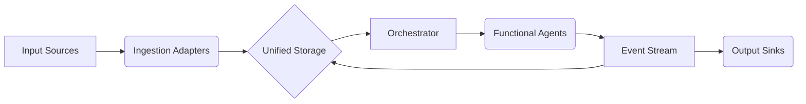

# Egregora V3: The Atom-Centric Architecture

**Status:** Draft
**Date:** 2024-05-22
**Author:** Architect

## 1. The Vision

Egregora V2 was a pipeline of scripts. Egregora V3 is a **Functional Event Stream**.

The core insight of V3 is that **everything is an Entry**. A WhatsApp message, a generated blog post, a user profile, a system log—these are all just atoms of information flowing through time. By adopting the **Atom Syndication Format (RFC 4287)** as our internal lingua franca, we collapse the complexity of managing disparate data types into a single, unified model.

### Key Shifts

| Dimension | V2 (Legacy) | V3 (Target) |
| :--- | :--- | :--- |
| **Data Model** | Multiple tables (`messages`, `runs`, `posts`) | Single Table (`documents`) storing `Entry` objects |
| **Logic** | Imperative Side-Effects (Agents write files) | Functional (Agents emit Events/Operations) |
| **Identity** | Database IDs / UUIDs | Semantic Slugs (`2024-01-01-topic`) |
| **Storage** | Hybrid (DuckDB + JSON Files) | Unified DuckDB (with Parquet for archives) |

---

## 2. The Architecture

### 2.1 The Data Model: `Entry`

The `Entry` (defined in `src/egregora_v3/core/types.py`) is the universal container.

```python
class Entry(BaseModel):
    id: str           # URI (e.g., "urn:uuid:..." or "https://site.com/post")
    title: str
    updated: datetime
    content: str
    authors: list[Author]
    links: list[Link] # Semantic links (rel="alternate", rel="enclosure")

    # Polymorphism via extensions
    doc_type: str     # "message", "post", "profile"
    internal_metadata: dict
```

### 2.2 The Functional Pipeline

The system is a unidirectional flow of transformations.



1.  **Ingestion:** Adapters (WhatsApp, Discord) convert raw external data into `Entry` objects (type=`message`) and push them to Storage.
2.  **Storage:** A single DuckDB table holds all entries.
3.  **Orchestration:** The `Pipeline` queries Storage for unprocessed entries (using Windowing strategies).
4.  **Agents:**
    *   Input: A window of `Entry` objects.
    *   Process: LLM reasoning (Pure Logic).
    *   Output: A list of *new* `Entry` objects (type=`post`, type=`log`) or `Operations` (e.g., `UpdateEntry`).
5.  **Output:** Sinks listen for specific Entry types (e.g., `post`) and materialize them (render Hugo/MkDocs files).

### 2.3 Identity & Semantics

*   **Semantic Identity:** Where possible, IDs should be human-readable and stable (e.g., `2024-05-20-system-architecture`).
*   **Privacy:** Author PII is stripped at the **Ingestion** boundary. Internally, authors are referenced by stable, opaque UUIDs or Aliases.

---

## 3. Migration Strategy

We will use a **Strangler Fig** approach. We cannot stop the world to rewrite V2.

### Phase 1: Data Convergence (In Progress)
*   **Goal:** Make the DB schema compatible with `Entry`.
*   **Action:** Update `IR_MESSAGE_SCHEMA` in V2 to align with V3 `Entry` fields.
*   **Check:** Can we store a V3 `Entry` in the current V2 DuckDB table without data loss?

### Phase 2: Ingestion Swap
*   **Goal:** Decouple Input Adapters.
*   **Action:** Rewrite `WhatsAppAdapter` to produce `Entry` objects.
*   **Bridge:** A small shim converts `Entry` back to V2 dicts for the legacy pipeline if needed.

### Phase 3: Agent Refactor
*   **Goal:** functionalize the Writer.
*   **Action:** Refactor `Writer` agent to return objects instead of writing files.
*   **Benefit:** Enables parallel execution and easier testing.

### Phase 4: The Switch
*   **Goal:** V3 becomes the default.
*   **Action:** Point `egregora` CLI to the new pipeline. Archive V2 code.

---

## 4. Invariants (The "Rules of Physics")

1.  **No Side Effects in Agents:** Agents never write to disk or call network APIs (except the LLM itself). They only return *intent*.
2.  **Parse, Don't Validate:** Validation happens at the edges (Ingestion/Output). Internal data is trusted.
3.  **One Table:** If it's content, it goes in the `documents` table. No side tables for specific content types.
4.  **Privacy by Design:** PII never leaves the Ingestion layer unmasked.
