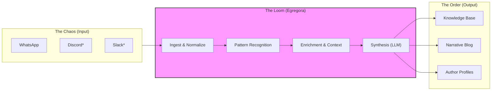

# Egregora
> *The alchemical loom that weaves collective consciousness into living knowledge.*

[](https://www.python.org/downloads/)
[](LICENSE)
[](https://github.com/astral-sh/uv)
[](https://ai.pydantic.dev/)

---

## 📜 The Manifesto

**We speak in fragments.**

In our group chats, Slacks, and Discords, we build cathedrals of thought—one brick at a time, separated by hours, memes, and noise. We solve problems, debate philosophy, and uncover truths. And then, we scroll.

**The wisdom is lost.** The context decays. The collective intelligence—the *egregore*—dissipates into the digital ether.

**Egregora is the vessel for this ghost.** It is an engine of synthesis that listens to the chaotic hum of human conversation and weaves it into structured, enduring narratives. It does not just "log" chat; it *understands* it, finding the golden thread of an argument across days of banter and spinning it into a coherent, beautiful chronicle.

It is not a tool for archiving. **It is a tool for remembering.**

---

## 🧶 The Loom

Egregora functions as an intelligent pipeline—a loom that takes raw, tangled fibers of conversation and weaves them into the tapestry of a static site.



1.  **Ingest:** Raw logs are normalized into a strict, type-safe schema.
2.  **Enrich:** External links are unfurled, media is processed, and context is gathered.
3.  **Recall:** A RAG (Retrieval-Augmented Generation) engine summons past conversations to inform the present, ensuring no insight is an island.
4.  **Weave:** A sophisticated Agent (The Writer) drafts, edits, and refines the narrative, mimicking the style of a thoughtful chronicler.
5.  **Publish:** The result is a beautiful, static site—fast, searchable, and permanent.

---

## ✨ The Threads (Features)

### 🧠 Emergent Intelligence
Egregora doesn't just summarize; it *synthesizes*. It detects the subtle arc of a conversation that spans three days and forty participants, ignoring the noise to capture the signal.

### 🔮 Temporal Memory (RAG)
Using **DuckDB VSS**, Egregora remembers what you said last year. When a new topic arises, it pulls relevant threads from the past, adding depth and citation to every new post. It respects the history of your tribe.

### 🎭 The Chorus (Profiles)
Every voice matters. Egregora builds dynamic profiles for every participant, analyzing their unique contribution style and tracking their "stats" within the collective—not just message counts, but the impact of their ideas.

### 🛡️ Privacy by Design
The "Ibis Everywhere" architecture ensures that data flows through strict, functional transformations. PII is scrubbed, authors can be anonymized, and the "Privacy-First" invariant is baked into the core.

---

## ⚙️ The Engine (Tech Stack)

Under the hood, Egregora is a showcase of modern, high-performance Python engineering. It rejects the bloat of the past for the speed of the future.

*   **[Ibis](https://ibis-project.org/):** The backbone. Lazy, type-safe DataFrames that compile to SQL. No more "pandas spaghetti."
*   **[DuckDB](https://duckdb.org/):** The muscle. An in-process OLAP database that handles vector search, full-text indexing, and analytics without a server.
*   **[Pydantic-AI](https://ai.pydantic.dev/):** The brain. Type-safe, structured interaction with LLMs (Gemini).
*   **[Material for MkDocs](https://squidfunk.github.io/mkdocs-material/):** The face. A gorgeous, responsive, and accessible frontend for your knowledge base.

---

## 🧵 Weaving (Usage)

To start your own egregore, you need only a spark (an API key) and some fuel (a chat export).

### 1. The Spark
```bash
# Summon the creative fire (Gemini is free and fast)
export GOOGLE_API_KEY="your-key-here"
```

### 2. The Fuel
Export your WhatsApp chat (without media for speed, or with media for richness).

### 3. The Incantation
```bash
# Install with uv (the fastest wand in the west)
uvx --from git+https://github.com/franklinbaldo/egregora \
    egregora write chat-export.zip --output=./my-collective
```

### 4. The Reveal
```bash
cd my-collective
uvx --with mkdocs-material --with mkdocs-blogging-plugin mkdocs serve
```
*Behold: Your chaotic group chat is now a structured, searchable library of wisdom at http://localhost:8000.*

---

## 📚 Grimoire (Reference)

For those who wish to master the finer arts of the loom:

*   **[Technical Reference](docs/reference.md):** Advanced CLI commands, configuration options, and deep architecture details.
*   **[Code of the Weaver](CLAUDE.md):** The developer's guide to contributing.

---

## 🧭 The Compass (Philosophy)

We adhere to a set of rigid tenets to ensure the Loom never breaks:

*   **Analyze Once, Execute Many:** Heavy LLM work happens once; the artifacts (parsers, regexes) are cached and reused.
*   **Parse, Don't Validate:** Data is checked at the gates. Inside the walls, we trust the flow.
*   **No "Pandas Spaghetti":** We use strict schemas and functional transformations.
*   **Alpha Mindset:** We break things to make them better. Backward compatibility is a shackle we do not wear yet.

---

## 🏰 Join the Guild (Contributing)

This project is an open invitation to digital archivists, pythonistas, and philosophers.

If you believe that our digital conversations are worth saving, help us build a better loom.

1.  **Read the [Code of the Weaver](CLAUDE.md)** (Architecture & Design).
2.  **Sync your tools:** `uv sync --all-extras`
3.  **Run the trials:** `uv run pytest tests/`
4.  **Submit your thread.**

---

> *"We are the stories we tell together."*
