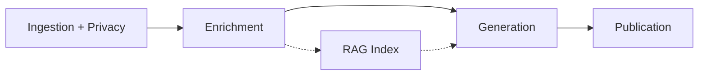
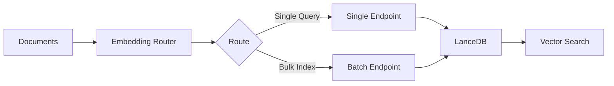
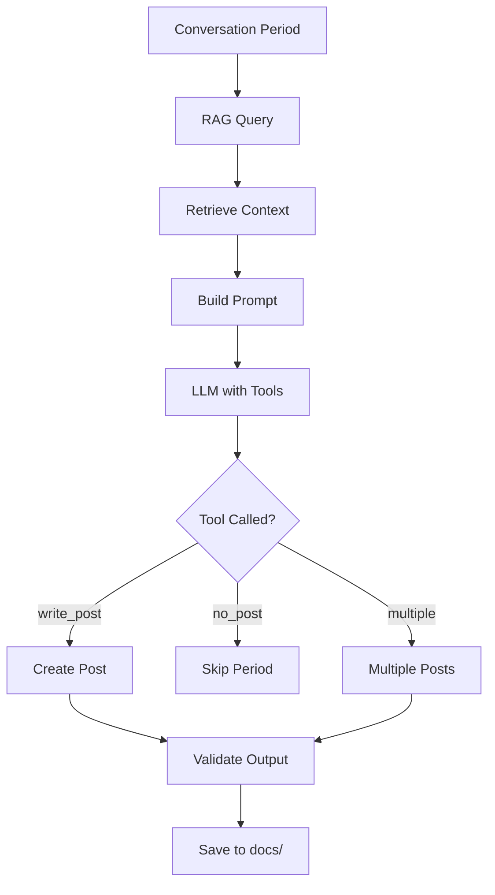
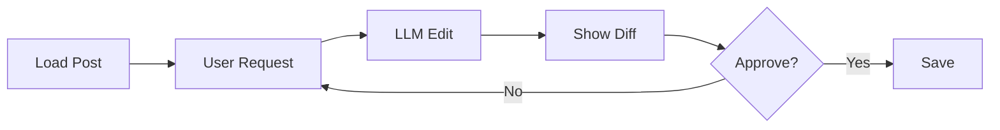
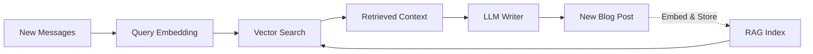
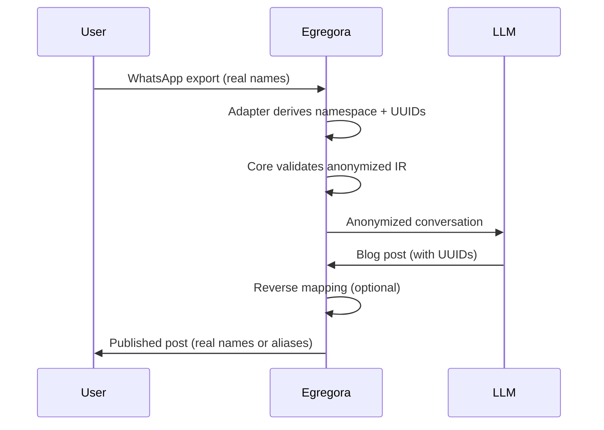
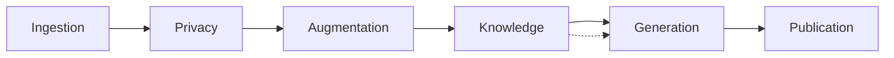

This file is a merged representation of a subset of the codebase, containing specifically included files, combined into a single document by Repomix.

# File Summary

## Purpose
This file contains a packed representation of a subset of the repository's contents that is considered the most important context.
It is designed to be easily consumable by AI systems for analysis, code review,
or other automated processes.

## File Format
The content is organized as follows:
1. This summary section
2. Repository information
3. Directory structure
4. Repository files (if enabled)
5. Multiple file entries, each consisting of:
  a. A header with the file path (## File: path/to/file)
  b. The full contents of the file in a code block

## Usage Guidelines
- This file should be treated as read-only. Any changes should be made to the
  original repository files, not this packed version.
- When processing this file, use the file path to distinguish
  between different files in the repository.
- Be aware that this file may contain sensitive information. Handle it with
  the same level of security as you would the original repository.

## Notes
- Some files may have been excluded based on .gitignore rules and Repomix's configuration
- Binary files are not included in this packed representation. Please refer to the Repository Structure section for a complete list of file paths, including binary files
- Only files matching these patterns are included: docs/**, README.md, SECURITY.md, mkdocs.yml, CHANGELOG.md, LICENSE
- Files matching patterns in .gitignore are excluded
- Files matching default ignore patterns are excluded
- Files are sorted by Git change count (files with more changes are at the bottom)

# Directory Structure
```
docs/
  adr/
    0001-media-and-routing.md
    0002-profile-path-convention.md
    0003-v3-coexistence-strategy.md
    0004-configuration-consolidation.md
    0004-url-enrichment-path-convention.md
    0005-egregora-config-ownership.md
    README.md
    template.md
  api/
    augmentation/
      enrichment.md
    ingestion/
      parser.md
    init/
      scaffolding.md
    knowledge/
      annotations.md
      rag.md
      ranking.md
    privacy/
      anonymizer.md
      detector.md
    configuration.md
    data-primitives.md
    index.md
  architecture/
    protocols.md
    url-conventions.md
  getting-started/
    configuration.md
    installation.md
    quickstart.md
  guide/
    architecture.md
    generation.md
    knowledge.md
    privacy.md
  includes/
    abbreviations.md
  javascripts/
    mathjax.js
  CLAUDE.md
  index.md
  reference.md
  UX_REPORT.md
  v3_development_plan.md
CHANGELOG.md
LICENSE
mkdocs.yml
README.md
SECURITY.md
```

# Files

## File: docs/adr/0001-media-and-routing.md
`````markdown
# ADR 0001: Media, Profiles, and Routing Conventions

## Context
Egregora V3 architecture requires deterministic and predictable paths for generated content (posts, profiles, media) to support the Atom-centric data model and static site generation (MkDocs). V2 had issues with inconsistent routing and media handling.

## Decision

We adopt the following conventions for V3:

### 1. Unified Post Storage
All generated content (Posts, Profiles, Journal Entries) resides in the `docs/posts/` directory (or configured `posts_dir`). This allows MkDocs to treat them uniformly as blog posts.

### 2. Semantic Identity & Routing
*   **Posts**: Routable via semantic slug + date.
    *   Storage: `docs/posts/{date}-{slug}.md`
    *   URL: `/posts/{date}-{slug}/`
*   **Profiles**: Routable via author UUID (semantic identity for authors).
    *   Storage: `docs/posts/authors/{uuid}.md` (Egregora writes ABOUT the author)
    *   URL: `/posts/authors/{uuid}/`
    *   This keeps profiles as "posts" in the blog structure but grouped.
*   **Announcements**: System events.
    *   Storage: `docs/posts/announcements/{slug}.md`
    *   URL: `/posts/announcements/{slug}/`

### 3. Media Storage
Media files are stored inside the posts directory for logical grouping.
*   **Location**: `docs/posts/media/`
*   **Subdirectories**:
    *   `docs/posts/media/images/`
    *   `docs/posts/media/videos/`
    *   `docs/posts/media/audio/`
    *   `docs/posts/media/documents/`
*   **Naming**: Content-addressed UUIDs or Semantic Slugs (preferred for SEO).
    *   Format: `{slug}.{ext}` (e.g., `2025-01-01-sunset.jpg`)

### 4. Ephemeral Staging for Media
To handle large files without memory exhaustion:
*   Media is extracted from ZIPs to a temporary disk directory (`tempfile`).
*   Files > 20MB are uploaded via File API (not inline base64).
*   Files are atomically moved (`shutil.move`) to `docs/media/` upon successful processing.

## Consequences
*   **Pros**:
    *   Deterministic URLs.
    *   Clean separation of concerns.
    *   Supports large media files.
    *   Author profiles are treated as first-class content.
*   **Cons**:
    *   Requires strict adherence to directory structure.
    *   Moving files requires filesystem access (handled by Adapter).

## Status
Accepted
`````

## File: docs/adr/0002-profile-path-convention.md
`````markdown
# ADR-002: Profile Path Convention

## Status
Accepted

## Context
Profile documents are posts **about** authors written by Egregora. They need to be routed to author-specific directories for organization.

Warning observed: `PROFILE doc missing 'subject' metadata, falling back to posts/`

## Decision
Profile documents go to author subfolders:

**URL**: `/posts/profiles/{author_uuid}/{slug}`
**Filesystem**: `docs/posts/profiles/{author_uuid}/{slug}.md`

### Metadata Requirements
Profile documents MUST have:
```yaml
type: profile
subject: {author_uuid}  # Required for routing
profile_aspect: "interests" | "contributions" | "interactions"
```

### Routing Logic
```python
case DocumentType.PROFILE:
    subject_uuid = document.metadata.get("subject")
    if not subject_uuid:
        logger.warning("PROFILE doc missing 'subject', falling back to posts/")
        return posts_dir / slug
    return posts_dir / "profiles" / subject_uuid / slug
```

## Consequences

### Easier
- Each author has dedicated profile feed
- Easy to find all profiles for a specific author
- Supports incremental profile updates (new posts, not edits)

### Harder
- Profile generator must always set `subject` metadata
- More complex routing logic than flat structure

## Related
- ADR-001: Media Path Convention
- GitHub Issue #1256: Fix Profile Routing
`````

## File: docs/adr/0003-v3-coexistence-strategy.md
`````markdown
# 3. V3 Coexistence Strategy

Date: 2025-05-23

## Status

Accepted

## Context

The repository currently contains two distinct architectures: the stable current version (`src/egregora`) and the next-generation version (`src/egregora_v3`).

Concerns were raised that this duplication creates technical debt, confusion regarding where to apply fixes, and violations of DRY (Don't Repeat Yourself) principles due to shared concepts (templates, prompts) being implemented twice.

## Decision

We have decided to maintain `src/egregora_v3` as an intentional, isolated parallel development track. It is **not** considered "duplicate code" in the traditional sense of technical debt, but rather a staging ground for a complete architectural rewrite.

### Implications

1.  **Isolation:** `src/egregora_v3` will remain a distinct package structure. It should not be merged or entangled with the current `src/egregora` codebase until it is ready to replace it entirely.
2.  **Default Target for Refactoring:** Unless a task explicitly specifies "V3" or "Next Gen", all bug fixes, refactoring, and maintenance work must target the **current version** (`src/egregora`).
3.  **Acceptable Duplication:** We accept the temporary "duplication tax" (e.g., having similar template loading logic in both places) to allow V3 to evolve without being constrained by legacy compatibility or breaking the stable version.

## Consequences

*   **Pros:** Allows V3 to innovate freely without risking the stability of the current production system. Clear separation of concerns between "maintenance" and "R&D".
*   **Cons:** Fixes applied to shared concepts in V2 must be manually ported to V3 if relevant.
`````

## File: docs/adr/0004-configuration-consolidation.md
`````markdown
# ADR-0004: Configuration Consolidation and TOML Adoption

## Status
Accepted

## Context
The previous configuration system in Egregora V3 was fragmented across multiple modules (`settings.py`, `overrides.py`, `config_validation.py`), leading to maintenance overhead and unclear precedence rules. Configuration was stored in a YAML file (`.egregora/config.yml`) inside a hidden directory, which made it less visible and susceptible to YAML's parsing ambiguities (e.g., the "Norway problem"). Additionally, the loading logic was over-engineered with intermediate builder classes that complicated simple overrides.

There was also a tendency to have "magic" configuration values that were calculated or mutated based on other settings during validation, leading to hidden behaviors and confusion about what the actual configuration state was.

## Decision
We have decided to refactor the configuration system with the following changes:

1.  **Consolidation**: All configuration logic, including loading, saving, and validation, is consolidated into a single module: `src/egregora/config/settings.py`. Intermediate layers like `overrides.py` and `config_validation.py` are removed.
2.  **TOML Adoption**: We are switching the configuration format from YAML to TOML. TOML is the standard for Python configuration (`pyproject.toml`), offers unambiguous type parsing (especially for dates/times), and has native support in Python 3.11+ via `tomllib`.
3.  **Root-Level Config**: The configuration file is moved from `.egregora/config.yml` to `.egregora.toml` in the site root. This improves visibility and aligns with standard tooling conventions.
4.  **Artifact Location**: A new setting `paths.egregora_dir` (defaulting to `.egregora`) is introduced to explicitly define where internal artifacts (RAG database, cache, etc.) are stored, separating configuration from data.
5.  **Strict Precedence**: Configuration loading now follows a strict, predictable precedence order:
    1.  **CLI Arguments** (Highest priority, runtime overrides)
    2.  **Environment Variables** (`EGREGORA_*`)
    3.  **Config File** (`.egregora.toml`)
    4.  **Defaults** (Lowest priority)
6.  **Defined, Not Calculated**: Configuration settings must be explicit ("Defined") rather than dynamically inferred or mutated based on other settings ("Calculated").
    *   **No Magic Defaults**: Defaults must be static, explicit values.
    *   **No Inter-Field Mutation**: Validators must not change the value of field A based on the value of field B (e.g., changing `rag_dir` because `egregora_dir` changed).
    *   **Explicit Relationships**: If a setting conceptually depends on another (e.g., a path inside a directory), it should default to the full relative path explicitly (e.g., `.egregora/rag`). If the user changes the parent directory, they are responsible for updating the child paths if they want them to remain nested. This prioritizes clarity and predictability over magic convenience.

## Consequences
**Positive:**
*   **Reduced Complexity**: A single source of truth for configuration makes the codebase easier to navigate and maintain.
*   **Type Safety**: Leveraging Pydantic for all validation ensures configuration integrity at load time.
*   **Standardization**: TOML provides a more robust and Python-native configuration format.
*   **Predictability**: "Defined, Not Calculated" ensures that the configuration object exactly matches what is in the file/env/defaults, making debugging easier.
*   **Flexibility**: Explicit artifact path configuration allows for better integration with different deployment environments.

**Negative:**
*   **Breaking Change**: Existing sites using `config.yml` will need to migrate to `.egregora.toml`. Support for `config.yml` has been removed to simplify the codebase and avoid ambiguity.
*   **Verbosity**: Users might need to configure multiple paths explicitly if they want to move the entire `.egregora` directory structure to a custom location, rather than changing one setting and having others follow magically.
*   **Python Version Requirement**: The use of `tomllib` requires Python 3.11+, which aligns with the project's requirement of Python 3.12+, but technically raises the minimum bar for the config module itself if extracted.
`````

## File: docs/adr/0004-url-enrichment-path-convention.md
`````markdown
# ADR-0004: URL Enrichment Path Convention

## Status
Accepted

## Context
URL enrichment documents are posts generated from shared URLs (YouTube videos, Spotify playlists, arXiv papers, Wikipedia articles, etc.). Currently, these are placed directly in `docs/posts/`, mixing with writer-generated blog posts.

URLs should be treated as a type of media, similar to images, videos, and audio.

## Decision
URL enrichment documents go inside the media directory as a new media type:

**URL**: `/posts/media/urls/{slug}`
**Filesystem**: `docs/posts/media/urls/{slug}.md`

### Media Directory Structure
```
docs/posts/media/
├── images/
├── videos/
├── audio/
├── documents/
└── urls/        ← URL enrichments go here
```

### Metadata Requirements
URL enrichment documents have:
```yaml
type: url_enrichment
source_url: {original_url}
```

### Examples
| Source | Path |
|--------|------|
| YouTube video | `posts/media/urls/youtube-quantum-computing-tutorial.md` |
| Spotify playlist | `posts/media/urls/spotify-techno-wave-playlist.md` |
| arXiv paper | `posts/media/urls/arxiv-quantum-computing-paper.md` |
| Wikipedia | `posts/media/urls/wikipedia-itsukushima-shrine.md` |

## Consequences

### Easier
- Consistent: URLs are treated as media like images/videos
- Clear media directory structure
- Easy to find all enriched content in one place

### Harder
- URL enricher must route to media/urls path

## Related
- ADR-0001: Media and Routing Conventions
`````

## File: docs/adr/0005-egregora-config-ownership.md
`````markdown
# 5. Egregora Configuration Ownership

Date: 2025-12-17

## Status

Accepted

## Context

There is potential confusion regarding the relationship between the Egregora-specific configuration (`.egregora.toml`, `.egregora/` directory) and the `MkDocsOutputAdapter`. Questions arise about whether the adapter is responsible for managing these files, creating them, or if they are strictly required for the adapter to function.

## Decision

1.  **Optional Helper Instruments**: The `.egregora.toml` file and the `.egregora/` directory are defined as **optional helper instruments** for easier setting management.
    *   They serve as a persistent store for user preferences (source type, model selection, step size, path overrides).
    *   They allow the Egregora CLI and Pipeline to function with fewer repeated arguments.

2.  **Not Managed by Output Adapter**: The `MkDocsOutputAdapter` is **not** responsible for the lifecycle (creation, updates, maintenance) of these configuration artifacts.
    *   **Role of Adapter**: The Adapter's sole responsibility is to **render content** (posts, media, profiles) into the filesystem structure. It *consumes* the configuration to know *where* to write, but it does not *manage* the configuration file itself.
    *   **Role of CLI/Init**: The logic for standardizing, creating, and updating `.egregora.toml` belongs to the Egregora CLI (`egregora init`) and high-level orchestration, not the output rendering layer.

3.  **Config Over Code**: The Adapter must strictly adhere to the paths resolved from the configuration (as implemented in `MkDocsPaths`), but it should treat the configuration source as opaque. Whether the config comes from `.egregora.toml`, environment variables, or hardcoded defaults is a concern for the *config loader*, not the *output adapter*.

## Consequences

*   **Logic Separation**: We will avoid adding logic to `MkDocsOutputAdapter` that modifies `config.toml` or prompts for configuration values.
*   **Portability**: The Output Adapter remains focused on the MkDocs specification (generating Markdown and YAML), making it easier to swap or upgrade without entangling it in Egregora-specific state management.
*   **Flexibility**: Users may theoretically use the Egregora pipeline without a config file if all parameters are supplied via CLI or objects, ensuring the system remains composable.
`````

## File: docs/adr/README.md
`````markdown
# Architecture Decision Records

This directory contains Architecture Decision Records (ADRs) documenting significant design decisions for Egregora.

## Index

| ADR | Title | Status |
|-----|-------|--------|
| [ADR-001](0001-media-and-routing.md) | Media & Routing Convention | Proposed |
| [ADR-002](0002-profile-path-convention.md) | Profile Path Convention | Proposed |

## Template

Use [template.md](template.md) for new ADRs.
`````

## File: docs/adr/template.md
`````markdown
# ADR-NNN: [Title]

## Status
Proposed | Accepted | Deprecated | Superseded

## Context
What is the issue that we're seeing that is motivating this decision?

## Decision
What is the change that we're proposing?

## Consequences
What becomes easier or harder as a result of this decision?
`````

## File: docs/api/augmentation/enrichment.md
`````markdown
# Augmentation - Enrichment

Enrich conversation context using LLMs to describe URLs and media.

::: egregora.agents.enricher
    options:
      show_source: true
      show_root_heading: true
`````

## File: docs/api/ingestion/parser.md
`````markdown
# Ingestion Parser

The ingestion parser converts raw exports into the intermediate representation (IR) used by downstream stages.

## Responsibilities
- Validate required columns and timestamps before the privacy gate runs.
- Normalize message metadata into the canonical schema used by enrichment and RAG.
- Surface meaningful errors when adapters emit malformed records.

## Status
This document will be expanded with code samples and adapter-specific notes as the pipeline stabilizes.
`````

## File: docs/api/init/scaffolding.md
`````markdown
# Scaffolding API

The scaffolding utilities initialize an output directory with templates, assets, and configuration needed to publish the site.

## Capabilities
- Create deterministic directory structures for generated content.
- Provide defaults for prompts, CSS, and layouts.
- Support idempotent re-runs when scaffolding already exists.

Examples for CLI usage and programmatic calls will be added as the tooling settles.
`````

## File: docs/api/knowledge/annotations.md
`````markdown
# Annotations API

Annotations capture reviewer notes and structured feedback alongside messages and generated outputs.

## Responsibilities
- Persist commentary and tags alongside message events.
- Expose lookup helpers used by ranking and regeneration flows.
- Allow adapters to opt into privacy validation where required.

More usage examples will be documented as the API stabilizes.
`````

## File: docs/api/knowledge/rag.md
`````markdown
# Retrieval-Augmented Generation (RAG)

The RAG module provides LanceDB-based vector storage and retrieval for enriched content.

## Overview

Egregora's RAG system uses:

- **LanceDB**: Fast vector storage with native filtering
- **Synchronous API**: All operations are synchronous, using thread pools for concurrency
- **Dual-Queue Router**: Intelligent routing between single and batch embedding endpoints
- **Asymmetric Embeddings**: Different task types for documents vs queries

## Quick Start

```python
from egregora.rag import index_documents, search, RAGQueryRequest
from egregora.data_primitives import Document, DocumentType

def example():
    # Index documents
    doc = Document(content="# Post\n\nContent", type=DocumentType.POST)
    index_documents([doc])

    # Search
    request = RAGQueryRequest(text="search query", top_k=5)
    response = search(request)

    for hit in response.hits:
        print(f"{hit.score:.2f}: {hit.text[:50]}")

example()
```

## Configuration

Configure RAG in `.egregora/config.yml`:

```yaml
paths:
  lancedb_dir: .egregora/lancedb

rag:
  enabled: true
  top_k: 5
  min_similarity_threshold: 0.7
  indexable_types: ["POST"]
  embedding_max_batch_size: 100
  embedding_timeout: 60.0
```

## API Reference

### Main Functions

::: egregora.rag.index_documents
    options:
      show_root_heading: true
      heading_level: 3

::: egregora.rag.search
    options:
      show_root_heading: true
      heading_level: 3

### Backend Protocol

::: egregora.rag.backend.VectorStore
    options:
      show_root_heading: true
      heading_level: 3
      members:
        - add
        - query
        - delete

### LanceDB Backend

::: egregora.rag.lancedb_backend.LanceDBRAGBackend
    options:
      show_root_heading: true
      heading_level: 3

## Data Models

### Query Request

::: egregora.rag.models.RAGQueryRequest
    options:
      show_source: true
      show_root_heading: true
      show_category_heading: true
      members_order: source
      heading_level: 3

### Query Response

::: egregora.rag.models.RAGQueryResponse
    options:
      show_source: true
      show_root_heading: true
      show_category_heading: true
      members_order: source
      heading_level: 3

### Retrieval Hit

::: egregora.rag.models.RAGHit
    options:
      show_source: true
      show_root_heading: true
      show_category_heading: true
      members_order: source
      heading_level: 3

## Architecture

### Dual-Queue Embedding Router

The embedding router intelligently routes requests to optimal endpoints using thread pools for concurrency:

- **Single Endpoint**: Low-latency, preferred for queries (1 request/sec)
- **Batch Endpoint**: High-throughput, used for bulk indexing (1000 embeddings/min)

**Features:**

- Independent rate limit tracking per endpoint
- Automatic 429 fallback and retry with exponential backoff
- Request accumulation during rate limits
- Intelligent routing based on request size and endpoint availability

### Asymmetric Embeddings

Google Gemini supports task-specific embeddings:

- **Documents**: `RETRIEVAL_DOCUMENT` task type for indexing
- **Queries**: `RETRIEVAL_QUERY` task type for searching

This improves retrieval quality by using different embedding strategies for documents vs queries.

## Examples

### Basic Indexing

```python
from egregora.rag import index_documents
from egregora.data_primitives import Document, DocumentType

def index_posts():
    docs = [
        Document(
            content="# First Post\n\nContent here",
            type=DocumentType.POST,
            metadata={"category": "tech"}
        ),
        Document(
            content="# Second Post\n\nMore content",
            type=DocumentType.POST,
            metadata={"category": "life"}
        )
    ]

    index_documents(docs)
    print(f"Indexed {len(docs)} documents")

index_posts()
```

### Advanced Search

```python
from egregora.rag import search, RAGQueryRequest

def search_posts():
    # Search with SQL filters
    request = RAGQueryRequest(
        text="machine learning",
        top_k=10,
        filters="metadata_json LIKE '%tech%'",  # SQL WHERE clause
        min_similarity=0.7
    )

    response = search(request)

    print(f"Found {len(response.hits)} results in {response.query_time_ms}ms")
    for hit in response.hits:
        print(f"Score: {hit.score:.3f}")
        print(f"Type: {hit.document_type}")
        print(f"Text: {hit.text[:100]}...")
        print()

search_posts()
```

### Custom Embedding Function

```python
from typing import Sequence
from egregora.rag import index_documents
from egregora.data_primitives import Document, DocumentType

def custom_embed(texts: Sequence[str], task_type: str) -> list[list[float]]:
    """Custom embedding function."""
    # Use your own embedding model
    embeddings = []
    for text in texts:
        # ... your embedding logic ...
        embeddings.append([0.1] * 768)  # Example
    return embeddings

def index_with_custom_embeddings():
    docs = [Document(content="Test", type=DocumentType.POST)]

    # Pass custom embedding function
    index_documents(docs, embedding_fn=custom_embed)

index_with_custom_embeddings()
```

## Performance

### Indexing Performance

- **Small batches (< 10 docs)**: ~100-200ms per document
- **Large batches (100+ docs)**: ~20-50ms per document (batched)
- **Bottleneck**: Embedding API rate limits

### Search Performance

- **Vector search**: < 10ms for 10K documents
- **With filters**: < 50ms for 10K documents
- **Bottleneck**: Query embedding latency (~100ms)

### Optimization Tips

1. **Batch indexing**: Index in large batches (100+ documents)
2. **Configure batch size**: Adjust `embedding_max_batch_size` in config
3. **Use filters**: SQL filters are very fast (pre-filter before vector search)
4. **Adjust top_k**: Lower `top_k` = faster search

## Migration from Legacy RAG

The legacy `egregora.agents.shared.rag.VectorStore` is deprecated. Migrate to `egregora.rag`:

**Before (Legacy):**

```python
from egregora.agents.shared.rag import VectorStore

store = VectorStore(rag_dir / "chunks.parquet", storage=storage)
indexed = store.index_documents(output, embedding_model=model)
results = store.query_media(query, media_types=types)
```

**After (New):**

```python
from egregora.rag import index_documents, search, RAGQueryRequest

def migrate():
    # Index documents
    index_documents(docs)

    # Search
    request = RAGQueryRequest(text=query, top_k=5)
    response = search(request)

migrate()
```

## See Also

- [Architecture Guide](../../guide/architecture.md#rag-retrieval-augmented-generation) - RAG system architecture
- [LanceDB Documentation](https://lancedb.github.io/lancedb/) - Underlying vector database
`````

## File: docs/api/knowledge/ranking.md
`````markdown
# Ranking API

Ranking surfaces score enriched content and annotations to drive better retrieval and generation decisions.

## Key Concepts
- Use deterministic signals from enrichment and annotations to rank candidates.
- Provide pluggable strategies so experimenters can tune ordering logic.
- Feed ranked results into writer/editor prompts.

This is a placeholder page; algorithm details will be captured as they are implemented.
`````

## File: docs/api/privacy/anonymizer.md
`````markdown
# Privacy Anonymizer

The anonymizer module provides utility functions for removing or masking personally identifiable information (PII).

## Usage

This module is primarily used by Input Adapters to anonymize data *before* it enters the main processing pipeline. It is not a standalone pipeline stage.

## Key Tasks
- Apply deterministic UUID mapping to authors and threads.
- Strip or redact sensitive fields that cannot be safely stored.
- Emit PII audit signals for downstream observability.

## Integration
Input adapters (like `WhatsAppAdapter`) invoke `anonymize_table` to ensure that the intermediate representation (IR) contains only anonymized data.

```python
from egregora.privacy.anonymizer import anonymize_table

# Inside an adapter
messages_table = parse_source(...)
anonymized_table = anonymize_table(messages_table, enabled=True)
```
`````

## File: docs/api/privacy/detector.md
`````markdown
# Privacy Detector

The detector identifies potential PII before anonymization occurs.

## Capabilities
- Flag candidate entities for masking or hashing.
- Provide structured signals to inform adapter-level privacy choices.
- Integrate with observability to trace decisions per message.

Detailed thresholds and rule sets will be added as the privacy gate solidifies.
`````

## File: docs/api/configuration.md
`````markdown
# Configuration API

Configuration management for Egregora, including settings models and validation.

## Overview

Egregora uses **Pydantic V2** for type-safe configuration management. All settings are defined in `.egregora/config.yml` and validated at load time.

## CLI Commands

### Validate Configuration

Check your configuration file for errors:

```bash
egregora config validate
egregora config validate ./my-blog
```

Shows:
- ✅ Validation success with summary
- ❌ Detailed error messages for invalid fields
- ⚠️  Warnings for unusual settings

### Show Configuration

Display current configuration:

```bash
egregora config show
egregora config show ./my-blog
```

## Settings Models

### EgregoraConfig

Root configuration object loaded from `.egregora/config.yml`.

::: egregora.config.settings.EgregoraConfig
    options:
      show_source: false
      show_root_heading: true
      show_category_heading: true
      members_order: source
      heading_level: 4
      members:
        - models
        - rag
        - writer
        - privacy
        - enrichment
        - pipeline
        - paths
        - database
        - output
        - features
        - quota

### ModelSettings

LLM model configuration for different tasks.

::: egregora.config.settings.ModelSettings
    options:
      show_source: false
      show_root_heading: true
      show_category_heading: true
      members_order: source
      heading_level: 4

### RAGSettings

RAG (Retrieval-Augmented Generation) configuration.

::: egregora.config.settings.RAGSettings
    options:
      show_source: false
      show_root_heading: true
      show_category_heading: true
      members_order: source
      heading_level: 4

### PipelineSettings

Pipeline execution settings.

::: egregora.config.settings.PipelineSettings
    options:
      show_source: false
      show_root_heading: true
      show_category_heading: true
      members_order: source
      heading_level: 4

## Configuration Examples

### Minimal Configuration

```yaml
# .egregora/config.yml
models:
  writer: google-gla:gemini-flash-latest

rag:
  enabled: true
  top_k: 5
```

### Full Configuration

```yaml
# .egregora/config.yml

# Model configuration
models:
  writer: google-gla:gemini-flash-latest
  enricher: google-gla:gemini-flash-latest
  enricher_vision: google-gla:gemini-flash-latest
  ranking: google-gla:gemini-flash-latest
  editor: google-gla:gemini-flash-latest
  reader: google-gla:gemini-flash-latest
  embedding: models/gemini-embedding-001
  banner: models/gemini-2.5-flash-image

# RAG configuration
rag:
  enabled: true
  top_k: 5
  min_similarity_threshold: 0.7
  indexable_types: ["POST"]
  embedding_max_batch_size: 100
  embedding_timeout: 60.0
  embedding_max_retries: 5

# Writer agent
writer:
  custom_instructions: |
    Write in a casual, friendly tone.
    Focus on practical examples.

# Enrichment
enrichment:
  enabled: true
  enable_url: true
  enable_media: true
  max_enrichments: 50

# Pipeline
pipeline:
  step_size: 1
  step_unit: days                  # "days", "hours", "messages"
  overlap_ratio: 0.2               # 20% overlap
  max_windows: 1                   # Process 1 window (0 = all)
  checkpoint_enabled: false        # Enable incremental processing

# Paths (relative to site root)
paths:
  egregora_dir: .egregora
  rag_dir: .egregora/rag
  lancedb_dir: .egregora/lancedb
  cache_dir: .egregora/cache
  prompts_dir: .egregora/prompts
  docs_dir: docs
  posts_dir: docs/posts
  profiles_dir: docs/profiles
  media_dir: docs/assets/media

# Output format
output:
  format: mkdocs                   # "mkdocs" or "hugo"

# Reader agent
reader:
  enabled: false
  comparisons_per_post: 5
  k_factor: 32
  database_path: .egregora/reader.duckdb

# Quota limits
quota:
  daily_llm_requests: 220
  per_second_limit: 1
  concurrency: 1
```

## Validation

### Field Validators

Configuration fields are validated with custom validators:

```python
# Model name format validation
models:
  writer: google-gla:gemini-flash-latest  # ✅ Valid
  writer: gemini-flash-latest             # ❌ Invalid (missing prefix)

# RAG top_k validation
rag:
  top_k: 5      # ✅ Good
  top_k: 20     # ⚠️  Warning (unusually high)
  top_k: 100    # ❌ Error (exceeds maximum)
```

### Cross-Field Validation

The config validator checks dependencies between fields:

```yaml
# ❌ Error: RAG enabled but lancedb_dir not set
rag:
  enabled: true
paths:
  lancedb_dir: ""  # Empty path

# ⚠️  Warning: Very high token limit
pipeline:
  max_prompt_tokens: 500000  # Exceeds most model limits
```

## Programmatic Usage

### Loading Configuration

```python
from pathlib import Path
from egregora.config.settings import load_egregora_config

# Load from site root
config = load_egregora_config(Path("./my-blog"))

# Access settings
print(config.models.writer)
print(config.rag.enabled)
print(config.pipeline.step_size)
```

### Creating Configuration

```python
from egregora.config.settings import EgregoraConfig, save_egregora_config

# Create with defaults
config = EgregoraConfig()

# Modify settings
config.rag.enabled = False
config.pipeline.step_size = 7

# Save to file
save_egregora_config(config, Path("./my-blog"))
```

### Configuration Overrides

```python
from egregora.config.overrides import ConfigOverrideBuilder

# Build with overrides
overrides = ConfigOverrideBuilder()
overrides.set_model("writer", "google-gla:gemini-pro-latest")
overrides.set_rag_enabled(False)

config = overrides.build(base_config)
```

## See Also

- [Getting Started - Configuration](../getting-started/configuration.md)
- [Privacy Guide](../guide/privacy.md)
- [RAG Configuration](knowledge/rag.md)
`````

## File: docs/api/data-primitives.md
`````markdown
# Data Primitives API

The data primitives module provides the core data structures used throughout Egregora.

## Overview

All content produced by the Egregora pipeline is represented as `Document` instances. Documents use content-addressed IDs (UUID v5 of content hash) for deterministic identity and deduplication.

## Document

::: egregora.data_primitives.document.Document
    options:
      show_source: true
      show_root_heading: true
      show_category_heading: true
      members_order: source
      show_if_no_docstring: false
      heading_level: 3

## DocumentType

::: egregora.data_primitives.document.DocumentType
    options:
      show_source: true
      show_root_heading: true
      heading_level: 3

## DocumentCollection

::: egregora.data_primitives.document.DocumentCollection
    options:
      show_source: true
      show_root_heading: true
      show_category_heading: true
      members_order: source
      show_if_no_docstring: false
      heading_level: 3

## MediaAsset

::: egregora.data_primitives.document.MediaAsset
    options:
      show_source: true
      show_root_heading: true
      heading_level: 3

## Usage Examples

### Creating Documents

```python
from egregora.data_primitives.document import Document, DocumentType

# Create a blog post
post = Document(
    content="# My Post\n\nContent here...",
    type=DocumentType.POST,
    metadata={
        "title": "My Post",
        "date": "2025-01-10",
        "slug": "my-post",
    }
)

# Document ID is deterministic
print(post.document_id)  # UUID based on content hash
```

### Working with Collections

```python
from egregora.data_primitives.document import DocumentCollection

# Create a collection
docs = [post1, post2, profile1]
collection = DocumentCollection(
    documents=docs,
    window_label="2025-01-10"
)

# Filter by type
posts = collection.by_type(DocumentType.POST)
profiles = collection.by_type(DocumentType.PROFILE)

# Find by ID
doc = collection.find_by_id("some-uuid")
```

### Media Assets

```python
from egregora.data_primitives.document import MediaAsset, DocumentType

# Read image file
with open("photo.jpg", "rb") as f:
    image_data = f.read()

# Create media asset
media = MediaAsset(
    content=image_data,
    type=DocumentType.MEDIA,
    metadata={
        "filename": "photo.jpg",
        "mime_type": "image/jpeg",
    }
)

# Create enrichment linked to media
enrichment = Document(
    content="A sunset over the ocean",
    type=DocumentType.ENRICHMENT_MEDIA,
    metadata={"url": "media/photo.jpg"},
    parent_id=media.document_id
)
```
`````

## File: docs/api/index.md
`````markdown
# API Reference

This section documents the main public interfaces that power Egregora's ingestion, privacy, knowledge, generation, and orchestration flows.

Use the subsections in the navigation to find the component you need:

- **Ingestion** covers parsers and adapters that transform raw exports into the internal representation.
- **Privacy** describes anonymization and detection helpers used to safeguard sensitive data.
- **Knowledge** outlines vector search, annotations, and ranking surfaces for retrieval.
- **Generation** documents the writer/editor agents responsible for producing content.
- **Publication & Orchestration** explains scaffolding, pipeline coordination, and CLI entry points.

Each page is a work in progress while we expand the consolidated documentation set.
`````

## File: docs/architecture/protocols.md
`````markdown
# Core Protocols

Egregora uses Protocol classes (PEP 544) to define interfaces without inheritance. This document describes all core protocols in the codebase.

## Table of Contents

- [URL Generation](#url-generation)
- [Input Adapters](#input-adapters)
- [Output Adapters](#output-adapters)
- [RAG Backend](#rag-backend)
- [Database Protocols](#database-protocols)

---

## URL Generation

### UrlContext

**Module:** `egregora.data_primitives.protocols`

Frozen dataclass providing context information for URL generation.

```python
@dataclass(frozen=True, slots=True)
class UrlContext:
    """Context information required when generating canonical URLs."""

    base_url: str = ""           # Base URL (e.g., "https://example.com")
    site_prefix: str = ""        # Site prefix (e.g., "/blog")
    base_path: Path | None = None  # Filesystem base path
    locale: str | None = None    # Locale for i18n (e.g., "en", "pt-BR")
```

**Usage:**
```python
ctx = UrlContext(
    base_url="https://mysite.com",
    site_prefix="/posts",
    base_path=Path("/output/docs"),
    locale="en"
)
```

### UrlConvention

**Module:** `egregora.data_primitives.protocols`

Protocol for deterministic URL generation strategies.

```python
class UrlConvention(Protocol):
    """Contract for deterministic URL generation strategies.

    Pure function pattern: same document → same URL
    No I/O, no side effects - just URL calculation.
    """

    @property
    def name(self) -> str:
        """Return a short identifier describing the convention."""
        ...

    @property
    def version(self) -> str:
        """Return a semantic version or timestamp string for compatibility checks."""
        ...

    def canonical_url(self, document: Document, ctx: UrlContext) -> str:
        """Calculate the canonical URL for ``document`` within ``ctx``."""
        ...
```

**Key Properties:**
- **Deterministic:** Same document always produces same URL
- **Pure:** No I/O operations, no side effects
- **Versioned:** `name` and `version` for compatibility tracking
- **Context-aware:** Uses `UrlContext` for environment-specific configuration

**Example Implementation:**
```python
class MkDocsUrlConvention:
    """MkDocs-compatible URL convention."""

    @property
    def name(self) -> str:
        return "mkdocs-standard"

    @property
    def version(self) -> str:
        return "v1.0"

    def canonical_url(self, document: Document, ctx: UrlContext) -> str:
        # Posts: /posts/{slug}/
        # Pages: /{slug}/
        if document.type == DocumentType.POST:
            path = f"/posts/{document.slug}/"
        else:
            path = f"/{document.slug}/"

        return f"{ctx.base_url}{ctx.site_prefix}{path}"
```

**Why This Matters:**
- **SEO:** Stable URLs across rebuilds prevent broken links
- **Testing:** Pure functions are easy to test
- **Flexibility:** Swap conventions without changing callers
- **Compatibility:** Version tracking enables gradual migration

---

## Input Adapters

### InputAdapter

**Module:** `egregora.data_primitives.protocols`

Protocol for bringing data INTO the pipeline.

```python
@runtime_checkable
class InputAdapter(Protocol):
    """Adapter for reading external data sources and converting to IR."""

    def read(self) -> Iterator[Table]:
        """Read from source and yield Ibis tables conforming to IR_MESSAGE_SCHEMA.

        Returns:
            Iterator of Ibis tables with IR_MESSAGE_SCHEMA columns
        """
        ...

    @property
    def metadata(self) -> dict[str, Any]:
        """Return metadata about the input source."""
        ...
```

**Available Implementations:**
- `WhatsAppAdapter` - Parse WhatsApp chat exports
- `IperonTJROAdapter` - Brazilian judicial records API
- `SelfInputAdapter` - Re-ingest existing posts

**Key Responsibilities:**
- Parse external format
- Convert to `IR_MESSAGE_SCHEMA`
- Handle privacy/anonymization at source
- Yield data as Ibis tables (not pandas)

**Example:**
```python
class MyAdapter:
    def __init__(self, source_path: Path):
        self.source_path = source_path

    def read(self) -> Iterator[Table]:
        # Parse your format
        data = parse_my_format(self.source_path)

        # Convert to IR_MESSAGE_SCHEMA
        table = ibis.memtable(data).select(
            message_id=...,
            conversation_id=...,
            author_id=...,
            content=...,
            timestamp=...,
            # ... all IR_MESSAGE_SCHEMA columns
        )

        yield table

    @property
    def metadata(self) -> dict[str, Any]:
        return {
            "source_type": "my-format",
            "source_path": str(self.source_path),
            "version": "1.0"
        }
```

---

## Output Adapters

### OutputAdapter

**Module:** `egregora.data_primitives.protocols`

Protocol for taking data OUT of the pipeline.

```python
@runtime_checkable
class OutputAdapter(Protocol):
    """Adapter for persisting documents to external formats."""

    def persist(self, document: Document) -> None:
        """Persist document to output format.

        Must be idempotent - repeated calls with same document should overwrite.
        """
        ...

    def documents(self) -> Iterator[Document]:
        """Iterate over all documents in output format.

        Returns:
            Iterator for memory efficiency (not list)
        """
        ...
```

**Available Implementations:**
- `MkDocsAdapter` - Generate MkDocs sites
- `ParquetAdapter` - Export to Parquet format

**Key Responsibilities:**
- Convert `Document` to target format
- Idempotent writes (overwrite on repeat)
- Lazy document iteration
- Handle filesystem layout

**Example:**
```python
class MyOutputAdapter:
    def __init__(self, output_dir: Path):
        self.output_dir = output_dir

    def persist(self, document: Document) -> None:
        # Calculate path
        path = self.output_dir / f"{document.slug}.html"

        # Convert Document to target format
        html = render_to_html(document)

        # Write (idempotent - overwrites)
        path.parent.mkdir(parents=True, exist_ok=True)
        path.write_text(html)

    def documents(self) -> Iterator[Document]:
        # Lazy iteration (not list)
        for path in self.output_dir.glob("*.html"):
            yield parse_html_to_document(path)
```

---

## RAG Backend

### RAGBackend

**Module:** `egregora.rag.backend`

Protocol for vector storage backends.

```python
class RAGBackend(Protocol):
    """Protocol for RAG vector storage backends."""

    async def index_documents(
        self,
        documents: Sequence[Document],
        *,
        embedding_fn: Callable[[Sequence[str], str], Awaitable[list[list[float]]]]
    ) -> int:
        """Index documents for retrieval.

        Args:
            documents: Documents to index
            embedding_fn: Async function to generate embeddings
                         Signature: (texts, task_type) -> embeddings

        Returns:
            Number of chunks indexed
        """
        ...

    async def search(
        self,
        request: RAGQueryRequest
    ) -> RAGQueryResponse:
        """Search indexed documents.

        Args:
            request: Search request with query text, top_k, filters

        Returns:
            Response with scored results
        """
        ...

    async def delete_all(self) -> None:
        """Delete all indexed documents."""
        ...
```

**Available Implementations:**
- `LanceDBRAGBackend` - LanceDB vector storage (current)

**Key Properties:**
- **Fully async:** All methods are async
- **Embedding injection:** Backend doesn't know about embedding models
- **Chunking:** Backend handles chunking internally
- **Task types:** Supports asymmetric embeddings (RETRIEVAL_DOCUMENT vs RETRIEVAL_QUERY)

**Example Usage:**
```python
from egregora.rag import LanceDBRAGBackend, RAGQueryRequest, index_documents

# Index documents
backend = LanceDBRAGBackend(db_path=Path(".egregora/lancedb"))
count = await index_documents([doc1, doc2, doc3])
print(f"Indexed {count} chunks")

# Search
request = RAGQueryRequest(
    text="how to use RAG",
    top_k=5,
    min_similarity=0.7
)
response = await backend.search(request)

for hit in response.hits:
    print(f"{hit.score:.2f}: {hit.text[:100]}")
```

---

## Database Protocols

### Storage Protocols

**Module:** `egregora.database.protocols`

Protocols for database storage and retrieval.

```python
class TableStorage(Protocol):
    """Protocol for table storage operations."""

    def write_table(
        self,
        table: Table,
        name: str,
        *,
        checkpoint: bool = False
    ) -> None:
        """Write Ibis table to storage."""
        ...

    def read_table(self, name: str) -> Table:
        """Read Ibis table from storage."""
        ...

    def table_exists(self, name: str) -> bool:
        """Check if table exists."""
        ...
```

---

## Best Practices

### Protocol Design

1. **Keep protocols small** - Single Responsibility Principle
2. **Use `@runtime_checkable`** - Enable `isinstance()` checks
3. **Document return types** - Protocols are contracts
4. **Avoid concrete dependencies** - Depend on abstractions

### Implementation Guidelines

1. **Pure functions when possible** - UrlConvention example
2. **Idempotent operations** - OutputAdapter.persist()
3. **Lazy iteration** - Use `Iterator` not `list`
4. **Async by default** - RAGBackend example

### Testing Protocols

```python
# Test with mock implementation
class MockOutputAdapter:
    def __init__(self):
        self.documents_dict = {}

    def persist(self, document: Document) -> None:
        self.documents_dict[document.id] = document

    def documents(self) -> Iterator[Document]:
        yield from self.documents_dict.values()

# Verify protocol compliance
from egregora.data_primitives.protocols import OutputAdapter
assert isinstance(MockOutputAdapter(), OutputAdapter)
```

---

## Related Documentation

- [CLAUDE.md](../CLAUDE.md) - Quick reference and key patterns
- [Architecture Overview](../guide/architecture.md) - System architecture
- [RAG Architecture](../api/knowledge/rag.md) - RAG implementation details
- [Pipeline Design](../api/orchestration/pipeline.md) - Pipeline stages and transforms
`````

## File: docs/architecture/url-conventions.md
`````markdown
# URL Convention System

## Overview

The **URL Convention** is the **single source of truth** for canonical URLs in the generated site. It defines how documents are addressed and referenced throughout the system, independent of how they are physically stored.

**Key Distinction:**
- **URL Convention:** Generates canonical URLs for the site (e.g., `/profiles/abc123`)
- **Adapter Implementation:** Decides how to persist/serve those URLs (filesystem, database, API, etc.)

For Static Site Generators (SSG) like MkDocs, URLs map to filesystem paths. But other adapters (e.g., database + FastAPI) could serve the same URLs without any files.

## Architecture

### Core Components

1. **`UrlConvention`** (Protocol/Interface)
   - Defines the contract for canonical URL generation
   - Location: `src/egregora/data_primitives/protocols.py`

2. **`StandardUrlConvention`** (Implementation)
   - Concrete implementation of URL generation rules
   - Generates URLs like `/profiles/{uuid}`, `/posts/{slug}`, etc.
   - Location: `src/egregora/output_adapters/conventions.py`

3. **Output Adapter** (Implementation-Specific)
   - Uses URL convention to get canonical URLs
   - Decides how to persist/serve documents at those URLs
   - **MkDocs:** Translates URLs to filesystem paths
   - **Database:** Could insert into DB with URL as identifier
   - **API:** Could register URL routes

### Document Persistence Flow

```
┌──────────────┐
│   Document   │
│   Object     │
└──────┬───────┘
       │
       ↓
┌──────────────────────────────────────────────────────┐
│  adapter.persist(document)                           │
└──────┬───────────────────────────────────────────────┘
       │
       ↓
┌──────────────────────────────────────────────────────┐
│  url = convention.canonical_url(doc, context)        │
│                                                       │
│  Result: /profiles/d65bbd29-dccb-55bb-a839...        │
│                                                       │
│  ✓ This URL is used across the entire site:         │
│    - Navigation links                                │
│    - Cross-references                                │
│    - Template rendering                              │
│    - Writer agent output                             │
└──────┬───────────────────────────────────────────────┘
       │
       ↓
┌──────────────────────────────────────────────────────┐
│  Adapter-Specific Persistence                        │
│                                                       │
│  SSG (MkDocs):                                       │
│    path = _url_to_path(url)                          │
│    → profiles/d65bbd29-dccb-55bb-a839....md         │
│    write_file(path, content)                         │
│                                                       │
│  Database:                                           │
│    db.insert(url=url, content=content, ...)          │
│                                                       │
│  API:                                                │
│    register_route(url, handler)                      │
└──────────────────────────────────────────────────────┘
```

## URL Convention Rules by Document Type

These are the **canonical URLs** used across the site, regardless of adapter implementation.

### PROFILE Documents

**Metadata Required:** `uuid` (author's UUID)

**Canonical URL:** `/profiles/{uuid}`

**Example:**
```python
Document(
    content="Profile content...",
    type=DocumentType.PROFILE,
    metadata={"uuid": "d65bbd29-dccb-55bb-a839-bed92ffe262b"}
)
```

**Generated URL:** `/profiles/d65bbd29-dccb-55bb-a839-bed92ffe262b`

**Adapter-Specific Storage:**
- **MkDocs:** `docs/profiles/d65bbd29-dccb-55bb-a839-bed92ffe262b.md`
- **Database:** `profiles` table with `url` column
- **API:** `GET /profiles/d65bbd29-dccb-55bb-a839-bed92ffe262b`

**Key Rules:**
- Uses **full UUID** from metadata (not truncated)
- No date prefix in URL
- URL is stable across regenerations

### POST Documents

**Metadata Required:** `slug`, `date`

**Canonical URL:** `/posts/{slug}`

**Example:**
```python
Document(
    content="Post content...",
    type=DocumentType.POST,
    metadata={
        "slug": "my-blog- post",
        "date": "2025-03-15"
    }
)
```

**Generated URL:** `/posts/my-blog-post`

**Adapter-Specific Storage:**
- **MkDocs:** `docs/posts/2025-03-15-my-blog-post.md` (date in filename)
- **Database:** `posts` table with `url`, `date`, `slug` columns
- **API:** `GET /posts/my-blog-post` (date in metadata)

**Key Rules:**
- URL uses slug only (clean URLs)
- Slug is normalized (lowercase, hyphens)
- Date stored in metadata, not URL (for Jekyll/MkDocs compat)

### JOURNAL Documents

**Metadata Required:** `window_label` or `slug`

**Canonical URL:** `/journal/{safe_label}`

**Example:**
```python
Document(
    content="Journal entry...",
    type=DocumentType.JOURNAL,
    metadata={"window_label": "2025-03-15_08:00-12:00"}
)
```

**Generated URL:** `/journal/2025-03-15-08-00-12-00`

**Key Rules:**
- Label is slugified (special characters converted to hyphens)
- Represents time windows or agent memory snapshots

### MEDIA Documents

**Metadata Required:** `filename`, `media_hash`

**Canonical URL:** `/media/{type}/{identifier}.{ext}`

**Example:**
```python
Document(
    content=b"...",  # binary data
    type=DocumentType.MEDIA,
    metadata={
        "filename": "photo.jpg",
        "media_hash": "abc123"
    }
)
```

**Generated URL:** `/media/images/abc123.jpg`

**Key Rules:**
- Hash-based naming prevents collisions
- Preserves file extension
- Organized by media type (images/, videos/, etc.)

### ENRICHMENT_MEDIA Documents

**Metadata Required:** `parent_id`, `parent_slug`

**Canonical URL:** `/media/{type}/{parent_slug}`

**Example:**
```python
Document(
    content="Enrichment markdown...",
    type=DocumentType.ENRICHMENT_MEDIA,
    metadata={
        "parent_id": "abc123",
        "parent_slug": "vacation-photo"
    }
)
```

**Generated URL:** `/media/images/vacation-photo` (matches `/media/images/vacation-photo.jpg`)

**Key Rules:**
- Enrichment documents describe media files
- URL pattern aligns with paired media file

### ENRICHMENT_URL Documents

**Canonical URL:** Variable (uses `suggested_path` if available)

**Example:**
```python
Document(
    content="URL enrichment...",
    type=DocumentType.ENRICHMENT_URL,
    suggested_path="media/urls/article-abc123"
)
```

**Generated URL:** `/media/urls/article-abc123/`

**Key Rules:**
- Often uses `suggested_path` for flexibility
- Falls back to hash-based naming if no suggested_path

## Why This Matters

### 1. **Single Source of Truth for URLs**

The URL convention is the **only** authority for canonical URLs:
- How documents are addressed in the site
- How documents are referenced across templates
- How links are generated

**What it does NOT dictate:**
- Physical storage location (adapter-specific)
- Storage format (files, DB, API, etc.)
- Implementation details

### 2. **Adapter Independence**

The same URL can be served by different adapters:

```python
url = "/profiles/abc123"  # From URL convention

# MkDocs adapter:
path = "docs/profiles/abc123.md"
write_file(path, content)
serve_from_filesystem(url, path)

# Database adapter:
db.profiles.insert(url=url, content=content)
serve_from_db(url)

# API adapter:
@app.get("/profiles/{uuid}")
async def get_profile(uuid: str):
    return fetch_from_cache(f"/profiles/{uuid}")
```

### 3. **Consistency Across References**

All parts of the system use the **same canonical URL**:
- Writer agent: `[Profile](/profiles/abc123)`
- Template rendering: `<a href="/profiles/abc123">`
- Navigation menus: `{url: "/profiles/abc123"}`
- Internal cross-references: `/profiles/abc123`

This ensures **no broken links** regardless of adapter.

### 4. **Prevents Duplicates**

The duplicate profile files issue occurred because:
- ❌ Legacy code bypassed URL convention and manually created files
- ✅ Modern code uses URL convention → adapter persistence

With a single URL source, duplicates are impossible.

## Implementation: URL Generation

### conventions.py

```python
def canonical_url(self, document: Document, ctx: UrlContext) -> str:
    """Generate canonical URL for the generated site.

    Returns URL like /profiles/abc123, NOT filesystem paths.
    How the adapter serves this URL is implementation-specific.
    """

    if document.type == DocumentType.PROFILE:
        # Extract full UUID from metadata
        author_uuid = document.metadata.get("uuid") or document.metadata.get("author_uuid")
        return self._join(ctx, self.routes.profiles_prefix, author_uuid)
        # Result: /profiles/d65bbd29-dccb-55bb-a839-bed92ffe262b

    elif document.type == DocumentType.POST:
        # Use slug from metadata
        slug = document.metadata.get("slug")
        return self._join(ctx, self.routes.posts_prefix, slug)
        # Result: /posts/my-blog-post

    # ... other types
```

## Implementation: MkDocs Adapter (Filesystem)

### adapter.py

This is **MkDocs-specific** - other adapters would implement differently.

```python
def _url_to_path(self, url: str, document: Document) -> Path:
    """Convert canonical URL to filesystem path (MkDocs-specific).

    This translation is unique to SSG adapters. Database adapters
    wouldn't need this - they'd use the URL as-is for lookups.
    """
    url_path = url.strip("/")

    # Document-type-specific path resolution
    resolver = self._path_resolvers.get(document.type)
    return resolver(url_path)

def _resolve_profile_path(self, url_path: str) -> Path:
    """/profiles/{uuid} → docs/profiles/{uuid}.md (MkDocs-specific)"""
    uuid = url_path.split('/')[-1]
    return self.profiles_dir / f"{uuid}.md"

def _resolve_post_path(self, url_path: str) -> Path:
    """/posts/{slug} → docs/posts/{date}-{slug}.md (MkDocs-specific)

    MkDocs/Jekyll convention: include date in filename for sorting.
    The URL stays clean (/posts/slug), but file has date prefix.
    """
    slug = url_path.split('/')[-1]
    date = self._extract_date_from_document(...)
    return self.posts_dir / f"{date}-{slug}.md"
```

## Anti-Patterns to Avoid

### ❌ Don't Bypass persist()

```python
# ❌ WRONG - Manual file/DB write
profiles_dir = Path("docs/profiles")
profile_path = profiles_dir / f"{author_uuid}.md"
profile_path.write_text(content)
```

**Why it's wrong:**
- Bypasses URL convention (no canonical URL generated)
- May use wrong path format
- Breaks link consistency across site
- Not tracked in adapter's index

### ❌ Don't Assume Storage Format

```python
# ❌ WRONG - Hardcoded filesystem assumptions
post_path = f"posts/{slug}.md"  # Assumes files exist!
```

**Why it's wrong:**
- Assumes SSG adapter (might be database)
- Path format is adapter-specific (MkDocs adds date prefix)
- Fragile to adapter changes

### ❌ Don't Manually Construct URLs

```python
# ❌ WRONG - Manual URL construction
profile_url = f"/profiles/{author_uuid[:8]}"  # Wrong format!
```

**Why it's wrong:**
- May not match canonical URL (short vs full UUID)
- Leads to broken links
- Inconsistent with URL convention

### ✅ Always Use URL Convention

```python
# ✅ CORRECT - Let URL convention generate canonical URL
doc = Document(
    content=content,
    type=DocumentType.PROFILE,
    metadata={"uuid": full_author_uuid}
)
adapter.persist(doc)

# Get canonical URL if needed:
url = adapter.url_convention.canonical_url(doc, adapter._ctx)
# Result: /profiles/d65bbd29-dccb-55bb-a839-bed92ffe262b

# Use this URL in links, templates, etc.
# How the adapter serves it (files/DB/API) doesn't matter
```

## Testing URL Conventions

### Unit Tests Should Verify

1. **Canonical URL generation** for each document type
2. **URL stability** (same metadata → same URL)
3. **URL format** matches expected patterns
4. **Metadata extraction** uses correct fields
5. **Edge cases** (missing metadata, special characters, etc.)

**Do NOT test:** Adapter-specific storage paths (those are adapter tests)

### Example Test

```python
def test_profile_url_uses_full_uuid():
    """Profile URLs must use full UUID, not truncated version."""
    full_uuid = "d65bbd29-dccb-55bb-a839-bed92ffe262b"

    doc = Document(
        content="Profile content",
        type=DocumentType.PROFILE,
        metadata={"uuid": full_uuid}
    )

    convention = StandardUrlConvention()
    ctx = UrlContext(base_url="", site_prefix="", base_path=Path("."))
    url = convention.canonical_url(doc, ctx)

    assert url == f"/profiles/{full_uuid}"
    # URL uses full UUID - how it's stored is adapter's concern
```

## Summary

**Remember:**
1. URL convention generates **canonical URLs for the site**
2. Adapters decide **how to persist/serve** those URLs
3. Same URL can be served by files (SSG), database, API, etc.
4. All documents **must** flow through `persist()` to get canonical URLs
5. Never bypass URL convention with manual storage code
6. Document metadata drives URL generation
7. Each document type has specific URL patterns

**When designing:**
- Think: "What URL should this document have in the site?"
- Don't think: "Where should I save this file?"

**When in doubt:** Check `StandardUrlConvention.canonical_url()` to see how your document type generates URLs.
`````

## File: docs/getting-started/configuration.md
`````markdown
# Configuration

**MODERN (Phase 2-4)**: Egregora configuration lives in `.egregora.toml`, separate from rendering (MkDocs).

Configuration sources (priority order):
1. **CLI arguments** - Highest priority (one-time overrides)
2. **Environment variables** - `EGREGORA_SECTION__KEY` (e.g., `EGREGORA_MODELS__WRITER`)
3. **`.egregora.toml`** - Main configuration file
4. **Defaults** - Defined in Pydantic `EgregoraConfig` model

## CLI Configuration

The `egregora write` command accepts many options:

```bash
egregora write [OPTIONS] EXPORT_PATH
```

### Core Options

| Option | Description | Default |
|--------|-------------|---------|
| `--output-dir` | Output directory for blog | `site` |
| `--timezone` | Timezone for message timestamps | `None` |
| `--step-size` | Size of each processing window | `1` |
| `--step-unit` | Unit: `messages`, `hours`, `days`, `bytes` | `days` |
| `--from-date` | Start date (YYYY-MM-DD) | `None` |
| `--to-date` | End date (YYYY-MM-DD) | `None` |

### Model Configuration

| Option | Description | Default |
|--------|-------------|---------|
| `--model` | Override LLM model for all tasks | `None` |

### Feature Flags

| Option | Description | Default |
|--------|-------------|---------|
| `--enable-enrichment/--no-enable-enrichment` | Enable AI enrichment (images, links) | `True` |

## Environment Variables

**MODERN**: Only credentials live in environment variables (keep out of git).

```bash
export GOOGLE_API_KEY="your-gemini-api-key"  # Required for Gemini API
export OPENROUTER_API_KEY="your-openrouter-key"  # Optional
```

## .egregora.toml

**MODERN (Phase 2-4)**: Main configuration file (maps to Pydantic `EgregoraConfig` model).

Generated automatically by `egregora init` or `egregora write` on first run:

```toml
# Model configuration (pydantic-ai format: provider:model-name)
[models]
writer = "google-gla:gemini-flash-latest"
enricher = "google-gla:gemini-flash-latest"
enricher_vision = "google-gla:gemini-flash-latest"
embedding = "models/text-embedding-004"
ranking = "google-gla:gemini-flash-latest"      # Optional
editor = "google-gla:gemini-flash-latest"       # Optional

# RAG (Retrieval-Augmented Generation) settings
[rag]
enabled = true
top_k = 5                    # Number of results to retrieve
min_similarity_threshold = 0.7         # Minimum similarity threshold (0-1)

# Writer agent settings
[writer]
custom_instructions = """
Write in a casual, friendly tone inspired by longform journalism.
"""
# enable_banners is now implicitly controlled by availability of 'banner' model and feature flags

# Enrichment settings
[enrichment]
enabled = true
enable_url = true
enable_media = true
max_enrichments = 50

# Pipeline windowing settings
[pipeline]
step_size = 1                # Size of each window
step_unit = "days"           # "messages", "hours", "days", "bytes"
overlap_ratio = 0.2          # Window overlap (0.0-0.5)

# Feature flags
[features]
ranking_enabled = false
annotations_enabled = true
```

**Location**: `.egregora.toml` in site root (next to `mkdocs.yml`)

## Advanced Configuration

### Custom Prompt Templates

**MODERN (Phase 2-4)**: Override prompts by placing custom Jinja2 templates in `.egregora/prompts/`.

**Directory structure**:

```
site-root/
├── .egregora.toml
└── .egregora/
    └── prompts/              # Custom prompt overrides (flat directory)
        ├── README.md         # Auto-generated usage guide
        ├── writer.jinja      # Override writer agent prompt
        ├── url_detailed.jinja
        └── media_detailed.jinja
```

**Priority**: Custom prompts (`.egregora/prompts/`) override package defaults (`src/egregora/prompts/`).

**Example**: Override writer prompt

```bash
# Copy default template
mkdir -p .egregora/prompts
cp src/egregora/prompts/writer.jinja .egregora/prompts/writer.jinja

# Edit to customize
vim .egregora/prompts/writer.jinja
```

Agents automatically detect and use custom prompts. Check logs for:
```
INFO:egregora.prompt_templates:Using custom prompts from /path/to/.egregora/prompts
```

### Database Configuration

Egregora stores persistent data in DuckDB:

- **Location**: `.egregora/pipeline.duckdb` (by default)
- **Tables**: `rag_chunks`, `annotations`, `elo_ratings`

To use a different database, modify the `[database]` section in `.egregora.toml`.

### Cache Configuration

Egregora caches LLM responses to reduce API costs:

- **Location**: `.egregora/.cache/` (by default)
- **Type**: Disk-based LRU cache using `diskcache`

To clear the cache:

```bash
rm -rf .egregora/.cache/
```

## Model Selection

### Writer Models

For blog post generation:

- **`google-gla:gemini-flash-latest`**: Fast, creative, excellent for blog posts (recommended)

### Enricher Models

For URL/media descriptions:

- **`google-gla:gemini-flash-latest`**: Fast, cost-effective (recommended)

### Embedding Models

For RAG retrieval:

- **`models/text-embedding-004`**: Latest, 768 dimensions (recommended)
- **`models/text-embedding-003`**: Older, 768 dimensions

## Performance Tuning

### Rate Limiting

Egregora automatically handles rate limits. To customize quotas, edit the `[quota]` section in `.egregora.toml`:

```toml
[quota]
daily_llm_requests = 100
per_second_limit = 0.05  # ~3 requests per minute
concurrency = 1
```

## Examples

### High-Quality Blog

```bash
egregora write export.zip \
  --model=google-gla:gemini-flash-latest \
  --step-size=7 --step-unit=days \
  --enable-enrichment
```

### Fast, Cost-Effective

```bash
egregora write export.zip \
  --model=google-gla:gemini-flash-latest \
  --step-size=7 --step-unit=days \
  --no-enable-enrichment
```

## Next Steps

- [Architecture Overview](../guide/architecture.md) - Understand the pipeline
- [Privacy Model](../guide/privacy.md) - Learn about anonymization
- [API Reference](../api/index.md) - Dive into the code
`````

## File: docs/getting-started/installation.md
`````markdown
# Installation

Egregora requires Python 3.12+ and uses [uv](https://github.com/astral-sh/uv) for package management.

## Install uv

First, install uv if you haven't already:

=== "macOS/Linux"

    ```bash
    curl -LsSf https://astral.sh/uv/install.sh | sh
    ```

=== "Windows (PowerShell)"

    ```powershell
    powershell -c "irm https://astral.sh/uv/install.ps1 | iex"
    ```

## Install Egregora

### From GitHub (Recommended)

Install directly from the repository using uvx:

```bash
uvx --from git+https://github.com/franklinbaldo/egregora egregora --help
```

This will install and run Egregora without any local installation. Use `uvx` for all commands:

```bash
# Initialize a new blog
uvx --from git+https://github.com/franklinbaldo/egregora egregora init my-blog

# Process WhatsApp export
uvx --from git+https://github.com/franklinbaldo/egregora egregora write export.zip
```

### From PyPI

```bash
uv tool install egregora
```

### From Source

For development (works on Windows, Linux, and macOS):

```bash
git clone https://github.com/franklinbaldo/egregora.git
cd egregora

# Quick setup (installs dependencies + pre-commit hooks)
python dev_tools/setup_hooks.py

# Or manual setup
uv sync --all-extras
uv run pre-commit install

# Run tests
uv run pytest tests/
```

See [Contributing Guide](https://github.com/franklinbaldo/egregora/blob/main/CONTRIBUTING.md) for full development setup.

## API Key Setup

Egregora uses Google's Gemini API for content generation. Get a free API key at [https://ai.google.dev/gemini-api/docs/api-key](https://ai.google.dev/gemini-api/docs/api-key).

=== "macOS/Linux"

    ```bash
    export GOOGLE_API_KEY="your-google-gemini-api-key"
    ```

=== "Windows (PowerShell)"

    ```powershell
    $Env:GOOGLE_API_KEY = "your-google-gemini-api-key"
    ```

## Verify Installation

Test that everything is working:

```bash
egregora --version
```

## Optional Dependencies

### Documentation

To build the documentation locally:

```bash
uv sync --extra docs
uv run mkdocs serve
```

### Linting

For development and code quality:

```bash
uv sync --extra lint
uv run ruff check src/
```

## Next Steps

- [Quick Start Guide](quickstart.md) - Generate your first blog post
- [Configuration](configuration.md) - Customize your setup
`````

## File: docs/getting-started/quickstart.md
`````markdown
# Quick Start

This guide will walk you through generating your first blog post from a WhatsApp export in under 5 minutes.

## Prerequisites

- Python 3.12+
- [uv](https://github.com/astral-sh/uv) installed
- [Google Gemini API key](https://ai.google.dev/gemini-api/docs/api-key)

## Step 1: Initialize Your Blog

Create a new blog site:

```bash
uvx --from git+https://github.com/franklinbaldo/egregora egregora init my-blog
cd my-blog
```

This creates a minimal MkDocs site structure:

```
my-blog/
├── mkdocs.yml          # Site configuration
├── docs/
│   ├── index.md        # Homepage
│   └── posts/          # Generated blog posts go here
└── .egregora/          # Egregora state (databases, cache)
```

## Step 2: Export Your WhatsApp Chat

From your WhatsApp:

1. Open the group or individual chat
2. Tap the three dots (⋮) → **More** → **Export chat**
3. Choose **Without media** (for privacy)
4. Save the `.zip` file

!!! tip
    For privacy, we recommend exporting **without media**. Egregora can enrich URLs and media references using LLMs instead.

## Step 3: Set Your API Key

```bash
export GOOGLE_API_KEY="your-api-key-here"
```

## Step 4: Process the Export

```bash
uvx --from git+https://github.com/franklinbaldo/egregora egregora write \
  whatsapp-export.zip \
  --output-dir=. \
  --timezone='America/New_York'
```

This will:

1. Parse the WhatsApp export
2. Anonymize all names (real names never reach the AI)
3. Create conversation windows (default: 1 day per window)
4. Generate blog posts using Gemini

!!! info
    The first run may take a few minutes as it:

    - Builds the LanceDB vector index (for RAG retrieval)
    - Embeds all messages for semantic search
    - Generates multiple blog posts

## Step 5: Preview Your Blog

Launch a local preview server:

```bash
uvx --with mkdocs-material --with mkdocs-blogging-plugin mkdocs serve
```

Open [http://localhost:8000](http://localhost:8000) in your browser. 🎉

## What Just Happened?

Egregora processed your chat through multiple stages:

1. **Ingestion**: Parsed WhatsApp `.zip` → structured data in DuckDB
2. **Privacy**: Replaced names with UUIDs (e.g., `john` → `a3f2b91c`)
3. **Enrichment**: (Optional) Enriched URLs/media with descriptions
4. **Knowledge**: Built LanceDB RAG index for retrieving similar past posts
5. **Generation**: Gemini generated 0-N blog posts per window
6. **Publication**: Created markdown files in `docs/posts/`

## Next Steps

### Customize Your Blog

Edit `mkdocs.yml` to change:

- Site name, description, theme
- Navigation structure

Edit `.egregora/config.yml` to customize:

- Models and parameters
- RAG settings
- Enrichment behavior
- Pipeline configuration

See [Configuration Guide](configuration.md) for details.

### Generate More Posts

Process another export or adjust windowing:

```bash
# Daily windowing (default)
egregora write another-export.zip --output-dir=. --step-size=1 --step-unit=days

# Hourly windowing for active chats
egregora write export.zip --step-size=4 --step-unit=hours

# Message-based windowing
egregora write export.zip --step-size=100 --step-unit=messages
```

### Enable Enrichment

Use LLM to enrich URLs and media:

```bash
egregora write export.zip --enable-enrichment
```

### Rank Your Content

Use ELO comparisons to identify your best posts:

```bash
egregora read rank docs/posts/
egregora top --limit=10
```

### Check Pipeline Runs

View pipeline execution history:

```bash
egregora runs list
egregora runs show <run_id>
```

## Common Options

```bash
# Daily windowing instead of default
egregora write export.zip --step-size=1 --step-unit=days

# Enable URL/media enrichment
egregora write export.zip --enable-enrichment

# Custom date range
egregora write export.zip --from-date=2025-01-01 --to-date=2025-01-31

# Different model
egregora write export.zip --model=google-gla:gemini-pro-latest

# Incremental processing (resume previous run)
egregora write export.zip --resume

# Invalidate cache tiers
egregora write export.zip --refresh=writer  # Regenerate posts
egregora write export.zip --refresh=all     # Full rebuild
```

## Troubleshooting

### "No posts were generated"

Check that:

1. Your chat has enough messages (minimum varies by window size)
2. The date range includes your messages
3. The window parameters are appropriate for your chat volume

### Rate Limiting

If you hit API rate limits, Egregora will automatically retry with exponential backoff. You can also configure quota limits in `.egregora/config.yml`:

```yaml
quota:
  daily_llm_requests: 1000
  per_second_limit: 1.0
  concurrency: 5
```

### LanceDB Permission Issues

In restricted environments, ensure `.egregora/lancedb/` is writable:

```bash
chmod -R u+w .egregora/lancedb/
```

## Learn More

- [Architecture Overview](../guide/architecture.md) - Understand the pipeline
- [Privacy Model](../guide/privacy.md) - How anonymization works
- [API Reference](../api/index.md) - Complete code documentation
`````

## File: docs/guide/architecture.md
`````markdown
# Architecture Overview

Egregora uses a **functional pipeline architecture** that processes conversations through pure transformations. This design provides clear separation of concerns and better maintainability.

## Pipeline Flow



Egregora processes conversations through these stages:

1. **Ingestion**: Input adapters parse exports into structured IR (Intermediate Representation) and apply privacy strategies.
2. **Enrichment**: Optionally enrich URLs and media with LLM descriptions.
3. **Generation**: Writer agent generates blog posts with RAG retrieval.
4. **Publication**: Output adapters persist to MkDocs site.

**Critical Invariant:** Privacy stage runs WITHIN the adapter, BEFORE any data enters the pipeline or reaches LLMs.

## Three-Layer Functional Architecture

```
Layer 3: orchestration/        # High-level workflows (write_pipeline.run)
Layer 2: transformations/      # Pure functional (Table → Table)
         input_adapters/       # Bring data IN
         output_adapters/      # Take data OUT
         database/             # Persistence, views, tracking
Layer 1: data_primitives/      # Foundation models (Document, etc.)
```

**Key Pattern:** No `PipelineStage` abstraction—all transforms are pure functions.

## Code Structure

```
src/egregora/
├── cli/                      # Typer commands
│   ├── main.py              # Main app (write, init, top, doctor)
│   ├── read.py              # Reader agent commands
│   └── runs.py              # Run tracking commands
├── orchestration/            # Workflows (Layer 3)
│   ├── write_pipeline.py    # Main pipeline coordination
│   ├── context.py           # PipelineContext, PipelineRunParams
│   └── factory.py           # Factory for creating pipeline components
├── transformations/          # Pure functional (Layer 2)
│   ├── windowing.py         # Window creation, checkpointing
│   └── enrichment.py        # Enrichment transformations
├── input_adapters/          # Layer 2
│   ├── whatsapp/            # WhatsApp adapter package
│   ├── iperon_tjro.py       # Brazilian judicial API adapter
│   ├── self_reflection.py   # Re-ingest past posts adapter
│   └── registry.py          # InputAdapterRegistry
├── output_adapters/         # Layer 2
│   ├── mkdocs/              # MkDocs output adapter
│   ├── parquet/             # Parquet output adapter
│   └── conventions.py       # Output conventions
├── database/                # Layer 2
│   ├── ir_schema.py         # All schema definitions (IR_MESSAGE_SCHEMA, etc.)
│   ├── duckdb_manager.py    # DuckDBStorageManager
│   ├── views.py             # View registry (daily_aggregates, etc.)
│   ├── tracking.py          # Run tracking (INSERT+UPDATE)
│   ├── sql.py               # SQLManager (Jinja2 templates)
│   └── init.py              # Database initialization
├── rag/                     # RAG implementation (Layer 2)
│   ├── lancedb_backend.py   # LanceDB backend (sync)
│   ├── embedding_router.py  # Dual-queue embedding router
│   ├── embeddings.py        # Embedding API
│   ├── backend.py           # RAGBackend protocol
│   └── models.py            # Pydantic models (RAGQueryRequest, etc.)
├── data_primitives/         # Layer 1
│   ├── document.py          # Document, DocumentType, MediaAsset
│   └── protocols.py         # OutputAdapter, InputAdapter protocols
├── agents/                  # Pydantic-AI agents
│   ├── writer.py            # Post generation agent
│   ├── enricher.py          # URL/media enrichment agent
│   ├── reader/              # Reader agent package
│   ├── banner/              # Banner generation agent
│   ├── tools/               # Agent tools
│   └── registry.py          # AgentResolver, ToolRegistry
├── privacy/                 # Anonymization
│   ├── anonymizer.py        # Anonymization logic
│   ├── detector.py          # PII detection
│   ├── patterns.py          # Regex patterns for PII
│   └── uuid_namespaces.py   # UUID namespace management
├── config/                  # Pydantic V2 settings
│   ├── settings.py          # EgregoraConfig (all settings classes)
│   ├── config_validation.py # Date/timezone validation
│   └── overrides.py         # ConfigOverrideBuilder
└── utils/                   # Utility functions
    ├── batch.py             # Batching utilities
    ├── cache.py             # Caching utilities
    └── ...                  # Many more utilities
```

## Input Adapters

**Purpose**: Convert external data sources into the IR (Intermediate Representation) schema.

**Available adapters:**

- `WhatsAppAdapter`: Parse WhatsApp `.zip` exports
- `IperonTJROAdapter`: Ingest Brazilian judicial records
- `SelfReflectionAdapter`: Re-ingest past blog posts

**Protocol:**

```python
class InputAdapter(Protocol):
    def read_messages(self) -> Iterator[dict[str, Any]]:
        """Yield raw message dictionaries."""
        ...

    def get_metadata(self) -> InputAdapterMetadata:
        """Return adapter metadata."""
        ...
```

All adapters produce data conforming to `IR_MESSAGE_SCHEMA`.

## Privacy Layer

**Module:** `egregora.privacy`

Ensures real names never reach the LLM. Privacy logic is integrated into the input adapters.

**Key components:**

- `deterministic_author_uuid()`: Convert names to UUIDs
- `detect_pii()`: Scan for phone numbers, emails, addresses
- Namespace management: Scoped anonymity per chat/tenant

**Process:**

1. Input adapter calls `deterministic_author_uuid()` during parsing
2. Core pipeline receives anonymized IR
3. LLM only sees UUIDs, never real names
4. Reverse mapping stored locally (never sent to API)

## Transformations

**Module:** `egregora.transformations`

Pure functional transformations on Ibis tables.

**Key functions:**

- `create_windows()`: Group messages into time/count-based windows
- `enrich_window()`: Add URL/media enrichments

**Pattern:**

```python
def transform(data: ibis.Table) -> ibis.Table:
    """Pure function: Table → Table"""
    return data.filter(...).mutate(...)
```

## RAG (Retrieval-Augmented Generation)

**Module:** `egregora.rag`

LanceDB-based vector storage with dual-queue embedding router.

**Architecture:**



**Key features:**

- **Synchronous API** (`index_documents`, `search`)
- Dual-queue router: single endpoint (low-latency) + batch endpoint (high-throughput)
- Automatic rate limit handling with exponential backoff
- Asymmetric embeddings: `RETRIEVAL_DOCUMENT` vs `RETRIEVAL_QUERY`
- Configurable indexable document types

**Configuration:**

```yaml
rag:
  enabled: true
  top_k: 5
  min_similarity_threshold: 0.7
  indexable_types: ["POST"]
  embedding_max_batch_size: 100
  embedding_timeout: 60.0
```

**API:**

```python
from egregora.rag import index_documents, search, RAGQueryRequest

# Index documents
index_documents([doc1, doc2])

# Search
request = RAGQueryRequest(text="search query", top_k=5)
response = search(request)
```

## Agents

Egregora uses Pydantic-AI agents for LLM interactions.

### Writer Agent

**Module:** `egregora.agents.writer`

Generates blog posts from conversation windows.

**Input:** Conversation window as XML (via `conversation.xml.jinja`)

**Output:** Markdown blog post with frontmatter

**Tools:** RAG search for retrieving similar past content

**Caching:** L3 cache with semantic hashing (zero-cost re-runs for unchanged windows)

### Enricher Agent

**Module:** `egregora.agents.enricher`

Extracts and enriches URLs and media from messages.

**Capabilities:**

- URL enrichment: Extract title, description, context
- Media enrichment: Generate captions for images/videos
- Text enrichment: Extract key points from long text

**Caching:** L1 cache for enrichment results (asset-level)

### Reader Agent

**Module:** `egregora.agents.reader`

Post quality evaluation and ranking using ELO system.

**Architecture:**

- Pairwise post comparison (A vs B)
- ELO rating updates based on comparison outcomes
- Persistent ratings in SQLite database
- Comparison history tracking

**Usage:**

```bash
egregora read rank ./docs/posts
egregora top --limit=10
```

### Banner Agent

**Module:** `egregora.agents.banner`

Generates cover images for blog posts using Gemini Imagen.

**Input:** Post title, summary, style instructions

**Output:** PNG image saved to `docs/assets/banners/`

## Output Adapters

**Purpose**: Persist generated documents to various formats.

**Available adapters:**

- `MkDocsAdapter`: Create MkDocs site structure
- `ParquetAdapter`: Export to Parquet files

**Protocol:**

```python
class OutputAdapter(Protocol):
    def persist(self, document: Document) -> None:
        """Persist document (idempotent overwrites)."""
        ...

    def documents(self) -> Iterator[Document]:
        """Lazy iteration for memory efficiency."""
        ...
```

## Database Management

**Module:** `egregora.database`

DuckDB for analytics and persistence.

**Key components:**

- `DuckDBStorageManager`: Context manager for database access
- `SQLManager`: Jinja2-based SQL template rendering
- View Registry: Reusable DuckDB views (e.g., `daily_aggregates_view`)
- Run Tracking: INSERT+UPDATE pattern for pipeline runs

**Views:**

```python
from egregora.database.views import views, daily_aggregates_view

# Get view
stats = daily_aggregates_view(messages_table)

# Register custom view
@views.register("my_view")
def my_view_builder(table: Table) -> Table:
    return table.filter(...)
```

## Tiered Caching

Three-tier cache system for cost reduction:

- **L1 Cache**: Asset enrichment results (URLs, media)
- **L2 Cache**: RAG search results with index metadata invalidation
- **L3 Cache**: Writer output with semantic hashing

**CLI:**

```bash
egregora write export.zip --refresh=writer  # Invalidate L3
egregora write export.zip --refresh=all     # Full rebuild
```

## Data Flow

### Ibis Everywhere

All data flows through Ibis DataFrames:

```python
# Input adapter → Ibis Table
messages = adapter.read_messages()

# Transformations → Ibis Table
windows = create_windows(messages)

# DuckDB backend for analytics
with DuckDBStorageManager() as storage:
    storage.write_table(windows, "windows")
```

### Schema Validation

**Central schema:** `database/ir_schema.py`

All stages preserve `IR_MESSAGE_SCHEMA` core columns:

- `message_id`: Unique identifier
- `window_id`: Window assignment
- `timestamp`: UTC timestamp
- `author_uuid`: Anonymized author
- `content`: Message text
- `media_type`: Media type (if any)
- `media_path`: Media path (if any)

**Validation:**

```python
from egregora.database.validation import validate_ir_schema

def transform(data: Table) -> Table:
    validate_ir_schema(data)  # Manual validation
    result = data.filter(...)
    return result
```

## Design Principles

✅ **Privacy-First:** Anonymize BEFORE LLM (critical invariant)
✅ **Ibis Everywhere:** DuckDB tables, pandas only at boundaries
✅ **Functional Transforms:** `Table → Table` (no classes)
✅ **Schemas as Contracts:** All stages preserve `IR_MESSAGE_SCHEMA`
✅ **Simple Default:** Full rebuild (`--resume` for incremental)
✅ **Alpha Mindset:** Clean breaks, no backward compatibility

## Technology Stack

| Component | Technology | Purpose |
|-----------|-----------|---------|
| DataFrames | Ibis | Unified data manipulation API |
| Database | DuckDB | Analytics + storage |
| Vector Store | LanceDB | RAG vector search |
| LLM | Google Gemini | Content generation |
| Embeddings | Gemini Embeddings | Vector search |
| Site Generator | MkDocs | Static site generation |
| CLI | Typer | Command-line interface |
| Package Manager | uv | Modern Python tooling |

## Performance Characteristics

- **Stateless Runs**: Each run is independent (except RAG/annotations)
- **Lazy Evaluation**: Ibis defers execution until needed
- **Batching**: Embeddings and enrichments are batched
- **Caching**: Three-tier cache (L1: enrichment, L2: RAG, L3: writer)
- **Vectorized**: DuckDB enables fast analytics
- **Concurrency**: ThreadPoolExecutor for I/O bound tasks

## Next Steps

- [Privacy Model](privacy.md) - Deep dive on anonymization
- [Knowledge Base](knowledge.md) - RAG and vector search
- [Content Generation](generation.md) - LLM writer internals
- [Project Structure](../development/structure.md) - Detailed code organization
`````

## File: docs/guide/generation.md
`````markdown
# Content Generation

Egregora uses Google's Gemini LLM with **tool calling** to generate blog posts. The AI has complete editorial freedom to decide what to write and how many posts to create.

## Philosophy: Trust the LLM

Instead of rigid heuristics, Egregora:

- Gives the LLM complete conversation context
- Lets it decide how many posts (0-N per period)
- Uses tool calling for structured output
- Keeps the pipeline simple

**Result**: Simpler code, better content.

## Architecture



## Writer Interface

```python
from egregora.generation import generate_posts

posts = generate_posts(
    df=messages,              # Conversation DataFrame
    client=gemini_client,     # Gemini API client
    rag_store=store,          # RAG retrieval
    period="weekly",          # Group by week
    model="models/gemini-2.0-flash-exp"
)
```

**Returns**:

```python
[
    {
        "title": "Weekly Recap: AI Safety Discussions",
        "date": "2025-01-15",
        "content": "...",
        "frontmatter": {
            "tags": ["ai-safety", "ethics"],
            "authors": ["a3f2b91c", "b7e4d23a"]
        }
    },
    ...
]
```

## Tool Calling

Egregora defines tools for the LLM:

### `write_post()`

```python
def write_post(
    title: str,
    content: str,
    tags: List[str],
    summary: str
) -> None:
    """Write a blog post from this conversation.

    Args:
        title: Post title
        content: Full markdown content
        tags: List of relevant tags
        summary: Brief summary (1-2 sentences)
    """
```

### `no_post()`

```python
def no_post(reason: str) -> None:
    """Skip this period without creating a post.

    Args:
        reason: Why no post was created
    """
```

**Example LLM response**:

```json
{
  "tool_call": "write_post",
  "args": {
    "title": "Weekly AI Safety Discussion",
    "content": "# Weekly AI Safety Discussion\n\nThis week...",
    "tags": ["ai-safety", "ethics"],
    "summary": "The group discussed AI alignment and safety protocols."
  }
}
```

## Prompt Engineering

### System Prompt

The writer receives:

```markdown
You are a blog writer analyzing group conversations.

Your task:
- Read the conversation from the period
- Decide if it contains enough substance for a post
- If yes, write an engaging blog post
- If no, call no_post() with a reason

Guidelines:
- Write in a narrative style
- Preserve the group's voice and humor
- Use quotes from conversations
- Add context where needed
- Use proper markdown formatting

Available context:
- Anonymized messages (UUIDs instead of names)
- Enriched URLs/media (if enabled)
- Similar past posts (via RAG)
```

### User Prompt

Includes the conversation:

```markdown
Period: 2025-01-08 to 2025-01-15

Conversation:
[2025-01-08 10:30] a3f2b91c: Has anyone read the new AI safety paper?
[2025-01-08 10:45] b7e4d23a: Yes! The alignment section is fascinating
...

Retrieved context (similar past posts):
1. "Previous AI Safety Discussion" (similarity: 0.89)
2. "Ethics in ML" (similarity: 0.76)

Generate a blog post if appropriate.
```

## Content Formatting

### Markdown Generation

Posts use standard markdown:

```markdown
# Title

Intro paragraph...

## Section 1

Content...

> "Quote from conversation" - Author UUID

## Section 2

More content...

[Link to reference](https://example.com)
```

### Frontmatter

Posts include YAML frontmatter:

```yaml
---
title: Weekly AI Safety Discussion
date: 2025-01-15
tags:
  - ai-safety
  - ethics
authors:
  - a3f2b91c
  - b7e4d23a
summary: The group discussed AI alignment and safety protocols.
---
```

### Code Blocks

The LLM can include code:

````markdown
```python
def align_model(model, values):
    return model.fine_tune(values)
```
````

## Quality Control

### Validation

All posts are validated:

```python
from egregora.generation.writer import validate_post

is_valid = validate_post(
    post=draft,
    schema=POST_SCHEMA
)
```

**Checks**:

- Valid YAML frontmatter
- Required fields present
- Markdown syntax correct
- No PII leaked
- Reasonable length (100-5000 words)

### Retries

If validation fails, the LLM retries:

```python
max_retries = 3
for attempt in range(max_retries):
    post = llm.generate(...)
    if validate_post(post):
        break
    # Provide feedback for retry
```

## Interactive Editing

Edit existing posts with AI:

```bash
egregora edit docs/posts/2025-01-15-my-post.md
```

**Editor workflow**:



**Example session**:

```
> What would you like to change?
Make it more concise

[LLM edits post]

> Review changes:
- Removed 3 paragraphs
- Condensed intro
- Merged similar sections

> Approve? (y/n)
y

[Post saved]
```

## Model Selection

### Recommended Models

| Model | Speed | Quality | Cost | Use Case |
|-------|-------|---------|------|----------|
| `gemini-2.0-flash-exp` | Fast | High | Low | General blogging |
| `gemini-1.5-pro` | Medium | Very High | Medium | Long-form content |
| `gemini-1.5-flash` | Very Fast | Medium | Very Low | Quick posts |

Configure via CLI:

```bash
egregora process export.zip --model=models/gemini-2.0-flash-exp
```

### Cost Estimation

Approximate costs (as of Jan 2025):

| Model | Input | Output | 1K messages |
|-------|-------|--------|-------------|
| Flash | $0.075/1M | $0.30/1M | ~$0.05 |
| Pro | $1.25/1M | $5.00/1M | ~$0.80 |

## Advanced Features

### Multi-Post Generation

LLM can create multiple posts per period:

```python
# Week with many topics → multiple posts
posts = generate_posts(df, client, rag_store)
# Returns [post1, post2, post3]
```

### Contextual Awareness

RAG provides context:

- **Consistency**: Use same terminology as past posts
- **Evolution**: Build on previous discussions
- **Callbacks**: Reference earlier conversations

### Author Attribution

Track which messages contributed:

```python
post = {
    "content": "...",
    "attribution": {
        "a3f2b91c": 15,  # 15 messages used
        "b7e4d23a": 8
    }
}
```

## Configuration

### Writing Style

Customize in `mkdocs.yml`:

```yaml
extra:
  egregora:
    style:
      tone: casual          # casual, formal, technical
      length: medium        # short, medium, long
      quotes: true          # include conversation quotes
      code_blocks: true     # include code examples
```

### Filtering

Control what gets written with the supported CLI options:

```bash
# Switch cadence
egregora process export.zip --period=week

# Restrict to a specific window
egregora process export.zip --from-date=2025-01-01 --to-date=2025-01-31

# Override timezone handling
egregora process export.zip --timezone="America/New_York"
```

## Troubleshooting

### "No posts generated"

**Possible causes**:

1. Not enough messages in period
2. LLM decided content wasn't substantial
3. PII detection blocked content

**Solutions**:

```bash
# Lower threshold
egregora process export.zip --min-messages=5

# Check logs
egregora process export.zip --verbose

# Review no_post() reasons
cat .egregora/logs/writer.log
```

### "Post quality is low"

**Solutions**:

1. Use a better model (e.g., `gemini-1.5-pro`)
2. Enable enrichment for more context
3. Build up RAG index with more posts
4. Use Elo ranking to identify best posts

```bash
egregora process export.zip \
  --model=models/gemini-1.5-pro \
  --enrich
```

### "Rate limiting errors"

Egregora automatically retries with backoff, but you can:

```bash
# Reduce batch sizes
egregora process export.zip --batch-size=5

# Add delays
egregora process export.zip --delay=1.0
```

## Next Steps

- [API Reference - Writer Module](../api/generation/writer.md) - Code documentation
- [API Reference - Editor Module](../api/generation/editor.md) - Interactive editing
- [Development Guide](../development/contributing.md) - Extend the writer
`````

## File: docs/guide/knowledge.md
`````markdown
# RAG & Knowledge Base

Egregora uses **Retrieval-Augmented Generation (RAG)** to ensure blog posts are consistent and context-aware.

## What is RAG?

RAG combines retrieval and generation:

1. **Index**: Embed all messages and past posts
2. **Retrieve**: When generating new content, find similar past content
3. **Generate**: LLM uses retrieved context to write consistently



## Architecture

### Vector Store

Egregora uses **DuckDB with the VSS extension** for vector search. The
high-level helpers live in `egregora.knowledge.rag`:

```python
import os
from pathlib import Path

from google import genai

from egregora.config import ModelConfig, load_site_config
from egregora.knowledge.rag import VectorStore, index_post, query_similar_posts
from egregora.utils.batch import GeminiBatchClient

# Load model preferences from mkdocs.yml (used by the CLI as well)
site_config = load_site_config(Path("output"))
model_config = ModelConfig(site_config=site_config)
embedding_model = model_config.get_model("embedding")
embedding_dims = model_config.get_embedding_output_dimensionality()

# Batch client for embeddings
client = genai.Client(api_key=os.environ["GOOGLE_API_KEY"])
batch_client = GeminiBatchClient(client, default_model=embedding_model)

# Open (or create) the vector store managed by the CLI
store = VectorStore(Path("output/rag/chunks.parquet"))

# Index a generated post
indexed = index_post(
    Path("output/posts/2025-01-01-new-year-retro.md"),
    batch_client,
    store,
    embedding_model=embedding_model,
    output_dimensionality=embedding_dims,
)

# Later, retrieve similar posts for a conversation table produced by the pipeline
similar = query_similar_posts(
    table=period_table,
    batch_client=batch_client,
    store=store,
    embedding_model=embedding_model,
    output_dimensionality=embedding_dims,
)
```

**Schema**:

```sql
CREATE TABLE rag_chunks (
    id UUID PRIMARY KEY,
    content TEXT,
    embedding FLOAT[768],  -- Vector embedding
    metadata JSON,         -- {source, timestamp, author, ...}
    created_at TIMESTAMP
);
```

### Retrieval Modes

**ANN (Approximate Nearest Neighbor)**:

- Uses DuckDB VSS extension
- Fast, scalable
- Requires extension download

```bash
egregora process export.zip --retrieval-mode=ann
```

**Exact Search**:

- Pure SQL similarity (cosine distance)
- No extension required
- Slower for large datasets

```bash
egregora process export.zip --retrieval-mode=exact
```

## Chunking Strategy

Messages are chunked for better retrieval:

```python
from pathlib import Path

from egregora.knowledge.rag.chunker import chunk_document

chunks = chunk_document(
    Path("output/posts/2025-01-01-new-year-retro.md"),
    max_tokens=1800,
)
```

**Strategies**:

1. **Fixed Size**: Split by token count
2. **Conversation-Aware**: Keep threads together
3. **Semantic**: Split by topic (future)

## Retrieval

When generating a blog post:

```python
from egregora.knowledge.rag import query_similar_posts

results = query_similar_posts(
    table=period_table,
    batch_client=batch_client,
    store=store,
    embedding_model=embedding_model,
    top_k=10,
    retrieval_mode="ann",
    retrieval_nprobe=10,
    output_dimensionality=embedding_dims,
)

context = results.execute().to_pylist()
```

**Returns**:

```python
[
    {
        "content": "...",
        "score": 0.92,
        "metadata": {"timestamp": "...", "author": "..."}
    },
    ...
]
```

## Embeddings

### Models

Egregora relies on Google's Gemini embedding models. The active model and
vector dimensionality are resolved by `ModelConfig`, using the same
configuration hierarchy as the CLI:

1. `--model` flag on `egregora process`
2. `extra.egregora.models.embedding` inside `mkdocs.yml`
3. Global `extra.egregora.model` override
4. Built-in defaults (`models/gemini-embedding-001`, 3072 dimensions)

To pin a specific embedding model or dimensionality, update `mkdocs.yml`:

```yaml
extra:
  egregora:
    models:
      embedding: models/gemini-embedding-001
    embedding:
      output_dimensionality: 3072
```

### Batching

Embeddings are batched for efficiency:

```python
from egregora.knowledge.rag.embedder import embed_chunks

embeddings = embed_chunks(
    chunks,
    batch_client,
    model=embedding_model,
    batch_size=100,
    output_dimensionality=embedding_dims,
)
```

## Annotations

Beyond embeddings, Egregora stores conversation metadata:

```python
from pathlib import Path

from egregora.database.duckdb_manager import DuckDBStorageManager
from egregora.knowledge import AnnotationStore

storage = DuckDBStorageManager(db_path=Path("output/annotations.duckdb"))
annotation_store = AnnotationStore(storage)
annotation_store.save_annotation(
    msg_id="msg-2025-01-01-0001",
    commentary="Follow up on the launch checklist",
)
annotations = annotation_store.list_annotations_for_message("msg-2025-01-01-0001")
```

**Stored data**:

- **Threading**: Which messages are replies
- **Topics**: Detected conversation topics
- **Sentiment**: Overall tone
- **Key participants**: Most active authors

**Schema**:

```sql
CREATE TABLE annotations (
    conversation_id UUID PRIMARY KEY,
    topics TEXT[],
    sentiment VARCHAR,
    key_participants TEXT[],
    thread_structure JSON,
    created_at TIMESTAMP
);
```

## Feedback Loop

RAG creates a feedback loop:


**Benefits**:

- Posts reference past posts
- Consistent terminology
- Evolving narrative
- Self-improvement

## Performance

### VSS Extension

DuckDB's VSS extension enables fast ANN search:

```bash
# Auto-installed on first run
egregora process export.zip

# Or install manually:
python -c "
import duckdb
conn = duckdb.connect()
conn.execute('INSTALL vss')
conn.execute('LOAD vss')
"
```

**Benchmarks** (1M chunks):

| Mode | Query Time | Accuracy |
|------|-----------|----------|
| Exact | ~500ms | 100% |
| ANN (nprobe=10) | ~50ms | ~95% |
| ANN (nprobe=100) | ~150ms | ~99% |

### Caching

Embeddings are cached to avoid recomputation:

```python
from egregora.utils.cache import get_cache

cache = get_cache(".egregora/cache/")

# Cached by content hash
embedding = cache.get("text_hash")
if not embedding:
    embedding = embed_text(text)
    cache.set("text_hash", embedding)
```

## Quality Control

### Elo Ranking

Egregora can rank posts using Elo comparisons:

```bash
egregora rank --site-dir=. --comparisons=50
```

**Process**:

1. Present two random posts
2. LLM judges which is better
3. Update Elo ratings
4. Repeat N times

**Schema**:

```sql
CREATE TABLE elo_ratings (
    post_id UUID PRIMARY KEY,
    rating INT DEFAULT 1500,
    comparisons INT DEFAULT 0,
    wins INT DEFAULT 0,
    losses INT DEFAULT 0,
    created_at TIMESTAMP
);
```

### Post Deduplication

Prevent similar posts:

```python
from egregora.knowledge.rag import check_similarity

is_duplicate = check_similarity(
    new_post=draft,
    existing_posts=rag_store,
    threshold=0.9  # 90% similarity
)
```

## Configuration

### Tuning RAG

```bash
# High-quality retrieval (slower)
egregora process export.zip \
  --retrieval-mode=ann \
  --retrieval-nprobe=100 \
  --top-k=20

# Fast retrieval (less accurate)
egregora process export.zip \
  --retrieval-mode=ann \
  --retrieval-nprobe=5 \
  --top-k=5

# No VSS extension (exact mode)
egregora process export.zip \
  --retrieval-mode=exact
```

### Storage Size

Approximate storage requirements:

| Data | Size per 1K messages |
|------|---------------------|
| Text | ~500 KB |
| Embeddings | ~3 MB |
| Annotations | ~100 KB |
| Cache | ~10 MB |

**Total**: ~14 MB per 1K messages.

## Next Steps

- [Content Generation](generation.md) - How the LLM writer works
- [API Reference - RAG Module](../api/knowledge/rag.md) - Code documentation
- [API Reference - Annotations](../api/knowledge/annotations.md) - Metadata details
`````

## File: docs/guide/privacy.md
`````markdown
# Privacy & Anonymization

Privacy is core to Egregora's design. Real names **never** reach the LLM - all conversations are automatically anonymized before processing.

## How Anonymization Works

### Deterministic UUIDs

Input adapters anonymize author names **before** the data enters the core
pipeline. Each adapter chooses the namespace that best matches its privacy
requirements and calls `deterministic_author_uuid()` while constructing the IR
table:

```python
import uuid

from egregora.privacy.constants import NAMESPACE_AUTHOR, deterministic_author_uuid

tenant_namespace = uuid.uuid5(NAMESPACE_AUTHOR, "tenant:family-chat:source:whatsapp")
author_uuid = deterministic_author_uuid("Alice", namespace=tenant_namespace)
```

**Key properties**:

- **Deterministic**: Same namespace + author → same UUID
- **Scoped anonymity**: Opt into tenant-specific namespaces when isolation is needed
- **Local control**: Namespace selection lives inside the adapter, so projects can
  decide how aggressively to separate identities

### Process Flow



## PII Detection

Egregora scans for personally identifiable information:

```python
from egregora.privacy import detect_pii

pii_results = detect_pii(df_anon)

# Detects:
# - Phone numbers (all formats)
# - Email addresses
# - Physical addresses
# - Credit card numbers
# - Social security numbers
```

**Patterns detected**:

| Type | Pattern | Example |
|------|---------|---------|
| Phone | `+1-555-123-4567` | US, international formats |
| Email | `user@example.com` | All standard emails |
| Address | `123 Main St, City` | Street addresses |
| Credit Card | `4111-1111-1111-1111` | Major card formats |
| SSN | `123-45-6789` | US social security |

**Actions**:

- **Warn**: Log PII detection
- **Redact**: Replace with `[REDACTED]`
- **Skip**: Exclude message from processing

## User Controls

Users can manage their privacy directly in WhatsApp by sending commands:

### Set Alias

Use a display name instead of UUID:

```
/egregora set alias "Casey"
```

Result: Posts show "Casey" instead of `a3f2b91c`.

### Set Bio

Add profile information:

```
/egregora set bio "AI researcher interested in privacy-preserving tech"
```

This bio is used when generating author profiles.

### Opt-Out

Exclude yourself from future posts:

```
/egregora opt-out
```

Your messages will still be visible in the chat, but won't be included in generated content.

### Opt-In

Re-enable participation:

```
/egregora opt-in
```

## Privacy Levels

Configure privacy strictness:

```bash
# Maximum privacy (no enrichment)
egregora write export.zip \
  --no-enrichment

# Balanced (anonymous with enrichment enabled)
egregora write export.zip \
  --enable-enrichment

# With custom timezone
egregora write export.zip \
  --timezone='America/New_York'
```

## Data Storage

### Local Storage

All data is stored locally:

```
.egregora/
├── egregora.db           # DuckDB database
│   ├── rag_chunks        # Embedded messages (anonymized)
│   ├── annotations       # Metadata
│   └── elo_ratings       # Quality scores
├── cache/                # LLM responses (anonymized)
└── mapping.json          # UUID → real name (local only)
```

**Important**: Never commit `.egregora/mapping.json` to public repositories!

### What Gets Sent to LLMs?

**Sent**:

- Anonymized messages (UUIDs instead of names)
- Timestamps (for context)
- Enriched descriptions (if enabled)
- Previous blog posts (for RAG)

**Never sent**:

- Real names
- Phone numbers (if detected)
- Email addresses (if detected)
- The UUID mapping

## Best Practices

### 1. Export Without Media

WhatsApp offers two export options:

- ✅ **Without media** (recommended): Text only, no images/videos
- ❌ **With media**: Includes photos, videos, voice messages

For privacy, always export **without media**. Egregora can optionally enrich URLs using LLMs instead.

### 2. Review Before Publishing

Preview generated posts before making your site public:

```bash
mkdocs serve  # Local preview only
```

Review that:

- Names are properly anonymized
- No PII leaked
- Content is appropriate

### 3. Configure Git Ignore

Ensure your `.gitignore` includes:

```gitignore
.egregora/
*.db
*mapping.json
```

### 4. Secure API Keys

Never commit API keys:

```bash
export GOOGLE_API_KEY="your-key"  # Environment variable
```

Or use a `.env` file (and add to `.gitignore`):

```bash
GOOGLE_API_KEY=your-key
```

## Privacy FAQ

### Can the LLM figure out real names from context?

Possible but unlikely. Egregora only sends message content, not:

- Contact lists
- Profile pictures
- Phone numbers
- Email addresses

However, if someone mentions "my name is Alice" in a message, that information is included. For maximum privacy, review exports before processing.

### What about message content privacy?

Egregora sends message content to Google's Gemini API. If your conversations contain sensitive information:

1. Use [Google's enterprise offerings](https://cloud.google.com/vertex-ai) with data residency controls
2. Or run a local LLM (requires code modifications)
3. Or carefully review and redact sensitive messages before export

### Is my data used to train Google's models?

Per Google's [Gemini API Terms](https://ai.google.dev/gemini-api/terms):

> Your data is not used to train Google's models.

However, review Google's current policies to ensure compliance with your requirements.

### Can I use a local LLM?

Yes, but requires code changes. Egregora uses Google's Gemini client, but you can swap in:

- [Ollama](https://ollama.ai/) for local inference
- [vLLM](https://vllm.ai/) for self-hosted serving
- [LiteLLM](https://litellm.ai/) for unified API

See [Development Guide](../development/contributing.md) for details.

## Next Steps

- [RAG & Knowledge Base](knowledge.md) - How retrieval works
- [Content Generation](generation.md) - LLM writer internals
- [API Reference - Privacy Module](../api/privacy/anonymizer.md) - Code documentation
`````

## File: docs/includes/abbreviations.md
`````markdown
*[AI]: Artificial Intelligence
*[LLM]: Large Language Model
*[RAG]: Retrieval-Augmented Generation
*[PII]: Personally Identifiable Information
*[UUID]: Universally Unique Identifier
*[API]: Application Programming Interface
*[CLI]: Command Line Interface
*[VSS]: Vector Similarity Search
*[ANN]: Approximate Nearest Neighbor
*[DuckDB]: An in-process SQL OLAP database management system
*[Ibis]: A portable Python dataframe library
*[Gemini]: Google's Large Language Model
*[MkDocs]: Static site generator for project documentation
*[Elo]: A rating system for calculating relative skill levels
*[VCR]: Video Cassette Recorder - here refers to pytest-vcr for recording API interactions
*[uv]: A fast Python package installer and resolver
*[ETL]: Extract, Transform, Load
*[OLAP]: Online Analytical Processing
*[SQL]: Structured Query Language
*[JSON]: JavaScript Object Notation
*[YAML]: YAML Ain't Markup Language
*[CSV]: Comma-Separated Values
*[HTML]: HyperText Markup Language
*[CSS]: Cascading Style Sheets
*[URL]: Uniform Resource Locator
*[HTTP]: Hypertext Transfer Protocol
*[HTTPS]: HTTP Secure
*[MIT]: Massachusetts Institute of Technology (here refers to MIT License)
*[CI/CD]: Continuous Integration/Continuous Deployment
*[GitHub]: A platform for version control and collaboration
*[PyPI]: Python Package Index
*[WhatsApp]: A messaging application
*[Slack]: A business communication platform
*[Discord]: A VoIP and instant messaging platform
*[Telegram]: A cloud-based instant messaging service
`````

## File: docs/javascripts/mathjax.js
`````javascript
/**
 * MathJax Configuration for Egregora Documentation
 * Enables beautiful mathematical notation rendering
 */

window.MathJax = {
  tex: {
    inlineMath: [["\\(", "\\)"]],
    displayMath: [["\\[", "\\]"]],
    processEscapes: true,
    processEnvironments: true
  },
  options: {
    ignoreHtmlClass: ".*|",
    processHtmlClass: "arithmatex"
  },
  svg: {
    fontCache: 'global'
  }
};

document$.subscribe(() => {
  MathJax.typesetPromise()
})
`````

## File: docs/CLAUDE.md
`````markdown
# CLAUDE Notes

This page mirrors the contributor notes maintained at the repository root. Refer to `/CLAUDE.md` for the authoritative version of coding standards and recent architectural decisions.
`````

## File: docs/index.md
`````markdown
# Egregora Documentation

**Emergent Group Reflection Engine Generating Organized Relevant Articles**

Welcome to the Egregora documentation! Transform your WhatsApp group chats into intelligent, privacy-first blogs where collective conversations emerge as beautifully written articles.

## Features

- 🧠 **Emergent Intelligence**: Collective conversations synthesize into coherent articles
- 👥 **Group Reflection**: Your community's unique voice and insights are preserved
- 🛡️ **Privacy-First**: Automatic anonymization - real names never reach the AI
- ⚙️ **Fully Automated**: Stateless pipeline powered by Ibis, DuckDB, and Gemini
- 📊 **Smart Context**: RAG retrieval ensures consistent, context-aware writing

## Quick Links

<div class="grid cards" markdown>

-   :material-clock-fast:{ .lg .middle } __Quick Start__

    ---

    Install Egregora and generate your first blog post in minutes

    [:octicons-arrow-right-24: Get Started](getting-started/quickstart.md)

-   :material-book-open-variant:{ .lg .middle } __User Guide__

    ---

    Learn about the architecture, privacy features, and how to customize your blog

    [:octicons-arrow-right-24: User Guide](guide/architecture.md)

-   :material-code-braces:{ .lg .middle } __API Reference__

    ---

    Complete API documentation for all modules and functions

    [:octicons-arrow-right-24: API Reference](api/index.md)

</div>

## Architecture Overview



Egregora uses a staged pipeline architecture that processes conversations through distinct phases:

1. **Ingestion**: Parse WhatsApp exports into structured data
2. **Privacy**: Anonymize names and detect PII
3. **Augmentation**: Enrich context with LLM-powered descriptions
4. **Knowledge**: Build RAG index and annotation metadata
5. **Generation**: LLM generates blog posts with tool calling
6. **Publication**: Create MkDocs site with templates

## Stack

- **[Ibis](https://ibis-project.org/)**: DataFrame abstraction for data transformations
- **[DuckDB](https://duckdb.org/)**: Fast analytical database with vector search
- **[Gemini](https://ai.google.dev/)**: Google's LLM for content generation
- **[MkDocs](https://www.mkdocs.org/)**: Static site generation
- **[uv](https://github.com/astral-sh/uv)**: Modern Python package management

## Philosophy

Egregora follows the principle of **"trusting the LLM"** - instead of micromanaging with complex heuristics, we:

- Give the AI complete conversation context
- Let it make editorial decisions (how many posts, what to write)
- Use tool calling for structured output
- Keep the pipeline simple and composable

This results in simpler code and often better outcomes. The LLM knows what makes a good article - our job is to give it the right context.
`````

## File: docs/reference.md
`````markdown
# Technical Reference

This section serves as a deep dive into the internal mechanics, command-line interface, and architectural decisions of Egregora.

!!! note "Target Audience"
    This reference is primarily for **Contributors**, **Advanced Users**, and **Developers** who want to understand how Egregora works under the hood or extend its functionality.

## Core References

### 1. [CLI Reference](api/orchestration/cli.md)
Detailed documentation of all command-line arguments, environment variables, and subcommands.
*   `egregora init`: Site scaffolding internals.
*   `egregora write`: Pipeline execution flags and caching strategies.
*   `egregora read`: Ranking and evaluation commands.

### 2. [Architecture Overview](guide/architecture.md)
A high-level view of the system's design, including:
*   The **Functional Pipeline** pattern (`Table -> Table` transformations).
*   **Three-Layer Architecture** (Orchestration, Transformations, Primitives).
*   **Data Flow** diagrams explaining how messages travel from ingestion to publication.
*   **Privacy Layer** mechanics.

### 3. [Configuration Reference](getting-started/configuration.md)
Complete guide to `egregora.toml` and `config.yml` settings.
*   Model selection and parameters.
*   Pipeline windowing rules.
*   Prompt customization.

### 4. [Database Schema](api/core/schema.md)
Documentation of the internal Ibis/DuckDB schemas used for:
*   Intermediate Representation (IR).
*   Run tracking.
*   RAG vector storage.

## Key Concepts

*   **Ibis Everywhere:** We use [Ibis](https://ibis-project.org) as the unified dataframe API to abstract SQL complexities and ensure portability.
*   **Privacy-First:** Anonymization happens *within* the input adapter, ensuring no PII leaks into the pipeline or LLM context.
*   **Sync-First:** The core pipeline is synchronous (blocking), using thread pools for parallel I/O, to avoid `asyncio` complexity in data processing steps.

## Developer Resources

*   [Contributing Guide](development/contributing.md): Coding standards and PR process.
*   [Project Structure](development/structure.md): File organization and module responsibilities.
*   [Testing Strategy](development/testing.md): How to run and write tests.
`````

## File: docs/UX_REPORT.md
`````markdown
# UX/UI Evaluation Report

## 1. Initial State Evaluation
The site started with the default **Material for MkDocs** theme.

### Weaknesses (Default Configuration)
*   **Typography:** The default `Roboto` font is functional but generic.
*   **Navigation:** Lacked top-level tabs and sticky headers, making deep navigation tedious.
*   **Performance:** Default page loads are full refreshes.
*   **Readability:** Table of Contents was separate, taking up screen real estate.

## 2. Implemented Improvements

### A. Configuration-Based Enhancements (`mkdocs.yml`)
We prioritized native Material features over custom hacking to ensure maintainability and robustness.

*   **SPA Feel (`navigation.instant`):** Enabled instant loading. Clicking a link now swaps the content without a full page reload, significantly improving perceived speed.
*   **Sticky Tabs (`navigation.tabs.sticky`):** Moved primary navigation to a top bar that persists on scroll, freeing up sidebar space for document structure.
*   **Integrated TOC (`toc.integrate`):** The Table of Contents is now integrated into the left sidebar (on desktop), providing a cleaner reading column on the right.
*   **Focus Mode (`header.autohide`):** The header slides away when scrolling down to maximize reading area.
*   **Code Quality:** Enabled `content.code.copy` for easy code snippet usage.

### B. Visual Design & Typography (`custom.css` & Config)
*   **Typography:**
    *   Switched to **Teal** primary and **Amber** accent colors for a distinct, modern look.
    *   Refined line-height (`1.7`) and max-width (`800px`) via CSS for optimal long-form readability.
    *   Styled headings (`h1`-`h3`) with a heavier weight (`700`) for better visual hierarchy.
*   **Layout:**
    *   Added whitespace improvements via `.md-content__inner` padding.
    *   Added subtle rounded corners and shadows to images and cards.

## 3. Verification
*   **Build Success:** The site builds successfully with the new configuration.
*   **Pipeline Integration:** The `egregora write` pipeline successfully generated content (Journal) using `gemini-flash-latest` under strict rate limits, proving the backend can populate this frontend.

## 4. Additional Enhancements Implemented

### Tag Cloud Visualization ✅
Implemented interactive tag cloud on the "Tags & Topics" page with:
*   **Word Cloud Display:** Tags sized by frequency (1-10 scale) using CSS data attributes
*   **Visual Hierarchy:** Larger, bolder text for frequently used tags
*   **Interactive Design:** Hover effects with scaling and shadow transitions
*   **Dual View:**
    *   Cloud view for visual exploration
    *   Alphabetical grid list with tag counts
*   **Auto-Generation:** Page regenerates after each pipeline run with current tag frequencies
*   **Graceful Degradation:** Displays placeholder message when no posts exist yet

### Profiles Tab ✅
The "Profiles" navigation tab is active and functional, providing access to author profiles with statistics and post history.

## 5. Technical Implementation

### CSS Enhancements (`custom.css`)
*   Added `.tag-cloud` and `.tag-cloud-item` styles with frequency-based sizing
*   10-level scaling system with responsive font sizes (0.85rem - 2.4rem)
*   Opacity and weight variations for visual hierarchy
*   Grid-based `.tag-list` for alphabetical view

### Template Updates (`tags.md.jinja`)
*   Dynamic tag rendering with Jinja2 loops
*   Frequency-level data attributes for CSS targeting
*   Conditional rendering with helpful placeholder text
*   Material for MkDocs admonition explaining tag functionality

### Backend Integration (`adapter.py` + `write_pipeline.py`)
*   `regenerate_tags_page()` method in MkDocsAdapter
*   Automatic tag frequency calculation with normalization
*   Integration into pipeline completion workflow
*   Error handling with graceful degradation
`````

## File: docs/v3_development_plan.md
`````markdown
# Egregora V3 Development Plan

> **📋 Strategic Architecture Plan**
>
> This document outlines the roadmap for **Egregora V3**, the next-generation architecture designed for public/privacy-ready data processing. V3 will eventually replace V2, which is optimized for private chat archives.
>
> **Current Status:** Planning phase with core types defined in `src/egregora_v3/core/`. V2 remains the production system (`src/egregora/`).
>
> **Target Timeline:** Alpha in 12 months, feature parity in 24 months.

---

## Project Goal

Build a general-purpose document processing library (`src/egregora_v3`) that supports diverse use cases beyond private chat processing. V3 targets public data sources (RSS feeds, APIs, public archives) and provides a clean, synchronous, modular architecture following Test-Driven Development (TDD).

**Key Differences from V2:**
- **Privacy:** Optional application concern (not core) - V3 assumes data is already privacy-ready
- **Scope:** General-purpose library (not just chat → blog)
- **Architecture:** Strict 4-layer design with enforced dependencies
- **Organization:** ContentLibrary pattern (simpler than AtomPub)

---

## Design Philosophy

Egregora V3 draws inspiration from the golden age of open, composable feed processing:

### Yahoo Pipes (2007-2015)
The original visual programming environment for RSS/data feeds. Pipes pioneered:
- **Graph-based pipelines** - Drag-and-drop nodes (Fetch, Filter, Sort, Union, Loop)
- **Composable operations** - Complex data transformations without code
- **Declarative flow** - Pipeline structure as visible data
- **Feed in, feed out** - RSS/Atom as universal exchange format

### Google Reader (2005-2013)
The definitive RSS/Atom aggregator that proved feeds could be a universal content layer:
- **Atom/RSS as first-class** - Standardized content model (Entry/Feed)
- **Aggregation at scale** - Unified interface for distributed content
- **State management** - Read/unread, tagging, organization
- **OPML for collections** - Workspace/subscription organization

### V3's Vision: Modern Pipes + Reader

Egregora V3 combines these philosophies for the LLM era:

```
┌─────────────────────────────────────────────────────────────┐
│ Yahoo Pipes (2007)              →  V3 Graph Pipelines       │
│ - Visual node graph             →  Pydantic AI Graph        │
│ - Fetch/Transform/Output        →  Ingest/Process/Publish   │
│ - Composable operators          →  Agents as nodes          │
└─────────────────────────────────────────────────────────────┘

┌─────────────────────────────────────────────────────────────┐
│ Google Reader (2005)            →  V3 Content Model         │
│ - Atom Entry/Feed primitives    →  Entry/Document/Feed      │
│ - RSS aggregation               →  Multi-source ingestion   │
│ - OPML collections              →  ContentLibrary           │
└─────────────────────────────────────────────────────────────┘

            ↓

    V3 = Pipes + Reader + LLMs

    Graph-based pipelines transforming Atom feeds,
    with AI agents as processing nodes
```

**What this means:**
- **Atom compliance** (Reader) - Entry/Feed as universal content model
- **Graph pipelines** (Pipes) - Composable, declarative transformations
- **Agent nodes** (V3) - LLM-powered processing steps
- **RSS in, RSS out** (Both) - Interoperable with feed ecosystem

**Why it matters:**
1. Proven design patterns (not reinventing the wheel)
2. Familiar mental model for RSS/feed users
3. Interoperability with existing feed ecosystem
4. Graph abstraction enables visual pipeline builders (future)
5. Atom/RSS standard prevents vendor lock-in

---

## Core Principles

### 1. Privacy as Optional Agent
**V3 doesn't enforce privacy.** Privacy can be added as an optional agent anywhere in the pipeline. Privacy agents don't need to be LLM-based (can use rule-based anonymization).

**Examples:**
```python
# Privacy before enrichment (anonymize raw data)
Raw Feed → PrivacyAgent → EnricherAgent → WriterAgent

# Privacy after enrichment (keep descriptions, anonymize authors)
Raw Feed → EnricherAgent → PrivacyAgent → WriterAgent

# No privacy (trusted/public data)
Raw Feed → EnricherAgent → WriterAgent
```

**Why:** Maximum flexibility, composable pipeline, removes core complexity, broader use cases.

### 2. Pragmatic Async/Sync - No Dogma
Use `async`/`await` when it provides clear benefits (parallel I/O, LLM calls, streaming). Use sync for pure transformations. No forced patterns - choose what makes sense for each operation.

**Guidelines:**
- **Async for I/O:** LLM calls, HTTP requests, database operations, file I/O
- **Sync for pure transforms:** Data validation, ID generation, XML serialization
- **Async generators:** For streaming large datasets or enabling backpressure
- **Core types stay sync:** Entry, Document, Feed are pure data models (no I/O)

**Why:** Modern Python supports both async and sync well. Fighting async with wrappers adds unnecessary complexity. Use the right tool for each job.

### 3. Atom Compliance
All content is modeled using Atom (RFC 4287) vocabulary: `Entry`, `Document`, `Feed`, `Link`, `Author`. This enables RSS/Atom export and interoperability.

**Why:**
- **Standard vocabulary:** Well-defined semantics, easy integration with feed readers
- **Agent clarity:** Entry gives Agents complete context for each item flowing through Feed
  - Not just raw text, but structured metadata: title, authors, dates, links, categories
  - Agents can reason about metadata, not just content
  - Self-contained units with full provenance and context

**Example - Agent receives structured Entry, not raw text:**
```python
# Agent sees complete context
entry = Entry(
    title="Team standup notes",
    content="Discussed API refactoring...",
    authors=[Author(name="Alice")],
    published=datetime(2024, 12, 4),
    categories=["engineering", "standup"],
    links=[Link(rel="enclosure", href="meeting-recording.mp3", type="audio/mpeg")]
)

# Agent can reason:
# - Who said it? (authors)
# - When? (published)
# - What type of content? (categories)
# - Any attachments? (links)
# - Context for generating output (all metadata available)
```

This structured approach is superior to passing raw strings to Agents.

### 4. ContentLibrary Organization
Documents are organized by type-specific repositories via a `ContentLibrary` facade:
```python
# Posts with media attachments (primary pattern)
post = Document(
    doc_type=DocumentType.POST,
    content="Check out this photo!",
    links=[Link(rel="enclosure", href="file://media/photo.jpg", type="image/jpeg")]
)
library.posts.save(post)

# Optional: Index media files separately for tracking/deduplication
library.media.index(path="media/photo.jpg", metadata={...})

# Other document types
library.profiles.save(profile_doc)
library.journal.save(journal_doc)
```

**Why:** Simpler and more direct than AtomPub's Service/Workspace/Collection hierarchy. AtomPub can be layered on top for HTTP APIs if needed later.

### 5. Strict Layering
Dependencies flow inward only: `Pipeline → Engine → Infra → Core`. The Core layer has zero dependencies on outer layers. Enforced via import linter.

**Why:** Clear separation of concerns, testable in isolation, prevents circular dependencies.

### 6. Protocol-Oriented Design
Infrastructure dependencies are defined as protocols (structural typing), not concrete classes. This enables testing with fakes instead of mocks.

**Why:** Better testability, flexibility, dependency inversion.

---

## Architecture Layers

```
┌─────────────────────────────────────────────────────────────┐
│ Layer 4: Pipeline (pipeline/)                               │
│ Graph-based orchestration: Nodes + Edges                    │
│ Components: Graph, PipelineRunner, Batching Utils, CLI      │
└─────────────────────────────────────────────────────────────┘
                           ↓
┌─────────────────────────────────────────────────────────────┐
│ Layer 3: Engine (engine/)                                   │
│ LLM interactions, agents, tools - cognitive processing      │
│ Components: WriterAgent, EnricherAgent, ToolRegistry        │
└─────────────────────────────────────────────────────────────┘
                           ↓
┌─────────────────────────────────────────────────────────────┐
│ Layer 2: Infrastructure (infra/)                            │
│ External I/O: adapters, databases, vector stores            │
│ Components: Adapters, DuckDBRepo, LanceDB, OutputSinks      │
└─────────────────────────────────────────────────────────────┘
                           ↓
┌─────────────────────────────────────────────────────────────┐
│ Layer 1: Core Domain (core/)                                │
│ Pure domain logic: types, config, protocols                 │
│ Components: Entry, Document, Feed, Context, Ports           │
│ Ports: Agent, InputAdapter, OutputSink, Repository, etc.    │
└─────────────────────────────────────────────────────────────┘
```

**Dependency Rules (Enforced):**
- Core depends on nothing (pure domain)
- Infra depends on Core only
- Engine depends on Core + Infra
- Pipeline depends on all layers

---

## Implementation Phases

### Phase 1: Core Foundation ✅ ~80% Complete

**Goal:** Define domain model and contracts.

**Status:**
- ✅ Atom types (Entry, Document, Feed, Link, Author, Category)
- ✅ Ports/protocols (DocumentRepository, InputAdapter, OutputSink, VectorStore)
- ✅ ContentLibrary facade (typed repositories)
- ✅ Config stub (EgregoraConfig)
- ⚠️ Partial: Semantic identity (slug-based IDs for posts/media)
- ⚠️ Partial: Test coverage (~60%, target 100%)

**Remaining Work:**
1. Complete semantic identity logic in `Document.create()`
2. Implement `Feed.to_xml()` for Atom feed export
3. Add `documents_to_feed()` aggregation function
4. 100% unit test coverage for all core types
5. Document threading support (RFC 4685 `in_reply_to`)
6. **Implement PipelineContext** for request-scoped state (used as `RunContext[PipelineContext]` in Pydantic-AI)

#### 1.5 Phase 1 Refinements
Before moving to Phase 2, address these design clarifications:

**Media Handling Strategy (Atom-Compliant):**
Follow Atom RFC 4287's enclosure pattern - media is referenced via Links, not embedded:

```python
# Example: Photo post with media attachment
entry = Entry(
    title="Summer Sunset",
    content="Beautiful sunset at the beach",  # Description/caption
    links=[
        Link(
            rel="enclosure",
            href="file://media/photos/sunset-2024.jpg",  # Path or URL
            type="image/jpeg",  # MIME type
            length=245760  # Size in bytes (optional)
        )
    ]
)
```

**Pattern:**
- Entry/Document `content` = description/caption (text)
- Media file referenced via `Link(rel="enclosure")`
- Link attributes: `href` (path/URL), `type` (MIME), `length` (bytes)
- Actual media file stored in filesystem/object storage

**Enrichment Workflow:**
```python
# 1. Entry arrives with media link but minimal description
entry = Entry(
    title="Photo from vacation",
    content="",  # Empty or minimal
    links=[Link(rel="enclosure", href="http://example.org/photo.jpg", type="image/jpeg")]
)

# 2. EnricherAgent downloads media and processes it
media_path = download_media(entry.links[0].href)
enrichment = enrich_media(media_path)  # Vision model: "Sunset over ocean..."

# 3. Store enrichment result
enrichment_doc = Document(
    doc_type=DocumentType.ENRICHMENT,
    content=enrichment.description,
    metadata={"source_entry_id": entry.id, "model": "gemini-2.0-flash-vision"}
)
library.enrichments.save(enrichment_doc)

# 4. Update entry content directly with enrichment
entry.content = enrichment.description  # "A sunset over the ocean with orange clouds"
```

**Benefits:**
- **Caching:** Process media once, reuse description many times (cheaper/faster)
- **Search/RAG:** Text descriptions are indexable and searchable in vector stores
- **Hybrid approach:** Use enrichment text for quick operations, original file for detailed analysis
- **Fallback:** Works when file unavailable or model doesn't support format
- **Cost optimization:** Not every LLM call needs vision/audio - use cached text when sufficient

**When to use multimodal LLMs directly:**
- Detailed analysis requiring full visual/audio context
- Questions about specific details not captured in enrichment
- Creative tasks needing direct media access (image editing, audio mixing)

**When to use enrichment text:**
- RAG search across large media collections
- Summarization and aggregation tasks
- Cheap/fast operations (filtering, categorization)

**Decision:** `DocumentType.MEDIA` may not be needed - media is Links, not Documents

**Identity Strategy (Hybrid Approach):**
- **Immutable data** (FeedItems, enrichments, vector chunks) → UUIDv5 (content-addressed)
- **Mutable content** (Posts, Profiles) → Semantic IDs (slugs, paths via UrlConvention)
- Rationale: Posts have human-meaningful identity (slug), chunks need deduplication (hash)
- Add `Document.slug` property for mutable types

**Config Loader Hardening:**
- Refactor `EgregoraConfig.load()` to dedicated loader class
- Better error reporting for malformed YAML (line numbers, validation failures)
- Environment variable override support

**Success Criteria:**
- [ ] All core types validated via Pydantic
- [ ] Atom XML serialization working (RSS export)
- [ ] ContentLibrary with all repositories defined
- [ ] Example "Hello World" app (RSS → Documents)

**Timeline:** Q1 2026 (2-3 months)

---

### Phase 2: Infrastructure 🔄 Not Started

**Goal:** Implement adapters and external I/O.

**Components:**

#### 2.1 Input Adapters
```python
# egregora_v3/infra/adapters/rss.py
class RSSAdapter(InputAdapter):
    """Parse RSS/Atom feeds into Entry stream."""
    def read_entries(self) -> Iterator[Entry]: ...

# egregora_v3/infra/adapters/json_api.py
class JSONAPIAdapter(InputAdapter):
    """Generic HTTP JSON API adapter."""
    def read_entries(self) -> Iterator[Entry]: ...

# egregora_v3/infra/adapters/whatsapp.py
class WhatsAppAdapter(InputAdapter):
    """WhatsApp parser (reused from V2)."""
    def read_entries(self) -> Iterator[Entry]: ...

```

**Note:** Privacy is NOT an adapter in V3. Users handle privacy preparation before feeding data to V3.

**Testing:** Contract tests ensuring all adapters return valid Entry objects.

#### 2.2 Document Repository
```python
# egregora_v3/infra/repository/duckdb.py
class DuckDBDocumentRepository(DocumentRepository):
    """DuckDB-backed document storage."""
    def save(self, doc: Document) -> None: ...
    def get(self, doc_id: str) -> Document | None: ...
    def list(self, doc_type: DocumentType | None = None) -> list[Document]: ...
    def delete(self, doc_id: str) -> None: ...
```

**Testing:** Integration tests against real DuckDB (in-memory for CI).

#### 2.3 Vector Store (RAG)
```python
# egregora_v3/infra/rag/lancedb.py
class LanceDBVectorStore(VectorStore):
    """Port from V2 (already synchronous)."""
    def index_documents(self, docs: list[Document]) -> None: ...
    def search(self, query: str, top_k: int = 5) -> list[Document]: ...
```

**Testing:** Port existing V2 tests, adapt to V3 Document model.

#### 2.4 Output Sinks (Feed → Format Transformation)
Output sinks transform the final Feed into any desired format. Multiple sinks can be used simultaneously.

```python
# egregora_v3/infra/output/mkdocs.py
class MkDocsOutputSink(OutputSink):
    """Generate MkDocs blog: markdown files + navigation."""
    def publish(self, feed: Feed) -> None:
        for entry in feed.entries:
            # Create docs/posts/entry-slug.md
            self._write_markdown(entry)
        # Generate mkdocs.yml navigation
        self._generate_nav(feed)

# egregora_v3/infra/output/atom_xml.py
class AtomXMLOutputSink(OutputSink):
    """Export Atom/RSS XML feed."""
    def publish(self, feed: Feed) -> None:
        xml = feed.to_xml()  # Atom RFC 4287 compliant
        self.path.write_text(xml)

# egregora_v3/infra/output/sqlite.py
class SQLiteOutputSink(OutputSink):
    """Export to SQLite database."""
    def publish(self, feed: Feed) -> None:
        with sqlite3.connect(self.db_path) as conn:
            for entry in feed.entries:
                conn.execute("INSERT INTO entries ...", entry.to_dict())

# egregora_v3/infra/output/csv.py
class CSVOutputSink(OutputSink):
    """Export to CSV files (flat format)."""
    def publish(self, feed: Feed) -> None:
        df = pd.DataFrame([e.to_dict() for e in feed.entries])
        df.to_csv(self.path, index=False)
```

**Multiple Output Formats:**
```python
# Transform final feed into multiple formats simultaneously
output_feed = writer_agent.run(enriched_feed, context)

# Generate blog
mkdocs_sink.publish(output_feed)

# Generate RSS feed
atom_sink.publish(output_feed)

# Export to database
sqlite_sink.publish(output_feed)
```

**Testing:** E2E tests generating actual files, validate structure.

#### 2.5 Privacy Agent (Optional Pipeline Component)
```python
# egregora_v3/infra/agents/privacy.py
class PrivacyAgent:
    """Optional privacy agent - Feed → Feed transformer.

    Not LLM-based - uses rule-based anonymization.
    Can be inserted anywhere in pipeline.
    """

    def __init__(self, namespace: str, strategies: list[PrivacyStrategy]):
        self.namespace = namespace
        self.strategies = strategies  # e.g., AnonymizeAuthors, RedactPII

    def run(self, feed: Feed, context: PipelineContext) -> Feed:
        """Anonymize entries in feed."""
        anonymized_entries = []
        for entry in feed.entries:
            entry = self._anonymize_entry(entry)
            anonymized_entries.append(entry)
        return Feed(entries=anonymized_entries, ...)

    def _anonymize_entry(self, entry: Entry) -> Entry:
        """Apply privacy strategies to entry."""
        # Replace author names with deterministic IDs
        if entry.authors:
            entry.authors = [
                Author(name=self._anonymize_name(a.name))
                for a in entry.authors
            ]
        # Redact PII from content
        entry.content = self._redact_pii(entry.content)
        return entry
```

**Usage Example:**
```python
privacy_agent = PrivacyAgent(
    namespace="egregora-demo",
    strategies=[AnonymizeAuthors(), RedactPII()]
)
feed = privacy_agent.run(raw_feed, context)
```

**Decision:** Privacy is opt-in, not mandatory.

---

### Phase 3: Engine ⚙️ Not Started

**Goal:** Implement LLM-powered agents and tools.

**Components:**
- WriterAgent (Feed → Feed transformer)
- EnricherAgent (Feed → Feed transformer)
- Tool registry and dependency injection
- Prompt templates (Jinja2)

**Testing:** All agents tested with `TestModel` (Pydantic-AI) to avoid live API calls.

**Example:**
```python
from pydantic_ai.models.test import TestModel

async def test_writer_agent_structure():
    test_model = TestModel()
    agent = WriterAgent(model=test_model)
    ...
```

---

### Phase 4: Pipeline 🧬 Not Started

**Goal:** Build graph-based pipeline orchestration.

**Components:**
- Graph runtime (Pydantic AI Graph beta)
- PipelineRunner orchestrating nodes
- CLI commands (`init`, `write`, `serve`)

**Testing:** E2E pipeline tests using fake models/adapters.

---

## Architecture Diagrams

### Layered Architecture
```
┌──────────────┐      ┌────────────┐      ┌──────────────┐      ┌──────────────┐
│  Pipeline    │ ---> │   Engine   │ ---> │  Infra       │ ---> │    Core       │
│ (Graph, CLI) │      │ (Agents)   │      │ (Adapters)   │      │ (Domain)      │
└──────────────┘      └────────────┘      └──────────────┘      └──────────────┘
```

### Example Pipeline (Push vs Pull)

**Pull Model (Chosen):**
```
Input → Privacy? → Enrich → Write → Output
```

**Push Model (Rejected):**
```
Input ↴
Privacy → Enrich → Write → Output
```

**Rationale:** Async generators enable natural pull-based streaming, with optional buffering.

---

## Configuration (Early Draft)

```yaml
# .egregora/config.v3.yml (draft)
debug: false
workspace: "default"

llm:
  provider: openai
  model: gpt-4.2-mini
  temperature: 0.3
  max_tokens: 2000

storage:
  repository: duckdb
  vector_store: lancedb

pipeline:
  batch_size: 10
  privacy_enabled: false
```

---

## Appendix: Additional Insights from Yahoo Pipes

**Operators to Recreate:**
- Fetch (HTTP, RSS)
- Filter (by field, regex)
- Union (merge streams)
- Sort
- Regex rename
- Loop (map)
- Truncate
- Geo (geocode, bounding box)

**Visual Builder Idea:**
- Pydantic Graph nodes rendered to Mermaid
- Drag-and-drop UI (future)
- Export/import pipeline definitions as JSON/YAML

**User Value:**
- No-code feed manipulation
- Reuse/share pipelines
- Educational (learn by example)

---

## Change Log (Chronological)

### 2024-12-15 - Feed → Feed Transformation Rationale (v0.12)
- Treat Agents as Feed → Feed transformers
- Enricher adds media descriptions and metadata
- Writer converts enriched entries to Posts
- Privacy is optional transformation

### 2024-12-12 - Push vs Pull Model (v0.11)
- Favor async generators (pull) over callbacks (push)
- Add `abatch`, `materialize` utilities

### 2024-12-10 - Privacy Reframed (v0.10)
- Privacy as optional agent, not adapter
- Agent receives `Entry` with full context

### 2024-12-05 - Atom Alignment (v0.9)
- Use Atom Entry/Feed as canonical data model
- Support RFC 4685 threading (in_reply_to)

### 2024-12-01 - Initial Draft (v0.8)
- Layered architecture and phases

---

## Roadmap (Quarterly)

- **Q1 2026:** Core completion (Atom export, 100% tests)
- **Q2 2026:** Infra adapters (RSS, JSON API, WhatsApp)
- **Q3 2026:** Repos + vector store (DuckDB, LanceDB)
- **Q4 2026:** Agents (Writer, Enricher) with Pydantic-AI
- **Q1 2027:** Graph pipeline, CLI
- **Q2-Q4 2027:** Migration tools, V2 parity

---

## FAQ

**Q: Is privacy required?**
A: No. V3 assumes input data is already privacy-ready. Privacy can be added via optional agent.

**Q: Why Atom instead of JSON?**
A: Atom provides standardized vocabulary and compatibility with feed readers. JSON serialization is supported, but Atom is canonical.

**Q: Will V2 be deprecated?**
A: Eventually, after V3 reaches parity and migration tools are available.

**Q: How does V3 handle media?**
A: Media is referenced via Links (`rel="enclosure"`), following Atom. Use EnricherAgent to generate descriptions.

**Q: Do I need async everywhere?**
A: No. Use async for I/O-heavy tasks; keep core types sync.

---

## Future Work (Brainstorm)

- Visual pipeline builder (Mermaid → web UI)
- Plugin system for third-party adapters
- Schema registry for adapters (e.g., JSON schema validation)
- Incremental processing (resume from checkpoints)
- Caching layer for LLM responses
- Multi-tenant ContentLibrary
- Observability (OpenTelemetry spans, metrics)
- Live reload for prompts/templates
- Offline mode for fully local processing
- Feature flags for experimental agents

---

## References

- Atom RFC 4287: https://datatracker.ietf.org/doc/html/rfc4287
- Yahoo Pipes (archived): https://en.wikipedia.org/wiki/Yahoo!_Pipes
- Google Reader: https://en.wikipedia.org/wiki/Google_Reader
- Pydantic AI Graph: https://ai.pydantic.dev/graph/beta/

---

## Extended Exploration: Atom-Aligned Content Model

### Atom as Universal Interchange
Atom (RFC 4287) defines a standard vocabulary for web syndication. Using Atom as the internal model ensures compatibility with existing tools and simplifies export/import.

**Key Atom Elements:**
- `feed`: Collection of entries
- `entry`: Individual item with metadata
- `title`, `id`, `updated`, `published`
- `author`, `link`, `category`

**Egregora Mapping:**
- `Entry` maps directly to Atom `entry`
- `Feed` maps to Atom `feed`
- `Document` extends `Entry` with doc_type and metadata
- `ContentLibrary` organizes Documents by type

### Threading (RFC 4685)
Threading allows hierarchical discussions via `in-reply-to` links.

**Example:**
```xml
<entry>
  <id>tag:example.org,2024:1</id>
  <title>Parent Post</title>
  <content>...</content>
  <link rel="in-reply-to" href="tag:example.org,2024:0" />
</entry>
```

V3 should support threading by allowing `Entry` to include `in_reply_to` metadata, enabling conversation trees.

### Semantic Identity
Human-readable identifiers improve UX (slugs), while UUIDv5 ensures content-addressable stability.

**Hybrid ID Approach:**
- Mutable docs: slug-based IDs
- Immutable docs: UUIDv5

### Feed Serialization
Implement `Feed.to_xml()` to produce Atom-compliant XML. Consider using `xml.etree.ElementTree` or `defusedxml` for safety.

**Pseudo-steps:**
1. Create `<feed>` with namespace `http://www.w3.org/2005/Atom`
2. Add required elements: `id`, `title`, `updated`
3. Iterate entries, serialize each to `<entry>`
4. Include links, authors, categories
5. Return `ElementTree.tostring()` as string

### ContentLibrary Pattern
ContentLibrary acts as a facade over multiple repositories, each managing a document type.

**Benefits:**
- Clear separation by doc_type
- Specialized indexing/search per type
- Consistent interface for applications

### Privacy Considerations
Even though privacy is optional, V3 should provide helper utilities:
- PII detectors (regex, ML)
- Redaction/anonymization transformers
- Audit logs for privacy actions

---

## Extended Pipeline Notes

### Pull vs Push Detailed Comparison

**Pull (Async Generators):**
- Natural backpressure
- Stream-based
- Easier composition (`async for`)
- Works with Python's `asyncio`

**Push (Callbacks/Events):**
- Requires event bus or callbacks
- Harder to reason about backpressure
- Less idiomatic in modern Python

**Decision:** Use pull-based streaming as default, allow push adapters if needed.

### Batching Strategies
- Static batch size (configurable)
- Adaptive batching based on latency/cost
- Separate batch sizes per agent (privacy/enrich/write)

### Error Handling
- Retry strategies per node
- Dead-letter queue for failed entries
- Partial failure handling (continue on error)

### Observability
- Metrics: throughput, latency, cost per entry
- Tracing: spans per agent call
- Logging: structured logs with entry IDs

### Performance Targets
- Handle 1M entries/day
- Sub-1s latency per entry for enrichment
- Cost ceiling per 1000 entries

---

## Potential Integrations

- **DuckDB** for local-first analytics
- **LanceDB** for vector search
- **FastAPI** for HTTP API layer
- **MkDocs** for static site generation
- **SQLite** for lightweight persistence
- **S3/MinIO** for media storage
- **Ray/Dask** for distributed processing (future)

---

## Security Considerations

- Validate all input adapters (schema validation)
- Sanitize HTML content in entries
- Use `defusedxml` for XML parsing
- Config-driven allowlists for outbound network calls

---

## Developer Experience (DX)

- Rich CLI with autocomplete and templates
- Hot reload for prompts and templates
- Clear error messages with remediation suggestions
- Sample pipelines and fixtures

---

## Migration Helpers

- Config converter (V2 → V3)
- Data importer with history preservation
- Compatibility checker (`egregora doctor`)

---

## Appendix: Pydantic AI Graph Notes

- Graph nodes are async functions
- Edges can have conditions (predicates)
- State carries context between nodes
- Supports visualization (Mermaid/DOT)
- Beta API - subject to change

---

## Example Graph Definition (Pseudocode)

```python
from pydantic_ai import Graph

class EgregoraGraph:
    def __init__(self):
        self.graph = Graph()
        self.graph.add_node("ingest", self.ingest)
        self.graph.add_node("privacy", self.privacy)
        self.graph.add_node("enrich", self.enrich)
        self.graph.add_node("write", self.write)

        self.graph.add_edge("ingest", "privacy", condition=lambda ctx: ctx.privacy_enabled)
        self.graph.add_edge("ingest", "enrich", condition=lambda ctx: not ctx.privacy_enabled)
        self.graph.add_edge("privacy", "enrich")
        self.graph.add_edge("enrich", "write")

    async def ingest(self, ctx, adapter):
        async for entry in adapter.read_entries():
            yield entry
```

---

## Notes on Testing Philosophy

- Prefer property-based tests for invariants
- Use fake models/tools; avoid network calls
- Snapshot prompts to detect regressions
- Measure performance and cost in CI

---

## Closing

Egregora V3 aims to be the **Pipes + Reader** for the LLM era—composable feed processing with modern AI capabilities. This plan serves as a living document guiding architecture, implementation, and testing.

**Status:** Living document, updated quarterly.
**Last Updated:** December 2025
**Next Review:** March 2026
`````

## File: CHANGELOG.md
`````markdown
# Changelog

All notable changes to this project will be documented in this file.

The format is based on [Keep a Changelog](https://keepachangelog.com/en/1.0.0/),
and this project adheres to [Semantic Versioning](https://semver.org/spec/v2.0.0.html).

**Note:** For the most recent breaking changes (last 60 days), see [CLAUDE.md](CLAUDE.md#breaking-changes).

## [Unreleased]

### 2025-12-13 - Simplification: Remove Over-Engineered Sub-Features

#### Removed
- **Privacy Module:** Removed entire PII detection and structural anonymization system
  - Deleted `src/egregora/privacy/` directory (anonymizer, UUID namespaces, privacy config)
  - Removed privacy integration from WhatsApp adapter and agents
  - Removed privacy-related configuration classes (`PrivacySettings`, `PIIPreventionSettings`, etc.)
  - Removed privacy constants (`AuthorPrivacyStrategy`, `MentionPrivacyStrategy`, `PIIScope`, etc.)
  - **Impact:** 600+ lines removed

- **CLI Commands:** Removed `egregora config` and `egregora runs` commands
  - Deleted `src/egregora/cli/config.py` and `src/egregora/cli/runs.py`
  - Core commands (`write`, `init`, `read`) remain functional
  - **Impact:** 400+ lines removed

- **Output Formats:** Removed Parquet/JSON export adapter
  - Deleted `src/egregora/output_adapters/parquet/` directory
  - Kept MkDocs as the only output format (as documented in FEATURES.md)
  - **Impact:** 200+ lines removed

- **Dead Code Cleanup:** Removed PII remnants detected by Vulture
  - Removed `_replace_pii_media_references()` function from enricher
  - **Impact:** 13+ lines removed

#### Rationale
Removed over-engineered implementation details (sub-features) to reduce complexity while maintaining all core functionality. Total impact: **2,154 lines removed** across 27 files.

Core features (RAG, media processing, banner generation, ELO ratings, model rotation) remain unchanged and fully functional.

See `REMOVAL_PLAN.md` for detailed removal strategy and `VULTURE_ANALYSIS.md` for dead code analysis.

### 2025-11-28 - De-Async Refactor & Privacy Alignment

#### Changed
- **BREAKING:** RAG APIs (`index_documents`, `search`) are now fully synchronous.
  - Reverted the previous "Async RAG" direction to align with the core synchronous architecture.
  - Concurrency is now handled via thread pools rather than asyncio event loops.
- **Documentation:** Updated architecture guides to reflect that Privacy is an integral part of the Input Adapter stage, not a standalone pipeline step.
- **Documentation:** Updated configuration reference with explicit warnings about model prefixes (`google-gla:` vs `models/`).
- **Documentation:** Updated RAG documentation to remove all `async`/`await` references.

### 2025-11-27 - MkDocs Scaffold Defaults

#### Changed
- **BREAKING:** Default posts directory created by `egregora init` moved from `docs/blog/posts` to `docs/posts`
  - Existing sites remain valid; no migration is needed unless your automation assumes the old path
  - New scaffolds use the flatter structure to match current MkDocs defaults

### 2025-11-27 - Async RAG Migration with Dual-Queue Embedding Router

#### Changed
- **BREAKING:** All RAG APIs are now fully async
  - Before: `index_documents([doc])` (blocking)
  - After: `await index_documents([doc])` (async)
  - Migration: Wrap in `asyncio.run()` for sync callers

#### Added
- Dual-queue embedding router (`egregora.rag.embedding_router`)
  - Single endpoint: Low-latency (1 request/sec)
  - Batch endpoint: High-throughput (1000 embeddings/min)
  - Independent rate limit tracking per endpoint
  - Automatic 429 fallback and retry with exponential backoff
- Asymmetric embeddings support
  - Documents: `RETRIEVAL_DOCUMENT` task type
  - Queries: `RETRIEVAL_QUERY` task type
- New RAG settings:
  - `embedding_max_batch_size: 100`
  - `embedding_timeout: 60.0`
  - `embedding_max_retries: 3`

#### Fixed
- O(n²) performance issue in text chunking
- Chunk overlap to prevent context loss

#### Migration Guide
1. **Async Context (Pydantic-AI tools):** Add `await`
2. **Sync Context (pipeline orchestration):** Wrap in `asyncio.run()`
3. **Tests:** Add `@pytest.mark.asyncio` decorator
4. **Custom Embedding Functions:** Must be async:
   ```python
   async def embed_fn(texts: Sequence[str], task_type: str) -> list[list[float]]
   ```

#### Files Changed
- `src/egregora/rag/__init__.py` - Async API signatures
- `src/egregora/rag/lancedb_backend.py` - Async backend methods
- `src/egregora/rag/embedding_router.py` - New dual-queue router
- `src/egregora/rag/embeddings_async.py` - New async embedding API
- `src/egregora/agents/writer.py` - Tool updated with `await`
- `src/egregora/orchestration/write_pipeline.py` - Wrapped in `asyncio.run()`
- `tests/unit/rag/*.py` - All tests converted to async

---

### 2025-11-27 - LanceDB RAG Backend

#### Added
- New `egregora.rag` package with LanceDB-based vector storage
- Clean protocol-based design with `RAGBackend` interface
- Simplified API:
  ```python
  from egregora.rag import index_documents, search, RAGQueryRequest
  await index_documents([doc])
  response = await search(RAGQueryRequest(text="query", top_k=5))
  ```
- Configuration:
  ```yaml
  paths:
    lancedb_dir: .egregora/lancedb
  rag:
    enabled: true
    top_k: 5
    min_similarity_threshold: 0.7
    indexable_types: ["POST"]
  ```

#### Changed
- **BREAKING:** Similarity scores now use cosine metric (was L2 distance)
  - Scores in [-1, 1] range
  - Re-indexing recommended
- **BREAKING:** Filters API changed from `dict[str, Any]` to SQL `str`
  - Before: `filters={"category": "programming"}`
  - After: `filters="category = 'programming'"`
- **BREAKING:** Removed `top_k_default` parameter from backend initialization
  - Use `RAGQueryRequest.top_k` instead
- **BREAKING:** Increased `top_k` maximum from 20 to 100

#### Removed
- Dependencies: `langchain-text-splitters`, `langchain-core`

#### Deprecated
- `egregora.agents.shared.rag` module (use `egregora.rag` instead)

#### Fixed
- Potential SQL injection in delete operations with proper string escaping

---

### 2025-11-26 - Resumability & Fixes

#### Changed
- **BREAKING:** `mkdocs-blogging-plugin` renamed to `blog` in `mkdocs.yml` templates
  - Before: `plugins: - blogging`
  - After: `plugins: - blog`
  - Impact: Custom `mkdocs.yml` files will fail to build

#### Migration
```yaml
# Update mkdocs.yml
plugins:
  - blog  # was 'blogging'
```

---

### 2025-11-25 - RAG Indexing Optimization

#### Changed
- **BREAKING:** RAG operations centralized as VectorStore methods
  - Before: `index_documents_for_rag(output, rag_dir, storage, ...)`
  - After: `store.index_documents(output, embedding_model=...)`
- **BREAKING:** Reduced RAG export surface
  - Removed: All internal functions from `egregora.agents.shared.rag`
  - Now exported: Only `VectorStore` and `DatasetMetadata`
- **BREAKING:** Removed `resolve_document_path()` from OutputSink protocol
  - Filesystem-specific method didn't belong in general output protocol
- **BREAKING:** RAG directory now uses settings instead of hardcoded paths
  - Before: `site_root / ".egregora" / "rag"` (hardcoded)
  - After: `config.paths.rag_dir` (configurable, default: `.egregora/rag`)

#### Added
- VectorStore facade with methods:
  - `index_documents(output_format, *, embedding_model)`
  - `index_media(docs_dir, *, embedding_model)`
  - `query_media(query, ...)`
  - `query_similar_posts(table, ...)`
  - `is_available()` (static)
  - `embed_query(query_text, *, model)` (static)

#### Improved
- Exception handling: Catches `OSError`, `ValueError`, `PromptTooLargeError` explicitly
  - Before: `except Exception: # noqa: BLE001`
  - Unexpected errors now propagate with full stack traces

#### Migration
```python
# Before
from egregora.agents.shared.rag import index_documents_for_rag, query_media
indexed = index_documents_for_rag(output, rag_dir, storage, embedding_model=model)
results = query_media(query, store, media_types=types, ...)

# After
from egregora.agents.shared.rag import VectorStore
store = VectorStore(rag_dir / "chunks.parquet", storage=storage)
indexed = store.index_documents(output, embedding_model=model)
results = store.query_media(query, media_types=types, ...)
```

---

### 2025-11-23 - Multi-PR Merge

#### Added
- **Tiered Caching Architecture** (PR #890)
  - L1: Asset enrichment results (URLs, media)
  - L2: Vector search results with index metadata invalidation
  - L3: Writer output with semantic hashing (zero-cost re-runs)
  - CLI: `--refresh` flag to invalidate cache tiers
  - Usage: `egregora write export.zip --refresh=writer` or `--refresh=all`

#### Changed
- **BREAKING:** Writer input format: Markdown → XML (PR #889)
  - Before: Conversation passed as Markdown table
  - After: Compact XML format via `_build_conversation_xml()`
  - Template: `src/egregora/templates/conversation.xml.jinja`
  - Impact: Custom prompt templates must use `conversation_xml` (not `markdown_table`)
  - Rationale: ~40% token reduction, better structure preservation

#### Fixed
- VSS extension now loaded explicitly before HNSW operations (PR #893)
- Fallback avatar generation using avataaars.io (deterministic from UUID hash)
- Banner path conversion to web-friendly relative URLs
- Idempotent scaffold (detects existing mkdocs.yml)

#### Refactored
- **WhatsApp Parser** (PR #894)
  - Removed: Hybrid DuckDB+Python `_parse_messages_duckdb()`
  - Added: Pure Python `_parse_whatsapp_lines()` generator
  - No API changes, internal refactor only
  - Rationale: Eliminates serialization overhead, single-pass processing

#### Removed
- **Privacy Validation** (PR #892)
  - Removed: Mandatory `validate_text_privacy()` from `AnnotationStore.save_annotation()`
  - Rationale: Allow public datasets (judicial records) with legitimate PII
  - Impact: Privacy validation is now optional, use at input adapter level
- **Circular Import Cleanup** (PR #891)
  - Removed: Lazy `__getattr__` shim in `agents/__init__.py`
  - Changed: Writer agent expects `output_format` in execution context (not direct import)
  - Migration: Ensure `PipelineContext.output_format` is set before writer execution

---

### 2025-11-22 - OutputAdapter Iterator & Auto-generation

#### Changed
- **BREAKING:** `OutputAdapter.documents() → Iterator[Document]`
  - Before: `def documents(self) -> list[Document]`
  - After: `def documents(self) -> Iterator[Document]`
  - Migration: Use `list(adapter.documents())` if you need random access
  - Rationale: Memory efficiency for sites with 1000s of documents

#### Added
- Statistics page auto-generation
  - Generates `posts/{date}-statistics.md` after pipeline runs
  - Uses `daily_aggregates_view` (View Registry pattern)
  - Non-critical path: errors don't block completion
- Interactive init
  - `egregora init` now prompts for site name
  - Auto-detects non-TTY (CI/CD) and disables prompts
  - Use `--no-interactive` to explicitly disable

---

### 2025-11-17 - Infrastructure Simplification

#### Removed
- ~1,500 LOC removed:
  - Event-sourced `run_events` → simple `runs` table (INSERT + UPDATE pattern)
  - IR schema: Python single source of truth (no SQL/JSON lockfiles)
  - Validation: Manual `validate_ir_schema()` calls (decorator removed)
  - Fingerprinting: Removed (file existence checks only)

#### Changed
- Checkpointing: Opt-in via `--resume` (default: full rebuild)

---

## Migration Tips

### General Principles
1. **Read breaking changes carefully** - Test changes in development first
2. **Update dependencies** - Run `uv sync --all-extras` after updating
3. **Check configuration** - Many changes introduce new config options
4. **Run tests** - `uv run pytest tests/unit/` for quick sanity check
5. **Use VCR cassettes** - First run of integration tests needs `GOOGLE_API_KEY`

### Getting Help
- File issues: https://github.com/franklinbaldo/egregora/issues
- Check docs: [docs/](docs/)
- Read CLAUDE.md: [CLAUDE.md](CLAUDE.md)

---

## Semantic Versioning

Since we're pre-1.0, breaking changes can occur in any release. Once we hit 1.0:
- **MAJOR** version: Breaking changes
- **MINOR** version: New features (backward compatible)
- **PATCH** version: Bug fixes (backward compatible)
`````

## File: LICENSE
`````
MIT License

Copyright (c) 2025 Franklin Silveira Baldo

Permission is hereby granted, free of charge, to any person obtaining a copy
of this software and associated documentation files (the "Software"), to deal
in the Software without restriction, including without limitation the rights
to use, copy, modify, merge, publish, distribute, sublicense, and/or sell
copies of the Software, and to permit persons to whom the Software is
furnished to do so, subject to the following conditions:

The above copyright notice and this permission notice shall be included in all
copies or substantial portions of the Software.

THE SOFTWARE IS PROVIDED "AS IS", WITHOUT WARRANTY OF ANY KIND, EXPRESS OR
IMPLIED, INCLUDING BUT NOT LIMITED TO THE WARRANTIES OF MERCHANTABILITY,
FITNESS FOR A PARTICULAR PURPOSE AND NONINFRINGEMENT. IN NO EVENT SHALL THE
AUTHORS OR COPYRIGHT HOLDERS BE LIABLE FOR ANY CLAIM, DAMAGES OR OTHER
LIABILITY, WHETHER IN AN ACTION OF CONTRACT, TORT OR OTHERWISE, ARISING FROM,
OUT OF OR IN CONNECTION WITH THE SOFTWARE OR THE USE OR OTHER DEALINGS IN THE
SOFTWARE.
`````

## File: mkdocs.yml
`````yaml
site_name: Egregora Documentation
site_description: Transform WhatsApp conversations into intelligent, privacy-first blogs powered by AI
site_url: https://franklinbaldo.github.io/egregora/
repo_url: https://github.com/franklinbaldo/egregora
repo_name: franklinbaldo/egregora
edit_uri: edit/main/docs/
copyright: |
  Copyright &copy; 2025 Egregora - MIT License<br>
  <small>Last generated: !ENV [BUILD_TIMESTAMP, "Unknown"]</small>

theme:
  name: material
  language: en
  palette:
    # Light mode
    - media: "(prefers-color-scheme: light)"
      scheme: default
      primary: deep purple
      accent: purple
      toggle:
        icon: material/brightness-7
        name: Switch to dark mode
    # Dark mode
    - media: "(prefers-color-scheme: dark)"
      scheme: slate
      primary: deep purple
      accent: purple
      toggle:
        icon: material/brightness-4
        name: Switch to light mode
  font:
    text: Inter
    code: Fira Code
  features:
    # Navigation
    - navigation.instant
    - navigation.instant.prefetch
    - navigation.instant.progress
    - navigation.tracking
    - navigation.tabs
    - navigation.tabs.sticky
    - navigation.sections
    - navigation.expand
    - navigation.path
    - navigation.prune
    - navigation.indexes
    - navigation.top
    - navigation.footer
    # Search
    - search.suggest
    - search.highlight
    - search.share
    # Header
    - header.autohide
    # Content
    - content.code.copy
    - content.code.annotate
    - content.code.select
    - content.tabs.link
    - content.tooltips
    - content.action.edit
    - content.action.view
    # Table of contents
    - toc.follow
    - toc.integrate
  icon:
    repo: fontawesome/brands/github
    edit: material/pencil
    view: material/eye

plugins:
  - search:
      separator: '[\s\-,:!=\[\]()"`/]+|\.(?!\d)|&[lg]t;|(?!\b)(?=[A-Z][a-z])'
  - mkdocstrings:
      handlers:
        python:
          paths: [src]
          options:
            docstring_style: google
            show_source: true
            show_root_heading: true
            show_root_full_path: false
            show_symbol_type_heading: true
            show_symbol_type_toc: true
            members_order: source
            heading_level: 2
            show_if_no_docstring: false
            show_signature_annotations: true
            separate_signature: true
            line_length: 80
            merge_init_into_class: true
  - git-revision-date-localized:
      enable_creation_date: true
      type: timeago
  - minify:
      minify_html: true
      minify_js: true
      minify_css: true
      htmlmin_opts:
        remove_comments: true
      cache_safe: true

markdown_extensions:
  # Python Markdown
  - abbr
  - admonition
  - attr_list
  - def_list
  - footnotes
  - md_in_html
  - tables
  - toc:
      permalink: true
      permalink_title: Anchor link to this section for reference
      toc_depth: 3
  # Python Markdown Extensions
  - pymdownx.arithmatex:
      generic: true
  - pymdownx.betterem:
      smart_enable: all
  - pymdownx.caret
  - pymdownx.details
  - pymdownx.emoji:
      emoji_index: !!python/name:material.extensions.emoji.twemoji
      emoji_generator: !!python/name:material.extensions.emoji.to_svg
  - pymdownx.highlight:
      anchor_linenums: true
      line_spans: __span
      pygments_lang_class: true
      auto_title: true
      linenums: true
  - pymdownx.inlinehilite
  - pymdownx.keys
  - pymdownx.mark
  - pymdownx.smartsymbols
  - pymdownx.snippets:
      auto_append:
        - includes/abbreviations.md
      check_paths: false
  - pymdownx.superfences:
      custom_fences:
        - name: mermaid
          class: mermaid
          format: !!python/name:pymdownx.superfences.fence_code_format
  - pymdownx.tabbed:
      alternate_style: true
      combine_header_slug: true
  - pymdownx.tasklist:
      custom_checkbox: true
      clickable_checkbox: false
  - pymdownx.tilde

nav:
  - Home: index.md
  - Demo: https://franklinbaldo.github.io/egregora/demo/
  - Getting Started:
    - Installation: getting-started/installation.md
    - Quick Start: getting-started/quickstart.md
    - Configuration: getting-started/configuration.md
  - User Guide:
    - Architecture Overview: guide/architecture.md
    - Technical Reference: reference.md
    - Privacy & Anonymization: guide/privacy.md
    - RAG & Knowledge Base: guide/knowledge.md
    - Content Generation: guide/generation.md
  - API Reference:
    - Overview: api/index.md
    - Ingestion:
      - Parser: api/ingestion/parser.md
    - Privacy:
      - Anonymizer: api/privacy/anonymizer.md
      - Detector: api/privacy/detector.md
    - Augmentation:
      - Enrichment: api/augmentation/enrichment.md
    - Knowledge:
      - RAG: api/knowledge/rag.md
      - Annotations: api/knowledge/annotations.md
      - Ranking: api/knowledge/ranking.md
    - Publication:
      - Scaffolding: api/init/scaffolding.md
    - Core:
      - Data Primitives: api/data-primitives.md
  - Architecture:
      - Protocols: architecture/protocols.md
      - URL Conventions: architecture/url-conventions.md

extra:
  # Build information (set by CI/CD workflow)
  build:
    timestamp: !ENV [BUILD_TIMESTAMP, "Unknown"]
    commit: !ENV [BUILD_COMMIT, "Unknown"]
    workflow_url: !ENV [BUILD_WORKFLOW_URL, ""]
  social:
    - icon: fontawesome/brands/github
      link: https://github.com/franklinbaldo/egregora
      name: Egregora on GitHub
    - icon: fontawesome/brands/python
      link: https://pypi.org/project/egregora/
      name: Egregora on PyPI
  analytics:
    provider: google
    property: !ENV [GOOGLE_ANALYTICS_KEY, ""]
    feedback:
      title: Was this page helpful?
      ratings:
        - icon: material/emoticon-happy-outline
          name: This page was helpful
          data: 1
          note: >-
            Thanks for your feedback!
        - icon: material/emoticon-sad-outline
          name: This page could be improved
          data: 0
          note: >-
            Thanks for your feedback! Help us improve this page by
            <a href="https://github.com/franklinbaldo/egregora/issues/new?title=[Docs]" target="_blank">opening an issue</a>.
  version:
    provider: mike
    default: stable
  status:
    new: Recently added
    deprecated: Deprecated

extra_javascript:
  - javascripts/mathjax.js
  - https://unpkg.com/mathjax@3/es5/tex-mml-chtml.js
`````

## File: README.md
`````markdown
# Egregora
> *Turn your chaotic group chat into a structured, readable blog.*

[](https://github.com/franklinbaldo/egregora/actions/workflows/ci.yml)
[](https://github.com/franklinbaldo/egregora/actions/workflows/codeql.yml)
[](https://codecov.io/gh/franklinbaldo/egregora)
[](https://www.python.org/downloads/)
[](LICENSE)
[](https://github.com/astral-sh/uv)
[](https://github.com/pre-commit/pre-commit)
[](https://ai.pydantic.dev/)
[](https://franklinbaldo.github.io/egregora/)

**Egregora** is a tool that reads your chat history and writes a blog. It uses AI to filter noise, synthesize conversations, and generate engaging posts. It is designed to run locally, keeping your data private by default, while using modern LLMs (like Gemini or OpenRouter) to do the heavy lifting of writing and formatting.

---

## 🚀 Getting Started

Egregora transforms a WhatsApp export (ZIP) into a static website powered by [Material for MkDocs](https://squidfunk.github.io/mkdocs-material/).

### 1. Installation

Install Egregora using [uv](https://github.com/astral-sh/uv) (requires Python 3.12+):

```bash
uv tool install git+https://github.com/franklinbaldo/egregora
```

You will also need a Google Gemini API key (free tier available):

```bash
export GOOGLE_API_KEY="your-api-key"
```

### 2. The Workflow

**1. Initialize a new site:**
```bash
egregora init ./my-blog
cd my-blog
```

**2. Generate posts from your chat export:**
```bash
egregora write path/to/chat_export.zip --output=.
```

**3. Preview your site:**
```bash
uvx --with mkdocs-material \
    --with mkdocs-macros-plugin \
    --with mkdocs-rss-plugin \
    --with mkdocs-blogging-plugin \
    --with mkdocs-glightbox \
    mkdocs serve -f .egregora/mkdocs.yml
```
*Visit http://localhost:8000 to read your new blog.*

---

## 🛠️ Configuration

Egregora is highly configurable via the `.egregora.toml` file generated in your site directory.

*   **Models:** Switch between models (e.g., `google-gla:gemini-flash-latest`) or use OpenRouter.
*   **Pipeline:** Adjust how many days of chat form a single post (`step_size`, `step_unit`).

👉 **[Full Configuration Reference](docs/getting-started/configuration.md)**

### Customizing the AI
*   **Prompts:** Edit `.egregora/prompts/writer.jinja` to change the tone and style of the writing.
*   **Instructions:** Add custom instructions in `.egregora.toml` under `[writer]` `custom_instructions`.

---

## ✨ Features

### 🧠 Context & Memory (RAG)
Egregora uses **LanceDB** to build a vector knowledge base of your conversations. When writing a new post, the AI "remembers" related discussions from the past, adding depth and continuity to the narrative.

### 🖼️ Rich Media
Images and videos shared in the chat are automatically extracted, optimized, and embedded in the posts. An "Enricher" agent analyzes images to provide descriptions for the Writer agent.

### 🎨 Visuals
A dedicated **Banner Agent** generates unique cover images for each post based on its content, giving your blog a polished look.

### 📊 Ranking & Quality
The **Reader Agent** uses an ELO rating system to evaluate and rank posts, helping you surface the best content from your archives.

---

## 👩‍💻 Developer Guide

Egregora is built with a focus on performance and maintainability.

### Project Structure
*   `src/egregora/orchestration/`: High-level workflows that coordinate the pipeline.
*   `src/egregora/agents/`: AI logic powered by **Pydantic-AI**.
*   `src/egregora/database/`: Data persistence using **DuckDB** and **LanceDB**.
*   `src/egregora/input_adapters/`: Logic for reading different data sources.

### Performance (Internals)
We use **Ibis** and **DuckDB** to handle large datasets efficiently.
*   **Streaming:** Large ZIP files are processed without loading everything into RAM.
*   **Functional Transforms:** Data flows through pure functions (`Table -> Table`) for speed and reliability.

### Adding New Adapters
You can extend Egregora to read from other sources (e.g., Slack, Telegram) by implementing the `InputAdapter` protocol in `src/egregora/input_adapters/base.py`.

---

## 🤝 Contributing

We welcome contributions! Please check out:

*   **[Technical Reference](docs/reference.md):** Deep dive into CLI commands and architecture.
*   **[Code of the Weaver](CLAUDE.md):** Guidelines for contributors and AI agents.

To run tests:
```bash
uv sync --all-extras
uv run pytest tests/
```
`````

## File: SECURITY.md
`````markdown
# Security Policy

## Supported Versions

| Branch/Tag | Status                  |
|------------|-------------------------|
| `main`     | :white_check_mark: Active (latest development) |
| `dev`      | :white_check_mark: Active (staging) |
| Others     | :x: No longer supported |

Security updates for active branches only.

## Reporting a Vulnerability

Report vulnerabilities responsibly:

1. **Preferred**: [GitHub Security Advisories](https://github.com/franklinbaldo/egregora/security/advisories/new) (private until patch).
2. **Alternative**: Open a private GitHub Issue labeled "security" or email `security@egregora.example` (TBD).
3. **Critical**: Direct maintainer contact via GitHub profile.

Expect:
- Acknowledgment within 48 hours.
- Patch/targeted fix within 7-14 days (priority).
- Disclosure coordination (CVSS 7+ coordinated).

## Secure Development Practices

- Pre-commit hooks (run `python dev_tools/setup_hooks.py`) enforce linting, secrets scanning, formatting on every commit.
- Dependencies pinned via `uv.lock`; audit with `uv run ruff check --select=security src/`.
- No committed secrets; env vars only (e.g., `GOOGLE_API_KEY`).
- Privacy-by-design: anonymization before LLM; PII detection in pipeline.

## Scope

In-scope: core pipeline (src/egregora), CLI, adapters.
Out-of-scope: 3rd-party (Gemini API, DuckDB vulns reported upstream).

Thanks for helping keep Egregora secure!
`````
