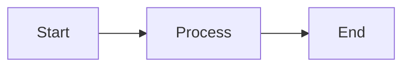

# Egregora Documentation

This directory contains the source for Egregora's project documentation, built with [MkDocs](https://www.mkdocs.org/) and the beautiful [Material for MkDocs](https://squidfunk.github.io/mkdocs-material/) theme.

## 📚 Documentation Structure

```
docs/
├── index.md                  # Homepage
├── getting-started/          # Installation & quickstart guides
├── guide/                    # User guides (architecture, privacy, etc.)
├── api/                      # API reference documentation
├── development/              # Contributing & development guides
├── stylesheets/              # Custom CSS
├── javascripts/              # Custom JavaScript
├── overrides/                # Custom templates
└── includes/                 # Reusable snippets & abbreviations
```

## 🚀 Quick Start

### Prerequisites

Install the documentation dependencies:

```bash
uv sync --extra docs
```

### Local Development

Start the development server with live reload:

```bash
uv run mkdocs serve
```

Then open [http://localhost:8000](http://localhost:8000) in your browser.

### Build Documentation

Generate the static site:

```bash
uv run mkdocs build
```

The built documentation will be in the `site/` directory.

## 🎨 Features

Our documentation setup includes:

- ✨ **Material Design** - Beautiful, responsive theme
- 🎨 **Custom Styling** - Gradient effects, enhanced cards, and modern design
- 🔍 **Advanced Search** - Fast, accurate search with highlighting
- 📝 **Code Highlighting** - Beautiful syntax highlighting with copy button
- 🧩 **Mermaid Diagrams** - Inline diagram rendering
- 📊 **Math Support** - LaTeX math rendering with MathJax
- 🔗 **Git Integration** - Automatic page revision dates
- ⚡ **Minification** - Optimized HTML/CSS/JS for production
- 📱 **Responsive** - Mobile-friendly design
- 🌙 **Dark Mode** - Automatic light/dark theme switching
- 🎯 **Navigation** - Tabs, breadcrumbs, and table of contents

## 🛠️ Configuration

The documentation is configured in `mkdocs.yml` at the project root. Key sections:

### Theme Customization

```yaml
theme:
  name: material
  palette:
    primary: deep purple
    accent: purple
  font:
    text: Inter
    code: Fira Code
```

### Plugins

- **search** - Full-text search with advanced tokenization
- **mkdocstrings** - API documentation from Python docstrings
- **git-revision-date-localized** - Automatic page update timestamps
- **minify** - Production optimization

### Markdown Extensions

- **PyMdown Extensions** - Enhanced markdown features
- **Admonitions** - Beautiful callout boxes
- **Code Blocks** - Syntax highlighting with line numbers
- **Tables** - Enhanced table styling
- **Emoji** - Support for emoji :rocket:
- **Math** - LaTeX equations

## 📝 Writing Documentation

### API Documentation

API docs are auto-generated from Python docstrings using Google-style format:

```python
def example_function(param1: str, param2: int) -> bool:
    """Brief description of the function.

    Args:
        param1: Description of param1
        param2: Description of param2

    Returns:
        Description of return value

    Raises:
        ValueError: When something goes wrong

    Examples:
        >>> example_function("test", 42)
        True
    """
    ...
```

### Admonitions

```markdown
!!! note "Optional Title"
    This is a note admonition.

!!! tip
    This is a tip.

!!! warning
    This is a warning.

!!! danger
    This is a danger alert.
```

### Code Blocks

````markdown
```python
# Code with syntax highlighting
def hello_world():
    print("Hello, World!")
```
````

### Diagrams

```markdown

```

### Cards Grid

```markdown
<div class="grid cards" markdown>

-   :material-clock-fast:{ .lg .middle } __Quick Start__

    ---

    Get started in minutes

    [:octicons-arrow-right-24: Get Started](getting-started/quickstart.md)

-   :material-book-open:{ .lg .middle } __User Guide__

    ---

    Learn the basics

    [:octicons-arrow-right-24: User Guide](guide/architecture.md)

</div>
```

## 🎨 Custom Styling

Custom CSS is in `docs/stylesheets/extra.css` with:

- CSS variables for consistent theming
- Enhanced typography with gradient text
- Beautiful card hover effects
- Improved code block styling
- Responsive design utilities
- Dark mode support

## 🚢 Deployment

### GitHub Pages

Deploy to GitHub Pages:

```bash
uv run mkdocs gh-deploy
```

### Manual Deployment

Build and deploy the `site/` directory to any static hosting:

```bash
uv run mkdocs build
# Upload the site/ directory to your hosting provider
```

## 📖 Resources

- [MkDocs Documentation](https://www.mkdocs.org/)
- [Material for MkDocs](https://squidfunk.github.io/mkdocs-material/)
- [MkDocstrings](https://mkdocstrings.github.io/)
- [PyMdown Extensions](https://facelessuser.github.io/pymdown-extensions/)

## 🤝 Contributing

When contributing to the documentation:

1. Follow the existing structure and style
2. Use Google-style docstrings for API docs
3. Test your changes locally with `mkdocs serve`
4. Ensure all links work and there are no warnings
5. Keep content concise and user-focused

## 💡 Tips

- **Live Reload**: Changes are reflected immediately with `mkdocs serve`
- **Strict Mode**: Use `mkdocs build --strict` to catch warnings
- **Link Validation**: All internal links are validated during build
- **Search**: Documentation is automatically indexed for search
- **Mobile**: Always test responsive design on mobile devices

---

Built with ❤️ using [MkDocs](https://www.mkdocs.org/) and [Material for MkDocs](https://squidfunk.github.io/mkdocs-material/)
