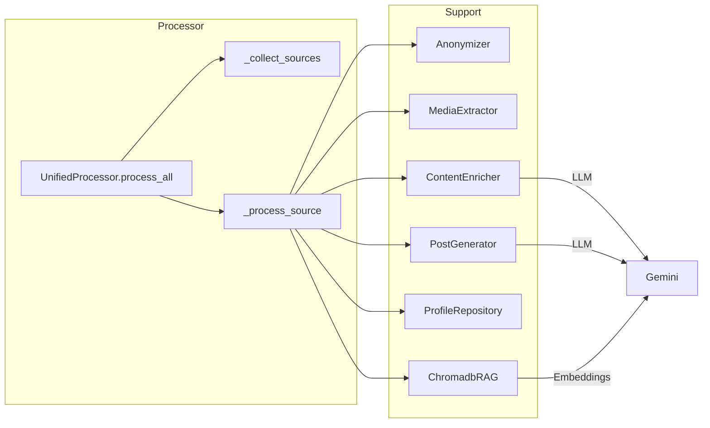
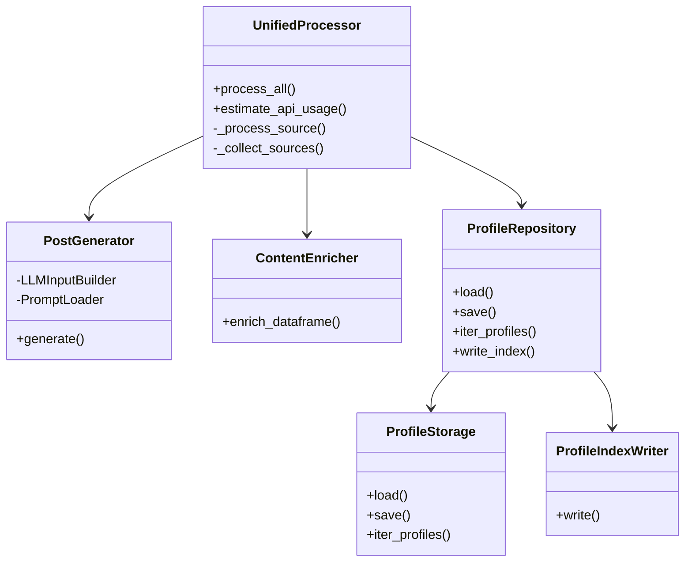

## Pipeline Overview

```mermaid
flowchart TD
    ZIP[WhatsApp ZIP exports] --> Parser[Parser.parse_multiple]
    Parser --> TranscriptCache[Transcript module\n(ensure schema, caching)]
    TranscriptCache --> UnifiedProcessor
    UnifiedProcessor -->|Anonymize| Anonymizer
    UnifiedProcessor -->|Media| MediaExtractor
    UnifiedProcessor -->|Enrichment| Enrichment[ContentEnricher]
    UnifiedProcessor -->|RAG| ChromadbRAG
    UnifiedProcessor -->|Prompts| PostGenerator
    PostGenerator --> Posts[Markdown posts]
    UnifiedProcessor --> ProfileRepo[ProfileRepository]
    ProfileRepo --> Profiles[JSON & Markdown profiles]
```




