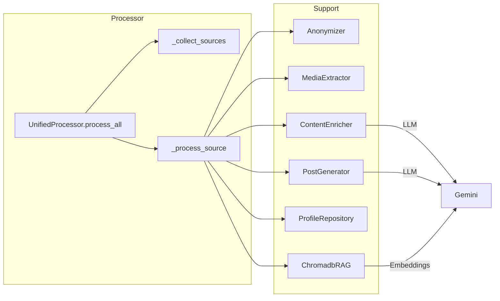
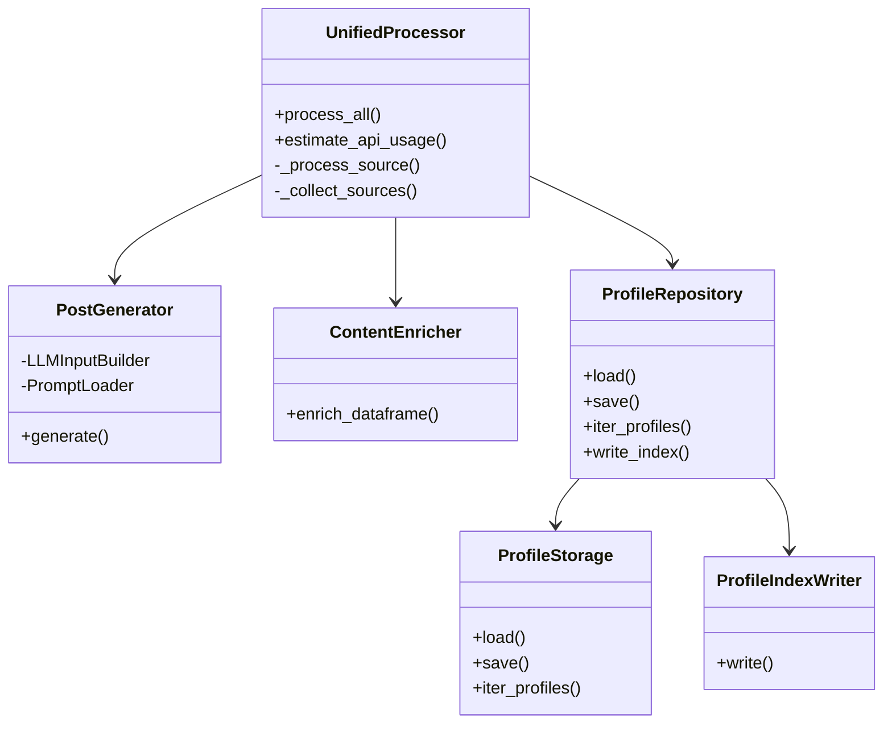
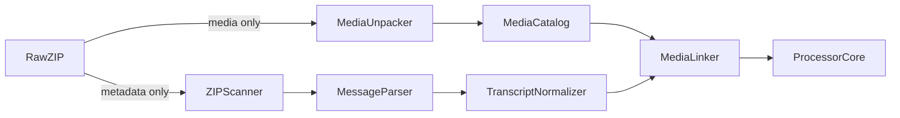
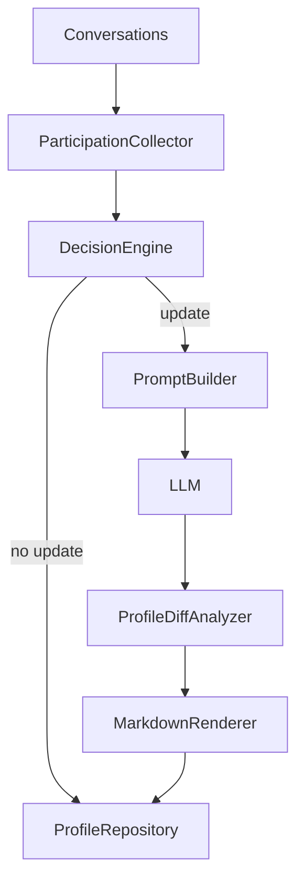
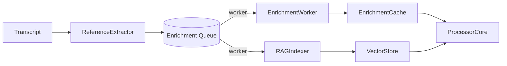
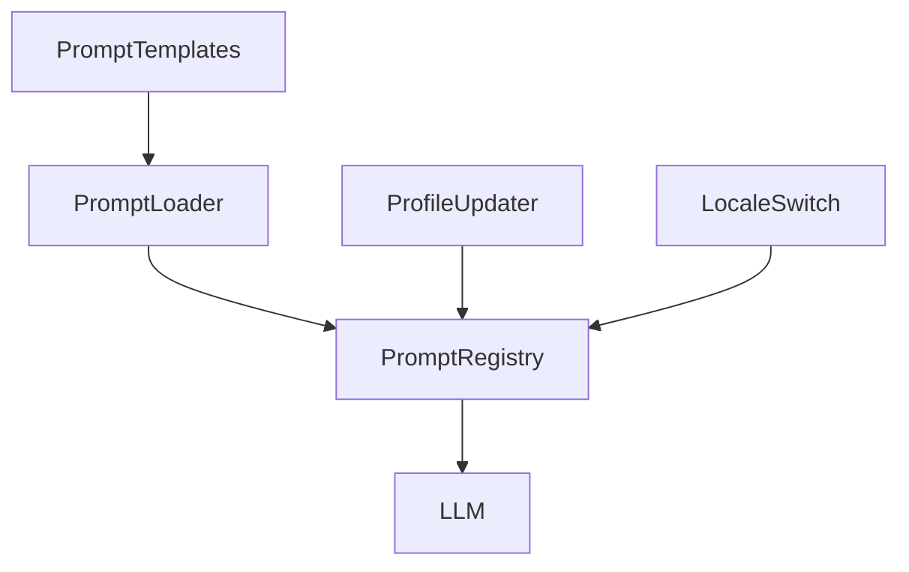

## Pipeline Overview

```mermaid
flowchart TD
    ZIP[WhatsApp ZIP exports] --> Parser[Parser.parse_multiple]
    Parser --> TranscriptCache[Transcript module\n(ensure schema, caching)]
    TranscriptCache --> UnifiedProcessor
    UnifiedProcessor -->|Anonymize| Anonymizer
    UnifiedProcessor -->|Media| MediaExtractor
    UnifiedProcessor -->|Enrichment| Enrichment[ContentEnricher]
    UnifiedProcessor -->|RAG| ChromadbRAG
    UnifiedProcessor -->|Prompts| PostGenerator
    PostGenerator --> Posts[Markdown posts]
    UnifiedProcessor --> ProfileRepo[ProfileRepository]
    ProfileRepo --> Profiles[JSON & Markdown profiles]
```





## Alternative Pipelines for TODO Cleanup

### Split Media Extraction Stages



*Goal:* tackle the `MediaExtractor` TODOs by separating metadata scanning from actual media extraction, reducing branching and making unit tests easier.

### Profile Updater Service Decomposition



*Goal:* address the monolithic `ProfileUpdater` TODOs by splitting the logic into decision, prompt building, diffing, and rendering stages.

### Streaming Enrichment & RAG Queue



*Goal:* break down long-running enrichment functions (`ContentEnricher`) and Chromadb indexing TODOs by offloading to background workers with explicit queues.

### Configurable Profile Prompt Pipeline



*Goal:* remove hardcoded prompts, enabling locale-specific templates and future prompt overrides that address the TODOs in `profiles/prompts.py`.
