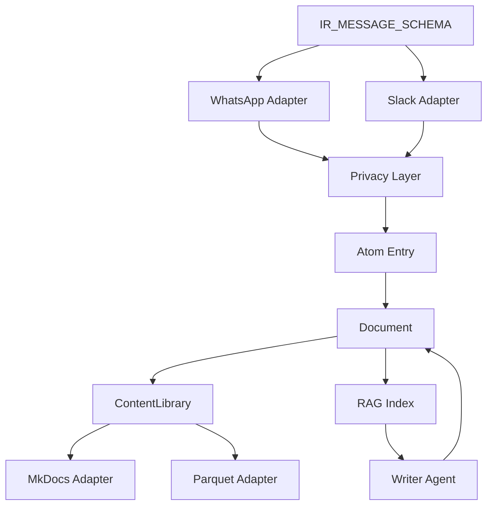

# V3 Plans Review and Improvement Proposals

**Reviewer**: Claude (Opus 4)
**Date**: 2025-12-06
**Documents Reviewed**:
- `v3-documents.md` - RFC: Egregora V3 Data Model
- `ir-v1-migration-plan.md` - IR v1 Schema Migration Plan
- `privacy-granular-strategies.md` - Two-Level Privacy Model
- `privacy-adapter-strategy.md` - Privacy as Adapter Responsibility
- `architecture.md` - Functional Pipeline Architecture
- `url-conventions.md` - URL Convention System
- `egregora-config-migration.md` - .egregora/ Folder Structure

---

## Executive Summary

The V3 plans represent a **well-architected modernization** of Egregora with strong foundational decisions. The adoption of Atom/RFC 4287 as the data model, the ContentLibrary simplification over AtomPub, and the two-level privacy architecture are all sound choices. However, there are **critical blockers** and **architectural gaps** that require attention before V3 can be fully realized.

### Overall Assessment: **B+**

| Aspect | Rating | Notes |
|--------|--------|-------|
| **Architecture** | A | Clean functional pipeline, good separation of concerns |
| **Data Model** | A | Atom-based, well-defined invariants |
| **Privacy Design** | A- | Innovative LLM-native approach, some edge cases unclear |
| **Documentation** | B+ | Thorough but some gaps in integration points |
| **Implementation Readiness** | C | BLOCKING issues, missing dependency graph |
| **Testing Strategy** | B- | Mentioned but not fully specified |

---

## Critical Issues (Must Fix Before V3)

### 1. 🔴 IR v1 Schema Migration is BLOCKING

**Status**: Pipeline fails at ingestion stage
**Location**: `ir-v1-migration-plan.md`

The entire V3 pipeline cannot function until this migration is complete. This is the **single most critical dependency**.

**Current Blockers:**
- Adapters still produce `CONVERSATION_SCHEMA` instead of `IR_MESSAGE_SCHEMA`
- Privacy stage expects different column names
- No working E2E test with VCR recording

**Improvement Proposal:**

```
┌─────────────────────────────────────────────────────────────────────┐
│  IMMEDIATE ACTION: Prioritize IR v1 Migration                      │
│                                                                      │
│  1. Create a separate tracking issue for IR v1                       │
│  2. Assign dedicated sprint/focus to complete migration              │
│  3. Block all other V3 work until IR v1 is functional               │
│  4. Add automated CI check that validates IR schema compliance       │
└─────────────────────────────────────────────────────────────────────┘
```

**Specific Steps:**
1. Complete UUID helpers (`deterministic_event_uuid`, `deterministic_thread_uuid`)
2. Update WhatsApp adapter first (it's the most used)
3. Add schema validation at adapter boundaries
4. Record VCR cassettes for E2E tests
5. Only then proceed with other adapters (Slack, etc.)

---

### 2. 🔴 Missing Integration Between IR v1 and Atom Data Model

**Problem**: Two core documents define different data models without explaining their relationship:
- `v3-documents.md`: Defines `Entry`, `Document`, `Feed` (Atom-based)
- `ir-v1-migration-plan.md`: Defines `IR_MESSAGE_SCHEMA` (internal representation)

**Question not answered**: How does `IR_MESSAGE_SCHEMA` transform into `Entry` objects?

**Improvement Proposal:**

Add a new section to `v3-documents.md` or create `ir-to-atom-mapping.md`:

```markdown
## IR Message to Atom Entry Mapping

The IR (Intermediate Representation) is the internal format for raw messages.
Atom Entry is the output format for processed documents.

### Transformation Pipeline

```
IR_MESSAGE_SCHEMA → Processing → Entry/Document (Atom)
```

### Field Mapping

| IR_MESSAGE_SCHEMA | Entry Field | Notes |
|-------------------|-------------|-------|
| event_id (UUID) | id | Use URN format: `urn:uuid:{event_id}` |
| ts (Timestamp) | updated | Direct mapping |
| ts (Timestamp) | published | Same as updated for messages |
| author_uuid | authors[0].uri | Format: `urn:uuid:{author_uuid}` |
| author_raw | (excluded) | PII - not included in Entry |
| text | content | With content_type="text/plain" |
| thread_id | in_reply_to.ref | If part of thread |
| media_url | links[rel="enclosure"] | For media attachments |
| tenant_id | source.id | Provenance tracking |
| source | categories[term] | e.g., "whatsapp", "slack" |
```

---

### 3. 🟡 Privacy Architecture: Unclear Edge Cases

**Problem**: The two-level privacy model is well-designed but has unclear edge cases.

**Gaps Identified:**

1. **What happens when structural anonymization is disabled but LLM-native is enabled?**
   - Raw PII reaches the LLM in prompts
   - LLM is told not to output PII, but has seen it
   - Is this a valid configuration?

2. **Journal protection vs. debugging**
   - `apply_to_journals: true` protects agent execution journals
   - But debugging requires seeing what the agent processed
   - How do developers debug without accessing PII?

3. **Cross-adapter PII leakage**
   - If WhatsApp adapter anonymizes but Slack adapter doesn't
   - And both are processed together
   - Can correlations leak identity?

**Improvement Proposal:**

Add a **Privacy Configuration Validation** section:

```python
def validate_privacy_config(config: PrivacySettings) -> list[PrivacyWarning]:
    """Validate privacy configuration for potential issues."""
    warnings = []

    # Warn about inconsistent configurations
    if not config.structural.enabled and config.pii_prevention.writer.enabled:
        warnings.append(PrivacyWarning(
            level="caution",
            message="Structural anonymization disabled but LLM PII prevention enabled. "
                    "Raw PII will be visible to the LLM during processing.",
            recommendation="Enable structural.enabled=true for full protection."
        ))

    # Warn about journal debugging vs. privacy trade-off
    if config.pii_prevention.writer.apply_to_journals:
        warnings.append(PrivacyWarning(
            level="info",
            message="Journal protection enabled. Debug output will be sanitized.",
            recommendation="Set DEBUG_MODE=true in .env to temporarily disable for debugging."
        ))

    return warnings
```

---

## Architecture Improvements

### 4. 🟡 Add Explicit Dependency Graph

**Problem**: The relationship between components is implied but not explicit.

**Current State**: Documents reference each other but there's no single view of dependencies.

**Improvement Proposal:**

Add `docs/development/v3-dependency-graph.md`:

```markdown
# V3 Component Dependency Graph

## Build Order (Critical Path)

```
┌─────────────────────────────────────────────────────────────────────────┐
│                           V3 BUILD ORDER                                 │
└─────────────────────────────────────────────────────────────────────────┘

Phase 0 (Foundation) - BLOCKING
├── IR v1 Schema Definition ✅
├── UUID Helpers ⏳
└── IR_MESSAGE_SCHEMA Validation ⏳

Phase 1 (Adapters)
├── WhatsApp Adapter → IR v1 ⏳ (depends on Phase 0)
├── Slack Adapter → IR v1 ⏳ (depends on Phase 0)
└── Privacy Integration ⏳ (depends on Phase 0)

Phase 2 (Data Model)
├── Entry/Document/Feed Models ✅
├── ContentLibrary ⏳ (depends on Phase 1)
└── URL Convention Implementation ✅

Phase 3 (Pipeline)
├── Windowing (replaces periods) ✅
├── Enrichment → Document ⏳
├── Writer → Document ⏳
└── Publication (OutputAdapters) ⏳

Phase 4 (Configuration)
├── .egregora/config.yml ✅
├── Prompt Overrides ✅
└── Consumer Updates ✅
```

## Component Dependencies


```

---

### 5. 🟡 Error Handling Strategy Missing

**Problem**: Plans don't address failure modes.

**Questions not answered:**
- What happens when an adapter fails mid-parse?
- What happens when privacy detection fails?
- What happens when LLM API calls fail during generation?
- How are partial runs resumed?

**Improvement Proposal:**

Add `docs/development/v3-error-handling.md`:

```markdown
# V3 Error Handling Strategy

## Adapter Failures

### Parse Errors (InputAdapter)
- **Behavior**: Fail fast, log error, skip problematic input
- **Recovery**: User must fix input file and re-run
- **Partial Success**: Not supported for parsing (all-or-nothing)

### Network Errors (API Adapters)
- **Behavior**: Exponential backoff with 3 retries
- **Recovery**: Automatic retry, then fail with clear error
- **State**: No partial state saved

## Pipeline Failures

### Privacy Stage Errors
- **Behavior**: CRITICAL - stop pipeline immediately
- **Rationale**: Never allow PII to leak due to error bypass
- **Recovery**: Fix configuration, re-run from start

### Enrichment Errors
- **Behavior**: Log warning, continue with unenriched content
- **Rationale**: Enrichment is optional, content is primary
- **State**: Mark documents as "unenriched" in metadata

### Writer Errors
- **Behavior**: Skip window, log error, continue with next
- **Rationale**: One failed post shouldn't block others
- **State**: Failed windows tracked in run metadata

## Resume Strategy

### Checkpoint Model
- Resume is timestamp-based (not window_id based)
- Last successful timestamp stored in run metadata
- Re-run processes only messages after checkpoint

### Idempotency
- All OutputAdapter.persist() calls are idempotent
- Same content = same output (content-addressed where applicable)
- Safe to re-run without duplicates
```

---

### 6. 🟡 Schema Evolution Strategy

**Problem**: No plan for how schemas evolve over time.

**Current assumption**: "Alpha mindset" - break everything

**But**: Once V3 ships, breaking changes are costly.

**Improvement Proposal:**

Add schema versioning from the start:

```python
# database/ir_schema.py

IR_SCHEMA_VERSION = "1.0.0"

IR_MESSAGE_SCHEMA = {
    "_schema_version": dt.string,  # Always include version
    "event_id": dt.UUID,
    # ... rest of schema
}

def migrate_schema(table: Table, from_version: str, to_version: str) -> Table:
    """Migrate table from one schema version to another."""
    migrations = {
        ("1.0.0", "1.1.0"): _migrate_1_0_to_1_1,
        ("1.1.0", "2.0.0"): _migrate_1_1_to_2_0,
    }
    return migrations[(from_version, to_version)](table)
```

---

## Documentation Improvements

### 7. 🟢 Add Quick Reference Card

**Problem**: Too many documents to navigate for common tasks.

**Improvement Proposal:**

Create `docs/development/v3-quick-reference.md`:

```markdown
# V3 Quick Reference

## Data Model Cheat Sheet

| Concept | Type | Purpose |
|---------|------|---------|
| IR_MESSAGE_SCHEMA | Ibis Schema | Raw message storage |
| Entry | Pydantic Model | Atom-compliant content unit |
| Document | Pydantic Model | Egregora-specific Entry subclass |
| Feed | Pydantic Model | Collection of Entries |

## Document Types

| Type | URL Pattern | Storage |
|------|-------------|---------|
| PROFILE | /profiles/{uuid} | Stable, full UUID |
| POST | /posts/{slug} | Date in metadata |
| JOURNAL | /journal/{label} | Time windows |
| MEDIA | /media/{type}/{hash} | Content-addressed |

## Privacy Quick Check

```yaml
# Maximum privacy (private chats)
privacy:
  structural.enabled: true
  structural.author_strategy: full_redaction
  pii_prevention.writer.enabled: true
  pii_prevention.writer.scope: all_pii

# Public data (judicial, news)
privacy:
  structural.enabled: false
  pii_prevention.writer.enabled: true  # Still prevent generating new PII
```

## Common Commands

```bash
# Process with IR v1 schema
egregora write export.zip --output=./site

# Validate IR schema compliance
egregora doctor --check=schema

# Debug privacy (shows what was anonymized)
egregora write export.zip --debug-privacy
```
```

---

### 8. 🟢 Add Implementation Status Dashboard

**Problem**: Hard to track what's implemented vs. planned.

**Improvement Proposal:**

Add status table to each document or create `docs/development/v3-status.md`:

```markdown
# V3 Implementation Status

Last Updated: 2025-12-06

## Core Components

| Component | Status | Document | Notes |
|-----------|--------|----------|-------|
| IR_MESSAGE_SCHEMA | ⏳ Partial | ir-v1-migration-plan.md | Schema defined, adapters pending |
| Entry/Document/Feed | ✅ Complete | v3-documents.md | Pydantic models implemented |
| ContentLibrary | ⏳ Designed | v3-documents.md | Awaiting IR v1 completion |
| URL Convention | ✅ Complete | url-conventions.md | Fully implemented |
| .egregora/ Config | ✅ Complete | egregora-config-migration.md | Phase 1-5 done |

## Adapters

| Adapter | IR v1 Support | Privacy | Status |
|---------|---------------|---------|--------|
| WhatsApp | ❌ | ✅ | Needs IR v1 migration |
| Slack | ❌ | ⏳ | Needs IR v1 + privacy |
| Iperon TJRO | N/A | N/A | Public data, no changes |
| Self-reflection | ⏳ | ⏳ | Needs review |

## Privacy

| Feature | Status | Notes |
|---------|--------|-------|
| Structural anonymization | ✅ | UUID mapping works |
| LLM-native PII prevention | ⏳ | Prompt templates need update |
| Journal protection | ⏳ | Design done, implementation pending |
| Privacy validation | ❌ | Proposal in review doc |

## Legend
- ✅ Complete / Implemented
- ⏳ In Progress / Partial
- ❌ Not Started
- N/A Not Applicable
```

---

## Code-Level Improvements

### 9. 🟢 Add Type Stubs for Core Protocols

**Problem**: Protocol interfaces are documented but not enforced.

**Improvement Proposal:**

Create explicit runtime-checkable protocols:

```python
# data_primitives/protocols.py

from typing import Protocol, runtime_checkable, Iterator
import ibis

@runtime_checkable
class InputAdapter(Protocol):
    """Protocol for input adapters producing IR_MESSAGE_SCHEMA tables."""

    def read(self) -> Iterator[ibis.Table]:
        """Yield Ibis tables conforming to IR_MESSAGE_SCHEMA.

        INVARIANTS:
        - Each table MUST pass validate_ir_schema()
        - author_uuid MUST be deterministically generated
        - tenant_id MUST be populated
        """
        ...

    @property
    def metadata(self) -> InputAdapterMetadata:
        """Return adapter metadata for provenance tracking."""
        ...

    @property
    def privacy_strategy(self) -> PrivacyStrategy:
        """Return this adapter's privacy handling strategy."""
        ...


@runtime_checkable
class OutputAdapter(Protocol):
    """Protocol for output adapters persisting Documents."""

    def persist(self, document: Document) -> None:
        """Persist document (idempotent overwrites).

        INVARIANTS:
        - Calling persist() twice with same document = no-op
        - URL is generated via url_convention, not manually
        """
        ...

    def documents(self) -> Iterator[Document]:
        """Lazy iteration over persisted documents."""
        ...
```

---

### 10. 🟢 Add Validation Decorators

**Problem**: Schema validation is manual and easy to forget.

**Improvement Proposal:**

```python
# database/validation.py

from functools import wraps
from typing import Callable, TypeVar
import ibis

T = TypeVar('T')

def validates_ir_schema(func: Callable[..., ibis.Table]) -> Callable[..., ibis.Table]:
    """Decorator to validate that function returns valid IR_MESSAGE_SCHEMA table."""
    @wraps(func)
    def wrapper(*args, **kwargs) -> ibis.Table:
        result = func(*args, **kwargs)
        validate_ir_schema(result)  # Raises if invalid
        return result
    return wrapper


# Usage in adapters:
class WhatsAppAdapter:
    @validates_ir_schema
    def parse(self, input_path: Path) -> ibis.Table:
        # ... parsing logic
        return table  # Automatically validated
```

---

## Testing Improvements

### 11. 🟢 Define V3 Test Matrix

**Problem**: Testing strategy mentioned but not formalized.

**Improvement Proposal:**

Add `docs/development/v3-testing-strategy.md`:

```markdown
# V3 Testing Strategy

## Test Pyramid

```
         ┌───────────────┐
         │    E2E (5)    │  Full pipeline, VCR recorded
         └───────┬───────┘
        ┌────────┴────────┐
        │ Integration (20) │  Component interactions
        └────────┬────────┘
    ┌────────────┴────────────┐
    │      Unit (100+)         │  Pure functions, models
    └─────────────────────────┘
```

## Required Tests by Component

### IR_MESSAGE_SCHEMA
- [ ] Schema definition matches Ibis types
- [ ] validate_ir_schema() catches missing columns
- [ ] validate_ir_schema() catches wrong types
- [ ] UUID determinism (same input = same output)

### InputAdapters
- [ ] WhatsApp: Parse → IR_MESSAGE_SCHEMA
- [ ] WhatsApp: Privacy integration
- [ ] WhatsApp: Media extraction
- [ ] Slack: Parse → IR_MESSAGE_SCHEMA
- [ ] Each adapter: implements Protocol correctly

### Privacy
- [ ] UUID mapping determinism
- [ ] Author strategy: uuid_mapping
- [ ] Author strategy: full_redaction
- [ ] Author strategy: role_based
- [ ] Mention replacement in text
- [ ] LLM prompt includes privacy instructions

### ContentLibrary
- [ ] Route document to correct repository
- [ ] Save + retrieve roundtrip
- [ ] Idempotent persist()

### URL Convention
- [ ] Profile URL uses full UUID
- [ ] Post URL uses slug (no date)
- [ ] Media URL is hash-based
- [ ] Stability: same doc = same URL

## VCR Cassettes Required

| Test | Cassette | API Calls |
|------|----------|-----------|
| E2E full pipeline | full_pipeline.yaml | Writer, Enricher, Embedding |
| Enrichment only | enrichment.yaml | Enricher |
| Writer only | writer.yaml | Writer + RAG |
```

---

## Summary of Improvement Proposals

### Priority 1 (Critical - Block V3)
1. **Complete IR v1 Migration** - Nothing works without this
2. **Add IR-to-Atom Mapping** - Document the transformation

### Priority 2 (Important - Quality)
3. **Privacy Edge Cases** - Add validation and warnings
4. **Explicit Dependency Graph** - Visualize build order
5. **Error Handling Strategy** - Define failure modes

### Priority 3 (Nice to Have)
6. **Schema Evolution Strategy** - Future-proofing
7. **Quick Reference Card** - Developer productivity
8. **Implementation Status Dashboard** - Tracking

### Priority 4 (Polish)
9. **Type Stubs for Protocols** - Enforcement
10. **Validation Decorators** - Automation
11. **V3 Test Matrix** - Quality assurance

---

## Next Steps

1. **Immediate**: Unblock IR v1 migration (assign dedicated focus)
2. **This Sprint**: Add dependency graph and error handling docs
3. **Next Sprint**: Privacy validation, test matrix
4. **Ongoing**: Update status dashboard as work progresses

---

## Appendix: Document Cross-References

| Document | Depends On | Depended By |
|----------|------------|-------------|
| v3-documents.md | - | ir-v1-migration-plan.md |
| ir-v1-migration-plan.md | v3-documents.md | privacy-*.md, architecture.md |
| privacy-granular-strategies.md | ir-v1-migration-plan.md | privacy-adapter-strategy.md |
| privacy-adapter-strategy.md | privacy-granular-strategies.md | architecture.md |
| architecture.md | All above | url-conventions.md |
| url-conventions.md | architecture.md | egregora-config-migration.md |
| egregora-config-migration.md | url-conventions.md | - |

---

*This review was generated by Claude (Opus 4) on 2025-12-06.*
