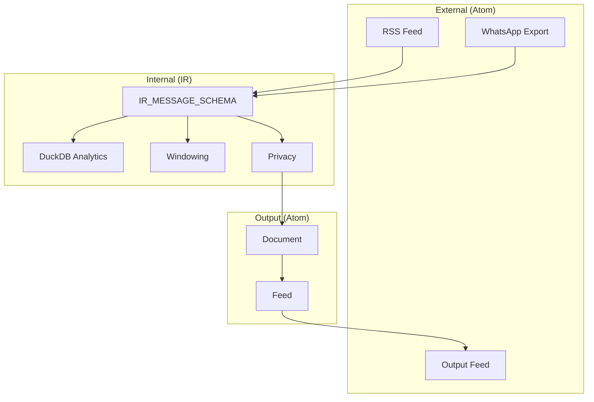

# V3 Plans Review and Improvement Proposals

**Reviewer**: Claude (Opus 4)
**Date**: 2025-12-06
**Documents Reviewed**:
- `v3-documents.md` - RFC: Egregora V3 Data Model
- `ir-v1-migration-plan.md` - IR v1 Schema Migration Plan
- `privacy-granular-strategies.md` - Two-Level Privacy Model
- `privacy-adapter-strategy.md` - Privacy as Adapter Responsibility
- `architecture.md` - Functional Pipeline Architecture
- `url-conventions.md` - URL Convention System
- `egregora-config-migration.md` - .egregora/ Folder Structure

---

## Executive Summary

The V3 plans have a **fundamental architectural contradiction** that must be resolved before implementation can proceed. The core V3 RFC (`v3-documents.md`) establishes Atom Feed/Entry as the data model throughout the system, but several other documents (`ir-v1-migration-plan.md`, `architecture.md`) still reference the legacy IR/Ibis-based approach.

### Overall Assessment: **B** (downgraded due to document conflicts)

| Aspect | Rating | Notes |
|--------|--------|-------|
| **V3 Data Model (Atom)** | A | Well-designed, RFC 4287 compliant |
| **Privacy Design** | A- | Innovative LLM-native approach |
| **URL Convention** | A | Clean, adapter-independent |
| **Config Migration** | A | .egregora/ structure complete |
| **Document Consistency** | D | **Critical conflict between Atom vs IR approaches** |
| **Implementation Readiness** | C | Blocked by unresolved architecture |

---

## 🔴 CRITICAL: Architectural Contradiction

### The Core Conflict

**V3 RFC (`v3-documents.md`) says:**

> "In V3, Egregora adopts the **Atom protocol** (RFC 4287) as the conceptual foundation for **input and output data**."
>
> "**Everything that enters is Atom; everything that exits is Atom (enriched).**"

```python
# V3 Vision - Atom throughout
class RSSAdapter(InputAdapter):
    def read_entries(self) -> Iterator[Entry]:
        # Parse RSS feed, yield Entry objects
        ...
```

**But `ir-v1-migration-plan.md` says:**

> "This document outlines the plan to migrate input adapters from the legacy `CONVERSATION_SCHEMA` to the new `IR_MESSAGE_SCHEMA`"

```python
# IR Vision - Ibis tables throughout
def parse(input_path: Path) -> Table:
    # Return IR_MESSAGE_SCHEMA Ibis table
    return ibis.memtable(ir_messages, schema=IR_MESSAGE_SCHEMA)
```

**And `architecture.md` says:**

> "All adapters produce data conforming to `IR_MESSAGE_SCHEMA`."
>
> "**Ibis Everywhere** - All data flows through Ibis DataFrames"

### This Creates Two Incompatible Architectures

```
┌─────────────────────────────────────────────────────────────────────────────┐
│                      ARCHITECTURE CONTRADICTION                              │
├─────────────────────────────────────────────────────────────────────────────┤
│                                                                              │
│  V3 ATOM VISION (v3-documents.md)          LEGACY IR VISION (ir-v1, arch)   │
│  ═══════════════════════════════           ══════════════════════════════   │
│                                                                              │
│  InputAdapter → Entry                      InputAdapter → ibis.Table        │
│       ↓                                          ↓                          │
│  Feed[Entry]                               IR_MESSAGE_SCHEMA                │
│       ↓                                          ↓                          │
│  Processing (Entry → Document)             Processing (Table → Table)       │
│       ↓                                          ↓                          │
│  Feed[Document]                            ??? → Document                   │
│       ↓                                          ↓                          │
│  OutputAdapter.persist(Document)           OutputAdapter.persist(Document)  │
│                                                                              │
│  Data Model: Pydantic (Entry/Document)     Data Model: Ibis (IR Schema)    │
│  Query: In-memory, object iteration        Query: DuckDB SQL                │
│  Type Safety: Full Pydantic validation     Type Safety: Schema at runtime   │
│                                                                              │
└─────────────────────────────────────────────────────────────────────────────┘
```

---

## Decision Required: Which Architecture for V3?

### Option A: Pure Atom (as per v3-documents.md)

**Pros:**
- Clean, standards-based (RFC 4287)
- Interoperability with feed readers/tools
- Simpler mental model (everything is an Entry)
- Type-safe throughout (Pydantic)

**Cons:**
- Requires rewriting adapters
- Loses DuckDB analytics capabilities
- May be slower for large datasets

**Changes Required:**
1. ❌ Deprecate `ir-v1-migration-plan.md`
2. ❌ Rewrite `architecture.md` for Atom
3. ❌ Rewrite all InputAdapters to return `Iterator[Entry]`
4. ❌ Remove Ibis dependency for data flow

### Option B: Hybrid (IR internally, Atom at boundaries)

**Pros:**
- Keep DuckDB analytics
- IR for efficient processing
- Atom only at input/output boundaries

**Cons:**
- Complexity: two data models
- Transformation overhead
- Contradicts "Atom everywhere" principle

**Changes Required:**
1. ✅ Keep `ir-v1-migration-plan.md` but clarify scope
2. ⚠️ Update `v3-documents.md` to clarify IR is internal
3. ⚠️ Document IR → Entry transformation
4. ⚠️ Update `architecture.md` to explain hybrid model

### Option C: IR Only (abandon Atom vision)

**Pros:**
- Simpler (one data model)
- Keep existing code patterns
- DuckDB analytics intact

**Cons:**
- Loses Atom interoperability
- Contradicts approved V3 RFC
- Not standards-based

**Changes Required:**
1. ❌ Mark `v3-documents.md` Atom sections as deprecated
2. ❌ Remove Entry/Feed from InputAdapter contracts
3. ✅ Keep IR as primary model

---

## Recommendation

### Recommended: Option B (Hybrid) with Clear Documentation

The V3 vision of "Atom everywhere" is elegant but impractical given:
- Existing codebase uses Ibis/DuckDB
- Analytics need SQL capabilities
- Atom lacks query semantics

**Proposed Resolution:**

```
┌─────────────────────────────────────────────────────────────────────────────┐
│                     RECOMMENDED HYBRID ARCHITECTURE                          │
├─────────────────────────────────────────────────────────────────────────────┤
│                                                                              │
│  EXTERNAL BOUNDARY          INTERNAL PROCESSING         EXTERNAL BOUNDARY   │
│  (Atom)                     (IR/Ibis)                   (Atom)              │
│                                                                              │
│  RSS Feed ──→ Entry ──→ IR_MESSAGE_SCHEMA ──→ Document ──→ Feed[Document]  │
│  WhatsApp ─┘            ↓                       ↑                           │
│                    DuckDB Analytics         Writer Agent                    │
│                    Windowing                    │                           │
│                    Privacy                      │                           │
│                         └──────────────────────┘                            │
│                                                                              │
│  RULE: Atom at boundaries, IR for processing                                │
│                                                                              │
└─────────────────────────────────────────────────────────────────────────────┘
```

**Documents to Update:**

1. **`v3-documents.md`** - Add section:
   ```markdown
   ## Internal vs External Data Model

   V3 uses **two complementary data models**:

   - **Atom (Entry/Document/Feed)**: External interfaces and output format
   - **IR (IR_MESSAGE_SCHEMA)**: Internal processing and analytics

   Adapters may receive data as Atom Feeds (RSS, Atom XML) or convert
   proprietary formats (WhatsApp, Slack) to IR for processing. All output
   is standardized as Atom Documents.
   ```

2. **`architecture.md`** - Update data flow:
   ```markdown
   ## Data Flow (Hybrid Model)

   ```
   Input → [Atom or Raw] → IR_MESSAGE_SCHEMA → Processing → Document → Feed
   ```

   The pipeline uses IR internally for efficient analytics, but all
   outputs conform to Atom specification.
   ```

3. **`ir-v1-migration-plan.md`** - Add context:
   ```markdown
   ## Relationship to V3 Atom Model

   IR_MESSAGE_SCHEMA is the **internal representation** used for:
   - DuckDB storage and analytics
   - Windowing and aggregation
   - Privacy processing

   IR records are transformed to Atom Entry/Document at output boundaries.
   ```

---

## Other Issues (After Architecture Resolution)

### 2. 🟡 Privacy Architecture: Unclear Edge Cases

**Gaps Identified:**

1. **Structural disabled + LLM-native enabled** - Raw PII reaches LLM
2. **Journal protection vs debugging** - How to debug without PII access?
3. **Cross-adapter PII leakage** - Mixed public/private sources

**Improvement Proposal:**

Add privacy configuration validation:

```python
def validate_privacy_config(config: PrivacySettings) -> list[PrivacyWarning]:
    """Validate privacy configuration for potential issues."""
    warnings = []

    if not config.structural.enabled and config.pii_prevention.writer.enabled:
        warnings.append(PrivacyWarning(
            level="caution",
            message="Structural anonymization disabled but LLM PII prevention enabled. "
                    "Raw PII will be visible to the LLM during processing."
        ))

    return warnings
```

---

### 3. 🟡 Error Handling Strategy Missing

**Questions not answered:**
- What happens when an adapter fails mid-parse?
- What happens when privacy detection fails?
- How are partial runs resumed?

**Improvement Proposal:**

Add `docs/development/v3-error-handling.md` defining:
- Adapter failure modes
- Pipeline failure handling
- Resume/checkpoint strategy
- Idempotency guarantees

---

### 4. 🟡 Missing Dependency Graph

**Problem**: No visualization of component dependencies and build order.

**Improvement Proposal:**



---

### 5. 🟢 Add Quick Reference Card

Create `docs/development/v3-quick-reference.md`:

```markdown
# V3 Quick Reference

## Data Models

| Layer | Model | Purpose |
|-------|-------|---------|
| External Input | Entry (Atom) | Standard feed items |
| Internal | IR_MESSAGE_SCHEMA | Analytics, processing |
| External Output | Document (Atom) | Blog posts, profiles |

## Document Types

| Type | URL Pattern | Use Case |
|------|-------------|----------|
| PROFILE | /profiles/{uuid} | Author profiles |
| POST | /posts/{slug} | Blog posts |
| JOURNAL | /journal/{label} | Processing logs |
| MEDIA | /media/{type}/{hash} | Images, files |
```

---

## Summary of Required Actions

### Priority 1: Resolve Architecture (BLOCKING)

| Action | Owner | Document |
|--------|-------|----------|
| **Decide: Atom vs Hybrid vs IR** | Team | - |
| Update v3-documents.md with decision | - | v3-documents.md |
| Update architecture.md for consistency | - | architecture.md |
| Clarify ir-v1-migration-plan.md scope | - | ir-v1-migration-plan.md |

### Priority 2: Fill Documentation Gaps

| Action | Document |
|--------|----------|
| Add privacy validation logic | privacy-granular-strategies.md |
| Add error handling strategy | NEW: v3-error-handling.md |
| Add dependency graph | NEW: v3-dependency-graph.md |

### Priority 3: Developer Experience

| Action | Document |
|--------|----------|
| Quick reference card | NEW: v3-quick-reference.md |
| Implementation status | NEW: v3-status.md |

---

## Appendix: Document Status

| Document | Aligned with V3? | Action Needed |
|----------|------------------|---------------|
| v3-documents.md | ✅ Yes (defines V3) | Clarify internal vs external |
| ir-v1-migration-plan.md | ⚠️ Unclear | Clarify as internal-only |
| architecture.md | ❌ No (says "Ibis everywhere") | Update for hybrid model |
| privacy-*.md | ✅ Yes | Minor edge case docs |
| url-conventions.md | ✅ Yes | No changes |
| egregora-config-migration.md | ✅ Yes | No changes |

---

*This review was generated by Claude (Opus 4) on 2025-12-06.*
*Updated to highlight architectural contradiction between Atom and IR approaches.*
