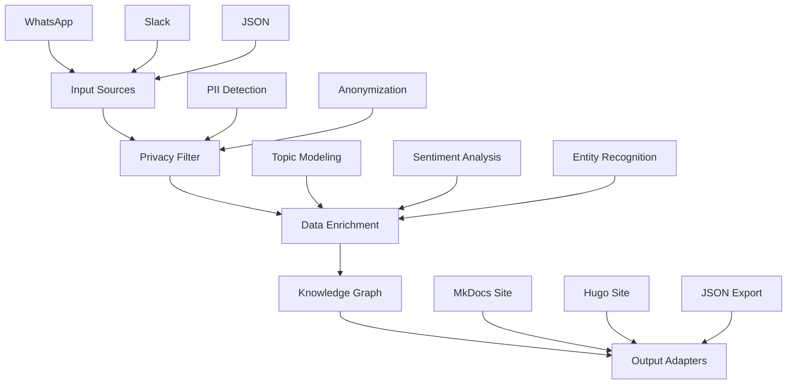

# Architecture

Egregora follows a modular, staged pipeline architecture designed for privacy, extensibility, and maintainability.

## High-Level Overview

Egregora processes your personal data through a series of stages:

## Core Components

### 1. Input Adapters

Input adapters are responsible for parsing and normalizing data from various sources. Each adapter implements a common interface to convert source-specific formats into Egregora's internal data representation.

- **WhatsApp Adapter**: Parses WhatsApp export files (.txt, .zip)
- **Slack Adapter**: Imports from Slack export files (.zip, JSON)
- **Generic Adapter**: Handles other structured data (JSON, CSV)

### 2. Privacy Layer

The privacy layer is the core of Egregora's privacy-first design:

- **PII Detection**: Identifies personal information (names, emails, phone numbers, locations)
- **Anonymization**: Replaces PII with anonymous tokens that maintain referential integrity
- **Gate System**: Controls what information flows between pipeline stages

### 3. Data Primitives

A common data representation that all pipeline stages use:

- **Document**: Core data structure containing messages, metadata, and relationships
- **Author Profile**: Anonymized representation of individuals in your data
- **Context**: Temporal, spatial, and topical context of conversations

### 4. Enrichment Runners

AI-powered modules that add semantic meaning to your data:

- **Topic Modeling**: Identifies conversation themes and topics
- **Sentiment Analysis**: Determines emotional tone of interactions
- **Entity Recognition**: Tags important entities (organizations, locations, etc.)
- **Media Analysis**: Extracts information from attached media files

### 5. Transformation Functions

Pure functions that transform data without side effects:

- **Windowing**: Groups related messages together
- **Media Processing**: Handles image/video content separately
- **Relationship Mapping**: Identifies connections between authors and topics

### 6. Output Adapters

Converts the enriched knowledge graph into various output formats:

- **MkDocs Adapter**: Generates documentation sites
- **Hugo Adapter**: Creates static sites with the Hugo framework
- **JSON Exporter**: Exports data for programmatic use
- **Custom Adapters**: Extendable format support

### 7. Orchestration

Coordinates the entire pipeline:

- **Write Pipeline**: Main processing flow from input to enriched output
- **CLI Interface**: Command-line interface for users
- **Configuration Manager**: Handles settings and options

## Data Flow

1. **Input Stage**: Data is loaded and normalized through input adapters
2. **Privacy Stage**: PII is detected and anonymized to protect privacy
3. **Enrichment Stage**: AI models add semantic meaning and context
4. **Transformation Stage**: Data is organized and structured
5. **Output Stage**: Results are formatted and written to the desired output

## Privacy-First Design

The architecture ensures privacy through:

- **Local Processing**: All PII detection and anonymization happens on your machine
- **Data Isolation**: PII never reaches external AI services
- **Token Consistency**: Anonymized tokens maintain referential integrity
- **Configurable Privacy**: Granular controls for privacy settings

## Extensibility

The modular design allows easy extension:

- New input formats can be added by implementing the input adapter protocol
- Additional enrichment capabilities can be added as new runners
- Multiple output formats are supported through output adapters
- Custom processing steps can be inserted into the pipeline