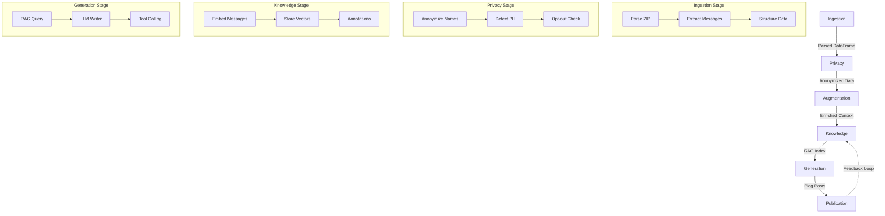

# Architecture Overview

Egregora uses a **staged pipeline architecture** that processes conversations through distinct phases. This design provides clear separation of concerns and better maintainability compared to traditional ETL pipelines.

## Pipeline Stages



## 1. Ingestion

**Module**: `egregora.ingestion`

Converts WhatsApp exports into structured Ibis DataFrames.

```python
from egregora.ingestion import parse_whatsapp_export

df = parse_whatsapp_export("whatsapp-export.zip")
# Columns: timestamp, author, message, media_type, media_path
```

**Key Operations**:

- Unzip WhatsApp export
- Parse text format (handles multiple formats)
- Extract timestamps, authors, messages
- Detect media references
- Convert to Ibis DataFrame

## 2. Privacy

**Module**: `egregora.privacy`

Ensures real names never reach the LLM.

```python
from egregora.privacy import anonymize_dataframe, detect_pii

# Convert names to deterministic UUIDs
df_anon = anonymize_dataframe(df)

# Scan for phone numbers, emails, addresses
pii_results = detect_pii(df_anon)
```

**Key Features**:

- **Deterministic UUIDs**: Same person always gets the same pseudonym
- **PII Detection**: Scans for phone numbers, emails, addresses, etc.
- **Opt-out Management**: Respects user privacy preferences
- **Reversible**: Original names stored separately for local display

## 3. Augmentation

**Module**: `egregora.augmentation`

Adds context to conversations using LLMs.

```python
from egregora.augmentation import enrich_urls, create_author_profiles

# Add descriptions for URLs and media
df_enriched = enrich_urls(df_anon, gemini_client)

# Generate author bios from conversations
profiles = create_author_profiles(df_anon, gemini_client)
```

**Key Operations**:

- **URL Enrichment**: LLM fetches and summarizes linked content
- **Media Enrichment**: Describes images, videos, documents
- **Author Profiling**: Generates bios from conversation patterns

## 4. Knowledge

**Module**: `egregora.knowledge`

Builds persistent indexes for retrieval and analysis.

```python
from egregora.knowledge import embed_and_store, annotate_conversations

# Embed messages and store in DuckDB vector store
embed_and_store(df_enriched, gemini_client, db_conn)

# Add metadata and threading information
annotations = annotate_conversations(df_enriched)
```

**Components**:

- **RAG Store**: Vector embeddings in DuckDB with VSS extension
- **Annotations**: Conversation metadata, threading, topics
- **Rankings**: Elo-based content quality scoring

## 5. Generation

**Module**: `egregora.generation`

LLM generates blog posts using tool calling.

```python
from egregora.generation import generate_posts

posts = generate_posts(
    df_enriched,
    gemini_client,
    rag_store,
    period="weekly"
)
# Returns 0-N posts per period
```

**Key Features**:

- **Tool Calling**: LLM uses `write_post()` function to create articles
- **RAG Context**: Retrieves similar past posts for consistency
- **Editorial Freedom**: LLM decides how many posts and what to write
- **Structured Output**: Pydantic models ensure valid frontmatter

## 6. Initialization

**Module**: `egregora.init`

Creates the MkDocs site structure used to publish generated content.

```python
from pathlib import Path

from egregora.init import ensure_mkdocs_project

# Ensure site scaffolding exists and receive docs directory path
docs_dir, created = ensure_mkdocs_project(Path("my-blog/"))
```

**Scaffold Output**:

```
my-blog/
├── mkdocs.yml
├── docs/
│   ├── index.md
│   ├── about.md
│   └── posts/
│       ├── 2025-01-15-first-post.md
│       └── 2025-01-22-second-post.md
└── .egregora/
    ├── egregora.db      # RAG vectors, annotations
    └── cache/           # LLM response cache
```

## Data Flow

### Ibis DataFrames

All data flows through Ibis DataFrames:

```python
from egregora.core.schema import CONVERSATION_SCHEMA

# All DataFrames follow defined schemas
df: ibis.Table = ibis.memtable(data, schema=CONVERSATION_SCHEMA)

# DuckDB backend for analytics
connection = ibis.duckdb.connect("egregora.db")
```

### Schemas

**Ephemeral** (in-memory transformations):

- `CONVERSATION_SCHEMA`: Messages with timestamps, authors, content
- `ENRICHMENT_SCHEMA`: URL/media descriptions

**Persistent** (DuckDB tables):

- `RAG_CHUNKS_SCHEMA`: Embedded message chunks with vectors
- `ANNOTATIONS_SCHEMA`: Conversation metadata
- `ELO_RATINGS_SCHEMA`: Content quality scores

## Feedback Loop

The knowledge stage creates a feedback loop:

1. Generate initial posts
2. Embed posts into RAG store
3. Future generations retrieve similar posts
4. Ensures consistency and evolution

## Why Staged Pipeline?

Traditional ETL (Extract-Transform-Load) doesn't fit because:

- **Feedback Loops**: RAG indexes posts for future use
- **Stateful Operations**: Knowledge stage persists data
- **Multiple Outputs**: Not just "loading" data somewhere

Staged pipeline better represents:

- Clear separation of concerns
- Explicit dependencies between stages
- Feedback and iteration
- Mixed ephemeral/persistent data

## Technology Stack

| Component | Technology | Purpose |
|-----------|-----------|---------|
| DataFrames | Ibis | Unified data manipulation API |
| Database | DuckDB | Analytics + vector search (VSS) |
| LLM | Google Gemini | Content generation |
| Embeddings | Gemini Embeddings | Vector search |
| Site | MkDocs | Static site generation |
| Cache | diskcache | Response caching |
| CLI | Typer | Command-line interface |

## Performance Characteristics

- **Stateless**: Each run is independent (except RAG/annotations)
- **Lazy Evaluation**: Ibis defers execution until needed
- **Batching**: Embeddings and enrichments are batched
- **Caching**: LLM responses cached on disk
- **Vectorized**: DuckDB enables fast analytics

## Next Steps

- [Privacy Model](privacy.md) - Deep dive on anonymization
- [Knowledge Base](knowledge.md) - RAG and vector search
- [Content Generation](generation.md) - LLM writer internals
