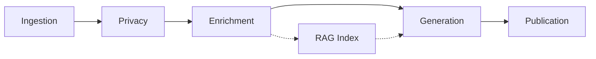
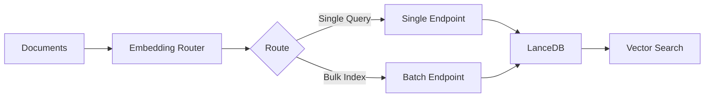

# Architecture Overview

Egregora uses a **functional pipeline architecture** that processes conversations through pure transformations. This design provides clear separation of concerns and better maintainability.

## Pipeline Flow



Egregora processes conversations through these stages:

1. **Ingestion**: Input adapters parse exports into structured IR (Intermediate Representation)
2. **Privacy**: Anonymize names with deterministic UUIDs
3. **Enrichment**: Optionally enrich URLs and media with LLM descriptions
4. **Generation**: Writer agent generates blog posts with RAG retrieval
5. **Publication**: Output adapters persist to MkDocs site

**Critical Invariant:** Privacy stage runs BEFORE any LLM processing.

## Three-Layer Functional Architecture

```
Layer 3: orchestration/        # High-level workflows (write_pipeline.run)
Layer 2: transformations/      # Pure functional (Table → Table)
         input_adapters/       # Bring data IN
         output_adapters/      # Take data OUT
         database/             # Persistence, views, tracking
Layer 1: data_primitives/      # Foundation models (Document, etc.)
```

**Key Pattern:** No `PipelineStage` abstraction—all transforms are pure functions.

## Code Structure

```
src/egregora/
├── cli/                      # Typer commands
│   ├── main.py              # Main app (write, init, top, doctor)
│   ├── read.py              # Reader agent commands
│   └── runs.py              # Run tracking commands
├── orchestration/            # Workflows (Layer 3)
│   ├── write_pipeline.py    # Main pipeline coordination
│   ├── context.py           # PipelineContext, PipelineRunParams
│   └── factory.py           # Factory for creating pipeline components
├── transformations/          # Pure functional (Layer 2)
│   ├── windowing.py         # Window creation, checkpointing
│   └── enrichment.py        # Enrichment transformations
├── input_adapters/          # Layer 2
│   ├── whatsapp/            # WhatsApp adapter package
│   ├── iperon_tjro.py       # Brazilian judicial API adapter
│   ├── self_reflection.py   # Re-ingest past posts adapter
│   └── registry.py          # InputAdapterRegistry
├── output_adapters/         # Layer 2
│   ├── mkdocs/              # MkDocs output adapter
│   ├── parquet/             # Parquet output adapter
│   └── conventions.py       # Output conventions
├── database/                # Layer 2
│   ├── ir_schema.py         # All schema definitions (IR_MESSAGE_SCHEMA, etc.)
│   ├── duckdb_manager.py    # DuckDBStorageManager
│   ├── views.py             # View registry (daily_aggregates, etc.)
│   ├── tracking.py          # Run tracking (INSERT+UPDATE)
│   ├── sql.py               # SQLManager (Jinja2 templates)
│   └── init.py              # Database initialization
├── rag/                     # RAG implementation (Layer 2)
│   ├── lancedb_backend.py   # LanceDB backend (async)
│   ├── embedding_router.py  # Dual-queue embedding router
│   ├── embeddings_async.py  # Async embedding API
│   ├── backend.py           # RAGBackend protocol
│   └── models.py            # Pydantic models (RAGQueryRequest, etc.)
├── data_primitives/         # Layer 1
│   ├── document.py          # Document, DocumentType, MediaAsset
│   └── protocols.py         # OutputAdapter, InputAdapter protocols
├── agents/                  # Pydantic-AI agents
│   ├── writer.py            # Post generation agent
│   ├── enricher.py          # URL/media enrichment agent
│   ├── reader/              # Reader agent package
│   ├── banner/              # Banner generation agent
│   ├── tools/               # Agent tools
│   └── registry.py          # AgentResolver, ToolRegistry
├── privacy/                 # Anonymization
│   ├── anonymizer.py        # Anonymization logic
│   ├── detector.py          # PII detection
│   ├── patterns.py          # Regex patterns for PII
│   └── uuid_namespaces.py   # UUID namespace management
├── config/                  # Pydantic V2 settings
│   ├── settings.py          # EgregoraConfig (all settings classes)
│   ├── config_validation.py # Date/timezone validation
│   └── overrides.py         # ConfigOverrideBuilder
└── utils/                   # Utility functions
    ├── batch.py             # Batching utilities
    ├── cache.py             # Caching utilities
    └── ...                  # Many more utilities
```

## Input Adapters

**Purpose**: Convert external data sources into the IR (Intermediate Representation) schema.

**Available adapters:**

- `WhatsAppAdapter`: Parse WhatsApp `.zip` exports
- `IperonTJROAdapter`: Ingest Brazilian judicial records
- `SelfReflectionAdapter`: Re-ingest past blog posts

**Protocol:**

```python
class InputAdapter(Protocol):
    def read_messages(self) -> Iterator[dict[str, Any]]:
        """Yield raw message dictionaries."""
        ...

    def get_metadata(self) -> InputAdapterMetadata:
        """Return adapter metadata."""
        ...
```

All adapters produce data conforming to `IR_MESSAGE_SCHEMA`.

## Privacy Layer

**Module:** `egregora.privacy`

Ensures real names never reach the LLM.

**Key components:**

- `deterministic_author_uuid()`: Convert names to UUIDs
- `detect_pii()`: Scan for phone numbers, emails, addresses
- Namespace management: Scoped anonymity per chat/tenant

**Process:**

1. Input adapter calls `deterministic_author_uuid()` during parsing
2. Core pipeline validates anonymized IR
3. LLM only sees UUIDs, never real names
4. Reverse mapping stored locally (never sent to API)

## Transformations

**Module:** `egregora.transformations`

Pure functional transformations on Ibis tables.

**Key functions:**

- `create_windows()`: Group messages into time/count-based windows
- `enrich_window()`: Add URL/media enrichments
- `apply_privacy()`: Validate anonymization

**Pattern:**

```python
def transform(data: ibis.Table) -> ibis.Table:
    """Pure function: Table → Table"""
    return data.filter(...).mutate(...)
```

## RAG (Retrieval-Augmented Generation)

**Module:** `egregora.rag`

LanceDB-based vector storage with dual-queue embedding router.

**Architecture:**



**Key features:**

- Async API (`async def index_documents`, `async def search`)
- Dual-queue router: single endpoint (low-latency) + batch endpoint (high-throughput)
- Automatic rate limit handling with exponential backoff
- Asymmetric embeddings: `RETRIEVAL_DOCUMENT` vs `RETRIEVAL_QUERY`
- Configurable indexable document types

**Configuration:**

```yaml
rag:
  enabled: true
  top_k: 5
  min_similarity_threshold: 0.7
  indexable_types: ["POST"]
  embedding_max_batch_size: 100
  embedding_timeout: 60.0
```

**API:**

```python
from egregora.rag import index_documents, search, RAGQueryRequest

# Index documents (async)
await index_documents([doc1, doc2])

# Search (async)
request = RAGQueryRequest(text="search query", top_k=5)
response = await search(request)
```

## Agents

Egregora uses Pydantic-AI agents for LLM interactions.

### Writer Agent

**Module:** `egregora.agents.writer`

Generates blog posts from conversation windows.

**Input:** Conversation window as XML (via `conversation.xml.jinja`)

**Output:** Markdown blog post with frontmatter

**Tools:** RAG search for retrieving similar past content

**Caching:** L3 cache with semantic hashing (zero-cost re-runs for unchanged windows)

### Enricher Agent

**Module:** `egregora.agents.enricher`

Extracts and enriches URLs and media from messages.

**Capabilities:**

- URL enrichment: Extract title, description, context
- Media enrichment: Generate captions for images/videos
- Text enrichment: Extract key points from long text

**Caching:** L1 cache for enrichment results (asset-level)

### Reader Agent

**Module:** `egregora.agents.reader`

Post quality evaluation and ranking using ELO system.

**Architecture:**

- Pairwise post comparison (A vs B)
- ELO rating updates based on comparison outcomes
- Persistent ratings in SQLite database
- Comparison history tracking

**Usage:**

```bash
egregora read rank ./docs/posts
egregora top --limit=10
```

### Banner Agent

**Module:** `egregora.agents.banner`

Generates cover images for blog posts using Gemini Imagen.

**Input:** Post title, summary, style instructions

**Output:** PNG image saved to `docs/assets/banners/`

## Output Adapters

**Purpose**: Persist generated documents to various formats.

**Available adapters:**

- `MkDocsAdapter`: Create MkDocs site structure
- `ParquetAdapter`: Export to Parquet files

**Protocol:**

```python
class OutputAdapter(Protocol):
    def persist(self, document: Document) -> None:
        """Persist document (idempotent overwrites)."""
        ...

    def documents(self) -> Iterator[Document]:
        """Lazy iteration for memory efficiency."""
        ...
```

## Database Management

**Module:** `egregora.database`

DuckDB for analytics and persistence.

**Key components:**

- `DuckDBStorageManager`: Context manager for database access
- `SQLManager`: Jinja2-based SQL template rendering
- View Registry: Reusable DuckDB views (e.g., `daily_aggregates_view`)
- Run Tracking: INSERT+UPDATE pattern for pipeline runs

**Views:**

```python
from egregora.database.views import views, daily_aggregates_view

# Get view
stats = daily_aggregates_view(messages_table)

# Register custom view
@views.register("my_view")
def my_view_builder(table: Table) -> Table:
    return table.filter(...)
```

## Tiered Caching

Three-tier cache system for cost reduction:

- **L1 Cache**: Asset enrichment results (URLs, media)
- **L2 Cache**: RAG search results with index metadata invalidation
- **L3 Cache**: Writer output with semantic hashing

**CLI:**

```bash
egregora write export.zip --refresh=writer  # Invalidate L3
egregora write export.zip --refresh=all     # Full rebuild
```

## Data Flow

### Ibis Everywhere

All data flows through Ibis DataFrames:

```python
# Input adapter → Ibis Table
messages = adapter.read_messages()

# Transformations → Ibis Table
windows = create_windows(messages)

# DuckDB backend for analytics
with DuckDBStorageManager() as storage:
    storage.write_table(windows, "windows")
```

### Schema Validation

**Central schema:** `database/ir_schema.py`

All stages preserve `IR_MESSAGE_SCHEMA` core columns:

- `message_id`: Unique identifier
- `window_id`: Window assignment
- `timestamp`: UTC timestamp
- `author_uuid`: Anonymized author
- `content`: Message text
- `media_type`: Media type (if any)
- `media_path`: Media path (if any)

**Validation:**

```python
from egregora.database.validation import validate_ir_schema

def transform(data: Table) -> Table:
    validate_ir_schema(data)  # Manual validation
    result = data.filter(...)
    return result
```

## Design Principles

✅ **Privacy-First:** Anonymize BEFORE LLM (critical invariant)
✅ **Ibis Everywhere:** DuckDB tables, pandas only at boundaries
✅ **Functional Transforms:** `Table → Table` (no classes)
✅ **Schemas as Contracts:** All stages preserve `IR_MESSAGE_SCHEMA`
✅ **Simple Default:** Full rebuild (`--resume` for incremental)
✅ **Alpha Mindset:** Clean breaks, no backward compatibility

## Technology Stack

| Component | Technology | Purpose |
|-----------|-----------|---------|
| DataFrames | Ibis | Unified data manipulation API |
| Database | DuckDB | Analytics + storage |
| Vector Store | LanceDB | RAG vector search |
| LLM | Google Gemini | Content generation |
| Embeddings | Gemini Embeddings | Vector search |
| Site Generator | MkDocs | Static site generation |
| CLI | Typer | Command-line interface |
| Package Manager | uv | Modern Python tooling |

## Performance Characteristics

- **Stateless Runs**: Each run is independent (except RAG/annotations)
- **Lazy Evaluation**: Ibis defers execution until needed
- **Batching**: Embeddings and enrichments are batched
- **Caching**: Three-tier cache (L1: enrichment, L2: RAG, L3: writer)
- **Vectorized**: DuckDB enables fast analytics
- **Async RAG**: Full async API for embedding and search

## Next Steps

- [Privacy Model](privacy.md) - Deep dive on anonymization
- [Knowledge Base](knowledge.md) - RAG and vector search
- [Content Generation](generation.md) - LLM writer internals
- [Project Structure](../development/structure.md) - Detailed code organization
