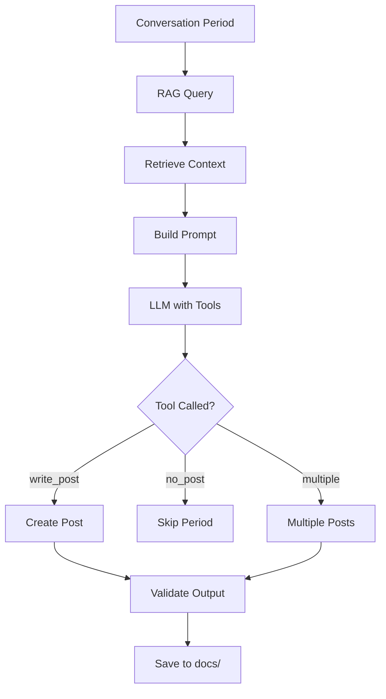
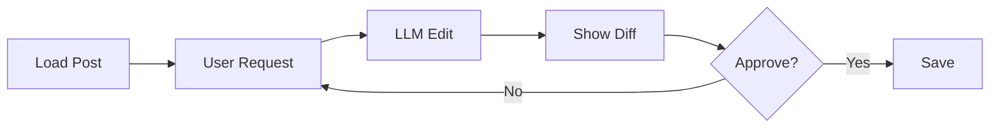

# Content Generation

Egregora uses Google's Gemini LLM with **tool calling** to generate blog posts. The AI has complete editorial freedom to decide what to write and how many posts to create.

## Philosophy: Trust the LLM

Instead of rigid heuristics, Egregora:

- Gives the LLM complete conversation context
- Lets it decide how many posts (0-N per period)
- Uses tool calling for structured output
- Keeps the pipeline simple

**Result**: Simpler code, better content.

## Architecture



## Writer Interface

```python
from egregora.generation import generate_posts

posts = generate_posts(
    df=messages,              # Conversation DataFrame
    client=gemini_client,     # Gemini API client
    rag_store=store,          # RAG retrieval
    period="weekly",          # Group by week
    model="models/gemini-2.0-flash-exp"
)
```

**Returns**:

```python
[
    {
        "title": "Weekly Recap: AI Safety Discussions",
        "date": "2025-01-15",
        "content": "...",
        "frontmatter": {
            "tags": ["ai-safety", "ethics"],
            "authors": ["a3f2b91c", "b7e4d23a"]
        }
    },
    ...
]
```

## Tool Calling

Egregora defines tools for the LLM:

### `write_post()`

```python
def write_post(
    title: str,
    content: str,
    tags: List[str],
    summary: str
) -> None:
    """Write a blog post from this conversation.

    Args:
        title: Post title
        content: Full markdown content
        tags: List of relevant tags
        summary: Brief summary (1-2 sentences)
    """
```

### `no_post()`

```python
def no_post(reason: str) -> None:
    """Skip this period without creating a post.

    Args:
        reason: Why no post was created
    """
```

**Example LLM response**:

```json
{
  "tool_call": "write_post",
  "args": {
    "title": "Weekly AI Safety Discussion",
    "content": "# Weekly AI Safety Discussion\n\nThis week...",
    "tags": ["ai-safety", "ethics"],
    "summary": "The group discussed AI alignment and safety protocols."
  }
}
```

## Prompt Engineering

### System Prompt

The writer receives:

```markdown
You are a blog writer analyzing group conversations.

Your task:
- Read the conversation from the period
- Decide if it contains enough substance for a post
- If yes, write an engaging blog post
- If no, call no_post() with a reason

Guidelines:
- Write in a narrative style
- Preserve the group's voice and humor
- Use quotes from conversations
- Add context where needed
- Use proper markdown formatting

Available context:
- Anonymized messages (UUIDs instead of names)
- Enriched URLs/media (if enabled)
- Similar past posts (via RAG)
```

### User Prompt

Includes the conversation:

```markdown
Period: 2025-01-08 to 2025-01-15

Conversation:
[2025-01-08 10:30] a3f2b91c: Has anyone read the new AI safety paper?
[2025-01-08 10:45] b7e4d23a: Yes! The alignment section is fascinating
...

Retrieved context (similar past posts):
1. "Previous AI Safety Discussion" (similarity: 0.89)
2. "Ethics in ML" (similarity: 0.76)

Generate a blog post if appropriate.
```

## Content Formatting

### Markdown Generation

Posts use standard markdown:

```markdown
# Title

Intro paragraph...

## Section 1

Content...

> "Quote from conversation" - Author UUID

## Section 2

More content...

[Link to reference](https://example.com)
```

### Frontmatter

Posts include YAML frontmatter:

```yaml
---
title: Weekly AI Safety Discussion
date: 2025-01-15
tags:
  - ai-safety
  - ethics
authors:
  - a3f2b91c
  - b7e4d23a
summary: The group discussed AI alignment and safety protocols.
---
```

### Code Blocks

The LLM can include code:

````markdown
```python
def align_model(model, values):
    return model.fine_tune(values)
```
````

## Quality Control

### Validation

All posts are validated:

```python
from egregora.generation.writer import validate_post

is_valid = validate_post(
    post=draft,
    schema=POST_SCHEMA
)
```

**Checks**:

- Valid YAML frontmatter
- Required fields present
- Markdown syntax correct
- No PII leaked
- Reasonable length (100-5000 words)

### Retries

If validation fails, the LLM retries:

```python
max_retries = 3
for attempt in range(max_retries):
    post = llm.generate(...)
    if validate_post(post):
        break
    # Provide feedback for retry
```

## Interactive Editing

Edit existing posts with AI:

```bash
egregora edit docs/posts/2025-01-15-my-post.md
```

**Editor workflow**:



**Example session**:

```
> What would you like to change?
Make it more concise

[LLM edits post]

> Review changes:
- Removed 3 paragraphs
- Condensed intro
- Merged similar sections

> Approve? (y/n)
y

[Post saved]
```

## Model Selection

### Recommended Models

| Model | Speed | Quality | Cost | Use Case |
|-------|-------|---------|------|----------|
| `gemini-2.0-flash-exp` | Fast | High | Low | General blogging |
| `gemini-1.5-pro` | Medium | Very High | Medium | Long-form content |
| `gemini-1.5-flash` | Very Fast | Medium | Very Low | Quick posts |

Configure via CLI:

```bash
egregora process export.zip --model=models/gemini-2.0-flash-exp
```

### Cost Estimation

Approximate costs (as of Jan 2025):

| Model | Input | Output | 1K messages |
|-------|-------|--------|-------------|
| Flash | $0.075/1M | $0.30/1M | ~$0.05 |
| Pro | $1.25/1M | $5.00/1M | ~$0.80 |

## Advanced Features

### Multi-Post Generation

LLM can create multiple posts per period:

```python
# Week with many topics → multiple posts
posts = generate_posts(df, client, rag_store)
# Returns [post1, post2, post3]
```

### Contextual Awareness

RAG provides context:

- **Consistency**: Use same terminology as past posts
- **Evolution**: Build on previous discussions
- **Callbacks**: Reference earlier conversations

### Author Attribution

Track which messages contributed:

```python
post = {
    "content": "...",
    "attribution": {
        "a3f2b91c": 15,  # 15 messages used
        "b7e4d23a": 8
    }
}
```

## Configuration

### Writing Style

Customize in `mkdocs.yml`:

```yaml
extra:
  egregora:
    style:
      tone: casual          # casual, formal, technical
      length: medium        # short, medium, long
      quotes: true          # include conversation quotes
      code_blocks: true     # include code examples
```

### Filtering

Control what gets written with the supported CLI options:

```bash
# Switch cadence
egregora process export.zip --period=week

# Restrict to a specific window
egregora process export.zip --from-date=2025-01-01 --to-date=2025-01-31

# Override timezone handling
egregora process export.zip --timezone="America/New_York"
```

## Troubleshooting

### "No posts generated"

**Possible causes**:

1. Not enough messages in period
2. LLM decided content wasn't substantial
3. PII detection blocked content

**Solutions**:

```bash
# Lower threshold
egregora process export.zip --min-messages=5

# Check logs
egregora process export.zip --verbose

# Review no_post() reasons
cat .egregora/logs/writer.log
```

### "Post quality is low"

**Solutions**:

1. Use a better model (e.g., `gemini-1.5-pro`)
2. Enable enrichment for more context
3. Build up RAG index with more posts
4. Use Elo ranking to identify best posts

```bash
egregora process export.zip \
  --model=models/gemini-1.5-pro \
  --enrich
```

### "Rate limiting errors"

Egregora automatically retries with backoff, but you can:

```bash
# Reduce batch sizes
egregora process export.zip --batch-size=5

# Add delays
egregora process export.zip --delay=1.0
```

## Next Steps

- [API Reference - Writer Module](../api/generation/writer.md) - Code documentation
- [API Reference - Editor Module](../api/generation/editor.md) - Interactive editing
- [Development Guide](../development/contributing.md) - Extend the writer
