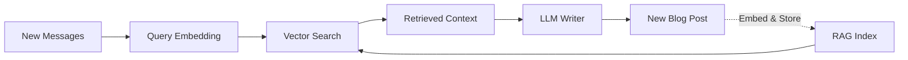
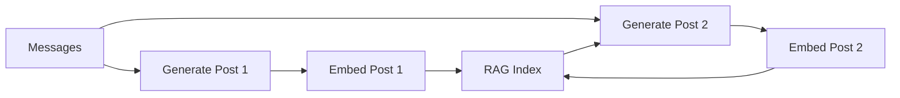

# RAG & Knowledge Base

Egregora uses **Retrieval-Augmented Generation (RAG)** to ensure blog posts are consistent and context-aware.

## What is RAG?

RAG combines retrieval and generation:

1. **Index**: Embed all messages and past posts
2. **Retrieve**: When generating new content, find similar past content
3. **Generate**: LLM uses retrieved context to write consistently



## Architecture

### Vector Store

Egregora uses **DuckDB with VSS extension** for vector search:

```python
from egregora.knowledge.rag import create_rag_store, embed_and_store

# Create store
store = create_rag_store(
    db_path="egregora.db",
    embedding_model="models/text-embedding-004",
    dimensions=768
)

# Embed and store messages
embed_and_store(
    df=messages,
    store=store,
    batch_size=100
)
```

**Schema**:

```sql
CREATE TABLE rag_chunks (
    id UUID PRIMARY KEY,
    content TEXT,
    embedding FLOAT[768],  -- Vector embedding
    metadata JSON,         -- {source, timestamp, author, ...}
    created_at TIMESTAMP
);
```

### Retrieval Modes

**ANN (Approximate Nearest Neighbor)**:

- Uses DuckDB VSS extension
- Fast, scalable
- Requires extension download

```bash
egregora process export.zip --retrieval-mode=ann
```

**Exact Search**:

- Pure SQL similarity (cosine distance)
- No extension required
- Slower for large datasets

```bash
egregora process export.zip --retrieval-mode=exact
```

## Chunking Strategy

Messages are chunked for better retrieval:

```python
from egregora.knowledge.rag import chunk_messages

chunks = chunk_messages(
    df=messages,
    chunk_size=512,      # tokens
    overlap=50,          # token overlap
    by_conversation=True # respect thread boundaries
)
```

**Strategies**:

1. **Fixed Size**: Split by token count
2. **Conversation-Aware**: Keep threads together
3. **Semantic**: Split by topic (future)

## Retrieval

When generating a blog post:

```python
from egregora.knowledge.rag import retrieve_context

context = retrieve_context(
    query="What did we discuss about AI safety?",
    store=store,
    top_k=10,           # Retrieve top 10 chunks
    nprobe=10           # ANN search quality
)
```

**Returns**:

```python
[
    {
        "content": "...",
        "score": 0.92,
        "metadata": {"timestamp": "...", "author": "..."}
    },
    ...
]
```

## Embeddings

### Models

Egregora supports Google's embedding models:

| Model | Dimensions | Performance | Use Case |
|-------|-----------|-------------|----------|
| `text-embedding-004` | 768 | Fast | Recommended |
| `text-embedding-005` | 768 | Faster | Latest |

Configure via CLI:

```bash
egregora process export.zip \
  --embedding-model=models/text-embedding-004 \
  --embedding-dimensions=768
```

### Batching

Embeddings are batched for efficiency:

```python
from egregora.knowledge.rag import embed_batch

embeddings = embed_batch(
    texts=chunks,
    model=gemini_client,
    batch_size=100
)
```

## Annotations

Beyond embeddings, Egregora stores conversation metadata:

```python
from egregora.knowledge import annotate_conversations

annotations = annotate_conversations(df)
```

**Stored data**:

- **Threading**: Which messages are replies
- **Topics**: Detected conversation topics
- **Sentiment**: Overall tone
- **Key participants**: Most active authors

**Schema**:

```sql
CREATE TABLE annotations (
    conversation_id UUID PRIMARY KEY,
    topics TEXT[],
    sentiment VARCHAR,
    key_participants TEXT[],
    thread_structure JSON,
    created_at TIMESTAMP
);
```

## Feedback Loop

RAG creates a feedback loop:



**Benefits**:

- Posts reference past posts
- Consistent terminology
- Evolving narrative
- Self-improvement

## Performance

### VSS Extension

DuckDB's VSS extension enables fast ANN search:

```bash
# Auto-installed on first run
egregora process export.zip

# Or install manually:
python -c "
import duckdb
conn = duckdb.connect()
conn.execute('INSTALL vss')
conn.execute('LOAD vss')
"
```

**Benchmarks** (1M chunks):

| Mode | Query Time | Accuracy |
|------|-----------|----------|
| Exact | ~500ms | 100% |
| ANN (nprobe=10) | ~50ms | ~95% |
| ANN (nprobe=100) | ~150ms | ~99% |

### Caching

Embeddings are cached to avoid recomputation:

```python
from egregora.utils.cache import get_cache

cache = get_cache(".egregora/cache/")

# Cached by content hash
embedding = cache.get("text_hash")
if not embedding:
    embedding = embed_text(text)
    cache.set("text_hash", embedding)
```

## Quality Control

### Elo Ranking

Egregora can rank posts using Elo comparisons:

```bash
egregora rank --site-dir=. --comparisons=50
```

**Process**:

1. Present two random posts
2. LLM judges which is better
3. Update Elo ratings
4. Repeat N times

**Schema**:

```sql
CREATE TABLE elo_ratings (
    post_id UUID PRIMARY KEY,
    rating INT DEFAULT 1500,
    comparisons INT DEFAULT 0,
    wins INT DEFAULT 0,
    losses INT DEFAULT 0,
    created_at TIMESTAMP
);
```

### Post Deduplication

Prevent similar posts:

```python
from egregora.knowledge.rag import check_similarity

is_duplicate = check_similarity(
    new_post=draft,
    existing_posts=rag_store,
    threshold=0.9  # 90% similarity
)
```

## Configuration

### Tuning RAG

```bash
# High-quality retrieval (slower)
egregora process export.zip \
  --retrieval-mode=ann \
  --retrieval-nprobe=100 \
  --top-k=20

# Fast retrieval (less accurate)
egregora process export.zip \
  --retrieval-mode=ann \
  --retrieval-nprobe=5 \
  --top-k=5

# No VSS extension (exact mode)
egregora process export.zip \
  --retrieval-mode=exact
```

### Storage Size

Approximate storage requirements:

| Data | Size per 1K messages |
|------|---------------------|
| Text | ~500 KB |
| Embeddings | ~3 MB |
| Annotations | ~100 KB |
| Cache | ~10 MB |

**Total**: ~14 MB per 1K messages.

## Next Steps

- [Content Generation](generation.md) - How the LLM writer works
- [API Reference - RAG Module](../api/knowledge/rag.md) - Code documentation
- [API Reference - Annotations](../api/knowledge/annotations.md) - Metadata details
