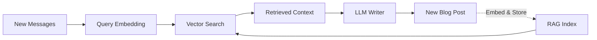
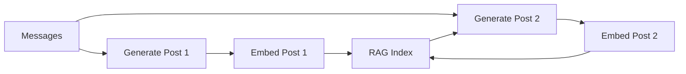

# RAG & Knowledge Base

Egregora uses **Retrieval-Augmented Generation (RAG)** to ensure blog posts are consistent and context-aware.

## What is RAG?

RAG combines retrieval and generation:

1. **Index**: Embed all messages and past posts
2. **Retrieve**: When generating new content, find similar past content
3. **Generate**: LLM uses retrieved context to write consistently



## Architecture

### Vector Store

Egregora uses **DuckDB with the VSS extension** for vector search. The
high-level helpers live in `egregora.knowledge.rag`:

```python
import os
from pathlib import Path

from google import genai

from egregora.config import ModelConfig, load_site_config
from egregora.knowledge.rag import VectorStore, index_post, query_similar_posts
from egregora.utils.batch import GeminiBatchClient

# Load model preferences from mkdocs.yml (used by the CLI as well)
site_config = load_site_config(Path("output"))
model_config = ModelConfig(site_config=site_config)
embedding_model = model_config.get_model("embedding")
embedding_dims = model_config.get_embedding_output_dimensionality()

# Batch client for embeddings
client = genai.Client(api_key=os.environ["GOOGLE_API_KEY"])
batch_client = GeminiBatchClient(client, default_model=embedding_model)

# Open (or create) the vector store managed by the CLI
store = VectorStore(Path("output/rag/chunks.parquet"))

# Index a generated post
indexed = index_post(
    Path("output/posts/2025-01-01-new-year-retro.md"),
    batch_client,
    store,
    embedding_model=embedding_model,
    output_dimensionality=embedding_dims,
)

# Later, retrieve similar posts for a conversation table produced by the pipeline
similar = query_similar_posts(
    table=period_table,
    batch_client=batch_client,
    store=store,
    embedding_model=embedding_model,
    output_dimensionality=embedding_dims,
)
```

**Schema**:

```sql
CREATE TABLE rag_chunks (
    id UUID PRIMARY KEY,
    content TEXT,
    embedding FLOAT[768],  -- Vector embedding
    metadata JSON,         -- {source, timestamp, author, ...}
    created_at TIMESTAMP
);
```

### Retrieval Modes

**ANN (Approximate Nearest Neighbor)**:

- Uses DuckDB VSS extension
- Fast, scalable
- Requires extension download

```bash
egregora process export.zip --retrieval-mode=ann
```

**Exact Search**:

- Pure SQL similarity (cosine distance)
- No extension required
- Slower for large datasets

```bash
egregora process export.zip --retrieval-mode=exact
```

## Chunking Strategy

Messages are chunked for better retrieval:

```python
from pathlib import Path

from egregora.knowledge.rag.chunker import chunk_document

chunks = chunk_document(
    Path("output/posts/2025-01-01-new-year-retro.md"),
    max_tokens=1800,
)
```

**Strategies**:

1. **Fixed Size**: Split by token count
2. **Conversation-Aware**: Keep threads together
3. **Semantic**: Split by topic (future)

## Retrieval

When generating a blog post:

```python
from egregora.knowledge.rag import query_similar_posts

results = query_similar_posts(
    table=period_table,
    batch_client=batch_client,
    store=store,
    embedding_model=embedding_model,
    top_k=10,
    retrieval_mode="ann",
    retrieval_nprobe=10,
    output_dimensionality=embedding_dims,
)

context = results.execute().to_pylist()
```

**Returns**:

```python
[
    {
        "content": "...",
        "score": 0.92,
        "metadata": {"timestamp": "...", "author": "..."}
    },
    ...
]
```

## Embeddings

### Models

Egregora relies on Google's Gemini embedding models. The active model and
vector dimensionality are resolved by `ModelConfig`, using the same
configuration hierarchy as the CLI:

1. `--model` flag on `egregora process`
2. `extra.egregora.models.embedding` inside `mkdocs.yml`
3. Global `extra.egregora.model` override
4. Built-in defaults (`models/gemini-embedding-001`, 3072 dimensions)

To pin a specific embedding model or dimensionality, update `mkdocs.yml`:

```yaml
extra:
  egregora:
    models:
      embedding: models/gemini-embedding-001
    embedding:
      output_dimensionality: 3072
```

### Batching

Embeddings are batched for efficiency:

```python
from egregora.knowledge.rag.embedder import embed_chunks

embeddings = embed_chunks(
    chunks,
    batch_client,
    model=embedding_model,
    batch_size=100,
    output_dimensionality=embedding_dims,
)
```

## Annotations

Beyond embeddings, Egregora stores conversation metadata:

```python
from pathlib import Path

from egregora.database.duckdb_manager import DuckDBStorageManager
from egregora.knowledge import AnnotationStore

storage = DuckDBStorageManager(db_path=Path("output/annotations.duckdb"))
annotation_store = AnnotationStore(storage)
annotation_store.save_annotation(
    msg_id="msg-2025-01-01-0001",
    commentary="Follow up on the launch checklist",
)
annotations = annotation_store.list_annotations_for_message("msg-2025-01-01-0001")
```

**Stored data**:

- **Threading**: Which messages are replies
- **Topics**: Detected conversation topics
- **Sentiment**: Overall tone
- **Key participants**: Most active authors

**Schema**:

```sql
CREATE TABLE annotations (
    conversation_id UUID PRIMARY KEY,
    topics TEXT[],
    sentiment VARCHAR,
    key_participants TEXT[],
    thread_structure JSON,
    created_at TIMESTAMP
);
```

## Feedback Loop

RAG creates a feedback loop:



**Benefits**:

- Posts reference past posts
- Consistent terminology
- Evolving narrative
- Self-improvement

## Performance

### VSS Extension

DuckDB's VSS extension enables fast ANN search:

```bash
# Auto-installed on first run
egregora process export.zip

# Or install manually:
python -c "
import duckdb
conn = duckdb.connect()
conn.execute('INSTALL vss')
conn.execute('LOAD vss')
"
```

**Benchmarks** (1M chunks):

| Mode | Query Time | Accuracy |
|------|-----------|----------|
| Exact | ~500ms | 100% |
| ANN (nprobe=10) | ~50ms | ~95% |
| ANN (nprobe=100) | ~150ms | ~99% |

### Caching

Embeddings are cached to avoid recomputation:

```python
from egregora.utils.cache import get_cache

cache = get_cache(".egregora/cache/")

# Cached by content hash
embedding = cache.get("text_hash")
if not embedding:
    embedding = embed_text(text)
    cache.set("text_hash", embedding)
```

## Quality Control

### Elo Ranking

Egregora can rank posts using Elo comparisons:

```bash
egregora rank --site-dir=. --comparisons=50
```

**Process**:

1. Present two random posts
2. LLM judges which is better
3. Update Elo ratings
4. Repeat N times

**Schema**:

```sql
CREATE TABLE elo_ratings (
    post_id UUID PRIMARY KEY,
    rating INT DEFAULT 1500,
    comparisons INT DEFAULT 0,
    wins INT DEFAULT 0,
    losses INT DEFAULT 0,
    created_at TIMESTAMP
);
```

### Post Deduplication

Prevent similar posts:

```python
from egregora.knowledge.rag import check_similarity

is_duplicate = check_similarity(
    new_post=draft,
    existing_posts=rag_store,
    threshold=0.9  # 90% similarity
)
```

## Configuration

### Tuning RAG

```bash
# High-quality retrieval (slower)
egregora process export.zip \
  --retrieval-mode=ann \
  --retrieval-nprobe=100 \
  --top-k=20

# Fast retrieval (less accurate)
egregora process export.zip \
  --retrieval-mode=ann \
  --retrieval-nprobe=5 \
  --top-k=5

# No VSS extension (exact mode)
egregora process export.zip \
  --retrieval-mode=exact
```

### Storage Size

Approximate storage requirements:

| Data | Size per 1K messages |
|------|---------------------|
| Text | ~500 KB |
| Embeddings | ~3 MB |
| Annotations | ~100 KB |
| Cache | ~10 MB |

**Total**: ~14 MB per 1K messages.

## Next Steps

- [Content Generation](generation.md) - How the LLM writer works
- [API Reference - RAG Module](../api/knowledge/rag.md) - Code documentation
- [API Reference - Annotations](../api/knowledge/annotations.md) - Metadata details
