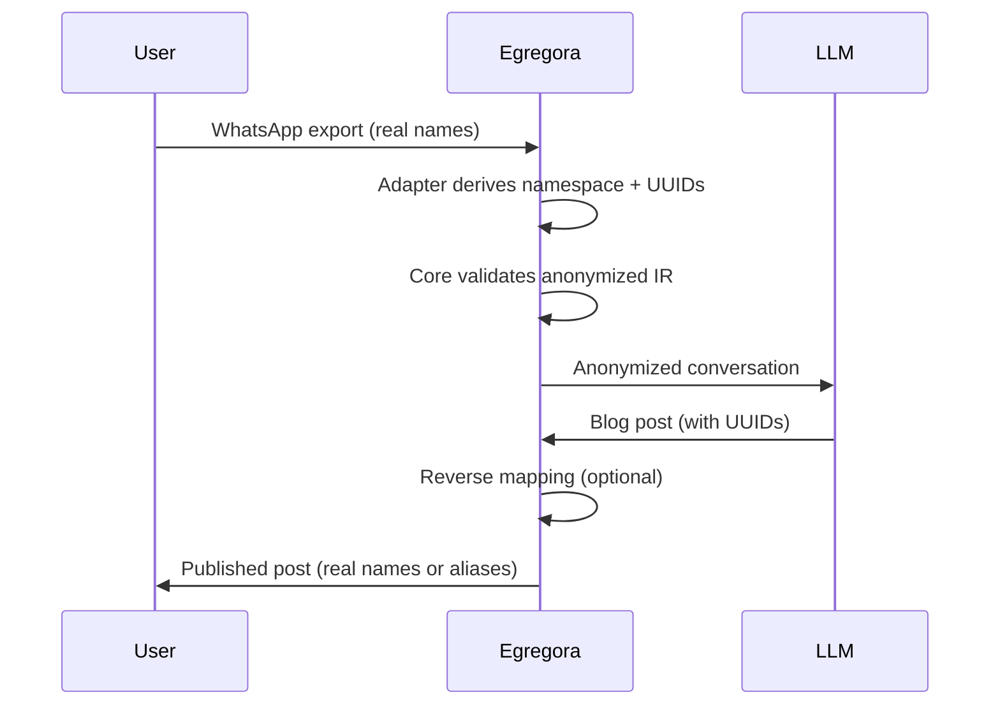

# Privacy & Anonymization

Privacy is core to Egregora's design. Real names **never** reach the LLM - all conversations are automatically anonymized before processing.

## How Anonymization Works

### Deterministic UUIDs

Input adapters anonymize author names **before** the data enters the core
pipeline. Each adapter chooses the namespace that best matches its privacy
requirements and calls `deterministic_author_uuid()` while constructing the IR
table:

```python
import uuid

from egregora.privacy.constants import NAMESPACE_AUTHOR, deterministic_author_uuid

tenant_namespace = uuid.uuid5(NAMESPACE_AUTHOR, "tenant:family-chat:source:whatsapp")
author_uuid = deterministic_author_uuid("Alice", namespace=tenant_namespace)
```

**Key properties**:

- **Deterministic**: Same namespace + author → same UUID
- **Scoped anonymity**: Opt into tenant-specific namespaces when isolation is needed
- **Local control**: Namespace selection lives inside the adapter, so projects can
  decide how aggressively to separate identities

### Process Flow



## PII Detection

Egregora scans for personally identifiable information:

```python
from egregora.privacy import detect_pii

pii_results = detect_pii(df_anon)

# Detects:
# - Phone numbers (all formats)
# - Email addresses
# - Physical addresses
# - Credit card numbers
# - Social security numbers
```

**Patterns detected**:

| Type | Pattern | Example |
|------|---------|---------|
| Phone | `+1-555-123-4567` | US, international formats |
| Email | `user@example.com` | All standard emails |
| Address | `123 Main St, City` | Street addresses |
| Credit Card | `4111-1111-1111-1111` | Major card formats |
| SSN | `123-45-6789` | US social security |

**Actions**:

- **Warn**: Log PII detection
- **Redact**: Replace with `[REDACTED]`
- **Skip**: Exclude message from processing

## User Controls

Users can manage their privacy directly in WhatsApp by sending commands:

### Set Alias

Use a display name instead of UUID:

```
/egregora set alias "Casey"
```

Result: Posts show "Casey" instead of `a3f2b91c`.

### Set Bio

Add profile information:

```
/egregora set bio "AI researcher interested in privacy-preserving tech"
```

This bio is used when generating author profiles.

### Opt-Out

Exclude yourself from future posts:

```
/egregora opt-out
```

Your messages will still be visible in the chat, but won't be included in generated content.

### Opt-In

Re-enable participation:

```
/egregora opt-in
```

## Privacy Levels

Configure privacy strictness:

```bash
# Maximum privacy (no enrichment, exact UUIDs)
egregora process export.zip \
  --anonymize \
  --detect-pii \
  --no-enrich \
  --no-profile

# Balanced (anonymous but enriched context)
egregora process export.zip \
  --anonymize \
  --enrich

# Minimal anonymization (use aliases, enrich all)
egregora process export.zip \
  --no-anonymize \
  --enrich \
  --profile
```

## Data Storage

### Local Storage

All data is stored locally:

```
.egregora/
├── egregora.db           # DuckDB database
│   ├── rag_chunks        # Embedded messages (anonymized)
│   ├── annotations       # Metadata
│   └── elo_ratings       # Quality scores
├── cache/                # LLM responses (anonymized)
└── mapping.json          # UUID → real name (local only)
```

**Important**: Never commit `.egregora/mapping.json` to public repositories!

### What Gets Sent to LLMs?

**Sent**:

- Anonymized messages (UUIDs instead of names)
- Timestamps (for context)
- Enriched descriptions (if enabled)
- Previous blog posts (for RAG)

**Never sent**:

- Real names
- Phone numbers (if detected)
- Email addresses (if detected)
- The UUID mapping

## Best Practices

### 1. Export Without Media

WhatsApp offers two export options:

- ✅ **Without media** (recommended): Text only, no images/videos
- ❌ **With media**: Includes photos, videos, voice messages

For privacy, always export **without media**. Egregora can optionally enrich URLs using LLMs instead.

### 2. Review Before Publishing

Preview generated posts before making your site public:

```bash
mkdocs serve  # Local preview only
```

Review that:

- Names are properly anonymized
- No PII leaked
- Content is appropriate

### 3. Configure Git Ignore

Ensure your `.gitignore` includes:

```gitignore
.egregora/
*.db
*mapping.json
```

### 4. Secure API Keys

Never commit API keys:

```bash
export GOOGLE_API_KEY="your-key"  # Environment variable
```

Or use a `.env` file (and add to `.gitignore`):

```bash
GOOGLE_API_KEY=your-key
```

## Privacy FAQ

### Can the LLM figure out real names from context?

Possible but unlikely. Egregora only sends message content, not:

- Contact lists
- Profile pictures
- Phone numbers
- Email addresses

However, if someone mentions "my name is Alice" in a message, that information is included. For maximum privacy, review exports before processing.

### What about message content privacy?

Egregora sends message content to Google's Gemini API. If your conversations contain sensitive information:

1. Use [Google's enterprise offerings](https://cloud.google.com/vertex-ai) with data residency controls
2. Or run a local LLM (requires code modifications)
3. Or carefully review and redact sensitive messages before export

### Is my data used to train Google's models?

Per Google's [Gemini API Terms](https://ai.google.dev/gemini-api/terms):

> Your data is not used to train Google's models.

However, review Google's current policies to ensure compliance with your requirements.

### Can I use a local LLM?

Yes, but requires code changes. Egregora uses Google's Gemini client, but you can swap in:

- [Ollama](https://ollama.ai/) for local inference
- [vLLM](https://vllm.ai/) for self-hosted serving
- [LiteLLM](https://litellm.ai/) for unified API

See [Development Guide](../development/contributing.md) for details.

## Next Steps

- [RAG & Knowledge Base](knowledge.md) - How retrieval works
- [Content Generation](generation.md) - LLM writer internals
- [API Reference - Privacy Module](../api/privacy/anonymizer.md) - Code documentation
