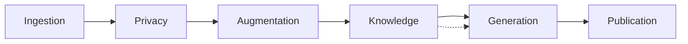

# Egregora Documentation

**Emergent Group Reflection Engine Generating Organized Relevant Articles**

Welcome to the Egregora documentation! Transform your WhatsApp group chats into intelligent, privacy-first blogs where collective conversations emerge as beautifully written articles.

## Features

- 🧠 **Emergent Intelligence**: Collective conversations synthesize into coherent articles
- 👥 **Group Reflection**: Your community's unique voice and insights are preserved
- 🛡️ **Privacy-First**: Automatic anonymization - real names never reach the AI
- ⚙️ **Fully Automated**: Stateless pipeline powered by Ibis, DuckDB, and Gemini
- 📊 **Smart Context**: RAG retrieval ensures consistent, context-aware writing

## Quick Links

-   :material-clock-fast:{ .lg .middle } __Quick Start__

    ---

    Install Egregora and generate your first blog post in minutes

    [:octicons-arrow-right-24: Get Started](getting-started/quickstart.md)

-   :material-book-open-variant:{ .lg .middle } __User Guide__

    ---

    Learn about the architecture, privacy features, and how to customize your blog

    [:octicons-arrow-right-24: User Guide](guide/architecture.md)

-   :material-code-braces:{ .lg .middle } __API Reference__

    ---

    Complete API documentation for all modules and functions

    [:octicons-arrow-right-24: API Reference](api/index.md)

-   :material-hammer-wrench:{ .lg .middle } __Development__

    ---

    Contributing guidelines and development setup instructions

    [:octicons-arrow-right-24: Development](development/contributing.md)

-   :material-package-down:{ .lg .middle } __Repomix Bundles__

    ---

    Download consolidated markdown bundles generated from the repository:

    - [Everything bundle](bundles/all.bundle.md){: download="egregora-all.md" data-bundle-name="all" }
    - [Full code bundle](bundles/code.bundle.md){: download="egregora-code.md" data-bundle-name="code" }
    - [Tests bundle](bundles/tests.bundle.md){: download="egregora-tests.md" data-bundle-name="tests" }
    - [Documentation bundle](bundles/docs.bundle.md){: download="egregora-docs.md" data-bundle-name="docs" }

## Architecture Overview

Egregora uses a staged pipeline architecture that processes conversations through distinct phases:

1. **Ingestion**: Parse WhatsApp exports into structured data
2. **Privacy**: Anonymize names and detect PII
3. **Augmentation**: Enrich context with LLM-powered descriptions
4. **Knowledge**: Build RAG index and annotation metadata
5. **Generation**: LLM generates blog posts with tool calling
6. **Publication**: Create MkDocs site with templates

## Stack

- **[Ibis](https://ibis-project.org/)**: DataFrame abstraction for data transformations
- **[DuckDB](https://duckdb.org/)**: Fast analytical database with vector search
- **[Gemini](https://ai.google.dev/)**: Google's LLM for content generation
- **[MkDocs](https://www.mkdocs.org/)**: Static site generation
- **[uv](https://github.com/astral-sh/uv)**: Modern Python package management

## Philosophy

Egregora follows the principle of **"trusting the LLM"** - instead of micromanaging with complex heuristics, we:

- Give the AI complete conversation context
- Let it make editorial decisions (how many posts, what to write)
- Use tool calling for structured output
- Keep the pipeline simple and composable

This results in simpler code and often better outcomes. The LLM knows what makes a good article - our job is to give it the right context.
