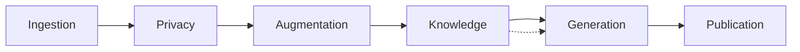

# Egregora Documentation

**Emergent Group Reflection Engine Generating Organized Relevant Articles**

  

    
Collective consciousness, rendered.

    <h1>Turn messy group chats into publishable narratives.</h1>
    
Egregora ingests WhatsApp exports, scrubs PII, enriches the context, and generates editorial-quality posts that feel like your community wrote them together.

    

      [Get started](getting-started/quickstart.md){ .md-button .md-button--primary }
      [See the architecture](guide/architecture.md){ .md-button }
    

    

      

        :material-shield-lock-outline: **Privacy-first** — aliases, PII scrubbing, and opt-out tooling baked in.
      

      

        :material-rocket-launch: **Fully automated** — ingestion → enrichment → publication with sensible defaults.
      

      

        :material-chart-timeline-variant: **Context-aware** — RAG retrieval keeps posts consistent across time.
      

    

  

  

    
Pipeline at a glance

    <ul class="hero__steps">
      <li>1 Upload your WhatsApp export</li>
      <li>2 Privacy layer strips identifiers</li>
      <li>3 Enrichment builds rich context</li>
      <li>4 RAG indexing keeps facts aligned</li>
      <li>5 Writer assembles polished posts</li>
    </ul>
    
Built with Ibis, DuckDB, and Gemini — designed for reproducible, stateless runs.

  

## Why Egregora

-   :material-brain:{ .lg .middle } __Emergent Intelligence__

    ---

    Collective conversations are synthesized into coherent articles with minimal prompts or heuristics.

-   :material-account-group:{ .lg .middle } __Group Reflection__

    ---

    The system preserves your community's unique voice with aliasing and lineage-aware context.

-   :material-lock-check:{ .lg .middle } __Privacy-First__

    ---

    Names never reach the AI. PII detection, opt-out workflows, and aliases are enforced by default.

-   :material-robot-happy-outline:{ .lg .middle } __Fully Automated__

    ---

    Stateless pipeline powered by Ibis, DuckDB, and Gemini — no manual babysitting.

-   :material-chart-box-outline:{ .lg .middle } __Smart Context__

    ---

    RAG retrieval and annotations keep posts consistent, factual, and aligned across time.

-   :material-rocket-launch-outline:{ .lg .middle } __Production Ready__

    ---

    MkDocs output with custom components, instant navigation, and search that works offline.

## Quick Links

-   :material-clock-fast:{ .lg .middle } __Quick Start__

    ---

    Install Egregora and generate your first blog post in minutes.

    [:octicons-arrow-right-24: Get Started](getting-started/quickstart.md)

-   :material-book-open-variant:{ .lg .middle } __User Guide__

    ---

    Learn about the architecture, privacy features, and how to customize your blog.

    [:octicons-arrow-right-24: User Guide](guide/architecture.md)

-   :material-code-braces:{ .lg .middle } __API Reference__

    ---

    Complete API documentation for all modules and functions.

    [:octicons-arrow-right-24: API Reference](api/index.md)

-   :material-hammer-wrench:{ .lg .middle } __Development__

    ---

    Contributing guidelines and development setup instructions.

    [:octicons-arrow-right-24: Development](development/contributing.md)

## Architecture Overview

Egregora uses a staged pipeline architecture that processes conversations through distinct phases:

1. **Ingestion**: Parse WhatsApp exports into structured data
2. **Privacy**: Anonymize names and detect PII
3. **Augmentation**: Enrich context with LLM-powered descriptions
4. **Knowledge**: Build RAG index and annotation metadata
5. **Generation**: LLM generates blog posts with tool calling
6. **Publication**: Create MkDocs site with templates

## Stack

- **[Ibis](https://ibis-project.org/)**: DataFrame abstraction for data transformations
- **[DuckDB](https://duckdb.org/)**: Fast analytical database with vector search
- **[Gemini](https://ai.google.dev/)**: Google's LLM for content generation
- **[MkDocs](https://www.mkdocs.org/)**: Static site generation
- **[uv](https://github.com/astral-sh/uv)**: Modern Python package management

## Philosophy

Egregora follows the principle of **"trusting the LLM"** - instead of micromanaging with complex heuristics, we:

- Give the AI complete conversation context
- Let it make editorial decisions (how many posts, what to write)
- Use tool calling for structured output
- Keep the pipeline simple and composable

This results in simpler code and often better outcomes. The LLM knows what makes a good article - our job is to give it the right context.
