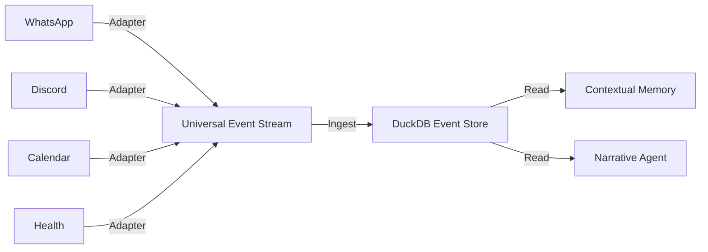

# RFC 034: Omni-Ingest Architecture (Moonshot)

## 🔭 Vision
**Title:** Omni-Ingest Architecture: The Universal Life Narrator
**Author:** Visionary (Jules)
**Status:** Draft
**Type:** Moonshot (Strategic Shift)

---

## 1. Problem Statement
**The Assumption:** Egregora is currently architected as a "WhatsApp Blog Generator". The entire pipeline is biased towards the structure, metadata, and quirks of WhatsApp exports (ZIP files, specific timestamp formats, "System Messages").

**The Friction:**
- Users with data in Discord, Slack, Telegram, or iMessage are second-class citizens.
- Adding a new source requires writing a complex Python `InputAdapter` and merging it into the core codebase.
- The system cannot ingest "non-chat" data (e.g., Calendar events, Location history, Health metrics) which are critical for a full "Life Narrative".

**The Opportunity:** By decoupling the ingestion layer from specific providers, Egregora can evolve from a "Chat Archive" to a "Digital Biographer" capable of weaving stories from any digital exhaust.

---

## 2. Proposed Solution: Omni-Ingest Architecture

We propose a fundamental architectural shift: **Egregora should not know about WhatsApp.**

Instead, Egregora should only know about **Life Events**. We will introduce a **Universal Ingestion Protocol (UIP)**—a standardized Intermediate Representation (IR) for any discrete event in a user's life.

### The Architecture



### Key Components

1.  **Universal Event Schema (UES)**:
    A flexible, typed schema that can represent a chat message, a calendar appointment, or a workout.
    ```python
    class LifeEvent(BaseModel):
        id: UUID
        timestamp: datetime
        actor_id: str  # "author"
        actor_name: str
        type: EventType  # MESSAGE, LOCATION, MEDIA, SYSTEM, HEALTH
        content: str     # Text body or JSON payload
        metadata: Dict[str, Any]
        context: Dict[str, Any]  # Thread ID, Channel, etc.
    ```

2.  **Plugin System**:
    Adapters are no longer hardcoded in `src/egregora/input_adapters`. They are standalone plugins (pip packages or simple scripts) that emit UES objects.

3.  **Semantic Unification Layer**:
    A new pipeline stage that resolves identities across sources (e.g., "User123" on Discord = "John Doe" on WhatsApp).

---

## 3. Value Proposition

| Beneficiary | Before | After |
|-------------|--------|-------|
| **User** | Can only preserve WhatsApp memories. | Can preserve their *entire digital life* (Discord gaming, Slack work, Strava runs). |
| **Developer** | Must learn Egregora internals to add a source. | Can write a simple script: `my_data -> JSON -> Egregora`. |
| **Product** | Niche "WhatsApp Tool". | The "Operating System for Memory". |

---

## 4. BDD Acceptance Criteria

```gherkin
Feature: Omni-Ingest Plugin System
  As a user with diverse digital data
  I want to ingest data from arbitrary sources via plugins
  So that my narrative reflects my whole life, not just one app

  Scenario: Ingesting a Multi-Source Stream
    Given the Omni-Ingest pipeline is active
    And I have a plugin for "Discord" and a plugin for "Google Calendar"
    When I run "egregora ingest --source discord --source calendar"
    Then all events are normalized into the Universal Event Schema
    And the Writer Agent generates a story weaving chat context with calendar events
    # Example: "On Tuesday, after your meeting with Client X (Calendar), you told Bob..."

  Scenario: Unifying Identities
    Given I am "jules#1234" on Discord and "Jules" on WhatsApp
    When I configure the Identity Resolver to map them together
    Then the resulting narrative treats them as the same actor
    And the Author Profile reflects traits from both platforms

  Scenario: Ingesting Non-Text Events
    Given a plugin emitting "Heart Rate" events
    When the Writer Agent encounters a "High Heart Rate" event during a "Gaming Session"
    Then the narrative mentions the intensity of the moment
    # Example: "The game was intense—your heart rate spiked to 120bpm as you won the match."
```

---

## 5. Risks & Mitigation

- **Risk:** Complexity of the Schema.
  - *Mitigation:* Start with `SimpleEvent` (chat-like) and extend later.
- **Risk:** LLM Confusion.
  - *Mitigation:* The Writer Agent needs updated prompts to understand "heterogeneous context".
- **Risk:** Performance.
  - *Mitigation:* DuckDB is already chosen for its ability to handle analytical workloads on millions of rows.

## 6. Implementation Hints
- The existing `InputAdapter` interface returning an Ibis Table is a good start, but the Table schema is currently hardcoded to "messages".
- We need to widen the Table schema to include `event_type` and `metadata` (JSON column).
