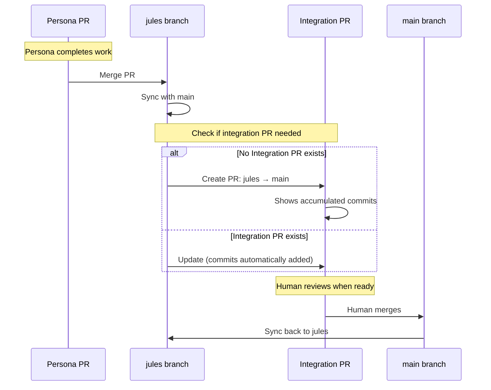

# Feature: Auto-criação de Integration PR (jules → main)

**Data**: 2026-01-10
**Branch**: `claude/evaluate-jules-sprints-SqvSG`
**Commit**: `179c9b8`

---

## 🎯 Problema

A branch `jules` acumula trabalho de múltiplas personas, mas **não havia PR automática para `main`**.

**Resultado**:
- Humano não tinha visibilidade fácil do trabalho acumulado
- Não havia ponto claro de revisão e integração
- Necessário criar PR manualmente

---

## ✅ Solução Implementada

### Nova Função: `PRManager.ensure_integration_pr_exists()`

**Localização**: `.jules/jules/scheduler_managers.py:389`

**O que faz**:
1. **Verifica** se já existe PR aberta: `jules` → `main`
2. **Se não existe**:
   - Verifica se `jules` está ahead de `main`
   - Se sim: **Cria PR automaticamente**
   - Se não: Não faz nada (branches em sync)
3. **Se existe**: Apenas informa o número da PR

**Quando é chamada**:
- Após merge bem-sucedido de PR de persona
- Após sync com `main`
- Em dois lugares em `scheduler_v2.py`:
  - Linha 229: Após merge normal
  - Linha 269: Após detectar PR já merged

---

## 📋 Formato da PR Criada

### Título
```
🤖 Integration: jules → main
```

### Corpo
```markdown
## Automated Integration PR

This PR contains accumulated work from the Jules autonomous development cycle.

**Stats**:
- Commits: X
- Source: `jules`
- Target: `main`

**Review Instructions**:
1. Review the accumulated changes from persona iterations
2. Verify all CI checks pass
3. Merge when ready to integrate into main branch

**Note**: This PR is automatically maintained by the Jules scheduler.
New commits will be added as personas complete their work.
```

---

## 🔄 Fluxo de Integração



---

## 💡 Comportamento Detalhado

### Cenário 1: Primeira execução
```
jules is 5 commits ahead of main
↓
No PR exists
↓
📝 Creating integration PR: jules → main (5 commits)
✅ Created integration PR #1234
```

### Cenário 2: PR já existe
```
jules is 8 commits ahead of main
↓
PR #1234 already exists
↓
ℹ️  Integration PR #1234 already exists: jules → main
(PR automaticamente mostra 8 commits agora)
```

### Cenário 3: Branches em sync
```
jules is 0 commits ahead of main
↓
ℹ️  Branch 'jules' is in sync with main. No PR needed.
(Nenhuma ação)
```

### Cenário 4: Após humano mergear
```
Human merges Integration PR #1234
↓
main absorbed jules commits
↓
jules syncs with main
↓
jules is 0 commits ahead
↓
ℹ️  Branch 'jules' is in sync with main. No PR needed.
```

---

## 🧪 Teste

### Comando
```bash
PYTHONPATH=.jules uv run python -m jules.cli schedule tick --dry-run
```

### Saída esperada
```
======================================================================
CYCLE MODE: Sequential persona execution
======================================================================
...
✅ PR #{number} is green! Merging into 'jules'...
📥 Syncing 'jules' with main...
✅ Synced 'jules' with main

📋 Ensuring integration PR exists...
ℹ️  Integration PR #X already exists: jules → main
(ou)
📝 Creating integration PR: jules → main (Y commits)
✅ Created integration PR #X: https://github.com/.../pull/X
```

---

## 🔍 Detalhes Técnicos

### Implementação

```python
def ensure_integration_pr_exists(self, repo_info: dict[str, Any]) -> int | None:
    """Ensure a PR exists from jules branch to main for human review."""

    # 1. Check existing PRs
    result = subprocess.run(
        ["gh", "pr", "list", "--head", self.jules_branch, "--base", "main",
         "--json", "number"],
        capture_output=True, text=True, check=True,
    )
    prs = json.loads(result.stdout) if result.stdout.strip() else []

    if prs:
        # PR already exists
        return prs[0]["number"]

    # 2. Check if ahead of main
    ahead_result = subprocess.run(
        ["git", "rev-list", "--count", f"origin/main..origin/{self.jules_branch}"],
        capture_output=True, text=True, check=True,
    )
    commits_ahead = int(ahead_result.stdout.strip())

    if commits_ahead == 0:
        # In sync, no PR needed
        return None

    # 3. Create PR
    subprocess.run(
        ["gh", "pr", "create",
         "--head", self.jules_branch,
         "--base", "main",
         "--title", pr_title,
         "--body", pr_body],
        capture_output=True, text=True, check=True,
    )
```

### Error Handling

**Não-fatal**: Se falhar, apenas loga warning e continua.

```python
except subprocess.CalledProcessError as e:
    print(f"⚠️  Failed to ensure integration PR: {stderr}", file=sys.stderr)
    return None
```

**Razão**: Criação de PR é nice-to-have, não deve bloquear o ciclo.

---

## 📊 Benefícios

| Benefício | Descrição |
|-----------|-----------|
| **Visibilidade** | Humano sempre sabe o estado de `jules` vs `main` |
| **Revisão fácil** | Single PR para revisar todo trabalho acumulado |
| **Automático** | Zero intervenção manual necessária |
| **Informativo** | PR body mostra quantos commits pendentes |
| **CI integrado** | PR roda CI checks antes de humano mergear |
| **Histórico claro** | Cada integration PR marca um milestone |

---

## 🚀 Próximos Passos

### Validação em Produção
1. ✅ Código implementado
2. ✅ Testado com dry-run
3. ⏳ **Aguardando merge da branch**
4. ⏳ Rodar em produção
5. ⏳ Verificar que PR é criada automaticamente
6. ⏳ Verificar que PR é atualizada conforme personas trabalham

### Possíveis Melhorias Futuras

**1. PR Labels**
```python
subprocess.run(["gh", "pr", "edit", str(pr_number),
                "--add-label", "automated", "--add-label", "integration"])
```

**2. Milestone Tracking**
```python
pr_body += f"\n**Sprint**: {current_sprint}"
```

**3. Summary de Personas**
```python
pr_body += "\n**Personas contributed**:\n"
for persona in get_personas_since_last_integration():
    pr_body += f"- {persona.emoji} {persona.id}\n"
```

**4. Metrics no PR Body**
```python
stats = get_integration_stats()
pr_body += f"\n**Changes**:\n"
pr_body += f"- Files changed: {stats.files_changed}\n"
pr_body += f"- Lines added: +{stats.additions}\n"
pr_body += f"- Lines removed: -{stats.deletions}\n"
```

---

## 🔗 Arquivos Modificados

### `.jules/jules/scheduler_managers.py`
- **Adicionado**: `ensure_integration_pr_exists()` (linhas 389-484)
- **Função**: Verificar/criar PR jules → main

### `.jules/jules/scheduler_v2.py`
- **Linha 229**: Chama após merge normal
- **Linha 269**: Chama após detectar PR já merged

---

## 📚 Relacionado

**Documentos**:
- `JULES_PRODUCTION_ANALYSIS.md` - Análise original
- `JULES_BRANCH_INVESTIGATION.md` - Investigação de branches
- `IMPLEMENTATION_SUMMARY.md` - Resumo de implementações

**Issues/PRs**:
- Relacionado à simplificação de branches (commit `3cc047a`)
- Complementa workflow de integration contínua

---

**Implementador**: Claude (Production Engineer)
**Status**: ✅ Implementado, aguardando validação em produção
**Impacto**: Melhora significativa em visibilidade e processo de integração
