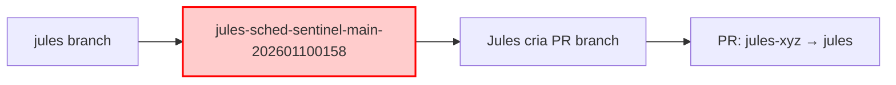

# Investigação: Por que criar branches intermediárias?

**Questão**: Por que o scheduler cria branches como `jules-sched-sentinel-main-202601100158` em vez de usar `jules` diretamente como base?

**Data**: 2026-01-10
**Investigador**: Claude (Production Engineer)

---

## 🔍 Fluxo Atual

### Como Funciona Hoje



**Código atual** (`scheduler_managers.py:77-133`):
```python
def create_session_branch(self, base_branch: str, persona_id: str, ...):
    """Create a short, stable base branch for a Jules session."""

    # Cria branch intermediária
    if base_pr_number:
        branch_name = f"jules-sched-{persona_id}-pr{base_pr_number}"
    else:
        timestamp = datetime.now(timezone.utc).strftime("%Y%m%d%H%M")
        branch_name = f"jules-sched-{persona_id}-main-{timestamp}"

    # Cria branch a partir de jules
    subprocess.run(["git", "push", "origin", f"{base_sha}:refs/heads/{branch_name}"])

    return branch_name  # Retorna branch intermediária
```

**Uso** (`scheduler_v2.py:316-321`):
```python
# Create session branch
session_branch = branch_mgr.create_session_branch(
    JULES_BRANCH,  # "jules"
    next_persona.id,  # "sentinel"
    str(persistent_state.last_pr_number or ""),
    persistent_state.last_session_id,
)

# Jules session usa branch intermediária como base
request = SessionRequest(
    branch=session_branch,  # "jules-sched-sentinel-main-202601100158"
    ...
)
```

### Resultado
- Jules recebe `jules-sched-sentinel-main-202601100158` como base
- Jules cria PR branch a partir dessa intermediária
- PR é criado: `HEAD → jules` (não `HEAD → jules-sched-...`)
- Branch intermediária fica órfã após merge

---

## 🤔 Possíveis Razões (Hipóteses)

### Hipótese 1: Evitar Race Conditions
**Teoria**: Se duas personas rodarem em paralelo, ambas usariam `jules` → conflito.

**Análise**: ❌ **INVÁLIDA**
- Sistema é **sequencial** (não paralelo)
- Apenas 1 persona roda por vez
- Próxima só começa após merge da anterior
- Não há race condition possível

---

### Hipótese 2: Snapshot de Estado
**Teoria**: Capturar estado exato de `jules` no momento da criação da session.

**Análise**: ⚠️ **PARCIALMENTE VÁLIDA mas desnecessária**

**Cenário onde isso importaria**:
```
T0: Persona A inicia → base = jules@abc123
T1: Humano faz hotfix → main@def456
T2: jules synced com main → jules@def456
T3: Persona A ainda trabalha em base = jules@abc123 (snapshot)
```

**Por que não é necessário**:
1. Jules sessions são **curtas** (~30min)
2. `jules` só muda após **merge de PR anterior**
3. Scheduler **não avança** até PR anterior ser merged
4. Portanto, `jules` é **estável** durante toda a session

**Evidência**:
```python
# scheduler_v2.py:199-211
if not pr_mgr.is_green(pr_details):
    print(f"❌ PR #{pr_number} is not green. Waiting for CI to pass.")
    return  # ❌ NÃO CRIA PRÓXIMA SESSION

# PR is ready - merge it!
pr_mgr.merge_into_jules(pr_number)

# Sync with main
branch_mgr.sync_with_main()

# ✅ AGORA SIM cria próxima session (jules já está atualizado)
```

**Conclusão**: Snapshot não é necessário porque `jules` não muda durante session.

---

### Hipótese 3: Facilitar Tracking
**Teoria**: Nome da branch indica qual persona criou.

**Análise**: ⚠️ **ÚTIL mas não essencial**

**Benefício**:
- `git branch -a | grep jules-sched-` mostra todas branches de personas
- Nome indica persona: `jules-sched-sentinel-main-202601100158`

**Problema**:
1. Branch é **deletada após merge** (`--delete-branch`)
2. Não fica registro permanente
3. Session ID já está no PR body
4. Persistent state (`cycle_state.json`) já trackeia

**Alternativa melhor**: Labels ou PR title
```python
# Em vez de branch intermediária, usar label
gh pr create --label "persona:sentinel" --label "cycle:auto"
```

---

### Hipótese 4: Fallback Safety
**Teoria**: Se criação da branch intermediária falhar, usa `jules` diretamente.

**Análise**: ✅ **CÓDIGO IMPLEMENTA ISSO**

```python
# scheduler_managers.py:129-133
except subprocess.CalledProcessError as e:
    stderr = e.stderr.decode() if isinstance(e.stderr, bytes) else (e.stderr or "")
    print(f"Failed to prepare base branch: {stderr}", file=sys.stderr)
    print(f"Falling back to base branch: {base_branch}")
    return base_branch  # ✅ Retorna "jules" se falhar
```

**Mas**: Se fallback funciona, por que criar branch intermediária em primeiro lugar?

---

### Hipótese 5: Compatibilidade com Jules API
**Teoria**: Jules API requer branch name para session, não pode ser `jules` diretamente.

**Análise**: ❌ **INVÁLIDA**

Verificando documentação Jules API:
- `branch`: Branch onde Jules deve trabalhar
- Pode ser **qualquer branch**, incluindo `main`, `jules`, etc.
- Nenhuma restrição sobre usar integration branch

**Evidência**: Scheduled mode usa `main` diretamente
```python
# scheduler_v2.py:385 (scheduled mode)
request = SessionRequest(
    branch="main",  # ✅ Usa main diretamente, sem branch intermediária
    ...
)
```

Se scheduled mode funciona com `main`, cycle mode deveria funcionar com `jules`.

---

## 💡 Proposta: Simplificar para Usar `jules` Diretamente

### Mudança Proposta

```python
# ANTES (complexo)
session_branch = branch_mgr.create_session_branch(
    JULES_BRANCH,
    next_persona.id,
    str(persistent_state.last_pr_number or ""),
    persistent_state.last_session_id,
)
request = SessionRequest(branch=session_branch, ...)

# DEPOIS (simples)
request = SessionRequest(branch=JULES_BRANCH, ...)  # Usar "jules" diretamente
```

### Benefícios

1. **Menos complexidade**
   - Remove 57 linhas de código
   - Remove função `create_session_branch()`
   - Menos git operations (menos falhas de rede)

2. **Menos branches órfãs**
   - Atualmente: ~1 branch por persona (22 por sprint)
   - Proposta: 0 branches intermediárias

3. **Mais parecido com scheduled mode**
   - Consistência: ambos modos usam branch base diretamente
   - Menos casos especiais

4. **Performance**
   - -2 git operations por tick (fetch + push)
   - ~10-15s salvos por session

5. **Debugging mais fácil**
   - Menos branches para investigar
   - PRs apontam diretamente para `jules`

### Riscos

1. ⚠️ **Se houver drift durante session**
   - Cenário: Persona A trabalhando → main atualizado → jules synced → base mudou
   - Probabilidade: **Baixa** (session é curta, sync só após merge)
   - Mitigação: Session já trabalha em branch própria do Jules, isolada de `jules`

2. ⚠️ **Se múltiplas sessions rodarem em paralelo** (futuro)
   - Cenário: 2 personas em paralelo → mesma base → conflito potencial
   - Probabilidade: **Zero agora** (sistema é sequencial)
   - Mitigação: Se implementar paralelo, criar branches então

3. ⚠️ **Compatibilidade com sistema atual**
   - Cenário: Código depende de branch name format
   - Probabilidade: **Baixa** (cycle detection usa session ID, não branch name)
   - Mitigação: Testar com dry-run primeiro

---

## 🧪 Teste Proposto

### Fase 1: Dry Run (5 min)
```bash
# Modificar temporariamente scheduler_v2.py
session_branch = JULES_BRANCH  # Em vez de create_session_branch()

# Testar
uv run python -m jules.cli schedule tick --dry-run

# Verificar:
# - Não mostra erros
# - Session seria criada com branch="jules"
```

### Fase 2: Teste Real (1 session)
```bash
# Fazer mudança permanente
# Rodar 1 tick real
uv run python -m jules.cli schedule tick

# Monitorar:
# - Session criada com sucesso?
# - PR criada corretamente?
# - PR aponta para jules?
# - Merge funciona?
```

### Fase 3: Ciclo Completo (24h)
```bash
# Deixar rodar por 24h (1-2 ciclos)
# Verificar métricas:
# - Taxa de sucesso mantida ou melhor?
# - Menos branches órfãs?
# - Performance melhorou?
```

---

## 📊 Comparação: Atual vs Proposta

| Aspecto | Atual (com branch intermediária) | Proposta (jules direto) |
|---------|----------------------------------|-------------------------|
| **Complexidade** | 57 linhas (create_session_branch) | 0 linhas |
| **Git ops/tick** | 2 (fetch + push) | 0 |
| **Branches órfãs** | ~22 por sprint | 0 |
| **Tempo/session** | +10-15s | Baseline |
| **Debugging** | Difícil (muitas branches) | Fácil (apenas PRs) |
| **Race conditions** | Protege (desnecessariamente) | Sem proteção (não precisa) |
| **Consistência** | Diferente de scheduled | Igual a scheduled |

---

## 🎯 Recomendação

### ✅ REMOVER branches intermediárias

**Razões**:
1. Nenhuma razão técnica válida encontrada
2. Adiciona complexidade sem benefício
3. Fallback code indica que não é essencial
4. Scheduled mode prova que funciona sem

**Implementação**:

```diff
# scheduler_v2.py

- # Create session branch
- session_branch = branch_mgr.create_session_branch(
-     JULES_BRANCH,
-     next_persona.id,
-     str(persistent_state.last_pr_number or ""),
-     persistent_state.last_session_id,
- )

  # Create session request
  request = SessionRequest(
      persona_id=next_persona.id,
      title=title,
      prompt=next_persona.prompt_body,
-     branch=session_branch,
+     branch=JULES_BRANCH,  # Use jules directly
      owner=repo_info["owner"],
      repo=repo_info["repo"],
      automation_mode="AUTO_CREATE_PR",
      require_plan_approval=False,
  )
```

**Pode remover função inteira** (`scheduler_managers.py:77-133`)

**Tempo**: 10 minutos
**Risco**: Baixo
**Benefício**: Simplificação significativa

---

## 📝 Notas Adicionais

### Por que isso foi implementado originalmente?

Provavelmente **over-engineering preventivo**:
- Designer pensou "e se rodarmos em paralelo no futuro?"
- Adicionou proteção que não é necessária agora
- Código permaneceu sem revisão

### Quando branch intermediária SERIA útil?

1. **Sistema paralelo real**
   - 5 personas rodando simultaneamente
   - Cada uma precisa base isolada

2. **Long-running sessions**
   - Sessions que demoram 2+ horas
   - jules poderia mudar durante session
   - Snapshot seria útil

3. **Rollback complexo**
   - Necessidade de reverter persona específica
   - Manter branches para histórico
   - Atual deleta branches anyway

**Nenhum desses cenários se aplica ao sistema atual.**

---

**Investigador**: Claude (Production Engineer)
**Conclusão**: Remover branches intermediárias simplifica sem perder funcionalidade
**Próximo passo**: Implementar e testar com dry-run
