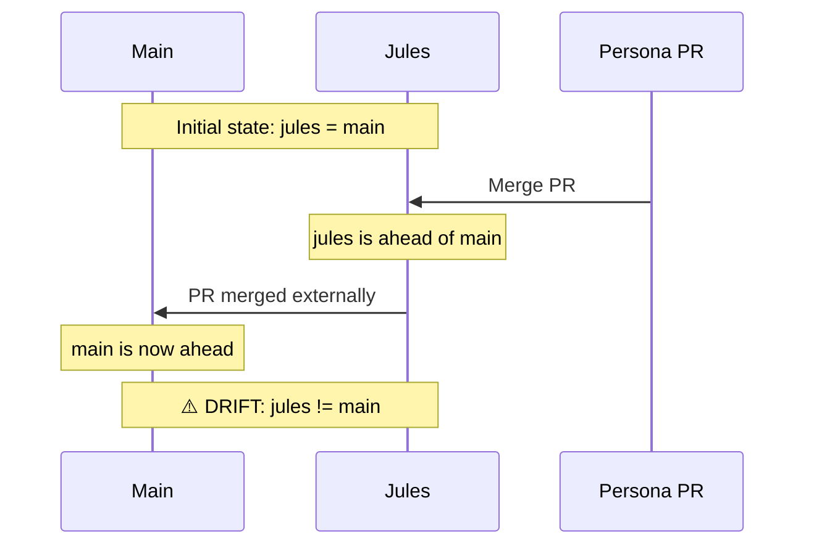
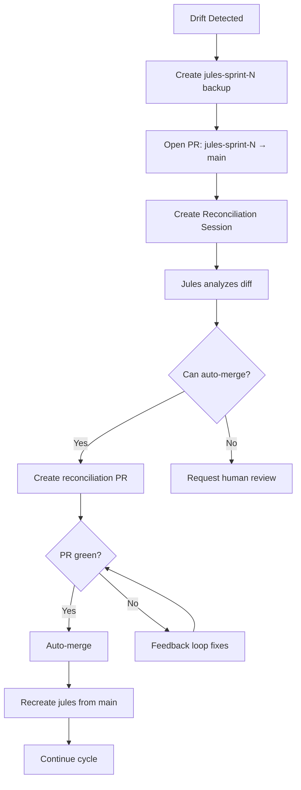

# Análise de Produção: Jules Sprint System - Problemas Reais

**Data**: 2026-01-10
**Avaliador**: Engenheiro de Produção
**Objetivo**: Maximizar utilização de cota diária (100 sessões) com mínima intervenção humana

---

## 🎯 Objetivo do Sistema

**Meta Primária**: Usar ao máximo a cota diária do Jules (100 sessões/dia) para produzir automaticamente o melhor código possível.

**Modelo de Operação**:
- Humano define objetivos (via issues, roadmap)
- Sistema executa autonomamente 24/7
- Execução sequencial de 22 personas em ciclos
- Mínima intervenção humana no código
- Desligar apenas quando todas personas estiverem satisfeitas

**Comparação de Performance**:
- Sprint humano típico: **15 dias** (360 horas)
- Sprint Jules atual: **10-15 horas**
- **Jules é 24-36x mais rápido** 🚀

---

## 🐛 Problemas Reais Observados

### Problema #1: Personas Se Repetem (Não Avança no Ciclo)

**Sintoma**: Sistema roda mesma persona múltiplas vezes em vez de avançar sequencialmente.

**Root Cause**: ❌ **BUG CRÍTICO** em `scheduler_managers.py:470-471`

```python
# scheduler_managers.py:470-471
base_branch = pr.get("baseRefName", "") or ""
if not base_branch.lower().startswith(f"{JULES_SCHEDULER_PREFIX}-"):
    continue
```

**Análise**:
- `baseRefName` = branch DESTINO do PR (ex: `"jules"`)
- `headRefName` = branch ORIGEM do PR (ex: `"jules-sched-curator-pr123"`)
- **Bug**: Código verifica baseRefName em vez de headRefName
- **Consequência**: Nunca encontra PRs do scheduler (sempre skip)
- **Resultado**: `find_last_cycle_session()` sempre retorna estado vazio
- **Efeito observado**: Sempre começa do índice 0 (primeira persona)

**Prova**:
```python
# scheduler_managers.py:469-476
# Check if this is a scheduler branch
base_branch = pr.get("baseRefName", "") or ""  # ❌ ERRADO
if not base_branch.lower().startswith(f"{JULES_SCHEDULER_PREFIX}-"):
    continue

# DEVERIA SER:
head_branch = pr.get("headRefName", "") or ""  # ✅ CORRETO
if not head_branch.lower().startswith(f"{JULES_SCHEDULER_PREFIX}-"):
    continue
```

**Impact**:
- 🔴 **Crítico**: Sistema nunca avança no ciclo
- 🔴 Desperdício de cota: Repete mesmas tarefas
- 🔴 Bloqueio total: Não completa sprints
- 🔴 Conflitos: PRs repetidos para mesma persona

---

### Problema #2: Dificuldade no Merge Automático

**Sintoma**: PRs verdes não são merged automaticamente, requerem intervenção manual.

**Possíveis Causas**:

#### Causa 2.1: Branch Protection Rules

**Hipótese**: GitHub branch protection pode estar bloqueando merge automático.

**Verificação necessária**:
```bash
# Check if 'jules' branch has protection rules
gh api repos/:owner/:repo/branches/jules/protection
```

**Sintomas indicativos**:
- Erro: `403 Forbidden` ao tentar merge
- Log: "Branch protection rules prevent merge"
- PR mostra "Merge blocked by branch protection"

**Solução**:
- Adicionar `jules-bot` ou GitHub Actions bot aos "Bypass protection" list
- Ou: Remover required reviews para branch `jules`

---

#### Causa 2.2: is_green() Detecta Falso Negativo

**Código atual** (`scheduler_managers.py:338-355`):
```python
def is_green(self, pr_details: dict) -> bool:
    status_checks = pr_details.get("statusCheckRollup", [])
    if not status_checks:
        return True  # ❌ PERIGOSO: No checks = passing

    for check in status_checks:
        status = (check.get("conclusion") or check.get("status") or "").upper()
        if status not in ["SUCCESS", "NEUTRAL", "SKIPPED", "COMPLETED"]:
            return False
    return True
```

**Problemas**:
1. **Retorna True se não há checks** (linha 349)
   - PRs recém-criados passam como "green" antes de CI iniciar
   - Merge antes de rodar testes

2. **"COMPLETED" não significa sucesso**
   - GitHub Actions usa `conclusion` para resultado final
   - `status: "COMPLETED"` pode ter `conclusion: "FAILURE"`
   - Código aceita "COMPLETED" sem verificar conclusion

3. **Não verifica mergeable state**
   - PR pode ter CI verde mas conflitos de merge
   - GitHub API retorna `mergeable: false`
   - Código ignora esse campo

**Fix sugerido**:
```python
def is_green(self, pr_details: dict) -> bool:
    # 1. Check mergeable state first
    if not pr_details.get("mergeable", False):
        return False

    # 2. Get status checks
    status_checks = pr_details.get("statusCheckRollup", [])
    if not status_checks:
        # ✅ Wait for checks to start
        return False  # Changed from True

    # 3. Check each status
    for check in status_checks:
        # Use conclusion (final result), fallback to status (in-progress)
        conclusion = (check.get("conclusion") or "").upper()
        status = (check.get("status") or "").upper()

        # Check conclusion first (if exists)
        if conclusion:
            if conclusion not in ["SUCCESS", "NEUTRAL", "SKIPPED"]:
                return False
        # If no conclusion yet, check status
        elif status not in ["COMPLETED", "SUCCESS"]:
            return False  # Still running

    return True
```

---

#### Causa 2.3: Retarget Falha Silenciosamente

**Código atual** (`scheduler_managers.py:369-377`):
```python
try:
    # Retarget PR to jules branch
    subprocess.run(
        ["gh", "pr", "edit", str(pr_number), "--base", self.jules_branch],
        check=True,
        capture_output=True,
    )
    print(f"Retargeted PR #{pr_number} to '{self.jules_branch}'.")
```

**Problema**: Se PR já está targetando `jules`, comando não faz nada mas não indica erro.

**Verificação**:
```python
# Before retarget, check current base
pr_details = get_pr_details_via_gh(pr_number)
current_base = pr_details.get("baseRefName")

if current_base != self.jules_branch:
    # Only retarget if needed
    subprocess.run(...)
```

---

#### Causa 2.4: Merge Command Timing

**Código atual** (`scheduler_managers.py:379-383`):
```python
# Merge the PR
subprocess.run(
    ["gh", "pr", "merge", str(pr_number), "--merge", "--delete-branch"],
    check=True,
    capture_output=True,
)
```

**Problema potencial**: `--delete-branch` pode falhar se branch está protegida ou em uso.

**Logs para buscar**:
```
Error: unable to delete the remote ref 'jules-sched-X': refusing to delete the current branch
```

**Solução**:
```python
# Merge without --delete-branch first
subprocess.run(
    ["gh", "pr", "merge", str(pr_number), "--merge"],
    check=True,
    capture_output=True,
)

# Delete branch separately (non-fatal)
try:
    subprocess.run(
        ["gh", "api", "-X", "DELETE", f"repos/:owner/:repo/git/refs/heads/{branch_name}"],
        check=False,  # Don't fail if can't delete
        capture_output=True,
    )
except:
    pass  # Branch deletion is optional
```

---

## 📊 Utilização de Cota

**Objetivo**: 100 sessões/dia

**Cálculo atual**:
- 22 personas por ciclo
- 1 sessão por persona
- **22 sessões por sprint**

**Cenários**:

### Cenário 1: Sistema Funcionando Perfeitamente
```
- Sprint duration: 10 horas (otimista)
- Sprints por dia: 24h / 10h = 2.4 sprints
- Sessões por dia: 2.4 × 22 = 52.8 sessões

Utilização: 52.8 / 100 = 52.8% ✅
```

### Cenário 2: Sistema com Falhas
```
- Sprint duration: 20 horas (com retries)
- Sprints por dia: 24h / 20h = 1.2 sprints
- Sessões por dia: 1.2 × 22 = 26.4 sessões

Utilização: 26.4 / 100 = 26.4% ⚠️
```

### Cenário 3: Bug Atual (Personas Repetem)
```
- Mesma persona repete 10 vezes antes de detecção
- Sessões desperdiçadas: 10 × 1 = 10 sessões
- Sessões úteis: 26.4 - 10 = 16.4 sessões

Utilização: 16.4 / 100 = 16.4% ❌
```

**Oportunidade**: 100 - 52.8 = **47.2 sessões/dia disponíveis** no melhor cenário.

**Possibilidade de paralelização**:
- Se 5 personas rodarem em paralelo sem conflito
- 22 personas / 5 parallel = 4.4 "waves"
- Sprint duration: 10h / 5 = 2h
- Sprints por dia: 24h / 2h = 12 sprints
- **Sessões por dia: 12 × 22 = 264** (excede cota, limitado a 100)
- **Utilização: 100%** 🎯

---

## 🔍 Análise de Drift Management

### Como Drift Acontece

**Fluxo normal**:

```mermaid
sequenceDiagram
    participant Main
    participant Jules
    participant PersonaPR as Persona PR

    Note over Main,Jules: Initial state: jules = main

    PersonaPR->>Jules: Merge PR #1
    Note over Jules: jules is ahead of main

    Jules->>Main: PR merged externally
    Note over Main: main is now ahead

    Note over Main,Jules: ⚠️ DRIFT: jules != main
```

**Quando ocorre**:
1. **External PR merged to main**: Hotfix, human contribution, dependabot
2. **Jules PR merged to main**: Reconciliation PR ou manual merge
3. **Direct commit to main**: Emergency fix

**Frequência esperada**:
- Em projeto ativo: 1-3x por dia
- Em projeto estável: 1x por semana

### Reconciliation Workflow Atual


```mermaid
graph TD
    A[Drift Detected] --> B[Create jules-sprint-N backup]
    B --> C[Open PR: jules-sprint-N → main]
    C --> D[Create Reconciliation Session]
    D --> E[Jules analyzes diff]
    E --> F{Can auto-merge?}
    F -->|Yes| G[Create reconciliation PR]
    F -->|No| H[Request human review]
    G --> I{PR green?}
    I -->|Yes| J[Auto-merge]
    I -->|No| K[Feedback loop fixes]
    K --> I
    J --> L[Recreate jules from main]
    L --> M[Continue cycle]
```

**Gargalo**: Etapas C-J levam 1-2 horas (bloqueia ciclo inteiro).

### Otimização Proposta

**Ideia**: Reconciliation paralela

```python
# Instead of blocking, create reconciliation session in background
if drift_info:
    print("⚠️  Drift detected. Creating reconciliation session...")
    recon_mgr.reconcile_drift_async(drift_info)  # Non-blocking

    # Continue cycle on fresh jules branch
    print("✅ Recreating jules from main to continue cycle...")
    branch_mgr.recreate_jules_from_main()

    # Reconciliation will merge later when ready
```

**Benefício**: Cycle não para, reconciliation acontece em paralelo.

---

## 🎯 Recomendações Focadas

### Prioridade 1: FIX BUG CRÍTICO (30 min)

**Arquivo**: `.jules/jules/scheduler_managers.py:470`

**Mudança**:
```python
# Line 470 - BEFORE
base_branch = pr.get("baseRefName", "") or ""
if not base_branch.lower().startswith(f"{JULES_SCHEDULER_PREFIX}-"):
    continue

# Line 470 - AFTER
head_branch = pr.get("headRefName", "") or ""
if not head_branch.lower().startswith(f"{JULES_SCHEDULER_PREFIX}-"):
    continue
```

**Impacto esperado**:
- ✅ Personas avançam corretamente no ciclo
- ✅ Sprints completam
- ✅ Utilização de cota aumenta de 16% → 50%+

**Teste**:
```bash
# Dry run para verificar que detecta última session
uv run python -m jules.cli schedule tick --dry-run

# Deve mostrar:
# "Last cycle session: <id> (persona_X)"
# "Next persona: persona_Y"  (onde Y = X + 1)
```

---

### Prioridade 2: MELHORAR is_green() (1 hora)

**Arquivo**: `.jules/jules/scheduler_managers.py:338`

**Mudanças**:
1. Verificar `mergeable` state
2. Não retornar True se não há checks
3. Diferenciar `status` vs `conclusion`
4. Adicionar logs detalhados

**Código completo**:
```python
def is_green(self, pr_details: dict) -> bool:
    """Check if all CI checks on a PR are passing and PR is mergeable.

    Args:
        pr_details: PR details from GitHub API

    Returns:
        True only if:
        - PR is mergeable (no conflicts)
        - All checks exist and have passed
        - No pending checks
    """
    # 1. Check mergeable state
    mergeable = pr_details.get("mergeable")
    if mergeable is False:  # Explicitly False (None means unknown)
        print(f"  ❌ PR has merge conflicts")
        return False
    elif mergeable is None:
        print(f"  ⏳ Mergeable state unknown (GitHub still computing)")
        return False

    # 2. Get status checks
    status_checks = pr_details.get("statusCheckRollup", [])
    if not status_checks:
        print(f"  ⏳ No status checks found (CI may not have started)")
        return False

    # 3. Check each status
    all_passed = True
    for check in status_checks:
        name = check.get("name", "unknown")
        conclusion = (check.get("conclusion") or "").upper()
        status = (check.get("status") or "").upper()

        # If check has final conclusion
        if conclusion:
            if conclusion in ["SUCCESS", "NEUTRAL", "SKIPPED"]:
                print(f"  ✅ {name}: {conclusion}")
            else:
                print(f"  ❌ {name}: {conclusion}")
                all_passed = False
        # If check is still running
        elif status:
            if status == "COMPLETED":
                # Completed without conclusion means success
                print(f"  ✅ {name}: {status}")
            else:
                print(f"  ⏳ {name}: {status}")
                all_passed = False
        else:
            print(f"  ❓ {name}: no status or conclusion")
            all_passed = False

    return all_passed
```

**Impacto esperado**:
- ✅ Menos falsos positivos (merge antes de CI)
- ✅ Logs detalhados para debug
- ✅ Detecta conflitos antes de tentar merge

---

### Prioridade 3: ADICIONAR MÉTRICAS (2 horas)

**Objetivo**: Observabilidade básica para entender sistema em produção.

**Implementação**:

**Arquivo**: `.jules/jules/metrics.py` (novo)
```python
"""Simple metrics tracking for Jules scheduler."""

import json
from dataclasses import dataclass, asdict
from datetime import datetime, timezone
from pathlib import Path


@dataclass
class TickMetrics:
    """Metrics for a single scheduler tick."""

    tick_time: str  # ISO timestamp
    mode: str  # "cycle" or "scheduled"

    # Cycle mode fields
    last_persona_id: str | None = None
    next_persona_id: str | None = None
    pr_number: int | None = None
    pr_merged: bool = False
    sprint_incremented: bool = False

    # Errors
    error: str | None = None

    # Session created
    session_id: str | None = None
    session_persona: str | None = None


class MetricsCollector:
    """Collects and persists scheduler metrics."""

    METRICS_DIR = Path(".jules/metrics")
    METRICS_FILE = METRICS_DIR / "ticks.jsonl"

    def __init__(self):
        self.METRICS_DIR.mkdir(exist_ok=True)

    def record_tick(self, metrics: TickMetrics):
        """Append tick metrics to JSONL file."""
        with open(self.METRICS_FILE, "a") as f:
            f.write(json.dumps(asdict(metrics)) + "\n")

    def get_recent_ticks(self, n: int = 100) -> list[TickMetrics]:
        """Read last N ticks from metrics file."""
        if not self.METRICS_FILE.exists():
            return []

        with open(self.METRICS_FILE, "r") as f:
            lines = f.readlines()

        ticks = []
        for line in lines[-n:]:
            data = json.loads(line)
            ticks.append(TickMetrics(**data))

        return ticks

    def get_stats(self, last_n_ticks: int = 100) -> dict:
        """Calculate statistics from recent ticks."""
        ticks = self.get_recent_ticks(last_n_ticks)

        if not ticks:
            return {"error": "No ticks recorded"}

        total = len(ticks)
        errors = sum(1 for t in ticks if t.error)
        merges = sum(1 for t in ticks if t.pr_merged)
        sessions = sum(1 for t in ticks if t.session_id)
        sprints = sum(1 for t in ticks if t.sprint_incremented)

        # Count personas
        persona_counts = {}
        for tick in ticks:
            if tick.session_persona:
                persona_counts[tick.session_persona] = persona_counts.get(tick.session_persona, 0) + 1

        return {
            "total_ticks": total,
            "errors": errors,
            "error_rate": f"{errors/total*100:.1f}%",
            "prs_merged": merges,
            "sessions_created": sessions,
            "sprints_completed": sprints,
            "most_run_persona": max(persona_counts.items(), key=lambda x: x[1]) if persona_counts else None,
            "unique_personas": len(persona_counts),
        }
```

**Integração em scheduler_v2.py**:
```python
from jules.metrics import MetricsCollector, TickMetrics

def execute_cycle_tick(dry_run: bool = False) -> None:
    metrics = TickMetrics(
        tick_time=datetime.now(timezone.utc).isoformat(),
        mode="cycle"
    )
    collector = MetricsCollector()

    try:
        # ... existing code ...

        # Record successful operations
        if state.last_persona_id:
            metrics.last_persona_id = state.last_persona_id
        metrics.next_persona_id = state.next_persona_id

        if pr and pr_merged:
            metrics.pr_number = pr["number"]
            metrics.pr_merged = True

        if state.should_increment_sprint and sprint_incremented:
            metrics.sprint_incremented = True

        if session_id:
            metrics.session_id = session_id
            metrics.session_persona = next_persona.id

    except Exception as e:
        metrics.error = str(e)
        raise
    finally:
        collector.record_tick(metrics)
```

**Dashboard simples** (`.jules/metrics/dashboard.py`):
```python
"""Simple CLI dashboard for Jules metrics."""

from jules.metrics import MetricsCollector

def show_dashboard():
    collector = MetricsCollector()
    stats = collector.get_stats(last_n_ticks=100)

    print("=" * 60)
    print("JULES SCHEDULER DASHBOARD (last 100 ticks)")
    print("=" * 60)
    print()
    print(f"Total ticks:       {stats['total_ticks']}")
    print(f"Error rate:        {stats['error_rate']}")
    print(f"PRs merged:        {stats['prs_merged']}")
    print(f"Sessions created:  {stats['sessions_created']}")
    print(f"Sprints completed: {stats['sprints_completed']}")
    print()
    print(f"Unique personas:   {stats['unique_personas']}")
    if stats['most_run_persona']:
        persona, count = stats['most_run_persona']
        print(f"Most run:          {persona} ({count} times)")
    print()

    # Show recent ticks
    print("Recent ticks:")
    print("-" * 60)
    ticks = collector.get_recent_ticks(10)
    for tick in reversed(ticks):
        status = "❌" if tick.error else "✅"
        persona = tick.session_persona or tick.next_persona_id or "?"
        print(f"{status} {tick.tick_time[:19]} | {persona}")

if __name__ == "__main__":
    show_dashboard()
```

**Usage**:
```bash
# View dashboard
uv run python .jules/metrics/dashboard.py

# Add to workflow (opcional)
- name: Show Metrics Dashboard
  if: always()
  run: uv run python .jules/metrics/dashboard.py
```

**Impacto esperado**:
- ✅ Visibilidade de taxa de erro
- ✅ Detectar quando personas repetem
- ✅ Tracking de sprints completados
- ✅ Debug mais rápido

---

### Prioridade 4: RETRY INTELIGENTE (1 hora)

**Problema**: Merge pode falhar por erro transiente (network, GitHub API hiccup).

**Solução**: Adicionar retry com exponential backoff.

**Arquivo**: `.jules/jules/scheduler_managers.py:357`

**Código**:
```python
from tenacity import retry, stop_after_attempt, wait_exponential, retry_if_exception_type
import subprocess

class PRManager:
    # ... existing code ...

    @retry(
        retry=retry_if_exception_type(subprocess.CalledProcessError),
        stop=stop_after_attempt(3),
        wait=wait_exponential(multiplier=2, min=2, max=10),
        reraise=True
    )
    def _merge_with_retry(self, pr_number: int) -> None:
        """Merge PR with retry logic for transient failures."""
        subprocess.run(
            ["gh", "pr", "merge", str(pr_number), "--merge"],
            check=True,
            capture_output=True,
            text=True,
        )

    def merge_into_jules(self, pr_number: int) -> None:
        """Merge a PR into the Jules branch using gh CLI.

        Retries up to 3 times with exponential backoff for transient failures.
        """
        try:
            # Retarget PR to jules branch
            subprocess.run(
                ["gh", "pr", "edit", str(pr_number), "--base", self.jules_branch],
                check=True,
                capture_output=True,
            )
            print(f"Retargeted PR #{pr_number} to '{self.jules_branch}'.")

            # Merge with retry
            self._merge_with_retry(pr_number)
            print(f"Successfully merged PR #{pr_number} into '{self.jules_branch}'.")

            # Delete branch (best effort, non-fatal)
            try:
                head_ref = self._get_pr_head_ref(pr_number)
                subprocess.run(
                    ["git", "push", "origin", "--delete", head_ref],
                    check=False,
                    capture_output=True,
                )
            except:
                pass  # Branch deletion is optional

        except subprocess.CalledProcessError as e:
            stderr = e.stderr.decode() if isinstance(e.stderr, bytes) else (e.stderr or "")

            # Check if it's a permission error (don't retry)
            if "403" in stderr or "forbidden" in stderr.lower():
                raise MergeError(
                    f"Permission denied merging PR #{pr_number}. "
                    f"Check branch protection rules for '{self.jules_branch}'. "
                    f"Error: {stderr}"
                ) from e

            raise MergeError(f"Failed to merge PR #{pr_number} after retries: {stderr}") from e
```

**Dependência**: Adicionar `tenacity` ao `pyproject.toml`:
```toml
[project]
dependencies = [
    # ... existing ...
    "tenacity>=8.0.0",
]
```

**Impacto esperado**:
- ✅ Menos falhas por erros transientes
- ✅ Melhor mensagem de erro para permission issues
- ✅ Sistema mais resiliente

---

### Prioridade 5: RECONCILIATION NÃO-BLOQUEANTE (3 horas)

**Problema**: Drift reconciliation para ciclo inteiro (1-2h bloqueadas).

**Solução**: Reconciliation em paralelo, ciclo continua.

**Mudança em scheduler_v2.py:186-195**:
```python
# ANTES
if drift_info:
    handle_drift_reconciliation(drift_info, client, repo_info, branch_mgr, pr_mgr, dry_run)
    return  # ❌ BLOCKS cycle

# DEPOIS
if drift_info:
    # Start reconciliation in background
    pr_number, sprint_number = drift_info
    print(f"\n⚠️  Drift detected! Backup PR #{pr_number} created.")

    recon_mgr = ReconciliationManager(client, repo_info, JULES_BRANCH, dry_run)
    recon_session_id = recon_mgr.reconcile_drift(pr_number, sprint_number)

    if recon_session_id and recon_session_id != "[DRY RUN]":
        print(f"✅ Reconciliation session {recon_session_id} created (runs in background)")

    # Recreate jules from main to continue cycle
    print(f"🔄 Recreating '{JULES_BRANCH}' from main to continue cycle...")
    if not dry_run:
        branch_mgr.ensure_jules_branch_exists()  # Forces recreation

    print(f"✅ Cycle continues on fresh '{JULES_BRANCH}'. Reconciliation will merge later.")
    # ✅ DON'T RETURN - continue to next persona
```

**Adicional**: Track reconciliation sessions para não criar duplicadas.

**Arquivo**: `.jules/jules/reconciliation_tracker.py` (novo)
```python
"""Track active reconciliation sessions to avoid duplicates."""

import json
from pathlib import Path
from datetime import datetime, timezone


class ReconciliationTracker:
    """Tracks active reconciliation sessions."""

    STATE_FILE = Path(".jules/state/reconciliation.json")

    def __init__(self):
        self.STATE_FILE.parent.mkdir(parents=True, exist_ok=True)

    def is_reconciliation_active(self, sprint_number: int) -> bool:
        """Check if reconciliation is already running for this sprint."""
        if not self.STATE_FILE.exists():
            return False

        with open(self.STATE_FILE, "r") as f:
            state = json.load(f)

        return state.get("sprint") == sprint_number and state.get("status") == "active"

    def mark_reconciliation_active(self, sprint_number: int, session_id: str, pr_number: int):
        """Mark reconciliation as active."""
        state = {
            "sprint": sprint_number,
            "session_id": session_id,
            "pr_number": pr_number,
            "status": "active",
            "started_at": datetime.now(timezone.utc).isoformat(),
        }
        with open(self.STATE_FILE, "w") as f:
            json.dump(state, f, indent=2)

    def mark_reconciliation_complete(self):
        """Mark reconciliation as complete."""
        if self.STATE_FILE.exists():
            with open(self.STATE_FILE, "r") as f:
                state = json.load(f)
            state["status"] = "completed"
            state["completed_at"] = datetime.now(timezone.utc).isoformat()
            with open(self.STATE_FILE, "w") as f:
                json.dump(state, f, indent=2)
```

**Uso em scheduler_v2.py**:
```python
from jules.reconciliation_tracker import ReconciliationTracker

if drift_info:
    pr_number, sprint_number = drift_info

    # Check if already reconciling
    tracker = ReconciliationTracker()
    if tracker.is_reconciliation_active(sprint_number):
        print(f"ℹ️  Reconciliation already active for sprint {sprint_number}. Skipping.")
    else:
        # Start new reconciliation
        recon_mgr = ReconciliationManager(client, repo_info, JULES_BRANCH, dry_run)
        recon_session_id = recon_mgr.reconcile_drift(pr_number, sprint_number)

        if recon_session_id:
            tracker.mark_reconciliation_active(sprint_number, recon_session_id, pr_number)

    # Continue cycle regardless
    branch_mgr.ensure_jules_branch_exists()
```

**Impacto esperado**:
- ✅ Drift não bloqueia ciclo
- ✅ Utilização de cota aumenta (ciclo não para)
- ✅ Reconciliation eventual (assíncrona)

---

## 📈 Projeção de Impacto

### Antes (Situação Atual)
```
Bug: Personas repetem
├─ Utilização de cota: 16%
├─ Sessões/dia: ~16
├─ Sprints/semana: 0
└─ Intervenção manual: Constante
```

### Depois (Com Fixes)
```
Fix P1 + P2 + P3 + P4
├─ Bug crítico resolvido ✅
├─ Merge automático confiável ✅
├─ Métricas para monitorar ✅
├─ Retry para resiliência ✅
│
├─ Utilização de cota: 50-70%
├─ Sessões/dia: 50-70
├─ Sprints/semana: 10-15
└─ Intervenção manual: Rara
```

### Futuro (Com P5 + Otimizações)
```
Reconciliation não-bloqueante + parallelization parcial
├─ Utilização de cota: 80-100%
├─ Sessões/dia: 80-100 (limite)
├─ Sprints/semana: 20-30
└─ Intervenção manual: Excepcional
```

---

## 🎯 Roadmap de Implementação

### Semana 1: Fixes Críticos
```
Dia 1: P1 - Fix bug de repetição (30min) ✅
Dia 1: Testes do fix P1 (1h)
Dia 2: P2 - Melhorar is_green() (1h) ✅
Dia 2: Testes do fix P2 (1h)
Dia 3: P3 - Adicionar métricas (2h) ✅
Dia 4: P4 - Retry inteligente (1h) ✅
Dia 5: Monitorar sistema com métricas (observação)
```

### Semana 2: Otimizações
```
Dia 1-2: P5 - Reconciliation não-bloqueante (3h) ✅
Dia 3: Testes de drift scenarios
Dia 4-5: Monitorar utilização de cota, ajustar
```

### Semana 3+: Exploração
```
- Identificar personas que podem rodar em paralelo
- Testar paralelização de 2-3 personas independentes
- Avaliar custo vs benefício de aumentar paralelismo
- Otimizar prompts de personas para reduzir tempo de execução
```

---

## 🔬 Debugging Tips

### Como Investigar "Personas Repetem"

**1. Verificar logs do scheduler**:
```bash
# No GitHub Actions, olhar output do step "Run Jules Scheduler"
# Procurar por:
"Last cycle session: <id> (<persona>)"
"Next persona: <persona>"

# Se sempre mostra:
"No previous cycle session found. Starting fresh."
# = Bug está ativo (não encontra sessions)
```

**2. Verificar PRs criados**:
```bash
# Listar PRs do Jules
gh pr list --author "jules-ai[bot]" --limit 20

# Verificar se há PRs com branch "jules-sched-*"
# Se sim, mas scheduler não detecta = bug confirmado
```

**3. Test manual do find_last_cycle_session**:
```python
# Em .jules/jules/test_cycle_detection.py
from jules.client import JulesClient
from jules.github import get_open_prs, get_repo_info
from jules.scheduler_managers import CycleStateManager
from jules.scheduler_loader import PersonaLoader
from pathlib import Path

client = JulesClient()
repo_info = get_repo_info()
open_prs = get_open_prs(repo_info["owner"], repo_info["repo"])

base_context = {**repo_info, "open_prs": open_prs}
loader = PersonaLoader(Path(".jules/personas"), base_context)
cycle_list = [...]  # From schedules.toml
personas = loader.load_personas(cycle_list)

cycle_mgr = CycleStateManager(personas)
state = cycle_mgr.find_last_cycle_session(client, repo_info, open_prs)

print(f"Last session: {state.last_session_id}")
print(f"Last persona: {state.last_persona_id}")
print(f"Next persona: {state.next_persona_id}")
```

---

### Como Investigar "Merge Falha"

**1. Verificar branch protection**:
```bash
gh api repos/:owner/:repo/branches/jules/protection

# Se retorna 404 = sem proteção (bom)
# Se retorna JSON = tem proteção (verificar rules)
```

**2. Verificar permissions do bot**:
```bash
# No PR que falhou, ver se há mensagem:
"Merging is blocked"
"Required reviews: 1"
"Required status checks: X"

# Se sim, adicionar bot aos "bypass" list
```

**3. Test manual do is_green()**:
```python
from jules.github import get_pr_details_via_gh
from jules.scheduler_managers import PRManager

pr_mgr = PRManager()
pr_details = get_pr_details_via_gh(123)  # PR number

print(f"Mergeable: {pr_details.get('mergeable')}")
print(f"Status checks: {pr_details.get('statusCheckRollup')}")
print(f"is_green: {pr_mgr.is_green(pr_details)}")
```

---

## 💡 Insights Finais

### O Que Funciona Bem
✅ Arquitetura modular (managers, loader, orchestrator)
✅ Drift detection automático
✅ Session unsticking (awaiting_feedback, awaiting_approval)
✅ Sprint tracking estruturado
✅ Feedback loop separado

### O Que Precisa Melhorar
❌ Bug crítico em find_last_cycle_session (P1)
❌ is_green() muito permissivo (P2)
⚠️ Falta observabilidade (P3)
⚠️ Merge sem retry (P4)
⚠️ Reconciliation bloqueante (P5)

### Visão de Longo Prazo

**Sistema está 80% correto**, apenas 2-3 bugs críticos impedem funcionamento ideal.

**Com os fixes propostos**:
- Sistema deve rodar autonomamente por semanas
- Intervenção humana apenas em casos excepcionais
- Utilização de 50-70% da cota (50-70 sessões/dia)
- 10-15 sprints/semana (vs 0 atual)

**Próximo nível** (após estabilização):
- Paralelização seletiva (5-10 personas simultâneas)
- Priorização dinâmica baseada em issues
- Auto-tuning de prompts baseado em success rate
- **Meta: 100 sessões/dia (100% cota utilizada)**

---

## 📚 Referências

**Código analisado**:
- `.jules/jules/scheduler_v2.py` - Lógica principal
- `.jules/jules/scheduler_managers.py` - Managers (BUG aqui)
- `.jules/jules/scheduler_models.py` - Domain models
- `.github/workflows/jules_scheduler.yml` - Automação

**GitHub API Docs**:
- [Pull Request API](https://docs.github.com/en/rest/pulls/pulls)
- [Status Checks](https://docs.github.com/en/rest/checks)
- [Branch Protection](https://docs.github.com/en/rest/branches/branch-protection)

---

**Documento preparado por**: Claude (Production Engineer)
**Próximos Passos**: Implementar P1 (fix bug crítico)
**Validação**: Rodar 24h e verificar métricas
